# <p align="center">Switches, Lights, and Multiplexers</p>

*The aim of this experiment is to explore how to interface basic input and output devices with an FPGA chip and implement a functional circuit utilizing these components. The switches on the DE-series boards will serve as inputs to the circuit while light-emitting diodes (LEDs) and 7-segment displays will be employed as output devices.*


## Table of Contents

1. [Introduction](#introduction)<br>
2. [Part 1: Switches & LEDs](#part-1-switches-&-leds)<br>
&nbsp;2.1. VHDL Code Implementation on the FPGA Board<br>
&nbsp;&nbsp;&nbsp;&nbsp;&nbsp;&nbsp;&nbsp;&nbsp;2.1.1. Implementation Results<br>
&nbsp;&nbsp;&nbsp;&nbsp;&nbsp;&nbsp;&nbsp;&nbsp;2.1.2. Discussion<br>
&nbsp;2.2. VHDL Testbench Code Simulation in ModelSim<br>
&nbsp;&nbsp;&nbsp;&nbsp;&nbsp;&nbsp;&nbsp;&nbsp;2.2.1. Simulation Results<br>
&nbsp;&nbsp;&nbsp;&nbsp;&nbsp;&nbsp;&nbsp;&nbsp;2.2.2. Discussion<br>
3. [Part 2: ](#part-2-cloud-computing-os)<br>
&nbsp;3.1. VHDL Code Implementation on the FPGA Board<br>
&nbsp;&nbsp;&nbsp;&nbsp;&nbsp;&nbsp;&nbsp;&nbsp;3.1.1. Implementation Results<br>
&nbsp;&nbsp;&nbsp;&nbsp;&nbsp;&nbsp;&nbsp;&nbsp;3.1.2. Discussion<br>
&nbsp;3.2. VHDL Testbench Code Simulation in ModelSim<br>
&nbsp;&nbsp;&nbsp;&nbsp;&nbsp;&nbsp;&nbsp;&nbsp;3.2.1. Simulation Results<br>
&nbsp;&nbsp;&nbsp;&nbsp;&nbsp;&nbsp;&nbsp;&nbsp;3.2.2. Discussion<br>
4. [Part 3: ](#part-3-additional-considerations-best-practices-in-os)<br>
&nbsp;4.1. VHDL Code Implementation on the FPGA Board<br>
&nbsp;&nbsp;&nbsp;&nbsp;&nbsp;&nbsp;&nbsp;&nbsp;4.1.1. Implementation Results<br>
&nbsp;&nbsp;&nbsp;&nbsp;&nbsp;&nbsp;&nbsp;&nbsp;4.1.2. Discussion<br>
&nbsp;4.2. VHDL Testbench Code Simulation in ModelSim<br>
&nbsp;&nbsp;&nbsp;&nbsp;&nbsp;&nbsp;&nbsp;&nbsp;4.2.1. Simulation Results<br>
&nbsp;&nbsp;&nbsp;&nbsp;&nbsp;&nbsp;&nbsp;&nbsp;4.2.2. Discussion<br>
5. [Part 4: ](#part-3-additional-considerations-best-practices-in-os)<br>
&nbsp;5.1. VHDL Code Implementation on the FPGA Board<br>
&nbsp;&nbsp;&nbsp;&nbsp;&nbsp;&nbsp;&nbsp;&nbsp;5.1.1. Implementation Results<br>
&nbsp;&nbsp;&nbsp;&nbsp;&nbsp;&nbsp;&nbsp;&nbsp;5.1.2. Discussion<br>
&nbsp;5.2. VHDL Testbench Code Simulation in ModelSim<br>
&nbsp;&nbsp;&nbsp;&nbsp;&nbsp;&nbsp;&nbsp;&nbsp;5.2.1. Simulation Results<br>
&nbsp;&nbsp;&nbsp;&nbsp;&nbsp;&nbsp;&nbsp;&nbsp;5.2.2. Discussion<br>
6. [Conclusion](#conclusion)<br>
7. [Work Division](#conclusion)<br>
8. [Resources](#resources)<br>

## Introduction
VHDL, which stands for VHSIC (Very High-Speed Integrated Circuit) Hardware Description Language, is a powerful and standardized language used for describing the behavior and structure of electronic systems, particularly digital circuits. Developed in the 1980s for the U.S. Department of Defense, VHDL allows designers to model complex hardware architectures at various levels of abstraction, from high-level algorithmic descriptions to detailed gate-level representations. The language supports concurrent execution of processes, enabling the simulation of hardware behavior in a time-efficient manner. VHDL is widely used in the design of Field Programmable Gate Arrays (FPGAs) and Application-Specific Integrated Circuits (ASICs) due to its ability to facilitate verification, synthesis, and optimization of digital designs. Its syntax is similar to that of the Ada programming language, making it both expressive and versatile, allowing designers to define entities, architectures, data types, and behaviors through constructs such as entities, architectures, packages, and configurations. Moreover, VHDL supports strong typing, modular design, and hierarchical modeling, which helps manage complexity in large systems. The language is governed by the IEEE standard (IEEE 1076), ensuring interoperability across various tools and platforms. VHDL also plays a significant role in the design flow, from behavioral simulation and functional verification to synthesis for actual hardware implementation, making it an essential tool for engineers and designers in the field of digital electronics.

In VHDL, several fundamental concepts are crucial for understanding the design and description of digital circuits. A library is a collection of predefined packages that grant access to various data types, functions, and procedures, with the IEEE library being a notable example that contains standard logic types and operations essential for digital circuit design. An entity defines the interface of a VHDL module, specifying the inputs and outputs of a digital circuit without detailing its internal operation; essentially, it serves as a blueprint for the component, outlining what it is, the signals it accepts as inputs, and the outputs it produces. You can have as many entities as you wish in a single VHDL file, with each entity representing a distinct component or module of the design. A port defines the connection points (inputs and outputs) for an entity, each having a name, a direction (IN, OUT, or INOUT), and a data type, enabling communication between the entity and other components or systems. An architecture describes the internal implementation and behavior of the entity, detailing how inputs are processed and outputs are generated; there can be multiple architectures for a single entity, allowing for different implementations of the same functionality. This means that each entity can be associated with one or more architectures, but a single architecture is linked to only one entity, facilitating various implementations or behaviors. Additionally, signals represent connections between different components and internal variables, enabling them to hold values and facilitate communication between processes. Together, these components form the backbone of VHDL design, empowering designers to create complex digital systems in a structured and modular manner.


## Part 1: Switches & LEDs
The DE2-115 provides eighteen switches and lights. The switches can be used to provide inputs, and the lights can be used as output devices. In this part, we create a simple VHDL entity that uses the switches and shows their states on the LEDs. 

This same procedure will be used to implement tasks. First, we will create a new Quartus project for the circuit, ensuring to select the target chip that corresponds to our DE2-115 board. Next, we will create a VHDL entity for the code and incorporate it into our project. Following that, we will include the necessary pin assignments for the DE-series board, as discussed previously, and compile the project. Finally, we will download the compiled circuit into the FPGA chip using the Quartus Programmer tool and test the functionality of the circuit.

### VHDL Code Implementation on the FPGA Board
``` VHDL
LIBRARY ieee;
USE ieee.std_logic_1164.all;

-- When a switch is flipped on, the corresponding LED lights up, providing a direct visual representation of the switch states.

ENTITY part1 IS 
   PORT ( SW   : IN   STD_LOGIC_VECTOR(17 DOWNTO 0); -- Declares an input port named 'SW' as a 18-bit vector of standard logic
          LEDR : OUT  STD_LOGIC_VECTOR(17 DOWNTO 0)); -- Declares an output port named 'LEDR' (red LEDs) as a 18-bit vector of standard logic
END part1;

ARCHITECTURE Structure OF part1 IS
BEGIN -- A keyword that indicates the start of the architecture's body - notice that we do not use BEGIN with entities
   LEDR <= SW; -- Assigns the value of the input 'SW' to the output 'LEDR' directly - so if the switch value is high then the LEDR will be high as well
END Structure;
```

<p align="center">
  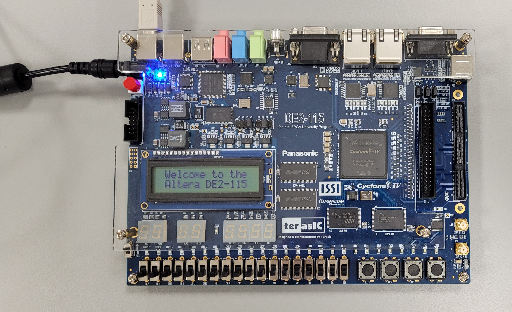 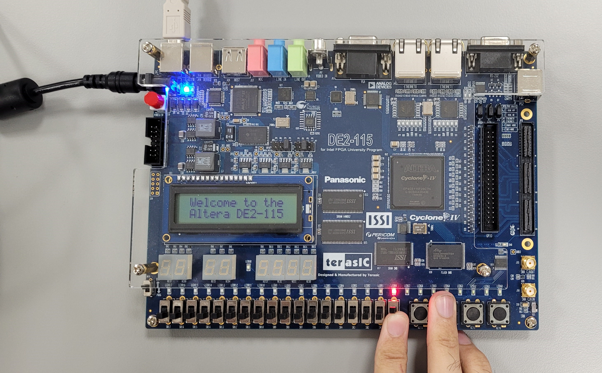  
  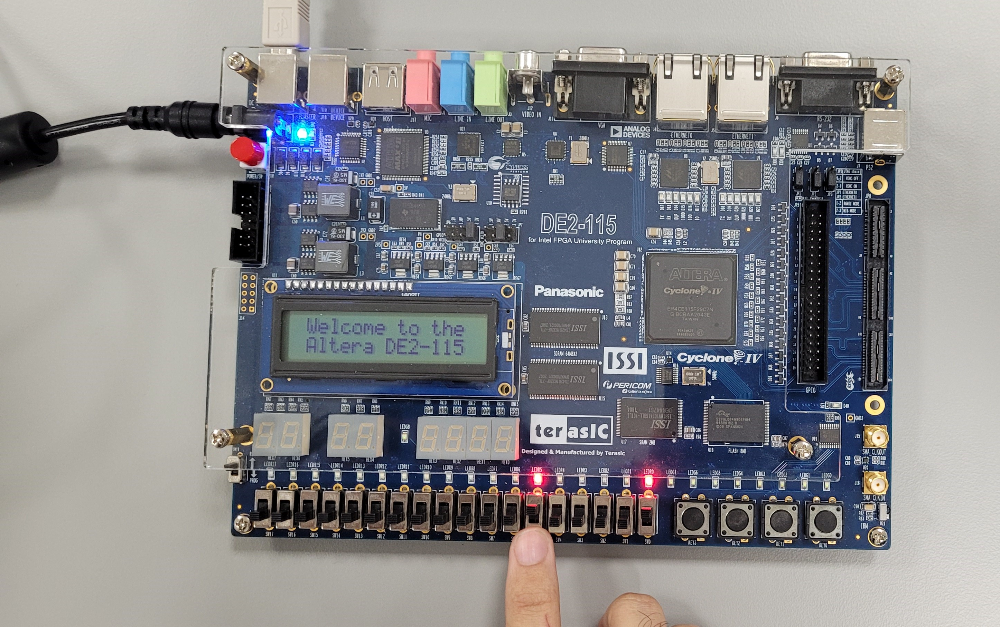 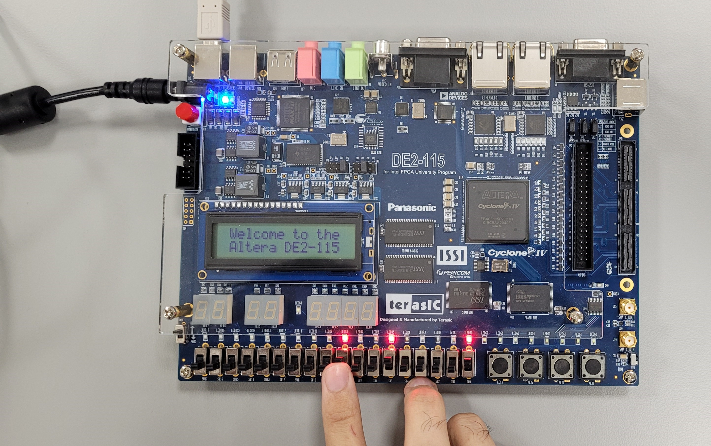
</p>

In the first photo, none of the switches are activated, resulting in no LEDs being illuminated. In the second photo, switch 0 (SW0) is turned on, which causes LED0 to light up. The third photo shows switch 5 activated, illuminating LED5. Similarly, in the fourth photo, switch 8 is turned on, activating LED8. We can also observe that activating a switch does not affect the state of any other LEDs that were previously lit with their corresponding switches. A LED will remain on as long as its switch is activated.

<br/>

### VHDL Testbench Code Simulation in ModelSim
``` VHDL
library IEEE;
use IEEE.Std_logic_1164.all; -- Use the standard logic package for defining and working with signals
use IEEE.Numeric_Std.all; -- Use the numeric standard library for arithmetic operations on vectors

-- Define an empty entity for the testbench; it has no ports
entity part1_tb is
end;

architecture bench of part1_tb is
-- Declaration of the component being tested (the design under test)
  component part1
     PORT ( SW   : IN   STD_LOGIC_VECTOR(17 DOWNTO 0); -- Input: 18-bit switch vector
            LEDR : OUT  STD_LOGIC_VECTOR(17 DOWNTO 0)); -- Output: 18-bit LED vector
  end component;

  -- Signal declaration: these signals will be used to connect to the component
  signal SW: STD_LOGIC_VECTOR(17 DOWNTO 0); -- 18-bit input signal for switches
  signal LEDR: STD_LOGIC_VECTOR(17 DOWNTO 0); -- 18-bit output signal for LEDs

begin
  -- Instantiate the component (part1) and connect signals to its ports
  uut: part1 port map ( SW   => SW, -- Connect the SW signal to the input of part1
                        LEDR => LEDR ); -- Connect the LEDR signal to the output of part1

  stimulus: process
  begin
    -- Initialisation code can be added here, such as setting initial values for signals

		SW <= "101010101010101010"; -- Set the SW signal to a specific pattern of switches (101010101010101010)     
		wait for 100 ns; -- Wait for 100 nanoseconds, enough pause for the result of the previous statement till you observe it
		
		SW <= "010101010101010101"; -- Change the SW signal to a different pattern (010101010101010101)
		wait for 100 ns;

    -- Additional testbench stimulus code can be added here to test more scenarios

    wait; -- Suspend indefinitely, allowing the simulation to run continuously and observe the output until it is manually stopped
  end process;

end;
```
<p align="center">
  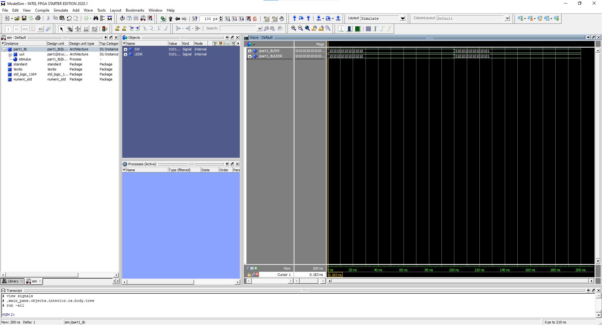
</p>

The simulation results align perfectly with the implementation results observed on the board, confirming that the design behaves as intended. When a switch (SW) is set to 1, the corresponding LED (LEDR) bit also lights up as 1, and similarly, when the switch is set to 0, the corresponding LED bit reflects this with a 0 output. This direct correlation between the switch states and LED outputs demonstrates the expected functionality of the circuit. In the waveform window, we can clearly observe the effect of the 100 ns wait time during which nothing occurs, creating the visual equivalent of a break between two test scenarios. After this pause we test new values in the switches vector and the corresponding results in the LEDs vector after each stimulus is applied.

It’s important to note that although we are viewing a waveform window, the data displayed does not represent traditional waveforms. Instead, we see discrete values of 0s and 1s. The absence of oscillation or variation in these values means that we cannot describe this output as a wave; there is no upward or downward movement to indicate continuous change. Rather, each state remains stable until the next input is applied, further illustrating the digital nature of the signals.


## Part 2
In this section, we implement a four-bit wide 2-to-1 multiplexer that takes two 4-bit inputs, X and Y, and produces a four-bit output M. The functionality of the multiplexer is governed by a select line s: when s=0, the output M mirrors the input X; conversely, when s=1, the output reflects the input Y.

A multiplexer, often abbreviated as "mux," is a digital switch that selects one of several input signals and forwards the selected input to a single output line. It operates based on control signals, known as select lines, which determine which input is routed to the output. The primary function of a multiplexer is to manage multiple data sources and simplify the complexity of wiring in a circuit.

### VHDL Code Implementation on the FPGA Board
``` VHDL
LIBRARY ieee;
USE ieee.std_logic_1164.all;

-- Simple module that connects the SW switches to the LEDR lights
ENTITY part2 IS 
   PORT ( SW   : IN  STD_LOGIC_VECTOR(8 DOWNTO 0);    -- 9 slide switches for input (8 for data and 1 for selection)
          LEDR : OUT STD_LOGIC_VECTOR(8 DOWNTO 0));   -- 9 red LEDs for output (8 for data display and 1 for selection indicator)
END part2;

ARCHITECTURE Structure OF part2 IS
   SIGNAL Sel : STD_LOGIC; -- defining that the selector is only 1 bit
   SIGNAL X, Y, M : STD_LOGIC_VECTOR(3 DOWNTO 0); -- defining that the x input, y input, and m output  are all 4 bits each

BEGIN
   X <= SW(3 DOWNTO 0); -- 4 bits (switches) for input X
   Y <= SW(7 DOWNTO 4); -- 4 bits (switches) for input Y
   Sel <= SW(8); -- 1 bit (switch) for the selector
   M(0) <= (NOT(Sel) AND X(0)) OR (Sel AND Y(0)); -- the equation to calculate the value inside the 1st bit of the M output
   M(1) <= (NOT(Sel) AND X(1)) OR (Sel AND Y(1)); -- the equation to calculate the value inside the 2nd bit of the M output
   M(2) <= (NOT(Sel) AND X(2)) OR (Sel AND Y(2)); -- the equation to calculate the value inside the 3rd bit of the M output
   M(3) <= (NOT(Sel) AND X(3)) OR (Sel AND Y(3)); -- the equation to calculate the value inside the 4th bit of the M output
   LEDR(8) <= Sel; -- LEDR8 will light up based on the state of the selector switch whether it is slid on or off
   LEDR(7 DOWNTO 4) <= "0000"; -- The second 4 LEDRs will remain off
   LEDR(3 DOWNTO 0) <= M; -- The first 4 LEDRs will show the output which is stored in the 4 bits of M
END Structure;
```

<p align="center">
  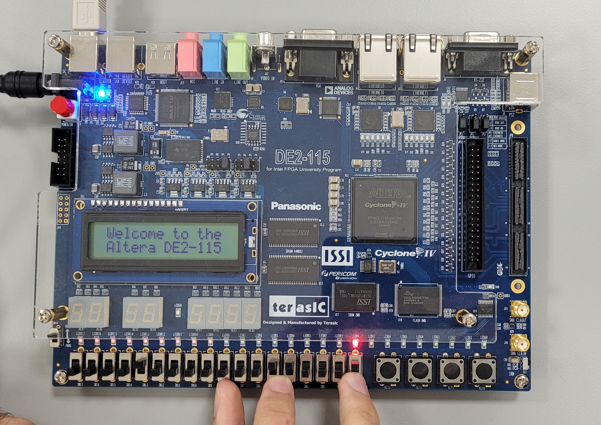 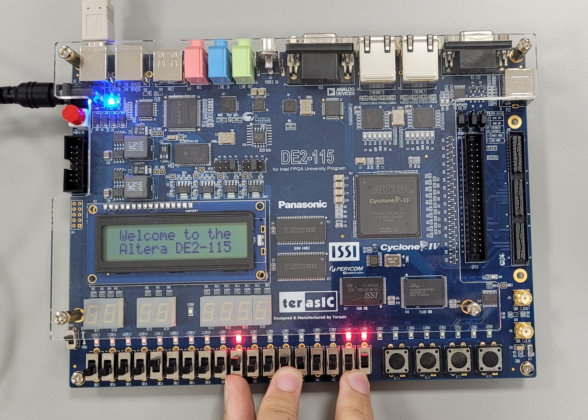  
  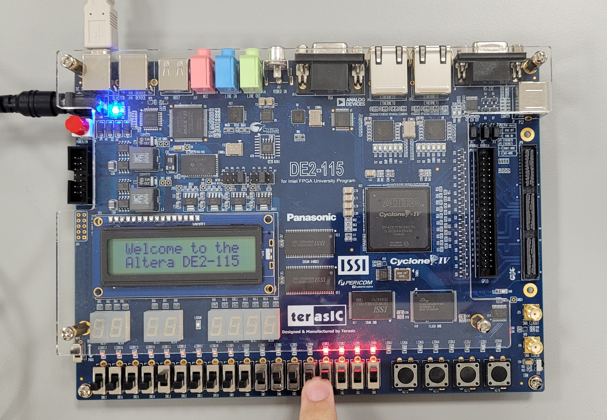 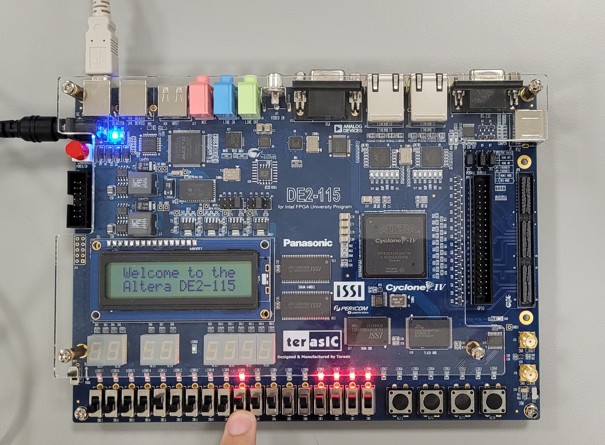
</p>

In the first photo, we test a case when X = "0001", Y = "0011", Sel = "0", and the result in M displayed on the LEDRs = "0001" which makes sense as we stated in our goal that when the Sel = "0" the output in M must mirror the input X. In the second photo, we test the same case except with the Sel = "1", and the result in M = "0011" which mirrors the input Y this time. Also, note that the LED corresponding to the Sel switch lights up when Sel is activated as per our instructions in VHDL. In the third photo, we test another case when X = "1111", Y = "1111", Sel = "0", and the result in M = "1111" mirroring X, not Y because the Sel = "0". Also, we have activated Switch 13 just to prove that it will affect nothing in the configuration or results because it is not defined in our current VHDL design. In the last test, we test the same case except with the Sel = "1" which results in M = "1111" mirroring the input Y.

<br/>

### VHDL Testbench Code Simulation in ModelSim
``` VHDL
library IEEE;
use IEEE.Std_logic_1164.all;
use IEEE.Numeric_Std.all;

entity part2_tb is
end;

architecture bench of part2_tb is

  component part2 
     PORT ( SW   : IN  STD_LOGIC_VECTOR(8 DOWNTO 0);
            LEDR : OUT STD_LOGIC_VECTOR(8 DOWNTO 0));
  end component;

  signal SW: STD_LOGIC_VECTOR(8 DOWNTO 0);
  signal LEDR: STD_LOGIC_VECTOR(8 DOWNTO 0);

begin

  uut: part2 port map ( SW   => SW,
                        LEDR => LEDR );

  stimulus: process
  begin
  
    -- Put initialisation code here

	 	-- Setting values for 4bit X
		SW(0) <= '0';
		SW(1) <= '0';
		SW(2) <= '0';
		SW(3) <= '0';
		
		-- Setting values for 4bit Y
		SW(4) <= '1';
		SW(5) <= '1';
		SW(6) <= '1';
		SW(7) <= '1';
		
		-- Selection line 
		SW(8) <= '1';
		wait for 100ns;
		SW(8) <= '0';
		wait for 100ns;

    -- Note that this is only one case, we can have 81 combinations.
    -- Although this one test case is sufficient in showing that the Sel bit is the determining factor in whether the M output mirrors input X or Y.

    wait;
  end process;

end;
```

<p align="center">
  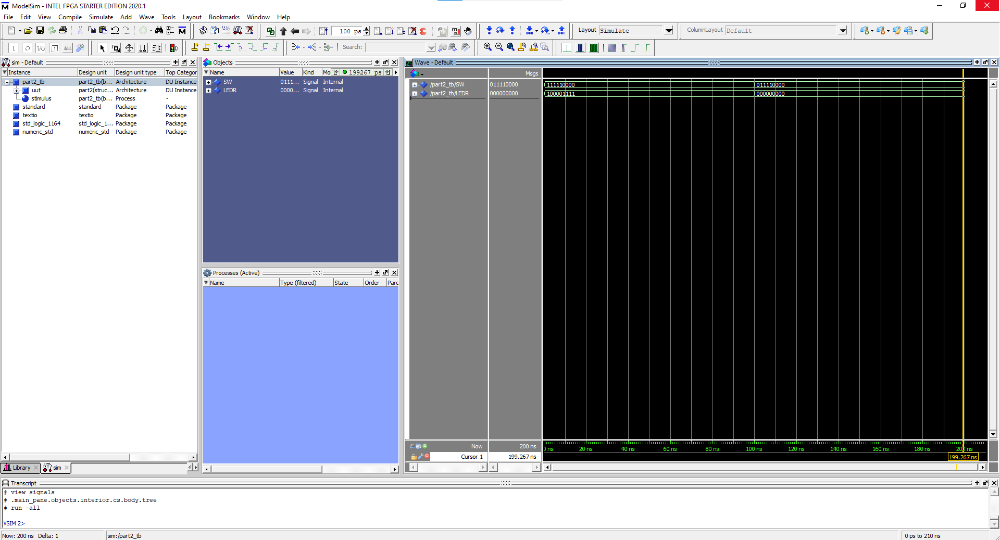
</p>

We can observe that the simulation result agrees with the FPGA implementation results. When X = "0000", Y = "1111", Sel = "1", the output M = "1111" mirroring Y then we have 4 bits which are deactivated and then the Sel bit is 1 because Sel = "1". In the second case, we test the same setup except that Sel = "0" this time which causes the output in M = "0000" mirroring X.

## Part 3

### VHDL Code Implementation on the FPGA Board
### VHDL Testbench Code Simulation in ModelSim

## Part 4

### VHDL Code Implementation on the FPGA Board
### VHDL Testbench Code Simulation in ModelSim


## Work Division
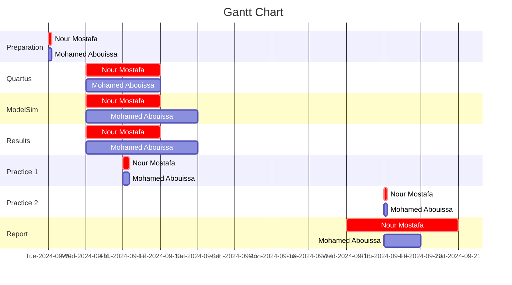

We extend our sincere appreciation to Eng. Umar Adeel for his insightful feedback which has significantly contributed to the successful completion of this experiment.
