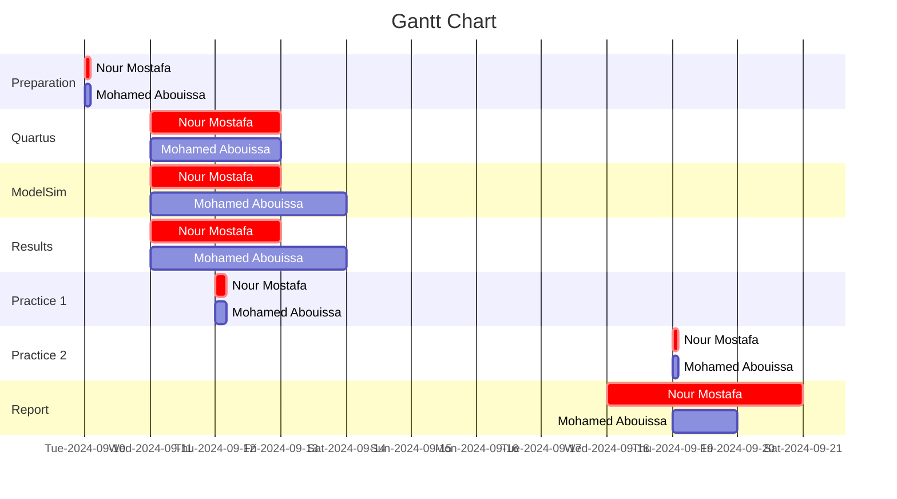

# <p align="center">Experiment 1</p>
## <p align="center">Switches, Lights, and Multiplexers</p>

*The aim of this experiment is to explore how to interface basic input and output devices with an FPGA chip and implement a functional circuit utilizing these components. The switches on the DE-series boards will serve as inputs to the circuit while light-emitting diodes (LEDs) and 7-segment displays will be employed as output devices.*


## Table of Contents

1. [Introduction](#introduction)<br>
2. [Part 1: Switches & LEDs](#part-1-switches-&-leds)<br>
&nbsp;2.1. VHDL Code Implementation on the FPGA Board<br>
&nbsp;&nbsp;&nbsp;&nbsp;&nbsp;&nbsp;&nbsp;&nbsp;2.1.1. Implementation Results<br>
&nbsp;&nbsp;&nbsp;&nbsp;&nbsp;&nbsp;&nbsp;&nbsp;2.1.2. Discussion<br>
&nbsp;2.2. VHDL Testbench Code Simulation in ModelSim<br>
&nbsp;&nbsp;&nbsp;&nbsp;&nbsp;&nbsp;&nbsp;&nbsp;2.2.1. Simulation Results<br>
&nbsp;&nbsp;&nbsp;&nbsp;&nbsp;&nbsp;&nbsp;&nbsp;2.2.2. Discussion<br>
3. [Part 2: ](#part-2-cloud-computing-os)<br>
&nbsp;3.1. VHDL Code Implementation on the FPGA Board<br>
&nbsp;&nbsp;&nbsp;&nbsp;&nbsp;&nbsp;&nbsp;&nbsp;3.1.1. Implementation Results<br>
&nbsp;&nbsp;&nbsp;&nbsp;&nbsp;&nbsp;&nbsp;&nbsp;3.1.2. Discussion<br>
&nbsp;3.2. VHDL Testbench Code Simulation in ModelSim<br>
&nbsp;&nbsp;&nbsp;&nbsp;&nbsp;&nbsp;&nbsp;&nbsp;3.2.1. Simulation Results<br>
&nbsp;&nbsp;&nbsp;&nbsp;&nbsp;&nbsp;&nbsp;&nbsp;3.2.2. Discussion<br>
4. [Part 3: ](#part-3-additional-considerations-best-practices-in-os)<br>
&nbsp;4.1. VHDL Code Implementation on the FPGA Board<br>
&nbsp;&nbsp;&nbsp;&nbsp;&nbsp;&nbsp;&nbsp;&nbsp;4.1.1. Implementation Results<br>
&nbsp;&nbsp;&nbsp;&nbsp;&nbsp;&nbsp;&nbsp;&nbsp;4.1.2. Discussion<br>
&nbsp;4.2. VHDL Testbench Code Simulation in ModelSim<br>
&nbsp;&nbsp;&nbsp;&nbsp;&nbsp;&nbsp;&nbsp;&nbsp;4.2.1. Simulation Results<br>
&nbsp;&nbsp;&nbsp;&nbsp;&nbsp;&nbsp;&nbsp;&nbsp;4.2.2. Discussion<br>
5. [Part 4: ](#part-3-additional-considerations-best-practices-in-os)<br>
&nbsp;5.1. VHDL Code Implementation on the FPGA Board<br>
&nbsp;&nbsp;&nbsp;&nbsp;&nbsp;&nbsp;&nbsp;&nbsp;5.1.1. Implementation Results<br>
&nbsp;&nbsp;&nbsp;&nbsp;&nbsp;&nbsp;&nbsp;&nbsp;5.1.2. Discussion<br>
&nbsp;5.2. VHDL Testbench Code Simulation in ModelSim<br>
&nbsp;&nbsp;&nbsp;&nbsp;&nbsp;&nbsp;&nbsp;&nbsp;5.2.1. Simulation Results<br>
&nbsp;&nbsp;&nbsp;&nbsp;&nbsp;&nbsp;&nbsp;&nbsp;5.2.2. Discussion<br>
6. [Conclusion](#conclusion)<br>
7. [Work Division](#conclusion)<br>
8. [Resources](#resources)<br>

## Introduction
VHDL, which stands for VHSIC (Very High-Speed Integrated Circuit) Hardware Description Language, is a powerful and standardized language used for describing the behavior and structure of electronic systems, particularly digital circuits. Developed in the 1980s for the U.S. Department of Defense, VHDL allows designers to model complex hardware architectures at various levels of abstraction, from high-level algorithmic descriptions to detailed gate-level representations. The language supports concurrent execution of processes, enabling the simulation of hardware behavior in a time-efficient manner. VHDL is widely used in the design of Field Programmable Gate Arrays (FPGAs) and Application-Specific Integrated Circuits (ASICs) due to its ability to facilitate verification, synthesis, and optimization of digital designs. Its syntax is similar to that of the Ada programming language, making it both expressive and versatile, allowing designers to define entities, architectures, data types, and behaviors through constructs such as entities, architectures, packages, and configurations. Moreover, VHDL supports strong typing, modular design, and hierarchical modeling, which helps manage complexity in large systems. The language is governed by the IEEE standard (IEEE 1076), ensuring interoperability across various tools and platforms. VHDL also plays a significant role in the design flow, from behavioral simulation and functional verification to synthesis for actual hardware implementation, making it an essential tool for engineers and designers in the field of digital electronics. In VHDL, the following concepts are fundamental to understanding how digital circuits are designed and described:

1. A library in VHDL is a collection of predefined packages that provide access to various data types, functions, and procedures. The IEEE library, for instance, contains standard logic types and operations, which are essential for digital circuit design.

2. An entity defines the interface of a VHDL module. It describes the inputs and outputs of a digital circuit without detailing how the circuit operates. Essentially, it serves as a blueprint that specifies what the component is, what signals it will accept as inputs, and what signals it will produce as outputs. You can have as many entities as you want in a single VHDL file. Each entity represents a distinct component or module of your design.

3. A port defines the connection points (inputs and outputs) for an entity. Each port has a name, a direction (IN, OUT, or INOUT), and a data type. Ports allow the entity to communicate with other components or systems.

4. An architecture describes the internal implementation and behavior of the entity. It defines how the inputs are processed and how the outputs are generated. There can be multiple architectures for a single entity, allowing different implementations of the same functionality. Each entity can have one or more architectures (but a single architecture is linked to only one entity). This allows you to provide different implementations or behaviors for the same entity. For example, you might define a behavioral architecture and a structural architecture for the same entity.

5. Signals are used to represent connections between different components and internal variables. They can hold values and communicate between processes.

Together, these components form the backbone of VHDL design, allowing designers to create complex digital systems in a structured and modular way.

## Part 1: Switches & LEDs
The DE2-115 provides eighteen switches and lights. The switches can be used to provide inputs, and the lights can be used as output devices. In this part, we create a simple VHDL entity that uses the switches and shows their states on the LEDs. 

This same procedure will be used to implement tasks. First, we will create a new Quartus project for the circuit, ensuring to select the target chip that corresponds to our DE2-115 board. Next, we will create a VHDL entity for the code and incorporate it into our project. Following that, we will include the necessary pin assignments for the DE-series board, as discussed previously, and compile the project. Finally, we will download the compiled circuit into the FPGA chip using the Quartus Programmer tool and test the functionality of the circuit.

``` VHDL
LIBRARY ieee;
USE ieee.std_logic_1164.all;

-- When a switch is flipped on, the corresponding LED lights up, providing a direct visual representation of the switch states.

ENTITY part1 IS 
   PORT ( SW   : IN   STD_LOGIC_VECTOR(17 DOWNTO 0); -- Declares an input port named 'SW' as a 18-bit vector of standard logic
          LEDR : OUT  STD_LOGIC_VECTOR(17 DOWNTO 0)); -- Declares an output port named 'LEDR' (red LEDs) as a 18-bit vector of standard logic
END part1;

ARCHITECTURE Structure OF part1 IS
BEGIN -- A keyword that indicates the start of the architecture's body - notice that we do not use BEGIN with entities
   LEDR <= SW; -- Assigns the value of the input 'SW' to the output 'LEDR' directly - so if the switch value is high then the LEDR will be high as well
END Structure;
```

<p align="center">
     
   
</p>

In the first photo, none of the switches are activated, resulting in no LEDs being illuminated. In the second photo, switch 0 (SW0) is turned on, which causes LED0 to light up. The third photo shows switch 5 activated, illuminating LED5. Similarly, in the fourth photo, switch 8 is turned on, activating LED8. We can also observe that activating a switch does not affect the state of any other LEDs that were previously lit with their corresponding switches. A LED will remain on as long as its switch is activated.

``` VHDL
-- This VHDL code is a testbench for a digital circuit described in another VHDL file named part1. The testbench simulates input signals to the circuit and monitors the output signals.

library IEEE;
use IEEE.Std_logic_1164.all; -- Use the standard logic package for defining and working with signals
use IEEE.Numeric_Std.all; -- Use the numeric standard library for arithmetic operations on vectors

-- Define an empty entity for the testbench; it has no ports
entity part1_tb is
end;

architecture bench of part1_tb is
-- Declaration of the component being tested (the design under test)
  component part1
     PORT ( SW   : IN   STD_LOGIC_VECTOR(17 DOWNTO 0); -- Input: 18-bit switch vector
            LEDR : OUT  STD_LOGIC_VECTOR(17 DOWNTO 0)); -- Output: 18-bit LED vector
  end component;

  -- Signal declaration: these signals will be used to connect to the component
  signal SW: STD_LOGIC_VECTOR(17 DOWNTO 0); -- 18-bit input signal for switches
  signal LEDR: STD_LOGIC_VECTOR(17 DOWNTO 0); -- 18-bit output signal for LEDs

begin
  -- Instantiate the component (part1) and connect signals to its ports
  uut: part1 port map ( SW   => SW, -- Connect the SW signal to the input of part1
                        LEDR => LEDR ); -- Connect the LEDR signal to the output of part1

  stimulus: process
  begin
  
    -- Initialisation code can be added here, such as setting initial values for signals

		SW <= "101010101010101010"; -- Set the SW signal to a specific pattern of switches (101010101010101010)     
		wait for 100 ns; -- Wait for 100 nanoseconds, enough pause for the result of the previous statement till you observe it
		
		SW <= "010101010101010101"; -- Change the SW signal to a different pattern (010101010101010101)
		wait for 100 ns;

    -- Additional testbench stimulus code can be added here to test more scenarios

    wait; -- Suspend indefinitely, allowing the simulation to run continuously and observe the output until it is manually stopped
  end process;

end;
```
<p align="center">
  
</p>

## Part 2

## Part 3

## Part 4

## Work Division


We extend our sincere appreciation to Eng. Umar Adeel for his insightful feedback which has significantly contributed to the successful completion of this experiment.
