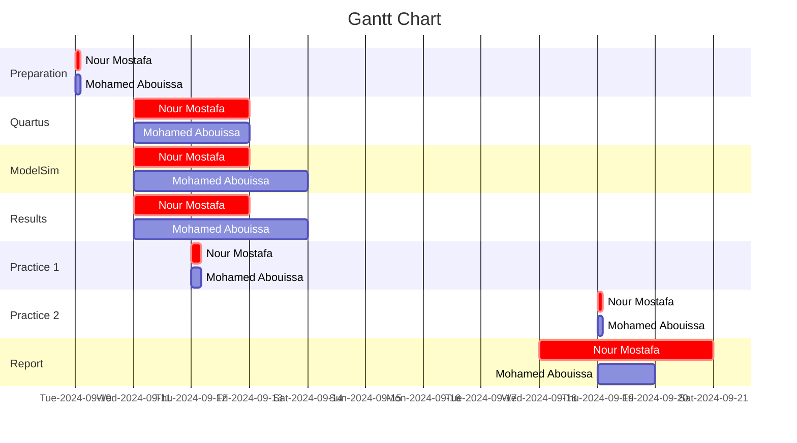

# <p align="center">Experiment 1</p>
## <p align="center">Switches, Lights, and Multiplexers</p>

<p align="center">
  
</p>

<p align="center">
    <a href="https://aurak.ac.ae/academics/programs-departments/department-of-computer-science-and-engineering">
    </a>
    <a href="">
    </a>
</p>

*The aim of this experiment is to explore how to interface basic input and output devices with an FPGA chip and implement a functional circuit utilizing these components. The switches on the DE-series boards will serve as inputs to the circuit while light-emitting diodes (LEDs) and 7-segment displays will be employed as output devices.*


## Table of Contents

1. [Introduction](#introduction)<br>
2. [Part 1: Switches & LEDs](#part-1-switches-&-leds)<br>
&nbsp;2.1. VHDL Code<br>
&nbsp;&nbsp;&nbsp;&nbsp;&nbsp;&nbsp;&nbsp;&nbsp;2.1.1. Implementation Results<br>
&nbsp;&nbsp;&nbsp;&nbsp;&nbsp;&nbsp;&nbsp;&nbsp;2.1.2. Discussion<br>
&nbsp;2.2. Testbench Code<br>
&nbsp;&nbsp;&nbsp;&nbsp;&nbsp;&nbsp;&nbsp;&nbsp;2.2.1. Simulation Results<br>
&nbsp;&nbsp;&nbsp;&nbsp;&nbsp;&nbsp;&nbsp;&nbsp;2.2.2. Discussion<br>
3. [Part 2: ](#part-2-cloud-computing-os)<br>
&nbsp;3.1. VHDL Code<br>
&nbsp;&nbsp;&nbsp;&nbsp;&nbsp;&nbsp;&nbsp;&nbsp;3.1.1. Implementation Results<br>
&nbsp;&nbsp;&nbsp;&nbsp;&nbsp;&nbsp;&nbsp;&nbsp;3.1.2. Discussion<br>
&nbsp;3.2. Testbench Code<br>
&nbsp;&nbsp;&nbsp;&nbsp;&nbsp;&nbsp;&nbsp;&nbsp;3.2.1. Simulation Results<br>
&nbsp;&nbsp;&nbsp;&nbsp;&nbsp;&nbsp;&nbsp;&nbsp;3.2.2. Discussion<br>
4. [Part 3: ](#part-3-additional-considerations-best-practices-in-os)<br>
&nbsp;4.1. VHDL Code<br>
&nbsp;&nbsp;&nbsp;&nbsp;&nbsp;&nbsp;&nbsp;&nbsp;4.1.1. Implementation Results<br>
&nbsp;&nbsp;&nbsp;&nbsp;&nbsp;&nbsp;&nbsp;&nbsp;4.1.2. Discussion<br>
&nbsp;4.2. Testbench Code<br>
&nbsp;&nbsp;&nbsp;&nbsp;&nbsp;&nbsp;&nbsp;&nbsp;4.2.1. Simulation Results<br>
&nbsp;&nbsp;&nbsp;&nbsp;&nbsp;&nbsp;&nbsp;&nbsp;4.2.2. Discussion<br>
5. [Part 4: ](#part-3-additional-considerations-best-practices-in-os)<br>
&nbsp;5.1. VHDL Code<br>
&nbsp;&nbsp;&nbsp;&nbsp;&nbsp;&nbsp;&nbsp;&nbsp;5.1.1. Implementation Results<br>
&nbsp;&nbsp;&nbsp;&nbsp;&nbsp;&nbsp;&nbsp;&nbsp;5.1.2. Discussion<br>
&nbsp;5.2. Testbench Code<br>
&nbsp;&nbsp;&nbsp;&nbsp;&nbsp;&nbsp;&nbsp;&nbsp;5.2.1. Simulation Results<br>
&nbsp;&nbsp;&nbsp;&nbsp;&nbsp;&nbsp;&nbsp;&nbsp;5.2.2. Discussion<br>
6. [Conclusion](#conclusion)<br>
7. [Work Division](#conclusion)<br>
8. [Resources](#resources)<br>

### Part 1: Switches & LEDs
The DE2-115 provides eighteen switches and lights. The switches can be used to provide inputs, and the lights can be used as output devices. In this part, we create a simple VHDL entity that uses the switches and shows their states on the LEDs. 

This same procedure will be used to implement tasks. First, we will create a new Quartus project for the circuit, ensuring to select the target chip that corresponds to our DE2-115 board. Next, we will create a VHDL entity for the code and incorporate it into our project. Following that, we will include the necessary pin assignments for the DE-series board, as discussed previously, and compile the project. Finally, we will download the compiled circuit into the FPGA chip using the Quartus Programmer tool and test the functionality of the circuit.

``` VHDL
LIBRARY ieee;
USE ieee.std_logic_1164.all;

-- Simple module that connects the SW switches to the LEDR lights
ENTITY part1 IS 
   PORT ( SW   : IN   STD_LOGIC_VECTOR(17 DOWNTO 0);
          LEDR : OUT  STD_LOGIC_VECTOR(17 DOWNTO 0));  -- red LEDs
END part1;

ARCHITECTURE Structure OF part1 IS
BEGIN
   LEDR <= SW;
END Structure;

```


### Part 2

### Part 3

### Part 4

### Work Division


We extend our sincere appreciation to Eng. Umar Adeel for his insightful feedback which has significantly contributed to the successful completion of this experiment.
