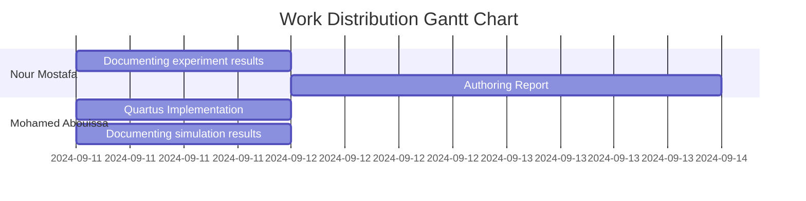

# 
Experiment 1

## 
Switches, Lights, and Multiplexers

The aim of this experiment is to explore how to interface basic input and output devices with an FPGA chip and implement a functional circuit utilizing these components. The switches on the DE-series boards will serve as inputs to the circuit while light-emitting diodes (LEDs) and 7-segment displays will be employed as output devices.

## Work Distribution & Acknowledgements
| | Name            | ID        | Task |
|-|-------------------|-----------|------|
|1| [Nour Mostafa](mailto:nour.mohamed@aurak.ac.ae)    | 2021004938 | 1. Conducted research on synchronization.   2. Conducted research on deadlock.   3. Prepared outstanding presentation slides. |
|2| [Mohamed Abouissa](mailto:mohamed.abouissa@aurak.ac.ae)  | 2021005188| 1. Documenting experiment and simulation results.   2. Conducted research on memory management.   3. Conducted research on file management. |

We extend our sincere appreciation to Eng. Umar Adeel for his insightful feedback which has significantly contributed to the successful completion of this experiment.

## Table of Contents

1. [Introduction](#introduction) 
2. [Part 1: Daily Driver OS (Arch Linux)](#part-1-daily-driver-os-arch-linux) 
&nbsp;2.1. VHDL Code 
&nbsp;&nbsp;&nbsp;&nbsp;&nbsp;&nbsp;&nbsp;&nbsp;2.1.1. Implementation Results 
&nbsp;&nbsp;&nbsp;&nbsp;&nbsp;&nbsp;&nbsp;&nbsp;2.1.2. Discussion 
&nbsp;2.2. Testbench Code 
&nbsp;&nbsp;&nbsp;&nbsp;&nbsp;&nbsp;&nbsp;&nbsp;2.2.1. Simulation Results 
&nbsp;&nbsp;&nbsp;&nbsp;&nbsp;&nbsp;&nbsp;&nbsp;2.2.2. Discussion 
3. [Part 2: Cloud Computing OS](#part-2-cloud-computing-os) 
&nbsp;3.1. VHDL Code 
&nbsp;&nbsp;&nbsp;&nbsp;&nbsp;&nbsp;&nbsp;&nbsp;3.1.1. Implementation Results 
&nbsp;&nbsp;&nbsp;&nbsp;&nbsp;&nbsp;&nbsp;&nbsp;3.1.2. Discussion 
&nbsp;3.2. Testbench Code 
&nbsp;&nbsp;&nbsp;&nbsp;&nbsp;&nbsp;&nbsp;&nbsp;3.2.1. Simulation Results 
&nbsp;&nbsp;&nbsp;&nbsp;&nbsp;&nbsp;&nbsp;&nbsp;3.2.2. Discussion 
4. [Part 3: Additional Considerations (Best Practices in OS)](#part-3-additional-considerations-best-practices-in-os) 
&nbsp;4.1. VHDL Code 
&nbsp;&nbsp;&nbsp;&nbsp;&nbsp;&nbsp;&nbsp;&nbsp;4.1.1. Implementation Results 
&nbsp;&nbsp;&nbsp;&nbsp;&nbsp;&nbsp;&nbsp;&nbsp;4.1.2. Discussion 
&nbsp;4.2. Testbench Code 
&nbsp;&nbsp;&nbsp;&nbsp;&nbsp;&nbsp;&nbsp;&nbsp;4.2.1. Simulation Results 
&nbsp;&nbsp;&nbsp;&nbsp;&nbsp;&nbsp;&nbsp;&nbsp;4.2.2. Discussion 
5. [Part 4: Additional Considerations (Best Practices in OS)](#part-3-additional-considerations-best-practices-in-os) 
&nbsp;5.1. VHDL Code 
&nbsp;&nbsp;&nbsp;&nbsp;&nbsp;&nbsp;&nbsp;&nbsp;5.1.1. Implementation Results 
&nbsp;&nbsp;&nbsp;&nbsp;&nbsp;&nbsp;&nbsp;&nbsp;5.1.2. Discussion 
&nbsp;5.2. Testbench Code 
&nbsp;&nbsp;&nbsp;&nbsp;&nbsp;&nbsp;&nbsp;&nbsp;5.2.1. Simulation Results 
&nbsp;&nbsp;&nbsp;&nbsp;&nbsp;&nbsp;&nbsp;&nbsp;5.2.2. Discussion 
6. [Conclusion](#conclusion) 
7. [Resources](#resources) 

### Part 1
The DE2-115 provides eighteen switches and lights. The switches can be used to provide inputs, and the lights can be used as output devices. 

VHDL entity that uses ten switches and shows their
states on the LEDs. Since there are multiple switches and lights it is convenient to represent them as vectors in the
VHDL code

### Part 2

### Part 3

### Part 4
