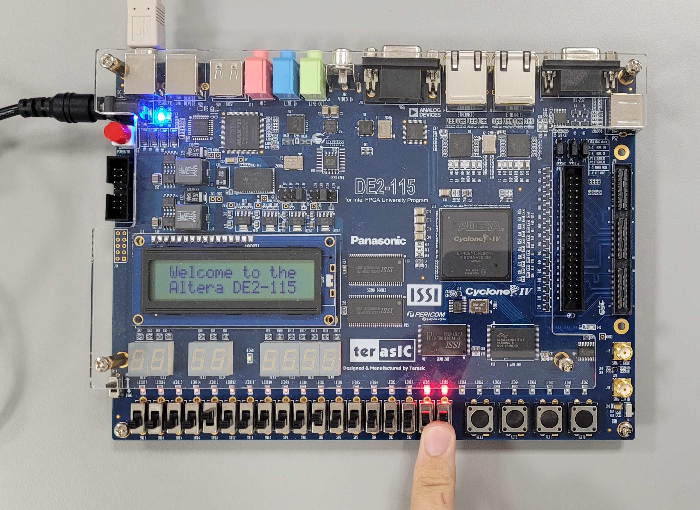

# <p align="center">Switches, Lights, and Multiplexers</p>

*The aim of this experiment is to explore how to interface basic input and output devices with an FPGA chip and implement a functional circuit utilizing these components. The switches on the DE-series boards will serve as inputs to the circuit while light-emitting diodes (LEDs) and 7-segment displays will be employed as output devices.*

---
VHDL, which stands for VHSIC (Very High-Speed Integrated Circuit) Hardware Description Language, is a powerful and standardized language used for describing the behavior and structure of electronic systems, particularly digital circuits. Developed in the 1980s for the U.S. Department of Defense, VHDL allows designers to model complex hardware architectures at various levels of abstraction, from high-level algorithmic descriptions to detailed gate-level representations. The language supports concurrent execution of processes, enabling the simulation of hardware behavior in a time-efficient manner. VHDL is widely used in the design of Field Programmable Gate Arrays (FPGAs) and Application-Specific Integrated Circuits (ASICs) due to its ability to facilitate verification, synthesis, and optimization of digital designs. Its syntax is similar to that of the Ada programming language, making it both expressive and versatile, allowing designers to define entities, architectures, data types, and behaviors through constructs such as entities, architectures, packages, and configurations. Moreover, VHDL supports strong typing, modular design, and hierarchical modeling, which helps manage complexity in large systems. The language is governed by the IEEE standard (IEEE 1076), ensuring interoperability across various tools and platforms. VHDL also plays a significant role in the design flow, from behavioral simulation and functional verification to synthesis for actual hardware implementation, making it an essential tool for engineers and designers in the field of digital electronics.

In VHDL, several fundamental concepts are crucial for understanding the design and description of digital circuits. A `library` is a collection of predefined packages that grant access to various data types, functions, and procedures, with the IEEE library being a notable example that contains standard logic types and operations essential for digital circuit design. An `entity` defines the interface of a VHDL module, specifying the inputs and outputs of a digital circuit without detailing its internal operation; essentially, it serves as a blueprint for the component, outlining what it is, the signals it accepts as inputs, and the outputs it produces. You can have as many entities as you wish in a single VHDL file, with each entity representing a distinct component or module of the design. A `port` defines the connection points (inputs and outputs) for an entity, each having a name, a direction (IN, OUT, or INOUT), and a data type, enabling communication between the entity and other components or systems. An `architecture` describes the internal implementation and behavior of the entity, detailing how inputs are processed and outputs are generated; there can be multiple architectures for a single entity, allowing for different implementations of the same functionality. This means that each entity can be associated with one or more architectures, but a single architecture is linked to only one entity, facilitating various implementations or behaviors. `UUT` stands for Unit Under Test. It refers to the specific module, component, or system that is currently being tested in a simulation or hardware environment. In hardware design and verification, especially with languages like VHDL or Verilog, the UUT is the entity or module that is the focus of testing within a testbench. The testbench provides inputs to the UUT and monitors the outputs to ensure it functions correctly. Additionally, `signals` represent connections between different components and internal variables, enabling them to hold values and facilitate communication between processes. Together, these components form the backbone of VHDL design, empowering designers to create complex digital systems in a structured and modular manner.


## Part 1: Switches & LEDs
The DE2-115 provides eighteen switches and lights. The switches can be used to provide inputs, and the lights can be used as output devices. In this part, we create a simple VHDL entity that uses the switches and shows their states on the LEDs. 

This same procedure will be used to implement tasks. First, we will create a new Quartus project for the circuit, ensuring to select the target chip that corresponds to our DE2-115 board. Next, we will create a VHDL entity for the code and incorporate it into our project. Following that, we will include the necessary pin assignments for the DE-series board, as discussed previously, and compile the project. Finally, we will download the compiled circuit into the FPGA chip using the Quartus Programmer tool and test the functionality of the circuit.

<details>
  <summary>VHDL Code Implementation on the FPGA Board</summary>
<br>
	
``` VHDL
LIBRARY ieee;
USE ieee.std_logic_1164.all;

-- When a switch is flipped on, the corresponding LED lights up, providing a direct visual representation of the switch states.

ENTITY part1 IS 
   PORT ( SW   : IN   STD_LOGIC_VECTOR(17 DOWNTO 0); -- Declares an input port named 'SW' as a 18-bit vector of standard logic
          LEDR : OUT  STD_LOGIC_VECTOR(17 DOWNTO 0)); -- Declares an output port named 'LEDR' (red LEDs) as a 18-bit vector of standard logic
END part1;

ARCHITECTURE Structure OF part1 IS
BEGIN -- A keyword that indicates the start of the architecture's body - notice that we do not use BEGIN with entities
   LEDR <= SW; -- Assigns the value of the input 'SW' to the output 'LEDR' directly - so if the switch value is high then the LEDR will be high as well
END Structure;
```

<p align="center">
     
   
</p>

In the first photo, none of the switches are activated, resulting in no LEDs being illuminated. In the second photo, switch 0 (SW0) is turned on, which causes LED0 to light up. The third photo shows switch 5 activated, illuminating LED5. Similarly, in the fourth photo, switch 8 is turned on, activating LED8. We can also observe that activating a switch does not affect the state of any other LEDs that were previously lit with their corresponding switches. A LED will remain on as long as its switch is activated.
</details>


<details>
  <summary>VHDL Testbench Code Simulation in ModelSim</summary>
<br>
	
``` VHDL
library IEEE;
use IEEE.Std_logic_1164.all; -- Use the standard logic package for defining and working with signals
use IEEE.Numeric_Std.all; -- Use the numeric standard library for arithmetic operations on vectors

-- Define an empty entity for the testbench; it has no ports
entity part1_tb is
end;

architecture bench of part1_tb is
-- Declaration of the component being tested (the design under test)
  component part1
     PORT ( SW   : IN   STD_LOGIC_VECTOR(17 DOWNTO 0); -- Input: 18-bit switch vector
            LEDR : OUT  STD_LOGIC_VECTOR(17 DOWNTO 0)); -- Output: 18-bit LED vector
  end component;

  -- Signal declaration: these signals will be used to connect to the component
  signal SW: STD_LOGIC_VECTOR(17 DOWNTO 0); -- 18-bit input signal for switches
  signal LEDR: STD_LOGIC_VECTOR(17 DOWNTO 0); -- 18-bit output signal for LEDs

begin
  -- Instantiate the component (part1) and connect signals to its ports
  uut: part1 port map ( SW   => SW, -- Connect the SW signal to the input of part1
                        LEDR => LEDR ); -- Connect the LEDR signal to the output of part1

  stimulus: process
  begin
    -- Initialisation code can be added here, such as setting initial values for signals

		SW <= "101010101010101010"; -- Set the SW signal to a specific pattern of switches (101010101010101010)     
		wait for 100 ns; -- Wait for 100 nanoseconds, enough pause for the result of the previous statement till you observe it
		
		SW <= "010101010101010101"; -- Change the SW signal to a different pattern (010101010101010101)
		wait for 100 ns;

    -- Additional testbench stimulus code can be added here to test more scenarios

    wait; -- Suspend indefinitely, allowing the simulation to run continuously and observe the output until it is manually stopped
  end process;

end;
```
<p align="center">
  
</p>

The simulation results align perfectly with the implementation results observed on the board, confirming that the design behaves as intended. When a switch (SW) is set to 1, the corresponding LED (LEDR) bit also lights up as 1, and similarly, when the switch is set to 0, the corresponding LED bit reflects this with a 0 output. This direct correlation between the switch states and LED outputs demonstrates the expected functionality of the circuit. In the waveform window, we can clearly observe the effect of the 100 ns wait time during which nothing occurs, creating the visual equivalent of a break between two test scenarios. After this pause we test new values in the switches vector and the corresponding results in the LEDs vector after each stimulus is applied.

Duolos' VHDL Testbench Creation Using Perl automates the creation of testbenches for our VHDL designs. However, it does not generate input patterns for testing the design. Instead, we can manually initialize all input values within the "Stimulus Process" section.

It’s important to note that although we are viewing a waveform window, the data displayed does not represent traditional waveforms. Instead, we see discrete values of 0s and 1s. The absence of oscillation or variation in these values means that we cannot describe this output as a wave; there is no upward or downward movement to indicate continuous change. Rather, each state remains stable until the next input is applied, further illustrating the digital nature of the signals.
</details>

## Part 2: Four-bit wide 2-to-1 multiplexer 
In this section, we implement a four-bit wide 2-to-1 multiplexer that takes two 4-bit inputs, X and Y, and produces a four-bit output M. The functionality of the multiplexer is governed by a select line s: when s=0, the output M mirrors the input X; conversely, when s=1, the output reflects the input Y.

A multiplexer, often abbreviated as "mux," is a digital switch that selects one of several input signals and forwards the selected input to a single output line. It operates based on control signals, known as select lines, which determine which input is routed to the output. The primary function of a multiplexer is to manage multiple data sources and simplify the complexity of wiring in a circuit.

<details>
  <summary>VHDL Code Implementation on the FPGA Board</summary>
<br>
	
``` VHDL
LIBRARY ieee;
USE ieee.std_logic_1164.all;

-- Simple module that connects the SW switches to the LEDR lights
ENTITY part2 IS 
   PORT ( SW   : IN  STD_LOGIC_VECTOR(8 DOWNTO 0);    -- 9 slide switches for input (8 for data and 1 for selection)
          LEDR : OUT STD_LOGIC_VECTOR(8 DOWNTO 0));   -- 9 red LEDs for output (8 for data display and 1 for selection indicator)
END part2;

ARCHITECTURE Structure OF part2 IS
   SIGNAL Sel : STD_LOGIC; -- defining that the selector is only 1 bit
   SIGNAL X, Y, M : STD_LOGIC_VECTOR(3 DOWNTO 0); -- defining that the x input, y input, and m output  are all 4 bits each

BEGIN
   X <= SW(3 DOWNTO 0); -- 4 bits (switches) for input X
   Y <= SW(7 DOWNTO 4); -- 4 bits (switches) for input Y
   Sel <= SW(8); -- 1 bit (switch) for the selector
   M(0) <= (NOT(Sel) AND X(0)) OR (Sel AND Y(0)); -- the equation to calculate the value inside the 1st bit of the M output
   M(1) <= (NOT(Sel) AND X(1)) OR (Sel AND Y(1)); -- the equation to calculate the value inside the 2nd bit of the M output
   M(2) <= (NOT(Sel) AND X(2)) OR (Sel AND Y(2)); -- the equation to calculate the value inside the 3rd bit of the M output
   M(3) <= (NOT(Sel) AND X(3)) OR (Sel AND Y(3)); -- the equation to calculate the value inside the 4th bit of the M output
   LEDR(8) <= Sel; -- LEDR8 will light up based on the state of the selector switch whether it is slid on or off
   LEDR(7 DOWNTO 4) <= "0000"; -- The second 4 LEDRs will remain off
   LEDR(3 DOWNTO 0) <= M; -- The first 4 LEDRs will show the output which is stored in the 4 bits of M
END Structure;
```

<p align="center">
     
   
</p>

In the first photo, we test a case when X = "0001", Y = "0011", Sel = "0", and the result in M displayed on the LEDRs = "0001" which makes sense as we stated in our goal that when the Sel = "0" the output in M must mirror the input X. In the second photo, we test the same case except with the Sel = "1", and the result in M = "0011" which mirrors the input Y this time. Also, note that the LED corresponding to the Sel switch lights up when Sel is activated as per our instructions in VHDL. In the third photo, we test another case when X = "1111", Y = "1111", Sel = "0", and the result in M = "1111" mirroring X, not Y because the Sel = "0". Also, we have activated Switch 13 just to prove that it will affect nothing in the configuration or results because it is not defined in our current VHDL design. In the last test, we test the same case except with the Sel = "1" which results in M = "1111" mirroring the input Y.
</details>

<details>
  <summary>VHDL Testbench Code Simulation in ModelSim</summary>
<br>
	
``` VHDL
library IEEE;
use IEEE.Std_logic_1164.all;
use IEEE.Numeric_Std.all;

entity part2_tb is
end;

architecture bench of part2_tb is

  component part2 
     PORT ( SW   : IN  STD_LOGIC_VECTOR(8 DOWNTO 0);
            LEDR : OUT STD_LOGIC_VECTOR(8 DOWNTO 0));
  end component;

  signal SW: STD_LOGIC_VECTOR(8 DOWNTO 0);
  signal LEDR: STD_LOGIC_VECTOR(8 DOWNTO 0);

begin

  uut: part2 port map ( SW   => SW,
                        LEDR => LEDR );

  stimulus: process
  begin
  
    -- Put initialisation code here

	 	-- Setting values for 4bit X
		SW(0) <= '0';
		SW(1) <= '0';
		SW(2) <= '0';
		SW(3) <= '0';
		
		-- Setting values for 4bit Y
		SW(4) <= '1';
		SW(5) <= '1';
		SW(6) <= '1';
		SW(7) <= '1';
		
		-- Selection line 
		SW(8) <= '1';
		wait for 100ns;
		SW(8) <= '0';
		wait for 100ns;

    -- Note that this is only one case, we can have 81 combinations.
    -- Although this one test case is sufficient in showing that the Sel bit is the determining factor in whether the M output mirrors input X or Y.

    wait;
  end process;

end;
```

<p align="center">
  
</p>

We can observe that the simulation result agrees with the FPGA implementation results. When X = "0000", Y = "1111", Sel = "1", the output M = "1111" mirroring Y then we have 4 bits which are deactivated and then the Sel bit is 1 because Sel = "1". In the second case, we test the same setup except that Sel = "0" this time which causes the output in M = "0000" mirroring X.
</details>

## Part 3: Two-bit wide 4-to-1 multiplexer
In this part, the output M needs to be chosen from four possible inputs: U, V, W, and X. A 2-bit select input S1S0 controls this selection process. The select lines operate as follows: when 
S1S0 is "00", the output M is set to U; when S1S0 is "01", M takes the value of V; for "10", M becomes W; and finally, when S1S0 is "11", the output M will be equal to X. Essentially, this design enables the circuit to dynamically choose one of four inputs based on the binary values of the select inputs, offering flexibility in data selection and control.

In the previous part, we built a four-bit wide 2-to-1 multiplexer from a one-bit 2-to-1 multiplexer. A single-bit wide 2-to-1 multiplexer can select between two inputs, and by replicating this structure four times, we expanded it to handle four-bit wide inputs. Each instance of the 2-to-1 multiplexer will operate on a single bit of the four-bit inputs. This design is modular and scalable, allowing for wider input selections while maintaining simplicity in design.

Now, to implement a 4-to-1 multiplexer using only 2-to-1 multiplexers, we can break the problem down by constructing it from simpler building blocks. A 2-to-1 multiplexer selects between two inputs using a single select signal. To construct a 4-to-1 multiplexer, we can utilize three 2-to-1 multiplexers arranged in a hierarchical structure. The first 2-to-1 mux will take U and V as inputs, while the second will take W and X. The outputs of these two multiplexers are then fed into a third 2-to-1 multiplexer. The first-level multiplexers will use the least significant bit of the select line S0, while the final multiplexer, which chooses between their outputs, will use the most significant bit S1. This arrangement allows for selecting one of four inputs using the two select bits S1 and S0, efficiently combining simpler components into a more complex circuit.

<details>
  <summary>VHDL Code Implementation on the FPGA Board</summary>
<br>
	
``` VHDL
LIBRARY ieee;
USE ieee.std_logic_1164.all;

-- Simple module that connects the SW switches to the LEDR lights
ENTITY part3 IS 
   PORT ( SW   : IN  STD_LOGIC_VECTOR(9 DOWNTO 0);    -- 10 slide switches for various types of inputs
          LEDR : OUT STD_LOGIC_VECTOR(7 DOWNTO 0));   -- 8 red LEDs for output
END part3;

ARCHITECTURE Structure OF part3 IS
   SIGNAL U, V, W, X, M, Sel : STD_LOGIC_VECTOR(1 DOWNTO 0);  --  each one is a vector with 2 bits

BEGIN
   -- assigning 2 switches (bits) per input
   U <= SW(1 DOWNTO 0); 
   V <= SW(3 DOWNTO 2);
   W <= SW(5 DOWNTO 4);
   X <= SW(7 DOWNTO 6);
   Sel <= SW (9 DOWNTO 8);

   -- calculating the 2 output bits using an equation
   M(0) <= ((U(0) AND (NOT Sel(0)) AND (NOT Sel(1))) OR (W(0) AND (NOT Sel(0)) AND (Sel(1))) OR (V(0) AND (Sel(0)) AND (NOT Sel(1))) OR (X(0) AND (Sel(0)) AND (Sel(1))));
   M(1) <= ((U(1) AND (NOT Sel(0)) AND (NOT Sel(1))) OR (W(1) AND (NOT Sel(0)) AND (Sel(1))) OR (V(1) AND (Sel(0)) AND (NOT Sel(1))) OR (X(1) AND (Sel(0)) AND (Sel(1))));
  	
	PROCESS(Sel, M) -- A process block is initiated to determine how the LEDR outputs will respond based on the Sel and M signals
   BEGIN
      -- Initialize LEDR to all zeros
      LEDR <= (others => '0'); -- ensuring that all LEDs are off by default

      -- We require the use of the case statement because we want to display the result inside M on the LEDRs above the input switches that are being mirrored in the output. (Just better output visualization)
      CASE Sel IS
         WHEN "00" =>
            LEDR(1 DOWNTO 0) <= M;   -- Display U on LEDR(1 DOWNTO 0)
         WHEN "01" =>
            LEDR(3 DOWNTO 2) <= M;   -- Display V on LEDR(3 DOWNTO 2)
         WHEN "10" =>
            LEDR(5 DOWNTO 4) <= M;   -- Display W on LEDR(5 DOWNTO 4)
         WHEN "11" =>
            LEDR(7 DOWNTO 6) <= M;   -- Display X on LEDR(7 DOWNTO 6)
         WHEN OTHERS =>
            LEDR <= (others => '0'); -- Default case
      END CASE;
   END PROCESS;

END Structure;
```

<p align="center">
     
   
   
   
</p>

In the first 4 cases, we test the same configuration with different values of the selector bits. In the 1st photo, U = "00", V = "01", W = "10", X = "11", Sel = "00" (read from right to left), and the result in M as shown on the LEDRs = "00" = U. In the 2nd photo, U = "00", V = "01", W = "10", X = "11", Sel = "01" and the result in M = "01" = V. In the 3rd photo, U = "00", V = "01", W = "10", X = "11", Sel = "10" and the result in M = "10" = W. In the 4th photo, U = "00", V = "01", W = "10", X = "11", Sel = "11" and the result in M = "11" = X. For the next 4 cases, we will test another configuration with different values of the selector bits. In the 5th photo, U = "11", V = "11", W = "11", X = "11", Sel = "00" and the result in M = "11" = U (conveniently shown above the U input switches for a more intuitive visual experience). In the 6th photo, U = "11", V = "11", W = "11", X = "11", Sel = "01" and the result in M = "11" = V (shown above the V input switches). In the 7th photo, U = "11", V = "11", W = "11", X = "11", Sel = "10" and the result in M = "11" = W (shown above the W input switches). In the 8th photo, U = "11", V = "11", W = "11", X = "11", Sel = "11" and the result in M = "11" = X (shown above the X input switches).
</details>

<details>
  <summary>VHDL Testbench Code Simulation in ModelSim</summary>
<br>

``` VHDL
library IEEE;
use IEEE.Std_logic_1164.all;
use IEEE.Numeric_Std.all;

entity part3_tb is
end;

architecture bench of part3_tb is

  component part3 
     PORT ( SW   : IN  STD_LOGIC_VECTOR(9 DOWNTO 0);
            LEDR : OUT STD_LOGIC_VECTOR(7 DOWNTO 0));
  end component;

  signal SW: STD_LOGIC_VECTOR(9 DOWNTO 0);
  signal LEDR: STD_LOGIC_VECTOR(7 DOWNTO 0);

begin

  uut: part2 port map ( SW   => SW,
                        LEDR => LEDR );

  stimulus: process
  begin
  	 -- U inputs
         SW(0) <= '1'; 
	 SW(1) <= '1';
	 
	 -- V inputs
	 SW(2) <= '1';
	 SW(3) <= '1';
	 
	 -- W inputs
	 SW(4) <= '1';
	 SW(5) <= '1';
	 
	 -- X inputs
	 SW(6) <= '1';
	 SW(7) <= '1';
	 
	 -- Sel Inputs
	 SW(8) <= '0';
	 SW(9) <= '0';
	 wait for 100ns;
	 SW(8) <= '1';
	 SW(9) <= '0';
	 wait for 100ns;	 
	 SW(8) <= '0';
	 SW(9) <= '1';
	 wait for 100ns;	 
	 SW(8) <= '1';
	 SW(9) <= '1';
	 wait for 100ns;

    wait;
  end process;

end;
```

<p align="center">
  
</p>

The simulation results successfully confirm the desired behavior. In the testbench, we test the 2nd scenario from our implementation where U = "11", V = "11", W = "11", X = "11", and Sel changes 4 combinations of its 2 bits to yield a different result each time. Just as in the board's results, when `Sel = "00"`, the output M = U; when `Sel = "01"`, M = V; when `Sel = "10"`, M = W; and finally, when `Sel = "11"`, the output M = X. Note that 2 bits are missing from the most significant bits side as they are the bits that correspond to the selectors LEDRs because our implementation code had no LEDs lighting up based on the state of the selector switches.

</details>

## Part 4: Driving a 7-Segment Display using a Decoder
The goal of this task is to display specific characters on a 7-segment display based on a two-bit input, c1c0. A 7-segment decoder is designed, which takes this two-bit input and produces seven output signals to control the display. Depending on the value of c1c0, a different character will be shown on the 7-segment display. When `c1c0 = "00"`, the display shows the character "d". For `c1c0 = "01"`, the character "E" is displayed. When `c1c0 = "10"`, the number "2" is shown, and for `c1c0 = "11"`, the display is blank (i.e., no character is illuminated). The seven segments of the display are labeled from 0 to 6 as per this [figure](Photos/29.png). To illuminate a segment, the signal needs to be driven to logic value 0 (since the display is active low, where 0 is "on" and 1 is "off"). Furthermore, the bits are counted from left to right!

Unlike 14-segment displays (as in the STM32L476VG's LCD), which can show a wider range of characters and more detailed information, a 7-segment display is primarily designed to display numerical digits (0-9) and a limited selection of alphabetic characters, such as 'A', 'b', 'C', 'd', 'E', 'F', 'g', 'H', 'L', 'P', 't', and 'u.' It cannot display arbitrary symbols or graphics, and while it can represent some letters, its character set is significantly restricted compared to full alphanumeric or graphical displays. Additionally, it typically presents information in a single color—most commonly red, or green—limiting its ability to showcase different colors or shades.

A decoder is a digital circuit that converts encoded inputs into distinct outputs, effectively translating binary or other encoded signals into recognizable data. Typically, a decoder has n input lines and $2^n$ output lines (in our case, we have 2 input lines therefore we have $2^2 =4$ output lines), with each output corresponding to a unique combination of the input values.

<details>
  <summary>Only One 7-Segment Display Working</summary>
<br>

<details>
  <summary>VHDL Code Implementation on the FPGA Board</summary>
<br>

``` VHDL
LIBRARY ieee;
USE ieee.std_logic_1164.all;

ENTITY part4 IS 
   PORT ( SW    : IN   STD_LOGIC_VECTOR(1 DOWNTO 0);  -- 2 bits of toggle switches
          LEDR  : OUT  STD_LOGIC_VECTOR(1 DOWNTO 0);  -- 2 bits of red LEDs
          HEX0  : OUT  STD_LOGIC_VECTOR(0 TO 6));     -- the rightmost 7-seg display
END part4;

ARCHITECTURE Structure OF part4 IS
   
BEGIN
   LEDR(1 DOWNTO 0) <= SW; -- the LEDs will light up based on the state of the switches
   
   HEX0 <= "1000010" when SW <= "00" else -- display 'd' (segment pattern for 'd')
           "0110000" when SW <= "01" else -- display 'E' (segment pattern for 'E')
           "0010010" when SW <= "10" else -- display '2' (segment pattern for '2')
           "1111111"; -- display nothing (all segments off)
	
END Structure;
```

<p align="center">
     
   
</p>

We can see in the captured results above that the desired circuit is successfully implemented. When `c1c0 = "00"`, the 7-segment displayed "d". When `c1c0 = "10"`, the 7-segment displayed "2", etc... We can also observe that the state of the switches is mirrored in the LEDRs above them. When the switch is 0 the LED is off and when the switch is 1 the LED is on. Finally, switch 13 was turned on just to prove that it is a don't care case that has no effect on the circuit configuration.

</details>

<details>
  <summary>VHDL Testbench Code Simulation in ModelSim</summary>
<br>

``` VHDL
library IEEE;
use IEEE.Std_logic_1164.all;
use IEEE.Numeric_Std.all;

entity part4_tb is
end;

architecture bench of part4_tb is

  component part4 
     PORT ( SW    : IN   STD_LOGIC_VECTOR(1 DOWNTO 0);
            LEDR  : OUT  STD_LOGIC_VECTOR(1 DOWNTO 0);
            HEX0  : OUT  STD_LOGIC_VECTOR(0 TO 6));
  end component;

  signal SW: STD_LOGIC_VECTOR(1 DOWNTO 0);
  signal LEDR: STD_LOGIC_VECTOR(1 DOWNTO 0);
  signal HEX0: STD_LOGIC_VECTOR(0 TO 6);

begin

  uut: part4 port map ( SW   => SW,
                        LEDR => LEDR,
                        HEX0(0 TO 6) => HEX0(0 TO 6) );

  stimulus: process
  begin
  
    -- Put initialisation code here

	SW  <= "00"  ;   --'d'--1011110
	wait for 100 ns ;
	SW  <= "01"  ;   --'E'--1111001
	wait for 100 ns ;
	SW  <= "10"  ;   --'2'--1011011
	wait for 100 ns ;
	sw  <= "11"  ;   --blank-0000000
	wait for 100 ns ;

    wait;
  end process;

end;
```

<p align="center">
  
</p>

We can observe that the LEDRs are copying the state of the switches just as we set them up to do and that the HEX bit configuration changes from "d" to "E" to "2" to "blank" based on the switch input combination.

</details>
</details>

<details>
  <summary>All 7-Segment Displays Working</summary>
<br>

<details>
  <summary>VHDL Code Implementation on the FPGA Board</summary>
<br>

``` VHDL
LIBRARY ieee;
USE ieee.std_logic_1164.all;

ENTITY part4 IS 
   PORT ( SW    : IN   STD_LOGIC_VECTOR(1 DOWNTO 0);   -- toggle switches
          LEDR  : OUT  STD_LOGIC_VECTOR(1 DOWNTO 0);   -- red LEDs
          HEX0  : OUT  STD_LOGIC_VECTOR(0 TO 6);
          HEX1  : OUT  STD_LOGIC_VECTOR(0 TO 6);
			 HEX2  : OUT  STD_LOGIC_VECTOR(0 TO 6);
			 HEX3  : OUT  STD_LOGIC_VECTOR(0 TO 6);
			 HEX4  : OUT  STD_LOGIC_VECTOR(0 TO 6);
			 HEX5  : OUT  STD_LOGIC_VECTOR(0 TO 6);
			 HEX6  : OUT  STD_LOGIC_VECTOR(0 TO 6);
			 HEX7  : OUT  STD_LOGIC_VECTOR(0 TO 6));
END part4;

ARCHITECTURE Structure OF part4 IS
   
BEGIN
   LEDR(1 DOWNTO 0) <= SW;
   
   --       0  
   --      ---  
   --     |   |
   --    5|   |1
   --     | 6 |
   --      ---  
   --     |   |
   --    4|   |2
   --     |   |
   --      ---  
   --       3  
 
        -- Note how redundant the code is
        HEX0 <= "1000010" when SW <= "00" else
			  "0110000" when SW <= "01" else
			  "0010010" when SW <= "10" else
			  "1111111";
			  
	HEX1 <= "1000010" when SW <= "00" else
			  "0110000" when SW <= "01" else
			  "0010010" when SW <= "10" else
			  "1111111";
			  
	HEX2 <= "1000010" when SW <= "00" else
			  "0110000" when SW <= "01" else
			  "0010010" when SW <= "10" else
			  "1111111";
			  
	HEX3 <= "1000010" when SW <= "00" else
			  "0110000" when SW <= "01" else
			  "0010010" when SW <= "10" else
			  "1111111";
			  
	HEX4 <= "1000010" when SW <= "00" else
			  "0110000" when SW <= "01" else
			  "0010010" when SW <= "10" else
			  "1111111";
			  
	HEX5 <= "1000010" when SW <= "00" else
			  "0110000" when SW <= "01" else
			  "0010010" when SW <= "10" else
			  "1111111";
			  
	HEX6 <= "1000010" when SW <= "00" else
			  "0110000" when SW <= "01" else
			  "0010010" when SW <= "10" else
			  "1111111";
			  
	HEX7 <= "1000010" when SW <= "00" else
			  "0110000" when SW <= "01" else
			  "0010010" when SW <= "10" else
			  "1111111";
	  	  
			  	  
END Structure;
```

``` VHDL
-- cleaner version and performs exactly the same functionality with much less code duplication
LIBRARY ieee;
USE ieee.std_logic_1164.all;

ENTITY part4 IS 
   PORT ( SW    : IN   STD_LOGIC_VECTOR(1 DOWNTO 0);   -- toggle switches
          LEDR  : OUT  STD_LOGIC_VECTOR(1 DOWNTO 0);   -- red LEDs
          HEX   : OUT  STD_LOGIC_VECTOR(0 TO 6) VECTOR (7 DOWNTO 0)); -- 8 seven-segment displays
END part4;

ARCHITECTURE Structure OF part4 IS
BEGIN
   LEDR(1 DOWNTO 0) <= SW; -- Map LEDs to switches

   -- Generate the same logic for each HEX display (HEX0 to HEX7)
   gen_hex : FOR i IN 0 TO 7 GENERATE
      HEX(i) <= "1000010" WHEN SW = "00" ELSE -- Display 'd' when SW = "00"
                "0110000" WHEN SW = "01" ELSE -- Display 'E' when SW = "01"
                "0010010" WHEN SW = "10" ELSE -- Display '2' when SW = "10"
                "1111111";                    -- Display blank when SW = "11"
   END GENERATE;
END Structure;

```

<p align="center">
     
   
</p>

The same results as before have been obtained, except this time we are driving the output into all of the 7-segment displays available on the FPGA board. This provided valuable insight and practice in efficiently handling the process of driving the same output across multiple components both in simplistic and efficient ways.

</details>

<details>
  <summary>VHDL Testbench Code Simulation in ModelSim</summary>
<br>

``` VHDL
library IEEE;
use IEEE.Std_logic_1164.all;
use IEEE.Numeric_Std.all;

entity part4_tbb is
end;

architecture bench of part4_tbb is

  component part4 
     PORT ( SW    : IN   STD_LOGIC_VECTOR(1 DOWNTO 0);
            LEDR  : OUT  STD_LOGIC_VECTOR(1 DOWNTO 0);
            HEX0  : OUT  STD_LOGIC_VECTOR(0 TO 6);
            HEX1  : OUT  STD_LOGIC_VECTOR(0 TO 6);
  			   HEX2  : OUT  STD_LOGIC_VECTOR(0 TO 6);
  			   HEX3  : OUT  STD_LOGIC_VECTOR(0 TO 6);
  			   HEX4  : OUT  STD_LOGIC_VECTOR(0 TO 6);
  			   HEX5  : OUT  STD_LOGIC_VECTOR(0 TO 6);
  			   HEX6  : OUT  STD_LOGIC_VECTOR(0 TO 6);
  			   HEX7  : OUT  STD_LOGIC_VECTOR(0 TO 6));
  end component;

  signal SW: STD_LOGIC_VECTOR(1 DOWNTO 0);
  signal LEDR: STD_LOGIC_VECTOR(1 DOWNTO 0);
  signal HEX0: STD_LOGIC_VECTOR(0 TO 6);
  signal HEX1: STD_LOGIC_VECTOR(0 TO 6);
  signal HEX2: STD_LOGIC_VECTOR(0 TO 6);
  signal HEX3: STD_LOGIC_VECTOR(0 TO 6);
  signal HEX4: STD_LOGIC_VECTOR(0 TO 6);
  signal HEX5: STD_LOGIC_VECTOR(0 TO 6);
  signal HEX6: STD_LOGIC_VECTOR(0 TO 6);
  signal HEX7: STD_LOGIC_VECTOR(0 TO 6);

begin

  uut: part4 port map ( SW   => SW,
                        LEDR => LEDR,
                        HEX0 => HEX0,
                        HEX1 => HEX1,
                        HEX2 => HEX2,
                        HEX3 => HEX3,
                        HEX4 => HEX4,
                        HEX5 => HEX5,
                        HEX6 => HEX6,
                        HEX7 => HEX7 );

  stimulus: process
  begin
  
    -- Put initialisation code here

	SW  <= "00"  ;   --'d'--1011110
	wait for 100 ns ;
	SW  <= "01"  ;   --'E'--1111001
	wait for 100 ns ;
	SW  <= "10"  ;   --'2'--1011011
	wait for 100 ns ;
	sw  <= "11"  ;   --blanck-0000000
	wait for 100 ns ;

    wait;
  end process;

end;
```

<p align="center">
  
</p>

The same result can be observed as with the previous simulation results except that we can see the extra rows each for another 7-segement-display copying the result in the original one.

</details>
</details>

## Conclusion
In this experiment, we successfully explored the interfacing of basic input and output devices with an FPGA chip, utilizing VHDL to implement various functional circuits. Each part of the experiment, from controlling switches and LEDs to designing multiplexers and 7-segment displays, provided a practical framework for understanding digital circuit design principles. Through hands-on coding and simulation in Quartus and ModelSim, we gained valuable insights into the behavior of digital systems and the intricacies of VHDL programming.

The challenges encountered during the project, such as debugging VHDL code and managing device configurations, significantly enhanced our problem-solving skills and reinforced our understanding of the design process. Moreover, this experience underscored the relevance of FPGAs in modern electronic applications, highlighting their flexibility and potential in various industries.

Looking forward, future experiments could expand on this foundation by incorporating more complex circuit designs or exploring optimization techniques in VHDL. Additionally, delving deeper into advanced features of VHDL and further applications of FPGA technology could yield even greater insights into the field of digital electronics.

## Resources
|1| Ashenden, P. J. (2008). The designer’s guide to VHDL (3rd ed). Morgan Kaufmann Publishers.  
|2| Digital Logic & Programming (Director). (2023, March 29). Installing Quartus, ModelSim & MAX10 Drivers (March 2023) [Video recording]. <br> https://www.youtube.com/watch?v=eOWBF4kNM8w  
|3| Frooxius (Director). (2011, July 23). Altera DE2-115 FPGA - Unpacking and Demonstration [Video recording]. <br> https://www.youtube.com/watch?v=Dn4UAL5MLMg  
|4| Gantt diagrams | Mermaid. (n.d.). Retrieved September 20, 2024, from <br> https://mermaid.js.org/syntax/gantt.html  
|5| montoya332 (Director). (2011, August 3). Control Panel Tutorial [Video recording]. <br> https://www.youtube.com/watch?v=F1e0XG83sLU  
|6| Quartus® Prime Introduction Using VHDL Designs. (2019).  
|7| Rania Hussein (Director). (2018, June 18). Tutorial (1/4): Creating a project from scratch in Quartus Prime [Video recording]. <br> https://www.youtube.com/watch?v=iLbmSTG7bpA  
|8| Technologies, T. (n.d.). Terasic—All FPGA Boards—Cyclone IV - Altera DE2-115 Development and Education Board. Retrieved September 16, 2024, from <br> https://www.terasic.com.tw/cgi-bin/page/archive.pl?Language=English&No=502  
|9| VHDL Testbench Creation Using Perl. (n.d.). Retrieved September 21, 2024, from <br> https://www.doulos.com/knowhow/perl/vhdl-testbench-creation-using-perl/  
|10| Compare PRO, STANDARD, and LITE Editions. (n.d.). <br> https://www.intel.com/content/dam/www/central-libraries/us/en/documents/quartus-prime-compare-editions-guide.pdf  
|11| Compare Editions Pro Standard Lite (Free) (n.d.). Retrieved September 21, 2024, from <br> https://www.intel.com/content/dam/www/central-libraries/us/en/documents/2023-11/quartus-prime-comparison-infographic.pdf  
|12| Terasic. (2017). DE2-115 User Manual. <br> https://www.terasic.com.tw/attachment/archive/502/DE2_115_User_manual.pdf <br>
<br>


We extend our sincere appreciation to Eng. Umar Adeel for his insightful feedback which has significantly contributed to the successful completion of this experiment.

This publication adheres to all regulatory laws and guidelines established by the American University of Ras Al Khaimah (AURAK) regarding the dissemination of academic materials.
