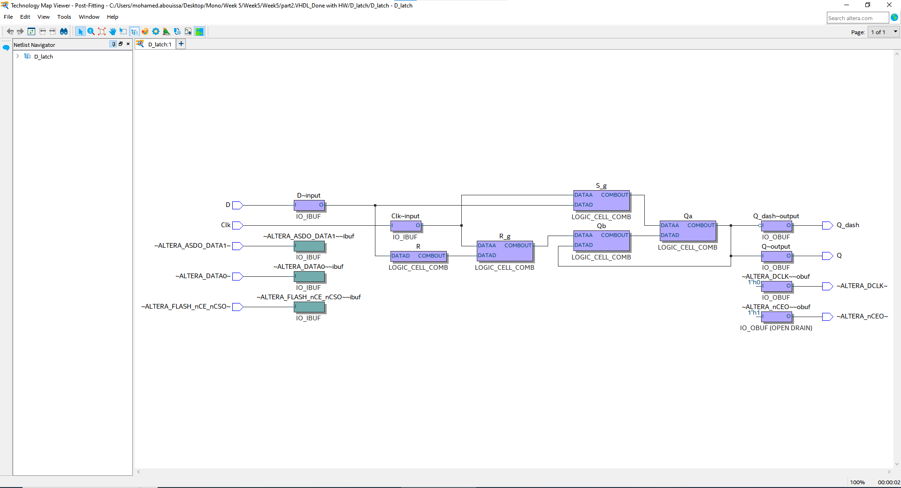
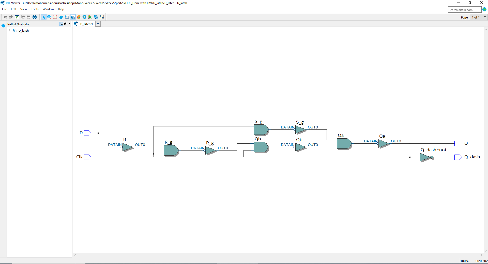
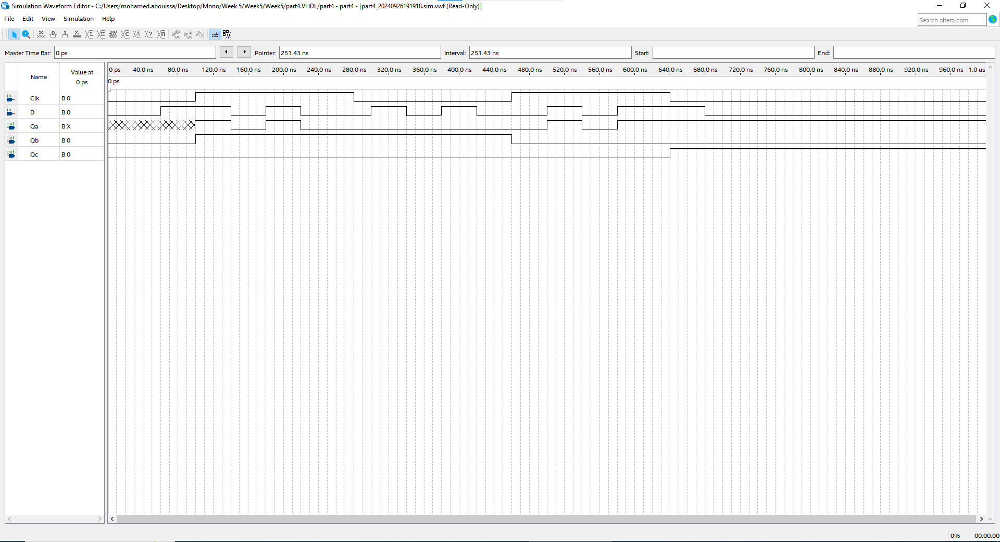
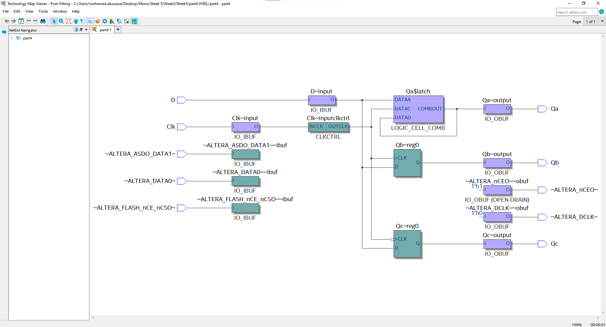
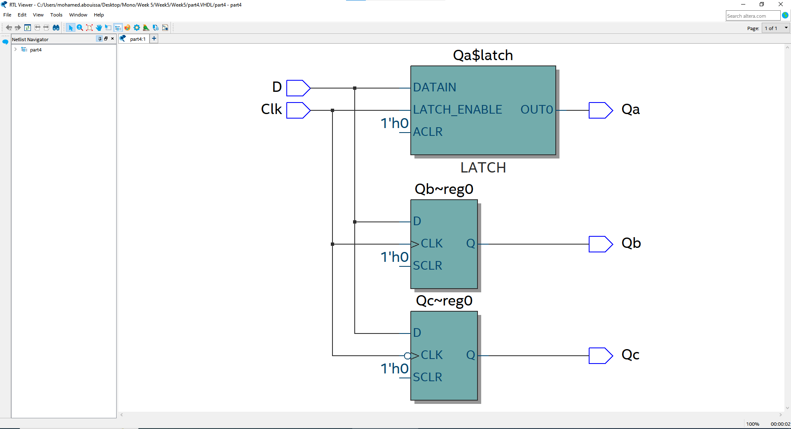
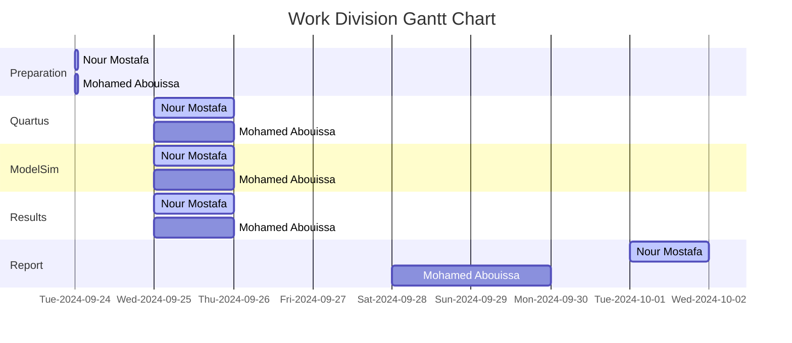

# <p align="center">Latches, Flip-flops, and Registers</p>

This lab experiment investigates the design and implementation of fundamental digital storage elements, including latches, flip-flops, and registers, using an Intel FPGA. The objectives are to understand how these storage elements can be created using lookup tables (LUTs) and to explore their behavior through simulation and hardware implementation.

---

Recall that the key difference between sequential and combinational circuits lies in how they process and store information. __Combinational circuits__ produce outputs solely based on the current inputs. These circuits do not have memory or the ability to store past information; their output is a direct function of the inputs at any given moment. Examples of combinational circuits include basic logic gates (AND, OR, NOT), adders, multiplexers, and decoders, where the outputs immediately change if the inputs change. In contrast, __sequential circuits__ rely on both current inputs and past states (or history) to determine their outputs. They include memory elements, such as flip-flops or latches, which allow them to store information. This storage enables sequential circuits to perform more complex tasks that depend on the sequence of input changes over time, such as counters, registers, and finite state machines. The presence of memory in sequential circuits distinguishes them from combinational circuits, making them crucial for implementing time-dependent operations and state-based designs.

A __latch__ is a basic digital storage element used to hold or store a single bit of data. It has inputs for data and control signals and outputs the stored value. The latch maintains its output until new data is provided, allowing it to "latch" onto and preserve a value. It is often used in sequential circuits to store temporary information, enabling more complex logic functions like memory elements, counters, and registers in digital systems.

A __flip-flop__ is a fundamental digital storage element that stores a single bit of data, similar to a latch but with defined triggering conditions for updating its state. Flip-flops have inputs for data and a control signal, which dictates when the stored value can change. Unlike latches, flip-flops are designed to be stable and change their output only at specific moments, typically on the edges of a control signal. This characteristic makes flip-flops essential components in synchronous circuits, where precise timing is crucial for operations such as data storage, synchronization, and state management in digital systems.

__Registers__ are digital storage elements composed of multiple flip-flops that work together to store multi-bit values, such as integers or memory addresses. They are essential components in digital systems, particularly in microprocessors and memory architecture, as they enable temporary data storage and manipulation during processing. Registers are constructed using flip-flops, with each flip-flop representing one bit of data; for instance, an 8-bit register consists of eight flip-flops, allowing it to hold an 8-bit binary number. While latches and flip-flops serve basic storage functions, registers facilitate the storage of larger data values, enabling complex operations like arithmetic calculations and data transfers. Typically, registers utilize clock signals to synchronize data input and output, ensuring stability during read and write operations. Overall, registers leverage the principles of latches and flip-flops to provide a structured and efficient means of handling multiple bits of information in digital circuits.

In digital circuits, a gate refers to the control of a signal's passage through a circuit element, such as a latch or flip-flop, based on the state of another signal, usually called a "gate" or "control" signal. When a circuit element is "gated," it means that its behavior is only active or responsive when the gate signal (often a clock or enable signal) is in a certain state, typically high (1). This gating mechanism helps control the flow of data, ensuring that updates only occur at specific times or under specific conditions, preventing unintended or asynchronous changes to the output.

Think of digital electronics as a building blocks game, where each type of component represents a different type of block used to create more complex structures. At the foundation of this game are latches, which act like basic building blocks that can hold a single unit of data. They can change their state based on input signals and are great for simple tasks, but they lack the precision needed for more complex structures. Next, we have flip-flops, which are more advanced blocks that offer a similar function but with a more organized approach. They can be thought of as blocks that only change their state at specific moments, akin to waiting for a signal to indicate the right time to build or modify part of the structure. This makes them ideal for ensuring that data is stored reliably, as they prevent unwanted changes during operation. As we build higher, we introduce registers, which are like groups of flip-flops working together to hold multiple units of data at once. Imagine a section of your building where several blocks are combined to create a larger, more functional unit. Registers are crucial for handling larger pieces of information, just like these larger units can provide stability and versatility in a building. Together, latches, flip-flops, and registers form a versatile toolkit for constructing intricate digital circuits. Just as in a building blocks game, where you combine different shapes and sizes to create impressive designs, digital designers use these components to build complex systems that can store, process, and manage data effectively.


## Part 1: Gated RS Latch

In the first part, we will create an [RS latch](https://www.geeksforgeeks.org/latches-in-digital-logic). The RS latch operates with two main inputs: Set (S) and Reset (R), and produces two outputs: `Q` and its complement `Q'`. The function of the latch is straightforward: when the Set (S) input is activated, the output `Q` becomes 1, and `Q'` becomes 0, effectively setting the latch. Conversely, when the Reset (R) input is activated, the output `Q` becomes 0, and `Q'` becomes 1, resetting the latch. If both inputs are inactive (set to 0), the latch holds its current state, remembering the last set or reset condition. Refer to [Figure 1](Photos/SRlatch.png) for a visual representation of the RS latch.

In this part, we will also explore how the RS latch behaves when both inputs are activated simultaneously, leading to an invalid state where the outputs `Q` and `Q'` are inconsistent. We will implement the RS latch using two cross-coupled NOR gates, which provide the necessary feedback loop to maintain the stored bit of data when both inputs are inactive. This simple latch design serves as a foundation for understanding more advanced memory elements in digital systems.

Refer to [Figure 2](Photos/Part1Q.png) for a visual representation of the gated RS latch. In this configuration, the latch receives `R`, `S`, and `clk` as inputs, producing `Qa` as the output and `Qb` as its complement. Additionally, the `signals` `R_g` and `S_g` are derived by ANDing the `R` and `clk` signals together and the `S` and `clk` signals, respectively. This gating mechanism helps control the operation of the RS latch based on the clock signal, ensuring that the latch responds appropriately to the inputs while maintaining its state as needed.

<details>
  <summary>VHDL Code Implementation on the FPGA Board (RS Latch)</summary>
<br>

``` VHDL
-- ENTITY defines the interface of the latch, which has three input ports (Clk, R, and S) and one output port (Q).
-- ARCHITECTURE contains the implementation details. In this case, signals like R_g, S_g, Qa, and Qb are defined, representing internal states of the latch.
-- The logic expressions in the architecture specify how the outputs relate to the inputs.

-- 4-input LUTs are fundamental building blocks in FPGAs, capable of implementing any logic function of up to four inputs.
-- The passage states that a single 4-input LUT is sufficient to realize the RS latch described.
-- While the RS latch can technically be implemented with a single LUT, it has a limitation: internal signals like R_g and S_g are not directly observable as outputs from the LUT.
-- This is important because if you want to monitor or debug these internal signals in your circuit, they need to be accessible.
-- To ensure that the internal signals are preserved in the FPGA's design, the passage mentions the KEEP directive. This is a VHDL attribute that instructs the Quartus compiler to treat
-- each of these internal signals (R_g, S_g, Qa, and Qb) as separate entities, rather than collapsing them into the LUT.
-- By including this directive, the compiler allocates individual logic resources (in this case, separate LUTs) for each internal signal, resulting in a circuit that uses four LUTs.

LIBRARY ieee;
USE ieee.std_logic_1164.all;

ENTITY part1 IS

   PORT ( Clk, R, S : IN  STD_LOGIC;          -- Assigning inputs R,S and Clk
          Q         : OUT STD_LOGIC);         -- Assigning output Q
     
END part1;

ARCHITECTURE Structural OF part1 IS

   SIGNAL R_g, S_g, Qa, Qb : STD_LOGIC ;          -- Creating signals R_g, S_g, Qa and Qb
   ATTRIBUTE KEEP: BOOLEAN;                       -- The KEEP attribute is defined as a boolean value, which can be used to instruct the synthesis tool to preserve certain signals during optimization.
   ATTRIBUTE KEEP OF R_g, S_g, Qa, Qb : SIGNAL IS true;           -- By applying the KEEP attribute to R_g, S_g, Qa, and Qb, we ensure that these signals are not optimized away or removed, which is particularly important in maintaining the functionality of the RS latch during synthesis.

BEGIN

   R_g <= R AND Clk;               -- R_g is a signal that has the value of R AND-ing Clk
   S_g <= S AND Clk;               -- S_g is a signal that has the value of S AND-ing Clk
   Qa <= NOT (R_g OR Qb);          
   Qb <= NOT (S_g OR Qa);          

   Q <= Qa;                        -- primary output Q is the Qa signal

END Structural;                   
```
</details>


<details>
  <summary>VHDL Testbench Code Simulation in ModelSim</summary>
<br>

``` VHDL
library IEEE;
use IEEE.Std_logic_1164.all;
use IEEE.Numeric_Std.all;

entity part1_tb is
end;

architecture bench of part1_tb is

  component part1
     PORT ( Clk, R, S : IN  STD_LOGIC;
            Q         : OUT STD_LOGIC);
  end component;

  signal Clk, R, S: STD_LOGIC;
  signal Q: STD_LOGIC;

begin

  uut: part1 port map ( Clk => Clk,
                        R   => R,
                        S   => S,
                        Q   => Q );
						
  stimulus: process
  begin
  
  R <= '1';
	S <= '0';
	clk <= '1';
	wait for 10 ns;
	
	R <= '0';
	S <= '1';
	clk <= '1';
	wait for 10 ns;
	
	R <= '0';
	S <= '0';
	clk <= '0';
	wait for 10 ns;
	
	R <= '1';
	S <= '1';
	clk <= '1';
	wait for 10 ns;

    wait;
  end process;
end;
```

<p align="center">
  
</p>

In the simulation of the SR latch with a clock, we observe that the latch responds to the clock signal and the inputs `S (Set)` and `R (Reset)` to determine the output. When the clock `(CLK)` is high, the latch reads the values of `S` and `R`. For example, in the first case, when the clock is high, `S` is 0, and `R` is 1, the output `Q` is set to 0, as the reset input is active. In the second case, with the clock still high, `S` is 1 and `R` is 0, resulting in the output `Q` being set to 1, since the set input is now active.

When the `clock` goes low, the latch enters a holding state, meaning it retains the value of the previous output regardless of the inputs `S` and `R`. For instance, if the previous output was 1, the latch holds this value when the clock is low. Lastly, when both `S` and `R` are set to 1 while the `clock` is high, this represents an invalid state for the SR latch. In this scenario, the output becomes undefined or may take on a random value, as the set and reset conditions are being applied simultaneously, which leads to a logical contradiction. This simulation highlights how the SR latch behaves depending on the `clock` signal, with valid outputs when the `clock` is high and an undefined state when both `S` and `R`` are high simultaneously.

</details>

<details>
  <summary>VHDL Simulation in Waveform Editor</summary>
<br>

<p align="center">
       
</p>

In this implementation of the SR latch system using the waveform editor, we start by setting the inputs `S` and `R` to be opposites of each other, meaning when `S` is 1, `R` is 0, and vice versa. This approach prevents the inputs from being set to either (0, 0) or (1, 1), as doing so would cause the system, or the waveform editor software, to enter an infinite loop, resulting in an `error`. This issue arises due to the `"hold"` state when both `S` and `R` are 0 and the `"forbidden"` state when both `S` and `R` are 1, which leads to undefined behavior.

In the second scenario, we configure the `clock (CLK)` to follow the `S` input, meaning the system remains in the high (1) state continuously. This is because if the `clock` is 0 and `S` is 0 while `R` is 1, the system ignores the inputs due to the `clock` being low, maintaining the previous state. In the final case, the clock is set to follow the `R` input. As a result, the system remains in the low (0) state indefinitely, because with the `clock` aligned with `R`, the system is effectively reset whenever `R` is 1.

This setup ensures that the system behaves predictably, avoiding `errors` caused by `invalid input` combinations and the hold state.

</details>

<details>
  <summary>VHDL LUT-Level Design and Gates-Level Design</summary>
<br>

<p align="center">
    
</p>

The diagrams above represent the `Look-Up Table (LUT)` for the gated SR latch created in this lab. On the left, we have the input signals: Set `(S)`, Reset `(R)`, and `Clock (CLK)`. The output `(Q)` is shown on the far right. In between, the internal signals, labeled as `R_g`, `S_g`, `Qa`, and `Qb`, are displayed. These internal signals were derived using the LUT, reflecting the latch's behavior based on the given inputs.

The second figure represents the same system but is shown in a logic gate design rather than using a `Look-Up Table (LUT)`. Here, we can clearly see the logical gates that were used to compute the internal signals, providing a more detailed view of how the internal workings of the SR latch are implemented at the gate level. Both diagrams effectively illustrate the functioning of the `SR latch`, highlighting the transition from a LUT-based design to one using physical logic gates.

</details>


## Part 2: Gated D Latch

In the second part, we will focus on creating a [D latch](https://www.geeksforgeeks.org/latches-in-digital-logic), which is a fundamental memory element commonly used in digital circuits to store a single bit of information. Unlike the RS latch, the D latch operates with only two main inputs: `Data (D)` and `Clock (CLK)`, and produces two outputs: `Q` and its complement `Q'`. The key advantage of the D latch is its simplicity—it eliminates the possibility of invalid states by directly linking the Data input to the Set and Reset logic.

The operation of the D latch is straightforward: when the `Clock (CLK)` is high (active), the output `Q` follows the input Data (D), meaning `Q` takes the value of `D`. When the clock is low (inactive), the latch holds its previous state, maintaining the last value that was stored when the `clock` was high. This design ensures that the latch only updates its state during the active phase of the `clock`, providing a more controlled and predictable behavior. Refer to [Figure 3](Photos/DLatch.png) for a visual representation of the D latch.

In this part, we will also examine how the D latch maintains the integrity of stored data by gating the Data input based on the clock signal. The D latch can be implemented using a modified RS latch configuration, where the Set and Reset inputs are derived directly from the Data signal. This modification ensures that the latch only updates when the clock is high, and retains its state when the clock is low.

Refer to [Figure 4](Photos/Part2Q.png) for a visual representation of the gated D latch. In this configuration, the latch takes `D` and `clk` as inputs, producing `Qa` as the output and `Qb` as its complement. The internal signals `R_g` and `S_g` are generated based on the clock signal and the data input, allowing the system to store data in sync with the clock. This gating mechanism ensures that the D latch updates the output `Q` only when the `clock` is high, providing reliable data storage in digital systems.


<details>
  <summary>VHDL Code Implementation on the FPGA Board (D Latch)</summary>
<br>

```VHDL
-- This is Gate Level Design

LIBRARY ieee;
USE ieee.std_logic_1164.all;

-- A gated D latch described the hard way

ENTITY D_latch IS

   PORT ( Clk, D : IN  STD_LOGIC;    -- Set my inputs Clk and D
          Q      : OUT STD_LOGIC);   -- Set my output Q

END D_latch;

ARCHITECTURE Structural OF D_latch IS

   SIGNAL R, R_g, S_g, Qa, Qb : STD_LOGIC ;      -- Same idea as part 1 (SR Latch) 
   ATTRIBUTE keep: boolean;
   ATTRIBUTE keep of R, R_g, S_g, Qa, Qb : signal is true;

BEGIN

   R <= NOT D;               -- R will be the complement of D so we can use it as S
   S_g <= NOT (D AND Clk);
   R_g <= NOT (R AND Clk);
   Qa <= NOT (S_g AND Qb);
   Qb <= NOT (R_g AND Qa);

   Q <= Qa;

END Structural;

```

```VHDL

-- This Is Top Level Design 

LIBRARY ieee;
USE ieee.std_logic_1164.all;

-- SW[0] is the latch's D input, SW[1] is the level-sensitive Clk, LEDR[0] is Q

ENTITY top IS

   PORT ( SW   : IN  STD_LOGIC_VECTOR(1 DOWNTO 0);     -- Set my input as switch
          LEDR : OUT STD_LOGIC_VECTOR(9 DOWNTO 0));    -- and the output will be on red LED
END top;

ARCHITECTURE Structural OF top IS

   COMPONENT D_latch 
      PORT ( Clk, D : IN  STD_LOGIC;     -- Defind the COMPONENT for the other entity that i will use
             Q      : OUT STD_LOGIC);

   END COMPONENT;

BEGIN   
   -- D_latch (input Clk, D, output Q)

   U1: D_latch PORT MAP (SW(1), SW(0), LEDR(0));     -- Here we maping the iput and the output
   LEDR(9 DOWNTO 1) <= "000000000";

END Structural;

-- Here is the gate level on it own entity same as the past code above

LIBRARY ieee;                   
USE ieee.std_logic_1164.all;

-- A gated D latch described the hard way

ENTITY D_latch IS
   PORT ( Clk, D : IN  STD_LOGIC;
          Q      : OUT STD_LOGIC);
END D_latch;

ARCHITECTURE Structural OF D_latch IS
   SIGNAL R, R_g, S_g, Qa, Qb : STD_LOGIC ;
   ATTRIBUTE keep: boolean;
   ATTRIBUTE keep of R, R_g, S_g, Qa, Qb : signal is true;
BEGIN   
   R <= NOT D;
   S_g <= NOT (D AND Clk);
   R_g <= NOT (R AND Clk);
   Qa <= NOT (S_g AND Qb);
   Qb <= NOT (R_g AND Qa);

   Q <= Qa;
END Structural;

```


</details>

<details>
  <summary>VHDL Simulation in Waveform Editor</summary>
<br>

<p align="center">
  
</p>

After carefully observing the waveform of the `D` latch, we can conclude that the behavior of the output `Q` is closely tied to the state of the `clock` signal and the data input `D`. Specifically, when the `clock` signal is high, the latch is in a transparent state, meaning that any changes in the input `D` are directly reflected in the output `Q`. In other words, as long as both the `clock` and the input `D` are high, the output `Q` will actively follow the input `D` without delay. This behavior ensures that during the `clock's` high period, the `D` latch continuously monitors and updates the output to mirror the input. However, when the `clock` signal goes low, the latch enters a hold state, maintaining the last value of `D` that was present during the high `clock` phase. This fundamental characteristic of the `D` latch makes it a valuable component for temporarily storing data in sequential circuits, ensuring synchronized data capture based on `clock` signals.

</details>

<details>
  <summary>VHDL LUT-Level Design and Gates-Level Design</summary>
<br>

<p align="center">
    
</p>

In the diagram above, we can observe two representations of the D latch: on the left is the `Look-Up Table (LUT)`, and on the right is the gate-level design. At first glance, both resemble the structure of an RS latch. However, there is a key difference in the D latch—while the RS latch has two separate inputs `(S and R)`, the D latch simplifies this by having only one input, `D`. This input is then split into two signals: the original input `D` and its complement `D` (the inverse of `D`. This design ensures that the D latch eliminates the possibility of invalid states that can occur in the RS latch by tying the behavior of the set and reset inputs directly to the value of `D`. This streamlined approach makes the D latch more efficient and easier to use for storing and synchronizing data in digital circuits.

</details>

## Part 3: D Flip-Flop (Positive & Negative Edge Triggered)

In this part, we are going to design a D latch, similar to the one we created in Part 2. Additionally, we will design two types of [D flip-flops](https://www.geeksforgeeks.org/flip-flop-types-their-conversion-and-applications/). One will operate with a `positive edge trigger`, while the other will function with a `negative edge trigger`. We can refer to [Figure 5](Photos/Part3Q.png) for a visual representation of these designs. The key difference between the flip-flops lies in the `clock signal`. In the case of the positive edge-triggered flip-flop, the `clock` input will show a small triangle symbol, indicating that it operates on the `rising edge` of the clock pulse. This means that the D flip-flop will store the input data `(D)` at the moment the clock transitions from a low (0) to a high (1) state. On the other hand, the negative edge-triggered flip-flop can be identified by a clock symbol with both a bubble and a triangle. The bubble signifies inversion, meaning the flip-flop will store the input data when the clock transitions from a high (1) to a low (0) state. Understanding these clock triggers is crucial in sequential logic design, as they control when the flip-flop captures and locks the input value.


A D flip-flop (or Data flip-flop) is a type of digital storage device that captures and stores the value of a data input, D, on the triggering edge of a clock signal. The key characteristic of a D flip-flop is that it has a single data input, D, and an output, Q, which takes on the value of the D input only at the clock's edge. Between clock edges, the output remains constant, effectively "locking" the data until the next clock pulse. This behavior makes D flip-flops ideal for synchronous circuits, as they help align data changes with precise clock timing, ensuring stability and reliability in sequential logic operations.

<details>
  <summary>VHDL Code Implementation on the FPGA Board (D Flip-Flop)</summary>
<br>

```VHDL
LIBRARY ieee;
USE ieee.std_logic_1164.all;

ENTITY part4 IS 

   PORT ( Clk, D     : IN  STD_LOGIC;
          Qa, Qb, Qc : OUT STD_LOGIC);
			 
END part4;

ARCHITECTURE Behavior OF part4 IS
BEGIN
   
   PROCESS (D, Clk)
   BEGIN
      IF (Clk = '1') THEN
         Qa <= D;
      END IF;
   END PROCESS;

   PROCESS (Clk)
   BEGIN
      IF (Clk'EVENT AND Clk = '1') THEN
         Qb <= D;
      END IF;
   END PROCESS;

   PROCESS (Clk)
   BEGIN
      IF (Clk'EVENT AND Clk = '0') THEN
         Qc <= D;
      END IF;
   END PROCESS;

END Behavior;
```

</details>

<details>
  <summary>VHDL Simulation in Waveform Editor</summary>
<br>

<p align="center">
  
</p>

</details>

<details>
  <summary>VHDL LUT Diagram and Logic Gates Circuit</summary>
<br>

<p align="center">
    
</p>

In the two diagrams provided, we can observe both the gate-level and LUT-level designs of a D latch and two D flip-flops. In the `gate-level design`, you see the D latch (`Qa$latch`) at the top, which holds data when the `Latch_Enable` signal is active. This latch is sensitive to the level of the clock signal (`Clk`). The two D flip-flops (`Qb~reg0` and `Qc~reg0`), on the other hand, are edge-triggered. One is positive edge-triggered (marked by a triangle on the clock input), and the other is negative edge-triggered (indicated by the bubble before the triangle). These flip-flops store the input (`D`) on the respective clock edge and transfer it to the outputs (`Qb` and `Qc`). The synchronous clear (`SCLR`) input for both flip-flops is deactivated (set to `1'h0`), meaning it does not affect the operation here.

In the `LUT-level design`, the same components are represented through logic cells. The latch (`Qa$latch`) stores and outputs data based on the `Clk~input` signal, and the flip-flops (`Qb~reg0` and `Qc~reg0`) continue to store data on their respective clock edges (positive or negative), behaving similarly to the gate-level design. The outputs (`Qa`, `Qb`, and `Qc`) reflect the data stored within each component after the relevant clocking or latching event. We can see through the LUT diagram that the latch now finally uses one look-up table only. Both designs serve the same function, but the gate-level diagram shows individual logic gates, while the LUT-level diagram focuses on programmable logic components.

</details>

## Conclusion

A __latch__ and a __flip-flop__ are both digital storage devices, but they differ in how they respond to input signals. A latch is level-sensitive, meaning it continuously responds to input changes as long as the control signal (such as a clock or enable signal) is at a certain level (high or low). This makes latches more susceptible to input variations during the control signal’s active phase. In contrast, a flip-flop is edge-sensitive, meaning it only changes its output at specific moments, like the rising or falling edge of a clock signal. This provides more precise control over when the output is updated, making flip-flops better suited for synchronous circuits where timing is critical. Overall, latches are simpler and faster, but flip-flops offer more stable and predictable behavior in clocked systems.

In this lab, we have learned about various visualization and simulation tools used in the FPGA design process, each serving a distinct purpose in ensuring the correct implementation of digital circuits. Visualization tools are essential for examining the internal structure of a design, allowing us to understand how the hardware description is interpreted and implemented. They provide insight into how the design is mapped to hardware resources and help identify potential areas for optimization or correction. Simulation tools, on the other hand, are used to verify the behavior and performance of the design. They ensure that the design operates correctly, both in terms of logical functionality and real-world timing, helping to identify and resolve issues before the design is deployed on actual hardware.

An __LUT__ (Look-Up Table) is a key component used in FPGAs (Field-Programmable Gate Arrays) to implement digital logic. It serves as a programmable logic block that can be configured to perform any logical operation, based on its inputs. An LUT is essentially a small memory that stores the precomputed output values for every possible combination of its inputs. For an LUT with n inputs, there are $2^n$ possible input combinations. LUTs allow FPGAs to implement arbitrary logic functions. By programming the LUT's truth table, it can be configured to mimic any desired logic gate or a combination of gates. By using LUTs, FPGAs provide a highly flexible and reconfigurable way to implement digital circuits without needing dedicated hardware gates for each specific logic function. Modern FPGAs typically use 4-input to 6-input LUTs, where the number refers to how many inputs the LUT can handle. Larger LUTs can implement more complex logic functions without needing additional resources, improving performance by reducing the need for additional interconnects.

A __netlist__ is a description of the electronic circuit's connectivity. It lists the components (such as logic gates, flip-flops, resistors, etc.) and the electrical connections (nets) between them. In the context of FPGA design and tools like Quartus Prime, the netlist is typically generated after synthesis and serves as an intermediate representation of the design before it is placed and routed onto the FPGA. __Post-Synthesis Netlist__ is where the netlist represents the design in terms of generic logic elements (such as logic gates) but does not yet reflect the specific resources of the target FPGA. __Post-Technology Mapping Netlist__ is generated after technology mapping. It represents the design using the specific logic elements (e.g., LUTs, flip-flops) available on the target FPGA device. __Post-Fitting Netlist__ shows how the design has been placed and routed on the FPGA, including the actual physical locations of components and the routing paths between them.

The __RTL Viewer__ in Quartus Prime provides a graphical representation of the design at the Register Transfer Level (RTL). It visualizes the structure of your hardware description language (HDL) code after synthesis, showing how your design is mapped into fundamental hardware components like registers, multiplexers, and combinational logic. It shows the logic gates and combinational operations (AND, OR, XOR, etc.) that are synthesized from your HDL code. This helps you understand how the design implements Boolean logic and functions. The RTL Viewer also displays control signals, such as clock and reset, allowing designers to verify that these critical signals are properly connected to the appropriate components. The viewer allows you to review your synthesized logic and potentially find opportunities to optimize the design (e.g., reducing redundant logic, improving data paths). It is a useful tool for identifying potential issues with how the design has been interpreted by the synthesizer. In short, it is used early in the design process and provides us with a high-level view based on the original HDL code.

In Quartus Prime, the __Technology Map Viewer__ provides a graphical representation of the logic elements used in the design, including how they are interconnected. It allows designers to visualize the technology mapping of their design and understand how different components fit together within the FPGA architecture. Postmapping is the stage which occurs after the synthesis and mapping phases in Quartus Prime. During postmapping, the design is translated into a netlist that reflects how the logic elements and resources will be utilized on the FPGA. Postmapping focuses on optimizing the design for area and performance based on the available FPGA architecture. Post Fitting is the stage that follows the fitting process, where the mapped design is placed and routed onto the FPGA. Post fitting involves analyzing the design after it has been physically placed on the FPGA and has its routing established. The main goal is to evaluate timing, check for any critical paths, and ensure that the design meets the required performance specifications. 

The __University Program VWF__ (Vector Waveform File) is a specific simulation tool used in the Intel Quartus Prime software, particularly in educational environments. It allows for easy functional simulation of digital circuits designed for FPGAs without the need for complex testbenches or external simulation tools.

A __functional simulation__ is a type of simulation used in digital circuit design to verify the logical correctness of a circuit, focusing solely on its functionality without considering timing aspects like delays or setup/hold times. It ensures that the circuit behaves as expected by simulating how inputs affect outputs based on the design’s logical structure. Timing delays, such as gate delays, propagation delays, and setup/hold times, are typically ignored. The circuit is simulated as if every signal change occurs instantaneously. This type of simulation is typically performed early in the design process to catch logical errors before synthesizing the circuit for hardware implementation. 

A __timing simulation__ is a more detailed type of simulation used in digital circuit design to verify not only the logical correctness of a circuit but also its behavior in relation to real-world timing characteristics. This includes propagation delays, setup and hold times, and clock skews that occur in the actual hardware due to physical factors like wire lengths and gate delays. Timing simulation uses post-synthesis data and ensures that signals change at appropriate times, helping designers identify issues like race conditions or glitches that may not appear in a functional simulation. By replicating actual timing behavior, it provides a more accurate reflection of how the circuit will perform once implemented in hardware, ensuring that the circuit meets the required performance specifications.

## Resources

|1| ALL ABOUT ELECTRONICS (Director). (2022, May 28). Latch and Flip-Flop Explained | Difference between the Latch and Flip-Flop. <br> https://www.youtube.com/watch?v=LTtuYeSmJ2g  
|2| Ashenden, P. J. (2008). The designer’s guide to VHDL (3rd ed). Morgan Kaufmann Publishers.  
|3| Neso Academy (Director). (2015a, February 2). What is a Clock?. <br> https://www.youtube.com/watch?v=wx0NyUfpm48  
|4| Neso Academy (Director). (2015b, February 8). Triggering Methods in Flip Flops. <br> https://www.youtube.com/watch?v=Pi_MHyMoenA  
|5| Neso Academy (Director). (2015c, April 20). SR Latch | NOR and NAND SR Latch. <br> https://www.youtube.com/watch?v=kt8d3CYWGH4  
|6| Simple Snippets (Director). (2018, February 21). Flip Flops & latches in Digital Electronics with Example of 1 Bit Memory Cell. <br> https://www.youtube.com/watch?v=PVJC_-_JB_A  
|7| VHDL Testbench Creation Using Perl. (n.d.). Retrieved September 21, 2024, from <br> https://www.doulos.com/knowhow/perl/vhdl-testbench-creation-using-perl/  

<br>



We extend our sincere appreciation to Eng. Umar Adeel for his insightful feedback which has significantly contributed to the successful completion of this experiment.

This publication adheres to all regulatory laws and guidelines established by the American University of Ras Al Khaimah (AURAK) regarding the dissemination of academic materials.

