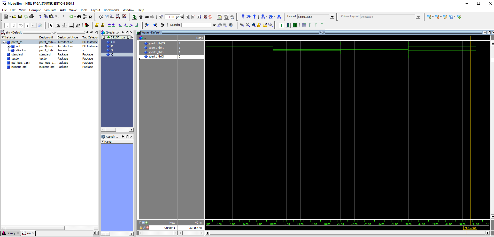
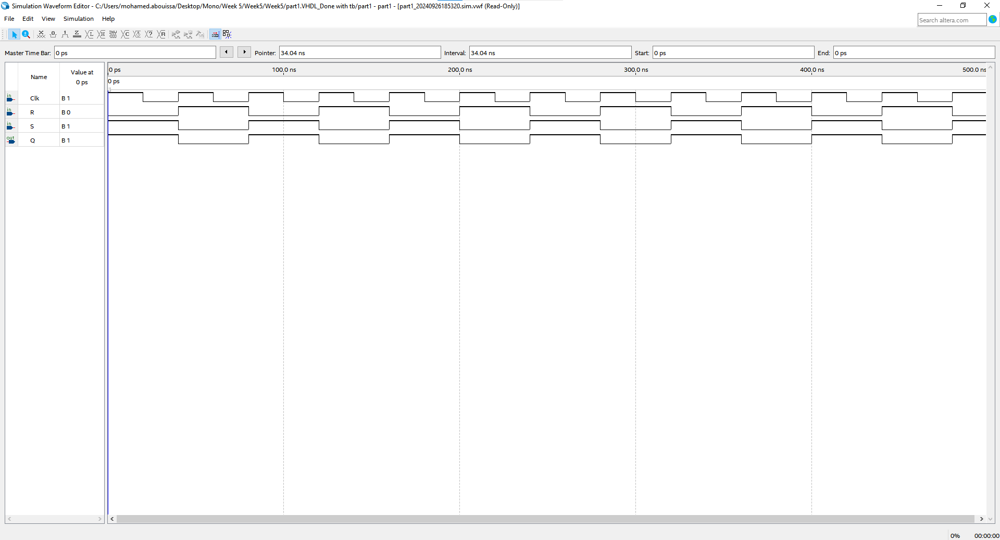
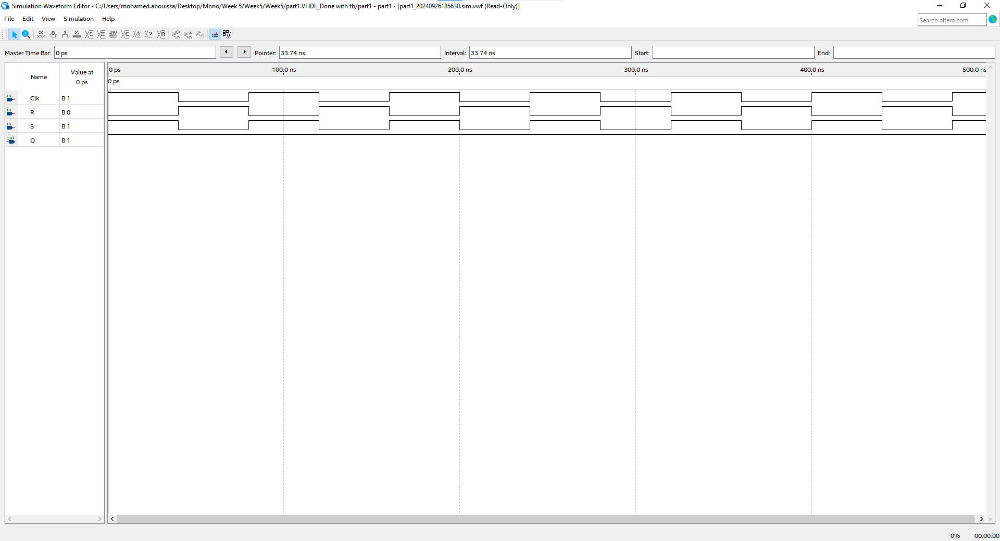
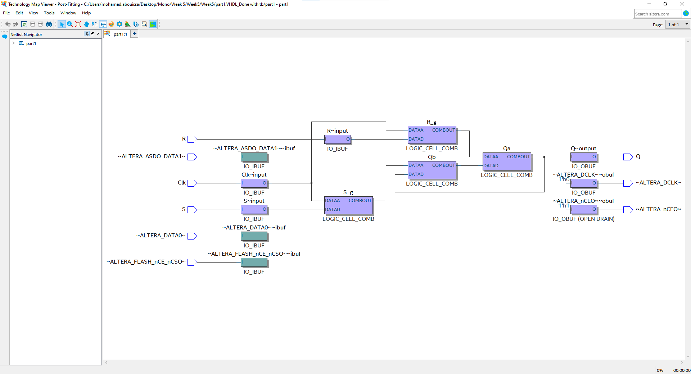
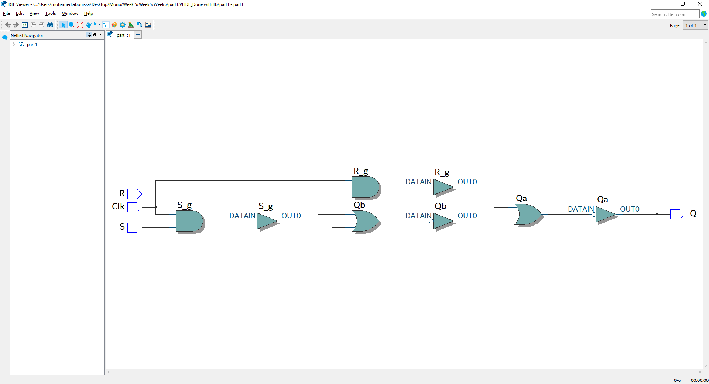
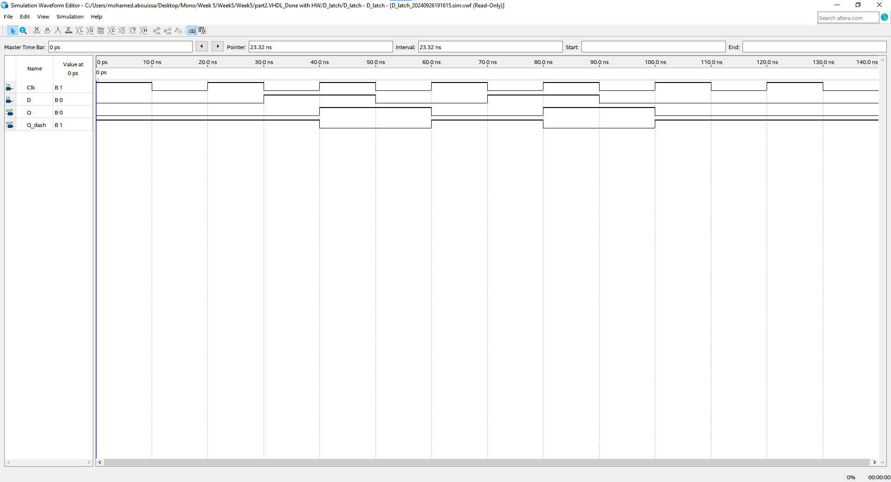

# <p align="center">Latches, Flip-flops, and Registers</p>

abstract

---

introduction

## Part 1: Design and Implementation of an RS Latch

In the first part, we will create an RS latch, which is a basic memory element used in digital circuits to store a single bit of information. The RS latch operates with two main inputs: Set (S) and Reset (R), and produces two outputs: `Q` and its complement `Q'`. The function of the latch is straightforward: when the Set (S) input is activated, the output `Q` becomes 1, and `Q'` becomes 0, effectively setting the latch. Conversely, when the Reset (R) input is activated, the output `Q` becomes 0, and `Q'` becomes 1, resetting the latch. If both inputs are inactive (set to 0), the latch holds its current state, remembering the last set or reset condition. Refer to [Figure 1](Photos/SRlatch.png) for a visual representation of the RS latch.

In this part, we will also explore how the RS latch behaves when both inputs are activated simultaneously, leading to an invalid state where the outputs `Q` and `Q'` are inconsistent. We will implement the RS latch using two cross-coupled NOR gates, which provide the necessary feedback loop to maintain the stored bit of data when both inputs are inactive. This simple latch design serves as a foundation for understanding more advanced memory elements in digital systems.

Refer to [Figure 2](Photos/Part1Q.png) for a visual representation of the gated RS latch. In this configuration, the latch receives `R`, `S`, and `clk` as inputs, producing `Qa` as the output and `Qb` as its complement. Additionally, the `signals` `R_g` and `S_g` are derived by ANDing the `R` and `clk` signals together and the `S` and `clk` signals, respectively. This gating mechanism helps control the operation of the RS latch based on the clock signal, ensuring that the latch responds appropriately to the inputs while maintaining its state as needed.

<details>
  <summary>VHDL Code Implementation on the FPGA Board (RS Latch)</summary>
<br>

``` VHDL
LIBRARY ieee;
USE ieee.std_logic_1164.all;

ENTITY part1 IS

   PORT ( Clk, R, S : IN  STD_LOGIC;          -- Assigning my inputs R,S and Clk
          Q         : OUT STD_LOGIC);         -- Assigning my output Q
     
END part1;

ARCHITECTURE Structural OF part1 IS

   SIGNAL R_g, S_g, Qa, Qb : STD_LOGIC ;          -- Creat my signals R_g, S_g, Qa and Qb
   ATTRIBUTE KEEP: BOOLEAN;                       -- The KEEP attribute is defined as a boolean value, which can be used to instruct the synthesis tool to preserve certain signals during optimization.
   ATTRIBUTE KEEP OF R_g, S_g, Qa, Qb : SIGNAL IS true;           -- By applying the KEEP attribute to R_g, S_g, Qa, and Qb, we ensure that these signals are not optimized away or removed, which is particularly important in maintaining the functionality of the RS latch during synthesis.

BEGIN

   R_g <= R AND Clk;               -- R_g is signal that have the valuse of R AND-ing Clk
   S_g <= S AND Clk;               -- S_g is signal that have the valuse of S AND-ing Clk
   Qa <= NOT (R_g OR Qb);          -- Same as shoing in the Question 
   Qb <= NOT (S_g OR Qa);          -- Same as shoing in the Question 

   Q <= Qa;                        -- My primery output Q is the values of my Qa signla

END Structural;                   
```
</details>


<details>
  <summary>VHDL Testbench Code Simulation in ModelSim</summary>
<br>

``` VHDL
library IEEE;
use IEEE.Std_logic_1164.all;
use IEEE.Numeric_Std.all;

entity part1_tb is
end;

architecture bench of part1_tb is

  component part1
     PORT ( Clk, R, S : IN  STD_LOGIC;
            Q         : OUT STD_LOGIC);
  end component;

  signal Clk, R, S: STD_LOGIC;
  signal Q: STD_LOGIC;

begin

  uut: part1 port map ( Clk => Clk,
                        R   => R,
                        S   => S,
                        Q   => Q );
						
  stimulus: process
  begin
  
-- Put initialisation code here

  R <= '1';
	S <= '0';
	clk <= '1';
	wait for 10 ns;
	
	R <= '0';
	S <= '1';
	clk <= '1';
	wait for 10 ns;
	
	R <= '0';
	S <= '0';
	clk <= '0';
	wait for 10 ns;
	
	R <= '1';
	S <= '1';
	clk <= '1';
	wait for 10 ns;

-- Put test bench stimulus code here

    wait;
  end process;
end;
```

<p align="center">
  
</p>

In the simulation of the SR latch with a clock, we observe that the latch responds to the clock signal and the inputs `S (Set)` and `R (Reset)` to determine the output. When the clock `(CLK)` is high, the latch reads the values of `S` and `R`. For example, in the first case, when the clock is high, `S` is 0, and `R` is 1, the output `Q` is set to 0, as the reset input is active. In the second case, with the clock still high, `S` is 1 and `R` is 0, resulting in the output `Q` being set to 1, since the set input is now active.

When the `clock` goes low, the latch enters a holding state, meaning it retains the value of the previous output regardless of the inputs `S` and `R`. For instance, if the previous output was 1, the latch holds this value when the clock is low. Lastly, when both `S` and `R` are set to 1 while the `clock` is high, this represents an invalid state for the SR latch. In this scenario, the output becomes undefined or may take on a random value, as the set and reset conditions are being applied simultaneously, which leads to a logical contradiction. This simulation highlights how the SR latch behaves depending on the `clock` signal, with valid outputs when the `clock` is high and an undefined state when both `S` and `R`` are high simultaneously.

</details>

<details>
  <summary>VHDL Simulation in Waveform Editor</summary>
<br>

<p align="center">
       
</p>

In this implementation of the SR latch system using the waveform editor, we start by setting the inputs `S` and `R` to be opposites of each other, meaning when `S` is 1, `R` is 0, and vice versa. This approach prevents the inputs from being set to either (0, 0) or (1, 1), as doing so would cause the system, or the waveform editor software, to enter an infinite loop, resulting in an `error`. This issue arises due to the `"hold"` state when both `S` and `R` are 0 and the `"forbidden"` state when both `S` and `R` are 1, which leads to undefined behavior.

In the second scenario, we configure the `clock (CLK)` to follow the `S` input, meaning the system remains in the high (1) state continuously. This is because if the `clock` is 0 and `S` is 0 while `R` is 1, the system ignores the inputs due to the `clock` being low, maintaining the previous state. In the final case, the clock is set to follow the `R` input. As a result, the system remains in the low (0) state indefinitely, because with the `clock` aligned with `R`, the system is effectively reset whenever `R` is 1.

This setup ensures that the system behaves predictably, avoiding `errors` caused by `invalid input` combinations and the hold state.

</details>

<details>
  <summary>VHDL LUT Diagram and Logic Gates Circuit</summary>
<br>

<p align="center">
    
</p>

Above, we have the `LUT (Look-Up Table)` diagrams for the gated SR latch created in this lab. On the left side, we can see the inputs `S`, `R`, and the `clock (CLK)`, and on the far right, we have the output `Q`. In the middle, the internal signals, labeled as `R_g`, `S_g`, `Qa`, and `Qb`, are displayed, which were computed using the `LUT`.

The second figure represents the same system but is shown in a logic gate design rather than using a `LUT`. Here, we can clearly see the logical gates that were used to compute the internal signals, providing a more detailed view of how the internal workings of the SR latch are implemented at the gate level. Both diagrams effectively illustrate the functioning of the SR latch, highlighting the transition from a LUT-based design to one using physical logic gates.

</details>


## Part 2: Design and Implementation of an D Latch

In the second part, we will focus on creating a D latch, which is a fundamental memory element commonly used in digital circuits to store a single bit of information. Unlike the RS latch, the D latch operates with only two main inputs: `Data (D)` and `Clock (CLK)`, and produces two outputs: `Q` and its complement `Q'`. The key advantage of the D latch is its simplicity—it eliminates the possibility of invalid states by directly linking the Data input to the Set and Reset logic.

The operation of the D latch is straightforward: when the `Clock (CLK)` is high (active), the output `Q` follows the input Data (D), meaning `Q` takes the value of `D`. When the clock is low (inactive), the latch holds its previous state, maintaining the last value that was stored when the `clock` was high. This design ensures that the latch only updates its state during the active phase of the `clock`, providing a more controlled and predictable behavior. Refer to [Figure 3](Photos/DLatch.png) for a visual representation of the D latch.

In this part, we will also examine how the D latch maintains the integrity of stored data by gating the Data input based on the clock signal. The D latch can be implemented using a modified RS latch configuration, where the Set and Reset inputs are derived directly from the Data signal. This modification ensures that the latch only updates when the clock is high, and retains its state when the clock is low.

Refer to [Figure 4](Photos/Part2Q.png) for a visual representation of the gated D latch. In this configuration, the latch takes `D` and `clk` as inputs, producing `Qa` as the output and `Qb` as its complement. The internal signals `R_g` and `S_g` are generated based on the clock signal and the data input, allowing the system to store data in sync with the clock. This gating mechanism ensures that the D latch updates the output `Q` only when the `clock` is high, providing reliable data storage in digital systems.


<details>
  <summary>VHDL Code Implementation on the FPGA Board (D Latch)</summary>
<br>

```VHDL
-- This is Gate Level Design

LIBRARY ieee;
USE ieee.std_logic_1164.all;

-- A gated D latch described the hard way

ENTITY D_latch IS

   PORT ( Clk, D : IN  STD_LOGIC;    -- Set my inputs Clk and D
          Q      : OUT STD_LOGIC);   -- Set my output Q

END D_latch;

ARCHITECTURE Structural OF D_latch IS

   SIGNAL R, R_g, S_g, Qa, Qb : STD_LOGIC ;      -- Same idea as part 1 (SR Latch) 
   ATTRIBUTE keep: boolean;
   ATTRIBUTE keep of R, R_g, S_g, Qa, Qb : signal is true;

BEGIN

   R <= NOT D;               -- R will be the complement of D so we can use it as S
   S_g <= NOT (D AND Clk);
   R_g <= NOT (R AND Clk);
   Qa <= NOT (S_g AND Qb);
   Qb <= NOT (R_g AND Qa);

   Q <= Qa;

END Structural;

```

```VHDL

-- This Is Top Level Design 

LIBRARY ieee;
USE ieee.std_logic_1164.all;

-- SW[0] is the latch's D input, SW[1] is the level-sensitive Clk, LEDR[0] is Q

ENTITY top IS

   PORT ( SW   : IN  STD_LOGIC_VECTOR(1 DOWNTO 0);     -- Set my input as switch
          LEDR : OUT STD_LOGIC_VECTOR(9 DOWNTO 0));    -- and the output will be on red LED
END top;

ARCHITECTURE Structural OF top IS

   COMPONENT D_latch 
      PORT ( Clk, D : IN  STD_LOGIC;     -- Defind the COMPONENT for the other entity that i will use
             Q      : OUT STD_LOGIC);

   END COMPONENT;

BEGIN   
   -- D_latch (input Clk, D, output Q)

   U1: D_latch PORT MAP (SW(1), SW(0), LEDR(0));     -- Here we maping the iput and the output
   LEDR(9 DOWNTO 1) <= "000000000";

END Structural;

-- Here is the gate level on it own entity same as the past code above

LIBRARY ieee;                   
USE ieee.std_logic_1164.all;

-- A gated D latch described the hard way

ENTITY D_latch IS
   PORT ( Clk, D : IN  STD_LOGIC;
          Q      : OUT STD_LOGIC);
END D_latch;

ARCHITECTURE Structural OF D_latch IS
   SIGNAL R, R_g, S_g, Qa, Qb : STD_LOGIC ;
   ATTRIBUTE keep: boolean;
   ATTRIBUTE keep of R, R_g, S_g, Qa, Qb : signal is true;
BEGIN   
   R <= NOT D;
   S_g <= NOT (D AND Clk);
   R_g <= NOT (R AND Clk);
   Qa <= NOT (S_g AND Qb);
   Qb <= NOT (R_g AND Qa);

   Q <= Qa;
END Structural;

```


</details>

<details>
  <summary>VHDL Simulation in Waveform Editor</summary>
<br>

<p align="center">
  
</p>


</details>

<details>
  <summary>VHDL LUT Diagram and Logic Gates Circuit</summary>
<br>

<p align="center">
    
</p>


</details>


