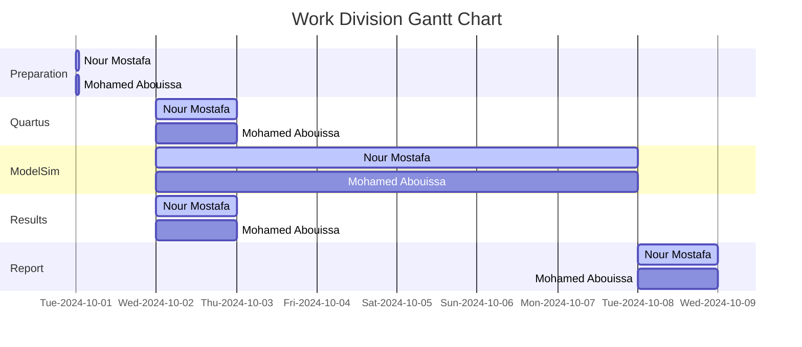

# <p align="center">Counters</p>

In this lab, we’ll be designing and testing counters using VHDL. First, we’ll build an 8-bit synchronous counter from a 4-bit synchronous counter using T-type flip-flops, simulate it, and then run it on a DE-series FPGA board. We’ll use switches, a push button, and 7-segment displays to control and show the count. After that, we’ll create a 16-bit counter using a different method that adds 1 to a register. We'll compare both designs in terms of how much logic they use and how they look in Quartus RTL Viewer, getting a better understanding of counters and FPGA implementation.

---

In digital system design, a __counter__ is a sequential circuit that counts the number of events, clock cycles, or pulses. It typically consists of flip-flops arranged in a sequence to store binary data, where each flip-flop represents one bit of the counter. Counters are classified based on their behavior and how they count: synchronous counters have all flip-flops triggered simultaneously by the same clock signal, whereas asynchronous counters have flip-flops triggered by different clocks, resulting in a ripple effect. Counters can count up (increment), down (decrement), or both, depending on their design. They can be used to track time intervals, divide frequencies, or sequence events in a system. Counters are widely used in digital circuits like timers, clocks, and memory addressing. In practice, counters operate based on inputs like enable and reset signals. For instance, an enable signal controls whether the counter increments its value, while a clear or reset signal resets the counter to zero. Some advanced counters allow programmable counting ranges or reversible counting (up and down). Hardware description languages like VHDL or Verilog are used to define and implement counter circuits, which are then synthesized and loaded onto programmable hardware, such as FPGAs or ASICs.

A __synchronous counter__ is a type of counter where all flip-flops are triggered by the same clock signal simultaneously. Since every flip-flop in the counter gets the clock pulse at the same time, the output of the counter changes in a coordinated manner on each clock edge. This results in fast and predictable operation because all flip-flops change states together without delays between stages. Synchronous counters are more reliable at higher clock speeds due to the absence of cumulative propagation delays, and they are easier to design for timing analysis and control in complex systems. Since all the flip-flops are driven by the same clock signal, they provide better performance, accuracy, and control. Synchronous counters are widely used in systems that require precise timing, such as digital clocks, microprocessors, frequency dividers, and event counters in control systems, where fast, predictable, and reliable performance is essential. On the other hand, an __asynchronous counter__, also known as a __ripple counter__, operates differently. In this design, only the first flip-flop is triggered by the clock signal, and each subsequent flip-flop is triggered by the output of the previous one. This causes a delay to ripple through the flip-flops as each one depends on the state of the previous one, leading to a slower response time as the counter gets larger. The ripple effect results in a less coordinated operation, which can introduce timing issues, particularly at higher clock frequencies. Asynchronous counters, on the other hand, are simpler to design and use fewer logic gates, making them more efficient in terms of hardware for small, low-speed applications. These counters are often used in basic applications where timing precision and speed are not critical, such as simple timers, low-frequency divider circuits, and low-cost devices. They are a good fit for simple tasks that don’t demand tight synchronization.

Whether having more bits in a counter is better depends entirely on the requirements of the application. More bits in a counter increase its counting range, allowing it to count higher values before resetting. For example, an 8-bit counter can count from 0x00 to 0xFF in hexadecimal, which corresponds to 0 to 255 in decimal. Meanwhile, a 16-bit counter can count from 0x0000 to 0xFFFF, which corresponds to 0 to 65,535 in decimal. In hexadecimal, the digits 10-15 are represented by the letters A through F, so after 0x09, the count continues as 0x0A, 0x0B, 0x0C, up to 0x0F, before progressing to 0x10 and so on. This is beneficial in applications that need to handle large counts, such as timers or event counters. However, increasing the number of bits also means more hardware resources are needed, such as flip-flops or logic gates, which can result in higher power consumption and complexity. In asynchronous counters, more bits can introduce delays due to the ripple effect between flip-flops, while in synchronous counters, larger bit-widths may require careful timing analysis. On the other hand, more bits can improve timing accuracy for applications like frequency dividers or digital clocks. In summary, the number of bits in a counter should match the application's specific needs. If high capacity and precision are required, more bits are useful, but for simpler tasks, fewer bits may offer better efficiency in terms of speed and resource use.

A __T-type flip-flop__ (T flip-flop) is a type of flip-flop, a basic building block in sequential digital circuits, used to store binary data. The "T" stands for "Toggle," which indicates its main function. A T flip-flop changes, or toggles, its output state (from 0 to 1 or from 1 to 0) every time it receives a triggering clock signal, provided its input is active (set to 1). If the T input is 0, the flip-flop retains its previous state. T flip-flops are often derived from JK flip-flops or D flip-flops, with modified behavior to simplify the design of counters and other sequential circuits. Key components include the toggle input that controls whether the flip-flop will change state. When T = 1, the flip-flop toggles; when T = 0, the output remains unchanged, the T flip-flop requires a clock signal to function (toggle action occurs on either the rising or falling edge of this signal, depending on the specific implementation), the output (Q) of the flip-flop, which represents its current state which can be either 0 or 1, and the complementary output (Q') which is simply the opposite of the Q output. If Q is 1, then Q' is 0, and vice versa. One of the most common applications of a T flip-flop is in binary counters. By connecting multiple T flip-flops in sequence, each flip-flop toggles at half the frequency of the previous one, effectively dividing the clock signal. In comparison with other flip-flops, a D flip-flop has a single data input, which determines its next state. If D = 1, the next state is 1; if D = 0, the next state is 0. The T flip-flop, on the other hand, toggles its output whenever T = 1, making it more suitable for counters. Furthermore, the T flip-flop is essentially a simplified version of the JK flip-flop with both the J and K inputs tied together. In a JK flip-flop, the J input acts like a "set" command, and the K input acts like a "reset" command, but when both J and K are high (1), the flip-flop toggles. The T flip-flop simply uses this toggle behavior directly.

## Part 1: Design and Implementation of an 4-bit and 8-bit Synchronous Counter

<details>
  <summary>VHDL Code Implementation on the FPGA Board (4-bit Synchronous Counter)</summary>
<br>

```VHDL
LIBRARY ieee;
USE ieee.std_logic_1164.all;

ENTITY part1_4bits IS 
   PORT ( SW   : IN  STD_LOGIC_VECTOR(1 DOWNTO 0);
          KEY  : IN  STD_LOGIC_VECTOR(0 DOWNTO 0);
          HEX0 : OUT STD_LOGIC_VECTOR(0 TO 6));
END part1_4bits;

ARCHITECTURE Behavior OF part1_4bits IS
   COMPONENT ToggleFF 
      PORT ( T, Clock, Resetn : IN  STD_LOGIC;
             Q                : OUT STD_LOGIC);
   END COMPONENT;
   COMPONENT hex7seg
      PORT ( hex     : IN  STD_LOGIC_VECTOR(3 DOWNTO 0);
             display : OUT STD_LOGIC_VECTOR(0 TO 6));
   END COMPONENT;
   SIGNAL Clock, Resetn : STD_LOGIC;
   SIGNAL Count, Enable : STD_LOGIC_VECTOR(3 DOWNTO 0);
BEGIN
   
   Clock <= KEY(0);
   Resetn <= SW(0);

   Enable(0) <= SW(1);
   TFF0: ToggleFF PORT MAP (Enable(0), Clock, Resetn, Count(0));
   Enable(1) <= Count(0) AND Enable(0);
   TFF1: ToggleFF PORT MAP (Enable(1), Clock, Resetn, Count(1));
   Enable(2) <= Count(1) AND Enable(1);
   TFF2: ToggleFF PORT MAP (Enable(2), Clock, Resetn, Count(2));
   Enable(3) <= Count(2) AND Enable(2);
   TFF3: ToggleFF PORT MAP (Enable(3), Clock, Resetn, Count(3));
   
   digit0: hex7seg PORT MAP (Count(3 DOWNTO 0), HEX0);
END Behavior;
         
LIBRARY ieee;
USE ieee.std_logic_1164.all;

ENTITY ToggleFF IS
   PORT ( T, Clock, Resetn : IN  STD_LOGIC;
          Q                : OUT STD_LOGIC);
END ToggleFF;

ARCHITECTURE Behavior OF ToggleFF IS
   SIGNAL T_out : STD_LOGIC;
BEGIN
   PROCESS (Clock)
   BEGIN
      IF (Clock'EVENT AND Clock = '1') THEN
         IF (Resetn = '0') THEN
            T_out <= '0';
         ELSIF (T = '1') THEN
            T_out <= NOT T_out;
         END IF;
      END IF;
   END PROCESS;
   Q <= T_out;
END Behavior;
         
LIBRARY ieee;
USE ieee.std_logic_1164.all;

ENTITY hex7seg IS
   PORT ( hex     : IN  STD_LOGIC_VECTOR(3 DOWNTO 0);
          display : OUT STD_LOGIC_VECTOR(0 TO 6));
END hex7seg;

ARCHITECTURE Behavior OF hex7seg IS
BEGIN
  
   PROCESS (hex)
   BEGIN
      CASE hex IS
         WHEN "0000" => display <= "0000001";
         WHEN "0001" => display <= "1001111";
         WHEN "0010" => display <= "0010010";
         WHEN "0011" => display <= "0000110";
         WHEN "0100" => display <= "1001100";
         WHEN "0101" => display <= "0100100";
         WHEN "0110" => display <= "0100000";
         WHEN "0111" => display <= "0001111";
         WHEN "1000" => display <= "0000000";
         WHEN "1001" => display <= "0000100";
         WHEN "1010" => display <= "0001000";
         WHEN "1011" => display <= "1100000";
         WHEN "1100" => display <= "0110001";
         WHEN "1101" => display <= "1000010";
         WHEN "1110" => display <= "0110000";
         WHEN OTHERS => display <= "0111000";
      END CASE;
   END PROCESS;
END Behavior;

```
</details>

<details>
  <summary>VHDL Code Implementation on the FPGA Board (8-bit Synchronous Counter)</summary>
<br>

```VHDL
LIBRARY ieee;
USE ieee.std_logic_1164.all;

ENTITY part1 IS 
   PORT ( SW         : IN  STD_LOGIC_VECTOR(1 DOWNTO 0);
          KEY        : IN  STD_LOGIC_VECTOR(0 DOWNTO 0);
          HEX1, HEX0 : OUT STD_LOGIC_VECTOR(0 TO 6));
END part1;

ARCHITECTURE Behavior OF part1 IS
   COMPONENT ToggleFF 
      PORT ( T, Clock, Resetn : IN  STD_LOGIC;
             Q                : OUT STD_LOGIC);
   END COMPONENT;
   COMPONENT hex7seg
      PORT ( hex     : IN  STD_LOGIC_VECTOR(3 DOWNTO 0);
             display : OUT STD_LOGIC_VECTOR(0 TO 6));
   END COMPONENT;
   SIGNAL Clock, Resetn : STD_LOGIC;
   SIGNAL Count, Enable : STD_LOGIC_VECTOR(7 DOWNTO 0);
BEGIN
   
   Clock <= KEY(0);
   Resetn <= SW(0);

   Enable(0) <= SW(1);
   TFF0: ToggleFF PORT MAP (Enable(0), Clock, Resetn, Count(0));
   Enable(1) <= Count(0) AND Enable(0);
   TFF1: ToggleFF PORT MAP (Enable(1), Clock, Resetn, Count(1));
   Enable(2) <= Count(1) AND Enable(1);
   TFF2: ToggleFF PORT MAP (Enable(2), Clock, Resetn, Count(2));
   Enable(3) <= Count(2) AND Enable(2);
   TFF3: ToggleFF PORT MAP (Enable(3), Clock, Resetn, Count(3));
   Enable(4) <= Count(3) AND Enable(3);
   TFF4: ToggleFF PORT MAP (Enable(4), Clock, Resetn, Count(4));
   Enable(5) <= Count(4) AND Enable(4);
   TFF5: ToggleFF PORT MAP (Enable(5), Clock, Resetn, Count(5));
   Enable(6) <= Count(5) AND Enable(5);
   TFF6: ToggleFF PORT MAP (Enable(6), Clock, Resetn, Count(6));
   Enable(7) <= Count(6) AND Enable(6);
   TFF7: ToggleFF PORT MAP (Enable(7), Clock, Resetn, Count(7));
   
   
   digit1: hex7seg PORT MAP (Count(7 DOWNTO 4), HEX1);
   digit0: hex7seg PORT MAP (Count(3 DOWNTO 0), HEX0);
END Behavior;
         
LIBRARY ieee;
USE ieee.std_logic_1164.all;

ENTITY ToggleFF IS
   PORT ( T, Clock, Resetn : IN  STD_LOGIC;
          Q                : OUT STD_LOGIC);
END ToggleFF;

ARCHITECTURE Behavior OF ToggleFF IS
   SIGNAL T_out : STD_LOGIC;
BEGIN
   PROCESS (Clock)
   BEGIN
      IF (Clock'EVENT AND Clock = '1') THEN
         IF (Resetn = '0') THEN
            T_out <= '0';
         ELSIF (T = '1') THEN
            T_out <= NOT T_out;
         END IF;
      END IF;
   END PROCESS;
   Q <= T_out;
END Behavior;
         
LIBRARY ieee;
USE ieee.std_logic_1164.all;

ENTITY hex7seg IS
   PORT ( hex     : IN  STD_LOGIC_VECTOR(3 DOWNTO 0);
          display : OUT STD_LOGIC_VECTOR(0 TO 6));
END hex7seg;

ARCHITECTURE Behavior OF hex7seg IS
BEGIN
  
   PROCESS (hex)
   BEGIN
      CASE hex IS
         WHEN "0000" => display <= "0000001";
         WHEN "0001" => display <= "1001111";
         WHEN "0010" => display <= "0010010";
         WHEN "0011" => display <= "0000110";
         WHEN "0100" => display <= "1001100";
         WHEN "0101" => display <= "0100100";
         WHEN "0110" => display <= "0100000";
         WHEN "0111" => display <= "0001111";
         WHEN "1000" => display <= "0000000";
         WHEN "1001" => display <= "0000100";
         WHEN "1010" => display <= "0001000";
         WHEN "1011" => display <= "1100000";
         WHEN "1100" => display <= "0110001";
         WHEN "1101" => display <= "1000010";
         WHEN "1110" => display <= "0110000";
         WHEN OTHERS => display <= "0111000";
      END CASE;
   END PROCESS;
END Behavior;
```
</details>

<details>
  <summary>VHDL LUT-Level Design and Gates-Level Design (4-bit Synchronous Counter)</summary>
<br>


</details>

<details>
  <summary>VHDL LUT-Level Design and Gates-Level Design (8-bit Synchronous Counter)</summary>
<br>


</details>

## Part 2: do your magic

do your magic


## Conclusion

The T-type flip-flop is a powerful sequential element in digital circuits, best known for its toggle behavior. It plays a crucial role in constructing counters, frequency dividers, and similar systems that require flipping between binary states. Its simplicity and efficiency make it a common choice in digital system design. Whether implemented in synchronous or asynchronous circuits, T flip-flops provide a reliable and easy way to manage state transitions in digital electronics.
## Resources

Do your magic

<br>



We extend our sincere appreciation to Eng. Umar Adeel for his insightful feedback which has significantly contributed to the successful completion of this experiment.

This publication adheres to all regulatory laws and guidelines established by the American University of Ras Al Khaimah (AURAK) regarding the dissemination of academic materials.


