# <p align="center">Counters</p>

In this lab, we’ll be designing and testing counters using VHDL. First, we’ll build an 8-bit synchronous counter from a 4-bit synchronous counter using T-type flip-flops, simulate it, and then run it on a DE-series FPGA board. We’ll use switches, a push button, and 7-segment displays to control and show the count. After that, we’ll create a 16-bit counter using a different method that adds 1 to a register. We'll compare both designs in terms of how much logic they use and how they look in Quartus RTL Viewer, getting a better understanding of counters and FPGA implementation.

---

In digital system design, a __counter__ is a sequential circuit that counts the number of events, clock cycles, or pulses. It typically consists of flip-flops arranged in a sequence to store binary data, where each flip-flop represents one bit of the counter. Counters are classified based on their behavior and how they count: synchronous counters have all flip-flops triggered simultaneously by the same clock signal, whereas asynchronous counters have flip-flops triggered by different clocks, resulting in a ripple effect. Counters can count up (increment), down (decrement), or both, depending on their design. They can be used to track time intervals, divide frequencies, or sequence events in a system. Counters are widely used in digital circuits like timers, clocks, and memory addressing. In practice, counters operate based on inputs like enable and reset signals. For instance, an enable signal controls whether the counter increments its value, while a clear or reset signal resets the counter to zero. Some advanced counters allow programmable counting ranges or reversible counting (up and down). Hardware description languages like VHDL or Verilog are used to define and implement counter circuits, which are then synthesized and loaded onto programmable hardware, such as FPGAs or ASICs.

A __synchronous counter__ is a type of counter where all flip-flops are triggered by the same clock signal simultaneously. Since every flip-flop in the counter gets the clock pulse at the same time, the output of the counter changes in a coordinated manner on each clock edge. This results in fast and predictable operation because all flip-flops change states together without delays between stages. Synchronous counters are more reliable at higher clock speeds due to the absence of cumulative propagation delays, and they are easier to design for timing analysis and control in complex systems. Since all the flip-flops are driven by the same clock signal, they provide better performance, accuracy, and control. Synchronous counters are widely used in systems that require precise timing, such as digital clocks, microprocessors, frequency dividers, and event counters in control systems, where fast, predictable, and reliable performance is essential. On the other hand, an __asynchronous counter__, also known as a __ripple counter__, operates differently. In this design, only the first flip-flop is triggered by the clock signal, and each subsequent flip-flop is triggered by the output of the previous one. This causes a delay to ripple through the flip-flops as each one depends on the state of the previous one, leading to a slower response time as the counter gets larger. The ripple effect results in a less coordinated operation, which can introduce timing issues, particularly at higher clock frequencies. Asynchronous counters, on the other hand, are simpler to design and use fewer logic gates, making them more efficient in terms of hardware for small, low-speed applications. These counters are often used in basic applications where timing precision and speed are not critical, such as simple timers, low-frequency divider circuits, and low-cost devices. They are a good fit for simple tasks that don’t demand tight synchronization.

## Part 1: 4-bit and 8-bit Synchronous Counters Using T flip-flops

A [__T-type flip-flop__](https://www.geeksforgeeks.org/flip-flop-types-their-conversion-and-applications/#sr-flip-flop) is a type of flip-flop, a basic building block in sequential digital circuits, used to store binary data. The "T" stands for "Toggle," which indicates its main function. A T flip-flop changes, or toggles, its output state (from 0 to 1 or from 1 to 0) every time it receives a triggering clock signal, provided its input is active (set to 1). If the T input is 0, the flip-flop retains its previous state. T flip-flops are often derived from JK flip-flops or D flip-flops, with modified behavior to simplify the design of counters and other sequential circuits. Key components include the toggle input that controls whether the flip-flop will change state, a clock signal is required for the toggle to function (toggle action occurs on either the rising or falling edge of this signal, depending on the specific implementation), the output `Q` of the flip-flop, which represents its current state which can be either 0 or 1, and the complementary output `Q'` which is simply the opposite of the `Q` output. If `Q` is 1, then `Q'` is 0, and vice versa. One of the most common applications of a T flip-flop is in binary counters. By connecting multiple T flip-flops in sequence, each flip-flop toggles at half the frequency of the previous one, effectively dividing the clock signal. In comparison with other flip-flops, a D flip-flop has a single data input, which determines its next state. If `D = 1`, the next state is 1; if `D = 0`, the next state is 0. The T flip-flop, on the other hand, toggles its output whenever `T = 1`, making it more suitable for counters. Furthermore, the T flip-flop is essentially a simplified version of the JK flip-flop with both the J and K inputs tied together. In a JK flip-flop, the J input acts like a "set" command, and the K input acts like a "reset" command, but when both J and K are high (1), the flip-flop toggles. The T flip-flop simply uses this toggle behavior directly.

For this part, we will design a 4-bit and 8-bit counter using T flip-flops. This [figure](Photos/4bitcounterfigure.png) illustrates the design for better understanding. The counter will have three primary inputs: `enable`, `reset (clear)`, and `clock`. The `enable` input determines whether the counter is operational. If the `enable` signal is high, the counter will function, and if it is low, the counter will remain inactive. For this design, we assign the enable input to switch number 1 (the second switch from the right). The `reset (clear)` input is active-low, meaning the counter will reset to zero when the reset signal is low. When the reset input is high, the counter will continue its operation without resetting. We assign the reset input to switch number 0 (rightmost). The `clock` input is `positive-edge triggered` and is assigned to key zero. This means that the counter will increment on the rising edge of the `clock` signal, which occurs when key zero is pressed and released (from low to high and then back to low). Therefore, to operate the counter, both the `enable` and `reset` inputs must be high. In this state, pressing the clock key will increment the counter. For the 4-bit counter, the output is displayed using a single 7-segment display `(HEX0)`. For the 8-bit counter, we use two 7-segment displays `(HEX0 and HEX1)`. The 4-bit counter is built using 4 T flip-flops, while the 8-bit counter uses 8 T flip-flops because it uses two 4-bit counters.

<details>
<summary>4-bit Counter</summary>

<details>
  <summary>VHDL Code Implementation on the FPGA Board</summary>
<br>

```VHDL

-- This is an example of Mixed Modeling using both Behavioral Modeling and Structural Modeling techniques.
-- The ToggleFF and hex7seg components are described using behavioral modeling. This type of modeling specifies the behavior of a component
-- based on its inputs and outputs, using process blocks and conditional statements.
-- The top-level part1_4bits entity is an example of structural modeling. In structural modeling, components are instantiated and connected together to form a larger system.
-- The part1_4bits entity instantiates four instances of the ToggleFF component to create a 4-bit counter. These instances are connected together using internal signals like Enable.
-- It also instantiates one instance of the hex7seg component to drive the 7-segment display based on the 4-bit counter output.
-- This approach represents the structure of the design by connecting components rather than describing their behavior directly.

LIBRARY ieee;
USE ieee.std_logic_1164.all;
--
-- inputs:
-- KEY0: manual clock
-- SW0: active low reset
-- SW1: enable signal for the counter
--
-- outputs:
-- HEX0: hex segment display

ENTITY part1_4bits IS 
   PORT ( SW   : IN  STD_LOGIC_VECTOR(1 DOWNTO 0); -- Assigning the input and output and their lengths
          KEY  : IN  STD_LOGIC_VECTOR(0 DOWNTO 0);
          HEX0 : OUT STD_LOGIC_VECTOR(0 TO 6));
END part1_4bits;

ARCHITECTURE Behavior OF part1_4bits IS
   COMPONENT ToggleFF -- The T-flip-flop component
      PORT ( T, Clock, Resetn : IN  STD_LOGIC;
             Q                : OUT STD_LOGIC);
   END COMPONENT;
   COMPONENT hex7seg -- The HEX component
      PORT ( hex     : IN  STD_LOGIC_VECTOR(3 DOWNTO 0);
             display : OUT STD_LOGIC_VECTOR(0 TO 6));
   END COMPONENT;
   SIGNAL Clock, Resetn : STD_LOGIC; -- Creating 4 signals
   SIGNAL Count, Enable : STD_LOGIC_VECTOR(3 DOWNTO 0);
BEGIN
   -- 4-bit counter based on T-flip flops
   Clock <= KEY(0);
   Resetn <= SW(0);

   Enable(0) <= SW(1);
   TFF0: ToggleFF PORT MAP (Enable(0), Clock, Resetn, Count(0)); -- Here we do mapping for the output Count(0) we take it and do AND with the Enable(0) so we get the second input for the second TFF
   Enable(1) <= Count(0) AND Enable(0);
   TFF1: ToggleFF PORT MAP (Enable(1), Clock, Resetn, Count(1)); -- And we keep going
   Enable(2) <= Count(1) AND Enable(1);
   TFF2: ToggleFF PORT MAP (Enable(2), Clock, Resetn, Count(2));
   Enable(3) <= Count(2) AND Enable(2);
   TFF3: ToggleFF PORT MAP (Enable(3), Clock, Resetn, Count(3));
   
   -- drive the displays
   digit0: hex7seg PORT MAP (Count(3 DOWNTO 0), HEX0); -- Here after we get the output for each TFF we will map the final result to the HEX 0
END Behavior;
         

-- T Flip-flop
LIBRARY ieee;
USE ieee.std_logic_1164.all;
-- ToggleFF and hex7seg components haven't explicitly declared that they are using the IEEE.Std_logic_1164 library, 
-- which contains the definition for STD_LOGIC. Although this library is included at the top of the part1_4bits entity, 
-- you also need to include it inside the ToggleFF and hex7seg components if they're in separate files or otherwise isolated.
-- You need to add the necessary library and package declarations inside each architecture where STD_LOGIC is used.

ENTITY ToggleFF IS
   PORT ( T, Clock, Resetn : IN  STD_LOGIC;
          Q                : OUT STD_LOGIC);
END ToggleFF;

ARCHITECTURE Behavior OF ToggleFF IS
   SIGNAL T_out : STD_LOGIC; -- Creating a signal
BEGIN
   PROCESS (Clock) -- If any changes happen in the clock, this process will run
   BEGIN
      IF (Clock'EVENT AND Clock = '1') THEN -- Simple nested if statement (if the clock changes and it becomes one then enter the next if)
         IF (Resetn = '0') THEN -- Also if the reset is 0 then T_out will be 0
            T_out <= '0';
         ELSIF (T = '1') THEN -- Else if T is 1 then toggle the input (CLOCK)
            T_out <= NOT T_out;
         END IF;
      END IF;
   END PROCESS;
   Q <= T_out; -- Output will be assigned to Q
END Behavior;
         

-- Hex 7-segment display driver
LIBRARY ieee;
USE ieee.std_logic_1164.all;

ENTITY hex7seg IS
   PORT ( hex     : IN  STD_LOGIC_VECTOR(3 DOWNTO 0);
          display : OUT STD_LOGIC_VECTOR(0 TO 6));
END hex7seg;

ARCHITECTURE Behavior OF hex7seg IS
BEGIN
   --
   --       0  
   --      ---  
   --     |   |
   --    5|   |1
   --     | 6 |
   --      ---  
   --     |   |
   --    4|   |2
   --     |   |
   --      ---  
   --       3  
   --
   PROCESS (hex)
   BEGIN
      CASE hex IS
         WHEN "0000" => display <= "0000001";
         WHEN "0001" => display <= "1001111";
         WHEN "0010" => display <= "0010010";
         WHEN "0011" => display <= "0000110";
         WHEN "0100" => display <= "1001100";
         WHEN "0101" => display <= "0100100";
         WHEN "0110" => display <= "0100000";
         WHEN "0111" => display <= "0001111";
         WHEN "1000" => display <= "0000000";
         WHEN "1001" => display <= "0000100";
         WHEN "1010" => display <= "0001000";
         WHEN "1011" => display <= "1100000";
         WHEN "1100" => display <= "0110001";
         WHEN "1101" => display <= "1000010";
         WHEN "1110" => display <= "0110000";
         WHEN OTHERS => display <= "0111000";
      END CASE;
   END PROCESS;
END Behavior;
```

<p align="center">
  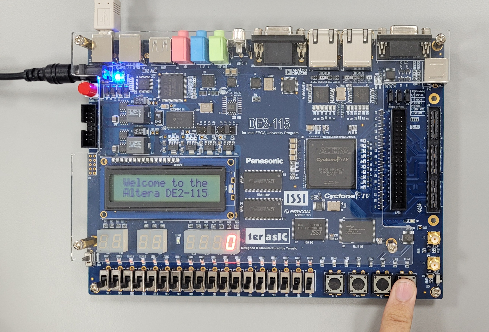 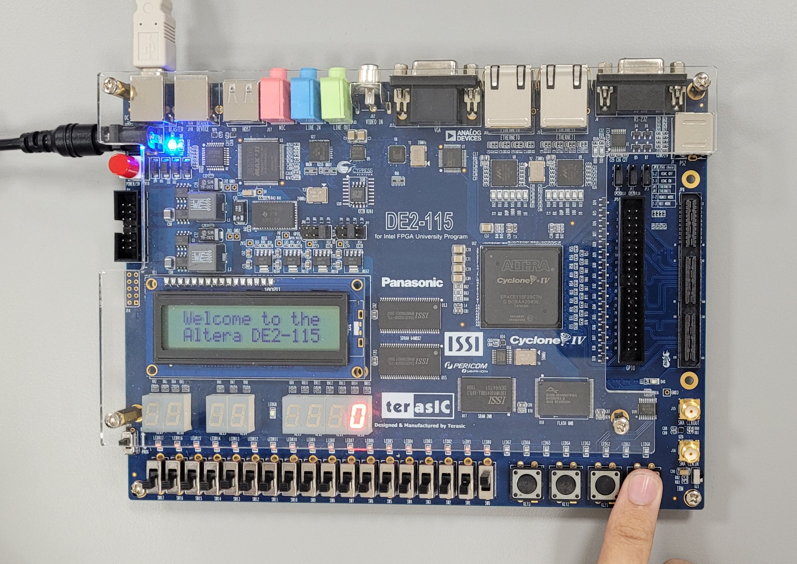 
  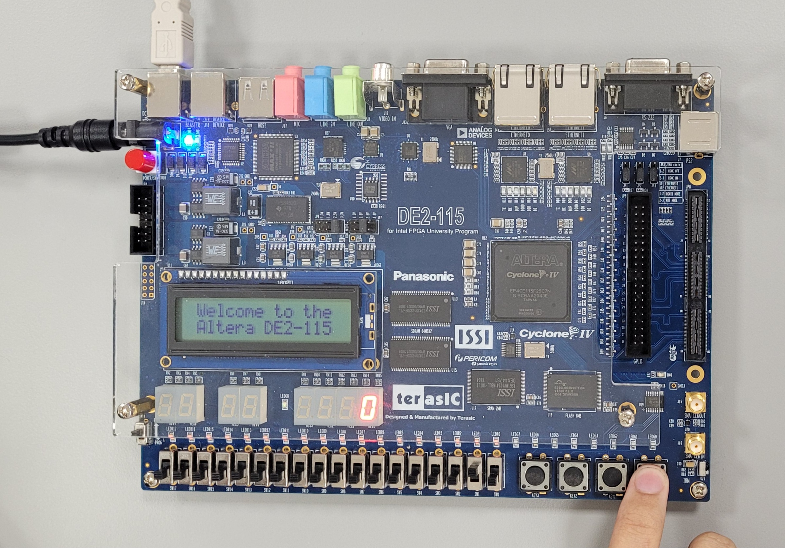  
</p>

The results shown on the board align with the desired behavior of the counter as it was being designed. When the reset is active (= 0) the counter will reset to zero, otherwise it will continue counting. When the enable is active (= 1) the counter will increment, otherwise it will remain unchanged from the previous value. Hence, in the first photo, when the reset was active but the enable inactive the counter was zero and it wasn't incrementing no matter how many times we pressed the push button (clock). In the second case, when the reset was active and the enable was active the counter was supposed to increment but it is resetting to zero because the reset is active. In the third case, when the reset was inactive and the enable was inactive, the counter would have incremented if it weren't for the enable being off. Finally, in the fourth case, when the reset was inactive and the enable was active, we were able to observe the counter incrementing on the HEX0 as we press on the push button. Note that you may hover your mouse over a picture to get the state description of the test case.


</details>


<details>
  <summary>Simulations</summary>
	<p align="center">
  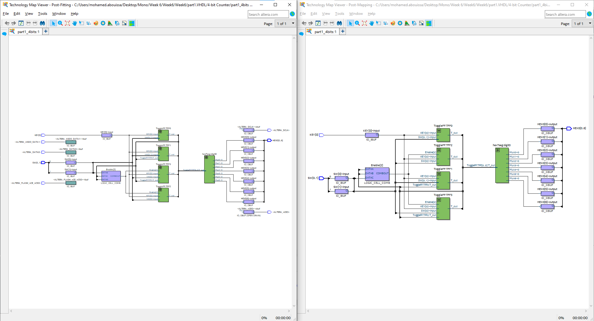 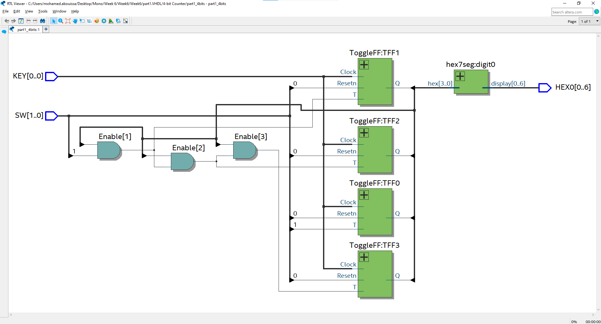 
</p>

 In the RTL viewer we can count 3 AND gates and 4 T flip-flops; a managable number of digital logic elements.
<br>
	
</details>

</details>


<details>
<summary>8-bit Counter</summary>

<details>
  <summary>VHDL Code Implementation on the FPGA Board</summary>
<br>

```VHDL
LIBRARY ieee;
USE ieee.std_logic_1164.all;
--
-- inputs:
-- KEY0: manual clock
-- SW0: active low reset
-- SW1: enable signal for the counter
--
-- outputs:
-- HEX0 - HEX1: hex segment displays

ENTITY part1 IS 
   PORT ( SW         : IN  STD_LOGIC_VECTOR(1 DOWNTO 0);
          KEY        : IN  STD_LOGIC_VECTOR(0 DOWNTO 0);
          HEX1, HEX0 : OUT STD_LOGIC_VECTOR(0 TO 6));
END part1;

ARCHITECTURE Behavior OF part1 IS
   COMPONENT ToggleFF 
      PORT ( T, Clock, Resetn : IN  STD_LOGIC;
             Q                : OUT STD_LOGIC);
   END COMPONENT;
   COMPONENT hex7seg
      PORT ( hex     : IN  STD_LOGIC_VECTOR(3 DOWNTO 0);
             display : OUT STD_LOGIC_VECTOR(0 TO 6));
   END COMPONENT;
   SIGNAL Clock, Resetn : STD_LOGIC;
   SIGNAL Count, Enable : STD_LOGIC_VECTOR(7 DOWNTO 0);
BEGIN
   -- 8-bit counter based on T-flip flops
   Clock <= KEY(0);
   Resetn <= SW(0);

   Enable(0) <= SW(1);
   TFF0: ToggleFF PORT MAP (Enable(0), Clock, Resetn, Count(0));
   Enable(1) <= Count(0) AND Enable(0);
   TFF1: ToggleFF PORT MAP (Enable(1), Clock, Resetn, Count(1));
   Enable(2) <= Count(1) AND Enable(1);
   TFF2: ToggleFF PORT MAP (Enable(2), Clock, Resetn, Count(2));
   Enable(3) <= Count(2) AND Enable(2);
   TFF3: ToggleFF PORT MAP (Enable(3), Clock, Resetn, Count(3));
   Enable(4) <= Count(3) AND Enable(3);
   TFF4: ToggleFF PORT MAP (Enable(4), Clock, Resetn, Count(4));
   Enable(5) <= Count(4) AND Enable(4);
   TFF5: ToggleFF PORT MAP (Enable(5), Clock, Resetn, Count(5));
   Enable(6) <= Count(5) AND Enable(5);
   TFF6: ToggleFF PORT MAP (Enable(6), Clock, Resetn, Count(6));
   Enable(7) <= Count(6) AND Enable(6);
   TFF7: ToggleFF PORT MAP (Enable(7), Clock, Resetn, Count(7));
   
   -- drive the displays
   digit1: hex7seg PORT MAP (Count(7 DOWNTO 4), HEX1);
   digit0: hex7seg PORT MAP (Count(3 DOWNTO 0), HEX0);
END Behavior;

-- ------------------------------------------------------------------------------------------------------------------
         
LIBRARY ieee;
USE ieee.std_logic_1164.all;

-- T Flip-flop
ENTITY ToggleFF IS
   PORT ( T, Clock, Resetn : IN  STD_LOGIC;
          Q                : OUT STD_LOGIC);
END ToggleFF;

ARCHITECTURE Behavior OF ToggleFF IS
   SIGNAL T_out : STD_LOGIC;
BEGIN
   PROCESS (Clock)
   BEGIN
      IF (Clock'EVENT AND Clock = '1') THEN
         IF (Resetn = '0') THEN
            T_out <= '0';
         ELSIF (T = '1') THEN
            T_out <= NOT T_out;
         END IF;
      END IF;
   END PROCESS;
   Q <= T_out;
END Behavior;

-- ------------------------------------------------------------------------------------------------------------------
         
LIBRARY ieee;
USE ieee.std_logic_1164.all;

ENTITY hex7seg IS
   PORT ( hex     : IN  STD_LOGIC_VECTOR(3 DOWNTO 0);
          display : OUT STD_LOGIC_VECTOR(0 TO 6));
END hex7seg;

ARCHITECTURE Behavior OF hex7seg IS
BEGIN
   --
   --       0  
   --      ---  
   --     |   |
   --    5|   |1
   --     | 6 |
   --      ---  
   --     |   |
   --    4|   |2
   --     |   |
   --      ---  
   --       3  
   --
   PROCESS (hex)
   BEGIN
      CASE hex IS
         WHEN "0000" => display <= "0000001";
         WHEN "0001" => display <= "1001111";
         WHEN "0010" => display <= "0010010";
         WHEN "0011" => display <= "0000110";
         WHEN "0100" => display <= "1001100";
         WHEN "0101" => display <= "0100100";
         WHEN "0110" => display <= "0100000";
         WHEN "0111" => display <= "0001111";
         WHEN "1000" => display <= "0000000";
         WHEN "1001" => display <= "0000100";
         WHEN "1010" => display <= "0001000";
         WHEN "1011" => display <= "1100000";
         WHEN "1100" => display <= "0110001";
         WHEN "1101" => display <= "1000010";
         WHEN "1110" => display <= "0110000";
         WHEN OTHERS => display <= "0111000";
      END CASE;
   END PROCESS;
END Behavior;
```

<p align="center">
  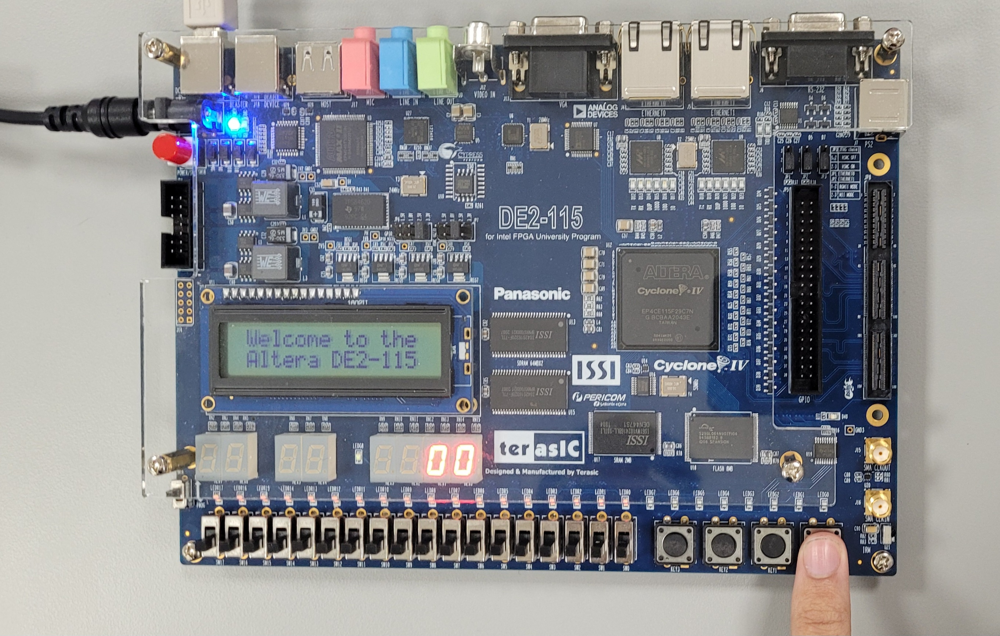 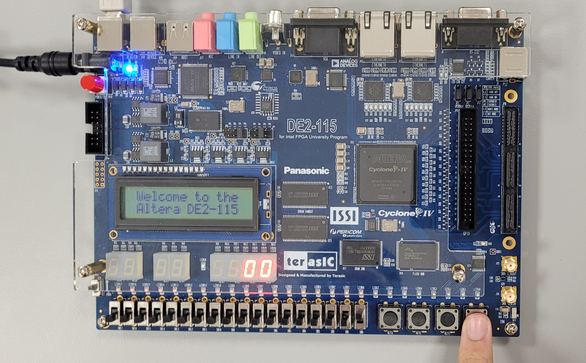 
  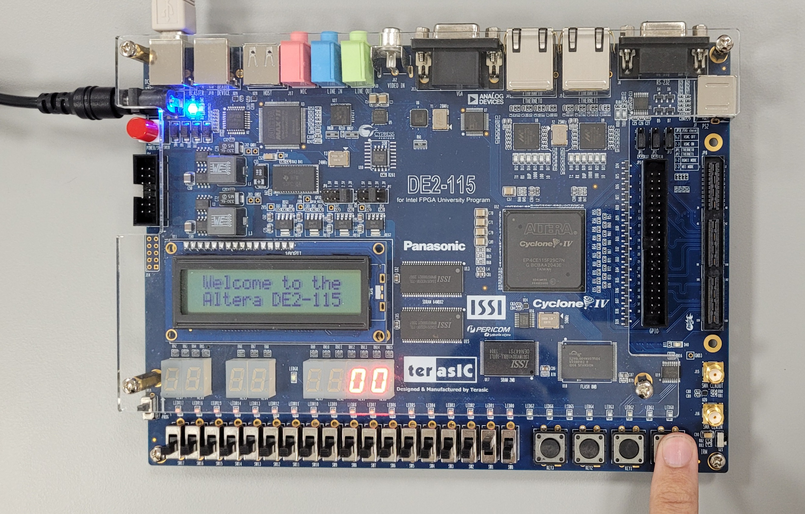  
</p>

A similar behavior is observed here (as we didn'y change the core behavior) except that now we have two 7-segment displays activated to accomodate the 8 bits. 

</details>

<details>
  <summary>Simulations</summary>
	<p align="center">
  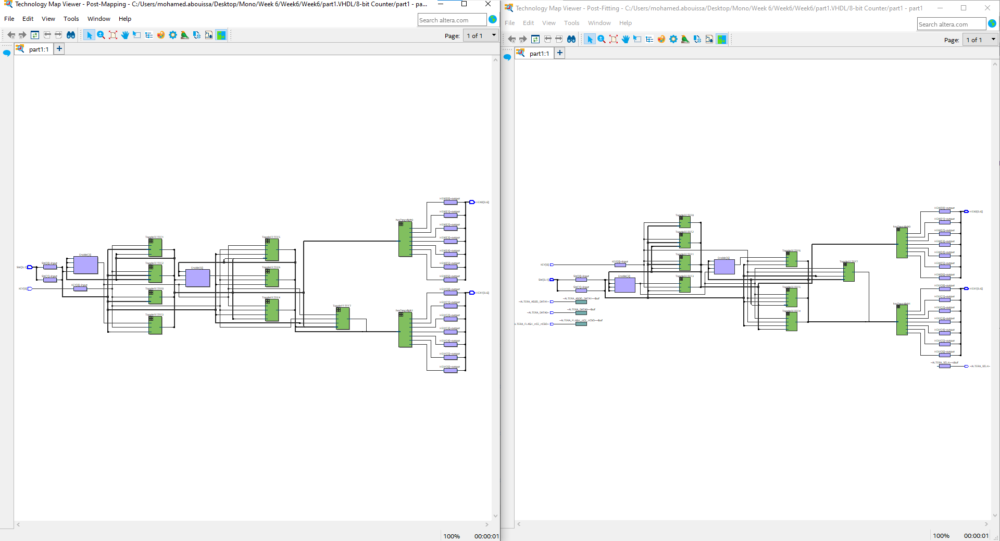 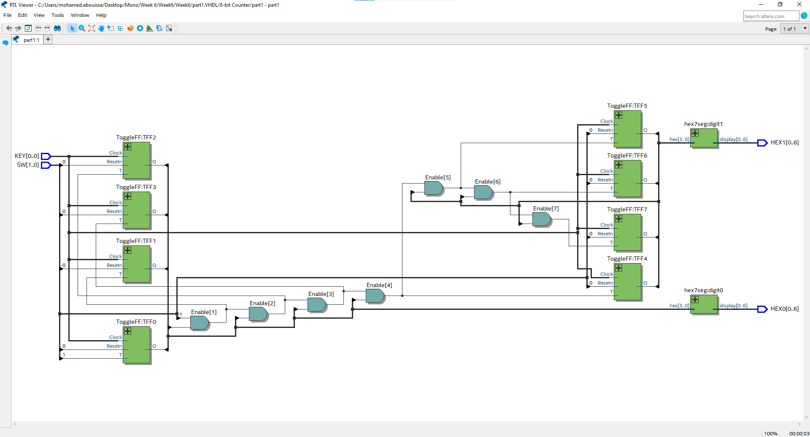 
</p>

 In the RTL viewer we can count 7 AND gates and 8 T flip-flops. The amount of logic elements approximately doubled in comparison with the 4-bits counter discussed above and although the number is also still somewhat manageable, it becomes increasingly obvious that this method does not scale well. The more bits that we demand in the counter the more the logic elements are going to be needed and the more complex it's going to be to manage them.
<br>

</details>

</details>

## Part 2: 16-bit Synchronous Counter Using a Register

A __register__ is a fundamental component in digital electronics used to store binary data temporarily. It typically consists of a collection of flip-flops or memory cells that can hold a specific number of bits (e.g., 8 bits, 16 bits, 32 bits, etc.). Registers are essential in various digital systems, including microprocessors, FPGAs (Field Programmable Gate Arrays), and digital signal processors. Registers can perform various operations, such as loading data, shifting bits, or counting. They are often used in arithmetic operations, data transfer, and control logic within digital circuits. Types of Registers include Synchronous Registers, which update their stored values based on a clock signal, causing all flip-flops in the register to change state simultaneously at a clock edge. Asynchronous Registers, on the other hand, change their output based on external signals and operate independently of the clock, allowing them to respond immediately to changes in control signals. Registers have several common uses in digital systems. They facilitate data transfer between various components, such as between the CPU and memory, ensuring smooth communication. Additionally, registers serve as temporary storage locations for data being processed or manipulated, providing a quick access point for operations. They can also be utilized to implement counters that increment or decrement based on clock pulses, aiding in tasks that require counting. Furthermore, in sequential circuits, registers are essential for state holding, as they maintain the current state of a system, enabling it to function based on past inputs. 

In VHDL, when we refer to accessing a register, we're typically talking about interacting with a physical storage element implemented in hardware, specifically within an FPGA (Field Programmable Gate Array) or other programmable logic devices. When you compile VHDL code targeting an FPGA, the registers defined in your VHDL design are mapped to actual physical hardware resources on the FPGA chip. Each register corresponds to an array of flip-flops or memory cells within the FPGA fabric. This fabric is made up of Configurable Logic Blocks (CLBs), which include lookup tables (LUTs), flip-flops, and multiplexers. Most FPGAs have a certain number of embedded flip-flops that can be used to create registers. When VHDL code is synthesized, the synthesis tool will allocate the appropriate number of flip-flops based on the signal definitions and the overall design. Some FPGAs also include block RAM (BRAM) modules that can serve as registers. These are larger storage elements that can hold multi-bit values and are useful for implementing larger data registers or memory. When VHDL code is simulated on a computer (using tools like ModelSim), the registers are represented in software. The simulation does not interact with the physical hardware; instead, it models how the registers would behave according to the defined VHDL logic. During simulation, the state of the registers is maintained in the simulator’s memory, allowing the designer to analyze the behavior of the circuit before deploying it to actual hardware. In VHDL, registers are often defined using signals or variables. VHDL can read from and write to registers using assignment statements. Registers are often accessed within process blocks. A process is sensitive to certain signals (like clock edges or resets) and executes when those signals change.

In this part, the goal is to implement the same behavior as described in [Part 1](#part-1-4-bit-and-8-bit-synchronous-counters-using-t-flip-flops) but using a register instead of a T flip-flop.

<details>
<summary>VHDL Code Implementation on the FPGA Board</summary>
<br>

``` VHDL
-- This is the Behavioral Modelling technique; a high-level abstraction method used in VHDL to describe the behavior of a digital system
-- without specifying the exact implementation at the gate level. Instead, it describes how the design behaves based on its inputs and outputs.
-- Behavioral modeling is characterized by the use of process blocks. The behavior inside these processes describes what should happen when certain conditions are met.
-- Behavioral modeling uses high-level constructs like IF-THEN-ELSE and CASE statements to define the logic of the system.
-- This model doesn’t specify the actual hardware implementation, such as flip-flops or gates, but describes how the system reacts to signals.

LIBRARY ieee;
USE ieee.std_logic_1164.all; -- Provides definitions for standard logic types
USE ieee.std_logic_unsigned.all; -- Provides definitions for unsigned arithmetic operations

--
-- inputs:
-- KEY0: manual clock (when pressed, the counter increments)
-- SW0: reset (active low)
-- SW1: enable signal for the counter
--
-- outputs:
--   HEX0 - HEX3: hex segment displays


-- Define the entity for the counter design, referred to as part2
-- This entity describes the inputs and outputs of the counter

ENTITY part2 IS 
   PORT ( SW  : IN STD_LOGIC_VECTOR(1 DOWNTO 0); -- 2-bit switch input vector
          KEY : IN STD_LOGIC_VECTOR(0 DOWNTO 0); -- 1-bit key input vector for manual clock
          HEX3, HEX2, HEX1, HEX0 : OUT STD_LOGIC_VECTOR(0 TO 6)); -- 7-segment display outputs
END part2;

ARCHITECTURE Behavior OF part2 IS
   COMPONENT hex7seg -- architecture defines how the hex7seg module works internally
      PORT ( hex     : IN  STD_LOGIC_VECTOR(3 DOWNTO 0); -- 4-bit input representing a hexadecimal digit
             display : OUT STD_LOGIC_VECTOR(0 TO 6)); -- 7-bit output for driving the 7-segment display
   END COMPONENT;
	
	-- Declaring internal signals
   SIGNAL Clock, Resetn, Enable : STD_LOGIC; -- The control signals for the counter
   SIGNAL Count : STD_LOGIC_VECTOR(15 DOWNTO 0); -- 16-bit counter value

	
	BEGIN
	-- Assigning inputs to internal signals for easier reference
   Clock <= KEY(0);
   Resetn <= SW(0);
   Enable <= SW(1);
   
   PROCESS (Clock) -- Process block triggered by the rising edge of the Clock
   BEGIN
      IF (Clock'EVENT AND Clock = '1') THEN -- Check for a rising edge on the Clock
         IF (Resetn = '0') THEN -- Check if the Resetn signal is low (active)
            Count <= (OTHERS => '0'); -- Reset the counter to 0
         ELSIF (Enable = '1') THEN -- If enable signal is high
            Count <= Count + 1; -- Increment the counter by 1 (This is the register expression)
         END IF;
      END IF;
   END PROCESS;

   -- Drive the 7-segment displays using the current count value
	-- Here we are calling the hex7seg entity (function) and passing arguments to it
   digit3: hex7seg PORT MAP (Count(15 DOWNTO 12), HEX3); -- Map the upper 4 bits of Count to HEX3
   digit2: hex7seg PORT MAP (Count(11 DOWNTO 8), HEX2); -- Map the next 4 bits of Count to HEX2
   digit1: hex7seg PORT MAP (Count(7 DOWNTO 4), HEX1); -- Map the next 4 bits of Count to HEX1
   digit0: hex7seg PORT MAP (Count(3 DOWNTO 0), HEX0); -- Map the lower 4 bits of Count to HEX0
END Behavior;

-- ------------------------------------------------------------------------------------------------------------------

LIBRARY ieee;
USE ieee.std_logic_1164.all;
USE ieee.std_logic_unsigned.all;

-- The entity declaration specifies the interface of the hex7seg module, including its
-- inputs and outputs. It describes what the module does but not how it does it. 
-- Entity declaration is akin to defining a function.

ENTITY hex7seg IS
   PORT ( hex     : IN  STD_LOGIC_VECTOR(3 DOWNTO 0); -- 4-bit input for the hexadecimal digit
          display : OUT STD_LOGIC_VECTOR(0 TO 6)); -- 7-bit output for controlling the 7-segment display
END hex7seg;

-- It may seem redundant to declare inputs and outputs in both the entity and architecture, but this 
-- design practice is foundational in VHDL.

ARCHITECTURE Behavior OF hex7seg IS
BEGIN
   --
   --       0  
   --      ---  
   --     |   |
   --    5|   |1
   --     | 6 |
   --      ---  
   --     |   |
   --    4|   |2
   --     |   |
   --      ---  
   --       3  
   --
   PROCESS (hex) -- Process block to decode hexadecimal input to 7-segment display output
   BEGIN
      CASE hex IS -- Using a case statement 
         WHEN "0000" => display <= "0000001"; --0
         WHEN "0001" => display <= "1001111"; --1
         WHEN "0010" => display <= "0010010"; --2
         WHEN "0011" => display <= "0000110"; --3
         WHEN "0100" => display <= "1001100"; --4
         WHEN "0101" => display <= "0100100"; --5
         WHEN "0110" => display <= "0100000"; --6
         WHEN "0111" => display <= "0001111"; --7
         WHEN "1000" => display <= "0000000"; --8
         WHEN "1001" => display <= "0000100"; --9
         WHEN "1010" => display <= "0001000"; --10 (A)
         WHEN "1011" => display <= "1100000"; --11 (B)
         WHEN "1100" => display <= "0110001"; --12 (C)
         WHEN "1101" => display <= "1000010"; --13 (D)
         WHEN "1110" => display <= "0110000"; --14 (E)
         WHEN OTHERS => display <= "0111000"; --15 (F)
      END CASE;
   END PROCESS;
END Behavior;
```

<p align="center">
  
</p>

The same behavior can be observed with regard to the operation of the board based on the `reset` and `enable` switches. However, here we utilize four 7-segment displays as we are working with 16 bits. Of course, the more bits there are in the number the bigger the maximum reachable number is going to be. Note that we adjusted the code (only for the demo) to be `register = register + big number` because otherwise it would have taken us FFFF button presses in hexadecimal (or 65535 in decimal) to show all counting states with all the four HEXes working. 

</details>

<details>
  <summary>Simulations</summary>
	<br>
	
``` VHDL
	-- Testbench created online at:
	--   https://www.doulos.com/knowhow/perl/vhdl-testbench-creation-using-perl/
	-- Copyright Doulos Ltd
	
	library IEEE;
	use IEEE.Std_logic_1164.all;
	use IEEE.Numeric_Std.all;
	
	entity part2_tb is
	end;
	
	architecture bench of part2_tb is
	
	  component part2 
	     PORT ( SW  : IN STD_LOGIC_VECTOR(1 DOWNTO 0);
	            KEY : IN STD_LOGIC_VECTOR(0 DOWNTO 0);
	            HEX3, HEX2, HEX1, HEX0 : OUT STD_LOGIC_VECTOR(0 TO 6));
	  end component;

	  signal SW: STD_LOGIC_VECTOR(1 DOWNTO 0);
	  signal KEY: STD_LOGIC_VECTOR(0 DOWNTO 0);
	  signal HEX3, HEX2, HEX1, HEX0: STD_LOGIC_VECTOR(0 TO 6);
	  signal Clock: STD_LOGIC;
	
	  constant clock_period: time := 10 ns;
	  signal stop_the_clock: boolean;
	  
	  signal decoded_hex0: string(1 to 1);  -- String of length 1 to store the hex character
	
	begin
	
	  uut: part2 port map ( SW   => SW,
	                        KEY  => KEY,
	                        HEX3 => HEX3,
	                        HEX2 => HEX2,
	                        HEX1 => HEX1,
	                        HEX0 => HEX0 );
	
	  stimulus: process
	  begin
	  
	 -- Put initialisation code here
	    SW  <= "10";    -- SW(0) = Reset, SW(1) = Enable
	    KEY <= "0";     -- Initial clock value

    -- Apply test case 1: Initial condition (reset active)
    wait for 50 ns;
    
    -- Apply test case 3: Disable counting but without reset
    SW <= "10";     -- Disable counting, reset de-asserted
    KEY <= "1";     -- Simulate clock edge
    wait for 50 ns;
    
    KEY <= "0";
    wait for 50 ns;
    
    -- Apply test case 4: Reset asserted again
    SW <= "11";     -- Reset inactive, enable active
    KEY <= "1";     -- Simulate clock edge
    wait for 50 ns;
    
    KEY <= "0";
    wait for 50 ns;
	 
	 KEY <= "1";     -- Simulate clock edge
    wait for 50 ns;
    
    KEY <= "0";
    wait for 50 ns;
	 
	 KEY <= "1";     -- Simulate clock edge
    wait for 50 ns;
    
    KEY <= "0";
    wait for 50 ns;
	 
	 KEY <= "1";     -- Simulate clock edge
    wait for 50 ns;
    
    KEY <= "0";
    wait for 50 ns;
	 
	 KEY <= "1";     -- Simulate clock edge
    wait for 50 ns;
    
    KEY <= "0";
    wait for 50 ns;
	 
	 KEY <= "1";     -- Simulate clock edge
    wait for 50 ns;
    
    KEY <= "0";
    wait for 50 ns;
	 
	 KEY <= "1";     -- Simulate clock edge
    wait for 50 ns;
    
    KEY <= "0";
    wait for 50 ns;
	 
	 KEY <= "1";     -- Simulate clock edge
    wait for 50 ns;
    
    KEY <= "0";
    wait for 50 ns;
	 
	 KEY <= "1";     -- Simulate clock edge
    wait for 50 ns;
    
    KEY <= "0";
    wait for 50 ns;
	 
	 KEY <= "1";     -- Simulate clock edge
    wait for 50 ns;
    
    KEY <= "0";
    wait for 50 ns;
	 
	 KEY <= "1";     -- Simulate clock edge
    wait for 50 ns;
    
    KEY <= "0";
    wait for 50 ns;
	 
	 KEY <= "1";     -- Simulate clock edge
    wait for 50 ns;
    
    KEY <= "0";
    wait for 50 ns;
	 
	 KEY <= "1";     -- Simulate clock edge
    wait for 50 ns;
    
    KEY <= "0";
    wait for 50 ns;
	 
	 KEY <= "1";     -- Simulate clock edge
    wait for 50 ns;
    
    KEY <= "0";
    wait for 50 ns;
	 
	 KEY <= "1";     -- Simulate clock edge
    wait for 50 ns;
    
    KEY <= "0";
    wait for 50 ns;
    stop_the_clock <= true;
    wait;
	  end process;
	
	  clocking: process -- can't remove
	  begin
	    while not stop_the_clock loop
	      Clock <= '0', '1' after clock_period / 2;
	      wait for clock_period;
	    end loop;
	    wait;
	  end process;
	  
	  -- Process to update decoded_hex0 signal based on HEX0 output
	  decode_monitor: process(HEX0)
	  begin
	    case HEX0 is
	      when "0000001" => decoded_hex0 <= "0";
	      when "1001111" => decoded_hex0 <= "1";
	      when "0010010" => decoded_hex0 <= "2";
	      when "0000110" => decoded_hex0 <= "3";
	      when "1001100" => decoded_hex0 <= "4";
	      when "0100100" => decoded_hex0 <= "5";
	      when "0100000" => decoded_hex0 <= "6";
	      when "0001111" => decoded_hex0 <= "7";
	      when "0000000" => decoded_hex0 <= "8";
	      when "0000100" => decoded_hex0 <= "9";
	      when "0001000" => decoded_hex0 <= "A";
	      when "1100000" => decoded_hex0 <= "B";
	      when "0110001" => decoded_hex0 <= "C";
	      when "1000010" => decoded_hex0 <= "D";
	      when "0110000" => decoded_hex0 <= "E";
	      when "0111000" => decoded_hex0 <= "F";
	      when others    => decoded_hex0 <= "?";  -- For any unknown pattern
	    end case;
	  end process;
	
	end;
```

<p align="center">
  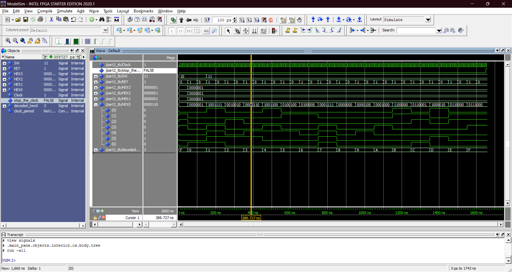
</p>

In the stimulus section of our testbench, we control the values of `SW` and `KEY`. The clock signal is automated, meaning it operates continuously based on the defined timing. The `stop_the_clock` signal determines when the simulation will halt. The outputs, including `HEX0`, `HEX1`, `HEX2`, `HEX3`, and `decoded_hex0`, are updated based on the applied stimulus. This setup allows us to observe how the counter responds to different inputs and conditions effectively. We can observe that the results from the testbench align perfectly with the actual board implementation. Specifically, when the `SW` input is set to "11" and the `KEY` input is pressed (set to '1'), the counter begins to increment as expected. Worthy of note is that, in the case where `SW = "11"` (the case where the counter is working), we alternate between `KEY = 0` and `KEY = 1` because keeping `KEY` constantly at `1` is like simulating a situation where you press the button and hold it down, rather than pressing and releasing it. The key needs to be pressed and released to trigger an increment, much like a real button press where you push, release to see the increment, then push again for the next one. We have expanded the `HEX0` signal bus to display each bit individually, enhancing clarity regarding their order in the simulation. This adjustment allows for a more straightforward interpretation of the output as we can see the bit arrangement from left to right, making it easier to analyze how the counter's value is represented on the 7-segment display. We observe that `HEX1`, `HEX2`, and `HEX3` remain in the `0` state because the counted value has not yet reached a magnitude sufficient to require more than one 7-segment display (i.e., the first hexadecimal digit). The counter is currently operating within a range that only utilizes `HEX0`, which reflects the lower four bits of the counted value. Thus, additional displays remain inactive until the counter surpasses the maximum value that can be represented by a single hexadecimal digit (i.e., 15 in decimal). Finally, recall that the 7-segment display bits are active when low. <br>


<p align="center">
  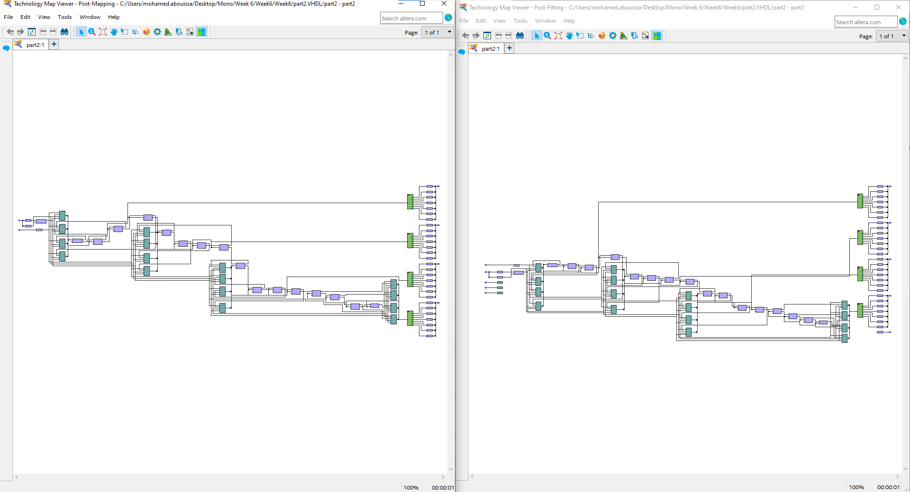 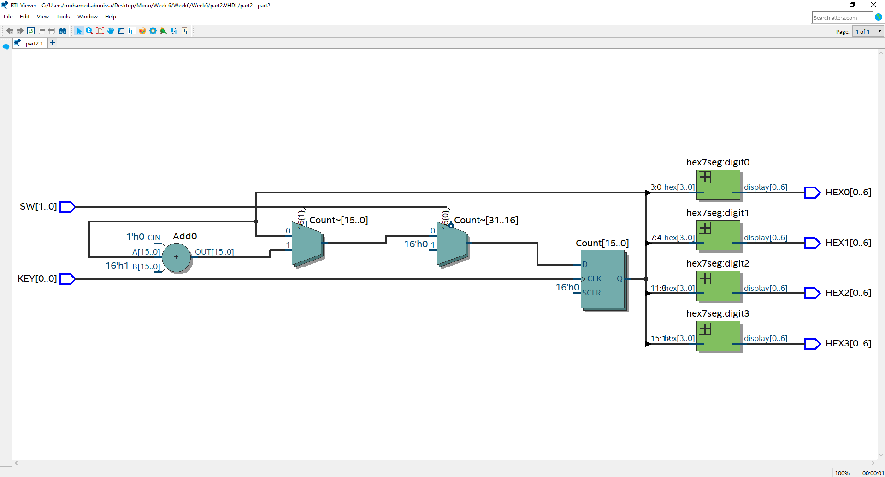 
</p>

 In the RTL viewer, we can identify several logic elements that represent different components of the design. The circular symbol with the "+" sign inside represents an adder. The triangular symbols indicate multiplexers. The rectangular element represents a register or counter. This element stores the value and is being used to maintain a count or store intermediate data. Overall, dispite doubling the amount of bits from the last part, the amount of logic elements required for the design actually decreased; a siginficant improvement from the scalability issue in the previous method.
<br>


</details>

## Conclusion

The T-type flip-flop is a powerful sequential element in digital circuits, best known for its toggle behavior. It plays a crucial role in constructing counters, frequency dividers, and similar systems that require flipping between binary states. Whether implemented in synchronous or asynchronous circuits, T flip-flops provide a reliable way to manage state transitions in digital electronics.

That said, when creating a counter, using a register is generally more efficient and straightforward compared to using T flip-flops. A register allows for easier implementation of operations like incrementing or decrementing a value by a specified amount (e.g., adding 1) with just a single VHDL expression (Q <= Q + 1). Registers are also clocked storage elements and are typically used in modern digital designs because they can be implemented using a few lines of code, and synthesis tools handle their implementation optimally. On the other hand, a T flip-flop-based counter, while possible, would require multiple T flip-flops, and managing carry logic between the bits becomes more complex. It’s also more difficult to scale to larger bit-width counters. T flip-flops are more suitable for simpler, small counters but tend to be less practical for larger designs due to the overhead of wiring multiple flip-flops and managing state transitions manually. Therefore, using a register is typically preferred for its simplicity, scalability, and ease of integration into modern digital systems.

Whether having more bits in a counter is better depends entirely on the requirements of the application. More bits in a counter increase its counting range, allowing it to count higher values before resetting. For example, an 8-bit counter can count from 0x00 to 0xFF in hexadecimal, which corresponds to 0 to 255 in decimal. Meanwhile, a 16-bit counter can count from 0x0000 to 0xFFFF, which corresponds to 0 to 65,535 in decimal. In hexadecimal, the digits 10-15 are represented by the letters A through F, so after 0x09, the count continues as 0x0A, 0x0B, 0x0C, up to 0x0F, before progressing to 0x10 and so on. This is beneficial in applications that need to handle large counts, such as timers or event counters. However, increasing the number of bits also means more hardware resources are needed, such as flip-flops or logic gates, which can result in higher power consumption and complexity. In asynchronous counters, more bits can introduce delays due to the ripple effect between flip-flops, while in synchronous counters, larger bit-widths may require careful timing analysis. On the other hand, more bits can improve timing accuracy for applications like frequency dividers or digital clocks. In summary, the number of bits in a counter should match the application's specific needs. If high capacity and precision are required, more bits are useful, but for simpler tasks, fewer bits may offer better efficiency in terms of speed and resource use.

## Resources

|1| Adding a file to a repository. (n.d.). GitHub Docs. Retrieved October 9, 2024, from <br> https://docs.github.com/en/repositories/working-with-files/managing-files/adding-a-file-to-a-repository  
|2| Ashenden, P. J. (2008). The designer’s guide to VHDL (3rd ed). Morgan Kaufmann Publishers.  
|3| Counters in Digital Logic. (2015, November 2). GeeksforGeeks. <br> https://www.geeksforgeeks.org/counters-in-digital-logic/  
|4| Electrodiction (Director). (2023a, August 5). REGISTERS || Digital Electronics [Video recording]. <br> https://www.youtube.com/watch?v=8UKdtiruQWE  
|5| Electrodiction (Director). (2023b, August 7). REGISTERS PART2 || Digital Electronics [Video recording]. <br> https://www.youtube.com/watch?v=6AeXZz5YHiE  
|6| Neso Academy (Director). (2015a, February 25). Introduction to T flip flop [Video recording]. <br> https://www.youtube.com/watch?v=wcfnEla_Y78  
|7| Neso Academy (Director). (2015b, March 12). Introduction to Counters | Important [Video recording]. <br> https://www.youtube.com/watch?v=iaIu5SYmWVM  
|8| Registers in Digital Electronics—Javatpoint. (n.d.). Www.Javatpoint.Com. Retrieved October 9, 2024, from <br> https://www.javatpoint.com/registers-in-digital-electronics  
|9| T Flip Flop. (2023, June 13). GeeksforGeeks. <br> https://www.geeksforgeeks.org/t-flip-flop/  
|10| VHDL Testbench Creation Using Perl. (n.d.). Retrieved September 21, 2024, from <br> https://www.doulos.com/knowhow/perl/vhdl-testbench-creation-using-perl/  
|11| What is Register in Digital Electronics ? (2023, August 13). GeeksforGeeks. <br> https://www.geeksforgeeks.org/what-is-register-digital-electronics/  

<br>

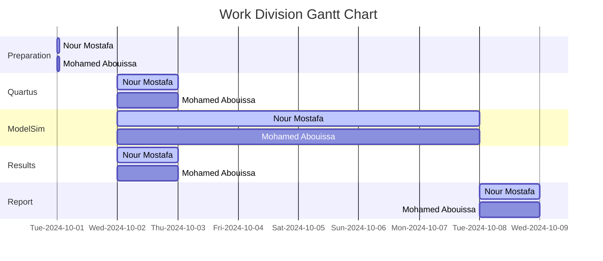

We extend our sincere appreciation to Eng. Umar Adeel for his insightful feedback which has significantly contributed to the successful completion of this experiment.

This publication adheres to all regulatory laws and guidelines established by the American University of Ras Al Khaimah (AURAK) regarding the dissemination of academic materials.


