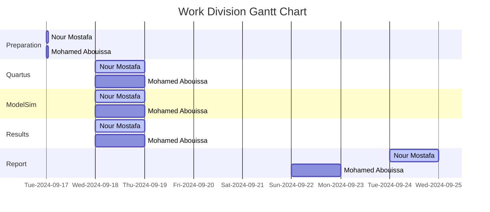

# <p align="center">Counters</p>

Do your magic :)

---

- what is the synchronous counter.
- what is the T-type flip-flops.
- for part two try to explain what the meaning of using regesters

## Part 1: Design and Implementation of an 4-bit and 8-bit Synchronous Counter

<details>
  <summary>VHDL Code Implementation on the FPGA Board (4-bit Synchronous Counter)</summary>
<br>

```VHDL
LIBRARY ieee;
USE ieee.std_logic_1164.all;

ENTITY part1_4bits IS 
   PORT ( SW   : IN  STD_LOGIC_VECTOR(1 DOWNTO 0);
          KEY  : IN  STD_LOGIC_VECTOR(0 DOWNTO 0);
          HEX0 : OUT STD_LOGIC_VECTOR(0 TO 6));
END part1_4bits;

ARCHITECTURE Behavior OF part1_4bits IS
   COMPONENT ToggleFF 
      PORT ( T, Clock, Resetn : IN  STD_LOGIC;
             Q                : OUT STD_LOGIC);
   END COMPONENT;
   COMPONENT hex7seg
      PORT ( hex     : IN  STD_LOGIC_VECTOR(3 DOWNTO 0);
             display : OUT STD_LOGIC_VECTOR(0 TO 6));
   END COMPONENT;
   SIGNAL Clock, Resetn : STD_LOGIC;
   SIGNAL Count, Enable : STD_LOGIC_VECTOR(3 DOWNTO 0);
BEGIN
   
   Clock <= KEY(0);
   Resetn <= SW(0);

   Enable(0) <= SW(1);
   TFF0: ToggleFF PORT MAP (Enable(0), Clock, Resetn, Count(0));
   Enable(1) <= Count(0) AND Enable(0);
   TFF1: ToggleFF PORT MAP (Enable(1), Clock, Resetn, Count(1));
   Enable(2) <= Count(1) AND Enable(1);
   TFF2: ToggleFF PORT MAP (Enable(2), Clock, Resetn, Count(2));
   Enable(3) <= Count(2) AND Enable(2);
   TFF3: ToggleFF PORT MAP (Enable(3), Clock, Resetn, Count(3));
   
   digit0: hex7seg PORT MAP (Count(3 DOWNTO 0), HEX0);
END Behavior;
         
LIBRARY ieee;
USE ieee.std_logic_1164.all;

ENTITY ToggleFF IS
   PORT ( T, Clock, Resetn : IN  STD_LOGIC;
          Q                : OUT STD_LOGIC);
END ToggleFF;

ARCHITECTURE Behavior OF ToggleFF IS
   SIGNAL T_out : STD_LOGIC;
BEGIN
   PROCESS (Clock)
   BEGIN
      IF (Clock'EVENT AND Clock = '1') THEN
         IF (Resetn = '0') THEN
            T_out <= '0';
         ELSIF (T = '1') THEN
            T_out <= NOT T_out;
         END IF;
      END IF;
   END PROCESS;
   Q <= T_out;
END Behavior;
         
LIBRARY ieee;
USE ieee.std_logic_1164.all;

ENTITY hex7seg IS
   PORT ( hex     : IN  STD_LOGIC_VECTOR(3 DOWNTO 0);
          display : OUT STD_LOGIC_VECTOR(0 TO 6));
END hex7seg;

ARCHITECTURE Behavior OF hex7seg IS
BEGIN
  
   PROCESS (hex)
   BEGIN
      CASE hex IS
         WHEN "0000" => display <= "0000001";
         WHEN "0001" => display <= "1001111";
         WHEN "0010" => display <= "0010010";
         WHEN "0011" => display <= "0000110";
         WHEN "0100" => display <= "1001100";
         WHEN "0101" => display <= "0100100";
         WHEN "0110" => display <= "0100000";
         WHEN "0111" => display <= "0001111";
         WHEN "1000" => display <= "0000000";
         WHEN "1001" => display <= "0000100";
         WHEN "1010" => display <= "0001000";
         WHEN "1011" => display <= "1100000";
         WHEN "1100" => display <= "0110001";
         WHEN "1101" => display <= "1000010";
         WHEN "1110" => display <= "0110000";
         WHEN OTHERS => display <= "0111000";
      END CASE;
   END PROCESS;
END Behavior;

```
</details>

<details>
  <summary>VHDL Code Implementation on the FPGA Board (8-bit Synchronous Counter)</summary>
<br>

```VHDL
LIBRARY ieee;
USE ieee.std_logic_1164.all;

ENTITY part1 IS 
   PORT ( SW         : IN  STD_LOGIC_VECTOR(1 DOWNTO 0);
          KEY        : IN  STD_LOGIC_VECTOR(0 DOWNTO 0);
          HEX1, HEX0 : OUT STD_LOGIC_VECTOR(0 TO 6));
END part1;

ARCHITECTURE Behavior OF part1 IS
   COMPONENT ToggleFF 
      PORT ( T, Clock, Resetn : IN  STD_LOGIC;
             Q                : OUT STD_LOGIC);
   END COMPONENT;
   COMPONENT hex7seg
      PORT ( hex     : IN  STD_LOGIC_VECTOR(3 DOWNTO 0);
             display : OUT STD_LOGIC_VECTOR(0 TO 6));
   END COMPONENT;
   SIGNAL Clock, Resetn : STD_LOGIC;
   SIGNAL Count, Enable : STD_LOGIC_VECTOR(7 DOWNTO 0);
BEGIN
   
   Clock <= KEY(0);
   Resetn <= SW(0);

   Enable(0) <= SW(1);
   TFF0: ToggleFF PORT MAP (Enable(0), Clock, Resetn, Count(0));
   Enable(1) <= Count(0) AND Enable(0);
   TFF1: ToggleFF PORT MAP (Enable(1), Clock, Resetn, Count(1));
   Enable(2) <= Count(1) AND Enable(1);
   TFF2: ToggleFF PORT MAP (Enable(2), Clock, Resetn, Count(2));
   Enable(3) <= Count(2) AND Enable(2);
   TFF3: ToggleFF PORT MAP (Enable(3), Clock, Resetn, Count(3));
   Enable(4) <= Count(3) AND Enable(3);
   TFF4: ToggleFF PORT MAP (Enable(4), Clock, Resetn, Count(4));
   Enable(5) <= Count(4) AND Enable(4);
   TFF5: ToggleFF PORT MAP (Enable(5), Clock, Resetn, Count(5));
   Enable(6) <= Count(5) AND Enable(5);
   TFF6: ToggleFF PORT MAP (Enable(6), Clock, Resetn, Count(6));
   Enable(7) <= Count(6) AND Enable(6);
   TFF7: ToggleFF PORT MAP (Enable(7), Clock, Resetn, Count(7));
   
   
   digit1: hex7seg PORT MAP (Count(7 DOWNTO 4), HEX1);
   digit0: hex7seg PORT MAP (Count(3 DOWNTO 0), HEX0);
END Behavior;
         
LIBRARY ieee;
USE ieee.std_logic_1164.all;

ENTITY ToggleFF IS
   PORT ( T, Clock, Resetn : IN  STD_LOGIC;
          Q                : OUT STD_LOGIC);
END ToggleFF;

ARCHITECTURE Behavior OF ToggleFF IS
   SIGNAL T_out : STD_LOGIC;
BEGIN
   PROCESS (Clock)
   BEGIN
      IF (Clock'EVENT AND Clock = '1') THEN
         IF (Resetn = '0') THEN
            T_out <= '0';
         ELSIF (T = '1') THEN
            T_out <= NOT T_out;
         END IF;
      END IF;
   END PROCESS;
   Q <= T_out;
END Behavior;
         
LIBRARY ieee;
USE ieee.std_logic_1164.all;

ENTITY hex7seg IS
   PORT ( hex     : IN  STD_LOGIC_VECTOR(3 DOWNTO 0);
          display : OUT STD_LOGIC_VECTOR(0 TO 6));
END hex7seg;

ARCHITECTURE Behavior OF hex7seg IS
BEGIN
  
   PROCESS (hex)
   BEGIN
      CASE hex IS
         WHEN "0000" => display <= "0000001";
         WHEN "0001" => display <= "1001111";
         WHEN "0010" => display <= "0010010";
         WHEN "0011" => display <= "0000110";
         WHEN "0100" => display <= "1001100";
         WHEN "0101" => display <= "0100100";
         WHEN "0110" => display <= "0100000";
         WHEN "0111" => display <= "0001111";
         WHEN "1000" => display <= "0000000";
         WHEN "1001" => display <= "0000100";
         WHEN "1010" => display <= "0001000";
         WHEN "1011" => display <= "1100000";
         WHEN "1100" => display <= "0110001";
         WHEN "1101" => display <= "1000010";
         WHEN "1110" => display <= "0110000";
         WHEN OTHERS => display <= "0111000";
      END CASE;
   END PROCESS;
END Behavior;
```
</details>

<details>
  <summary>VHDL LUT-Level Design and Gates-Level Design (4-bit Synchronous Counter)</summary>
<br>


</details>

<details>
  <summary>VHDL LUT-Level Design and Gates-Level Design (8-bit Synchronous Counter)</summary>
<br>


</details>

## Part 2: do your magic

do your magic


## Conclusion

Do your magic

## Resources

Do your magic

<br>



We extend our sincere appreciation to Eng. Umar Adeel for his insightful feedback which has significantly contributed to the successful completion of this experiment.

This publication adheres to all regulatory laws and guidelines established by the American University of Ras Al Khaimah (AURAK) regarding the dissemination of academic materials.


