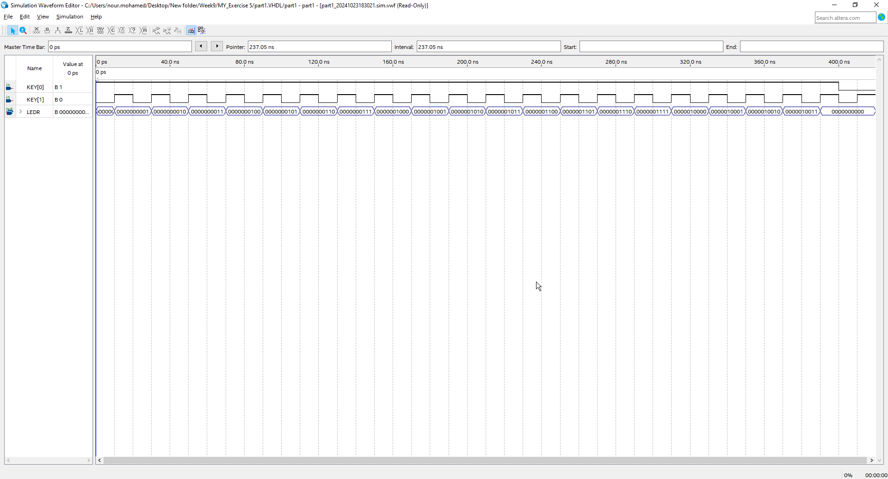
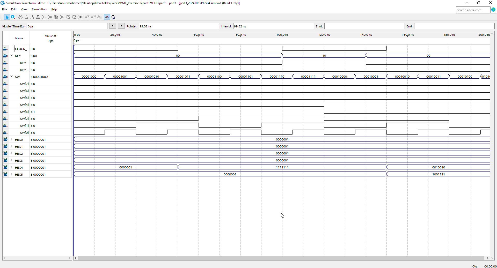
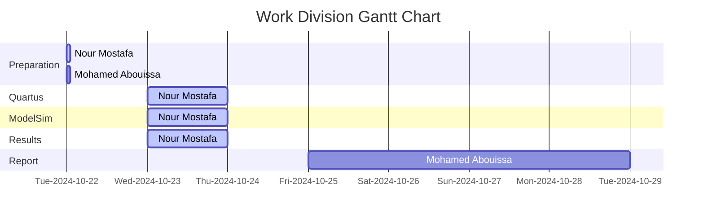

# <p align="center">Timers and Real-time Clock</p>

The objective of this lab was to design, simulate, and implement digital circuits on the DE2-115 Cyclone IV-E EP4CE115F29C7 Altera FPGA, specifically a modulo-k counter and a real-time clock. Additionally, we aim to study the use of clocks in timed circuits. This lab demonstrates foundational skills in digital circuit design, parameterized counting, and real-time display on FPGA hardware. 

---

The __modulo__ operation, commonly denoted as __mod__ or `%`, calculates the remainder of the division of one number by another. For example, in the expression 7 mod 3, the result is 1, because when 7 is divided by 3, it leaves a remainder of 1. Similarly, 10 mod 5 results in 0 since 10 is perfectly divisible by 5. 

A __modulo counter__ is a specialized digital counter that counts in a cyclic manner, resetting its count to zero after reaching a predefined maximum value, known as the __modulus__. This behavior is fundamental in various digital applications, where it is often necessary to cycle through a limited set of values. For instance, a modulo-10 counter counts from 0 to 9 before rolling over back to 0. The primary utility of such counters is to manage repetitive counting sequences, which can be crucial in applications like timers, clocks, and digital event counters. Modulo counters enable efficient resource usage, as they only require the bits necessary to represent the desired counting range. This compact design is particularly beneficial in digital circuits where space and power efficiency are critical. 


## Part 1: 8-bit Modulo-k Counter

The task involves creating a modulo-k counter by modifying the design of an 8-bit counter to incorporate an additional parameter (the value k, which defines the range of counting for the counter), allowing the counter to count from 0 to k−1. Specifically, the counter should be designed to roll over to 0 after reaching the maximum value of k−1. In this design, the pushbutton KEY0 will serve as an asynchronous reset, while KEY1 will function as a manual clock input. The current count value will be displayed on the red LEDR lights, and an additional output, named 'rollover,' will be indicated on one of the LEDR lights when the counter reaches k − 1. 

<details>
  <summary>VHDL Code Implementation on the FPGA Board</summary>
<br>

```VHDL
LIBRARY ieee;
USE ieee.std_logic_1164.all;

-- Define the entity for the main module, "part1," which serves as the top-level design.
ENTITY part1 IS
   PORT ( KEY  : IN  STD_LOGIC_VECTOR( 1 DOWNTO 0 ); -- KEY is a 2-bit input vector for clock and reset signals
          LEDR : OUT STD_LOGIC_VECTOR( 17 DOWNTO 0 ) ); -- LEDR is an 18-bit output vector to show the counter value and rollover signal
END ENTITY;

-- Begin architecture definition for "part1" with an RTL (Register Transfer Level) style.
ARCHITECTURE rtl OF part1 IS
   -- Declare a component named "modulo_counter" to be instantiated within "part1".
   -- This component will have parameters for bit width (n) and the modulo value (k).
   COMPONENT modulo_counter IS
      GENERIC ( n : NATURAL := 4; k : INTEGER := 15 );
      -- Define the ports for "modulo_counter": 
      -- clock and reset_n are inputs, Q outputs the counter value, 
      -- and rollover is set high when the counter reaches its maximum value (k-1).
      PORT ( clock    : IN  STD_LOGIC;
             reset_n  : IN  STD_LOGIC;
             Q        : OUT STD_LOGIC_VECTOR(n-1 DOWNTO 0);
             rollover : OUT STD_LOGIC );
   END COMPONENT;
BEGIN
   -- Instantiate "modulo_counter" component as "my_counter".
   my_counter: modulo_counter
      -- Map the GENERIC parameters: set n to 8 (8-bit counter) and k to 20 (count from 0 to 19).
      GENERIC MAP ( n => 8, k => 20 )
      -- Map the ports of the component to the top-level entity ports.
      -- Connect KEY(1) to the clock input and KEY(0) to reset_n.
      -- Connect the 8-bit counter output Q to LEDR bits [7:0].
      -- The rollover signal connects to LEDR(17) to indicate the counter has reset.
      PORT MAP ( clock => KEY(1), 
		           reset_n => KEY(0), 
					  Q => LEDR(7 DOWNTO 0), 
                 rollover => LEDR(17) );
   LEDR (16 DOWNTO 8) <= "000000000"; -- Set the unused bits of LEDR (16 to 8) to '0' to prevent any floating values.
END rtl;

-- Import the IEEE library again for the "modulo_counter" component.
LIBRARY ieee;
USE ieee.std_logic_1164.all;
-- Use the std_logic_unsigned package to enable unsigned arithmetic operations on STD_LOGIC_VECTOR.
USE ieee.std_logic_unsigned.all;

-- Define the entity "modulo_counter," which performs counting with parameterized width and modulus.
ENTITY modulo_counter is
   -- Declare generic parameters for flexibility:
   -- "n" represents the bit width of the counter, defaulted to 4 bits.
   -- "k" is the maximum count value, defaulted to 15.
   GENERIC (n : NATURAL := 4; k : INTEGER := 15);
   -- Define ports for the counter:
   -- "clock" for counting, "reset_n" as an asynchronous active-low reset,
   -- "Q" outputs the current counter value, and "rollover" signals the reset condition.
   PORT ( clock    : IN  STD_LOGIC;
          reset_n  : IN  STD_LOGIC;
          Q        : OUT STD_LOGIC_VECTOR(n-1 DOWNTO 0);
          rollover : OUT STD_LOGIC );
END ENTITY;

-- Begin architecture "core" for "modulo_counter."
ARCHITECTURE core OF modulo_counter IS
   -- Declare "counter" as an internal signal to hold the current count value,
   -- with a bit width of "n" to match the counter size.
   SIGNAL counter : STD_LOGIC_VECTOR(n-1 DOWNTO 0);
BEGIN
   -- Define a process that triggers on changes to "clock" or "reset_n."
   PROCESS(clock, reset_n)
   BEGIN
      -- Check if "reset_n" is active low ('0'), indicating a reset is requested.
      IF (reset_n = '0') THEN
         -- If reset, set "counter" to all zeros to start counting from 0.
         counter <= (OTHERS => '0');
      -- Otherwise, check for a rising edge on "clock" to perform counting.
      ELSIF ((clock'event) AND (clock = '1')) THEN
         -- If the counter has reached "k-1," reset it to zero to implement modulo-k counting.
         IF (counter = k-1) THEN
            counter <= (OTHERS => '0');
         -- Otherwise, increment the counter by 1.
         ELSE
            counter <= counter + 1;
         END IF;
      END IF;
   END PROCESS;
   
   -- Output the current value of "counter" to "Q."
   Q <= counter;   
   -- Set "rollover" to '1' when "counter" equals "k-1" (indicating rollover).
   -- Set "rollover" to '0' for all other values.
   rollover <= '1' WHEN (counter = k-1) ELSE '0';
END core;
```

<p align="center">
  
</p>

// anchor

</details>


<details>
  <summary>Waveform Simulation</summary>
	
<br>

<p align="center">
  
</p>

// anchor
<br>
	
</details>


## Part 2: Digital Stopwatch on 7-Segment Displays

In Part II of this lab exercise, the objective is to design and implement a digital real-time clock using a DE-series FPGA board, providing a dynamic display of time down to hundredths of a second. The time display is structured across `seven-segment displays`, where minutes are shown on `HEX5 and HEX4`, seconds on `HEX3 and HEX2`, and hundredths of a second on `HEX1 and HEX0`. The design leverages modular counters that count within specific ranges and reset accordingly, allowing the circuit to track time efficiently and accurately. Each counter stage representing hundredths, seconds, and minutes advances sequentially, with rollovers triggering the next stage’s increment. This design structure simplifies the clock's timing functionality and exemplifies the modular nature of digital timekeeping within FPGA environments.

The clock includes interactive features for added flexibility: the user can preset the minutes using switch inputs `(SW7–0)` in combination with the `KEY1` button, which allows starting from any defined minute count. Additionally, the clock is equipped with a pause feature, activated by pressing `KEY0`, that temporarily halts the time progression and resumes it upon release. This feature makes it possible to stop and restart the clock without losing the current time display. Through this hands-on implementation, we gain insight into the synchronization of timed circuits on FPGAs, as well as practical experience in utilizing counters and rollovers to build a scalable, real-time application.

<details>
<summary>VHDL Code Implementation on the FPGA Board</summary>
<br>

``` VHDL
LIBRARY ieee;
USE ieee.std_logic_1164.all;

ENTITY part2 is
   PORT ( CLOCK_50 : IN STD_LOGIC;
          SW       : IN STD_LOGIC_VECTOR(7 DOWNTO 0);
          KEY      : IN STD_LOGIC_VECTOR(1 DOWNTO 0);
          HEX5, HEX4, HEX3, HEX2, HEX1, HEX0 : OUT STD_LOGIC_VECTOR(0 to 6) );
END ENTITY;

ARCHITECTURE Behavior OF part2 IS
   COMPONENT modulo_counter_er IS
      GENERIC ( n : NATURAL  := 4; k : INTEGER := 15 );
		-- n is a generic parameter of type NATURAL, which is a non-negative integer. It specifies the bit-width of the counter.
		--  For instance, if n = 4, the counter has a 4-bit output, allowing it to count from 0 to 15 in binary.
		
		-- k is a generic parameter of type INTEGER. It defines the maximum count value or limit of the counter before it rolls over to zero.
		-- By setting k, the counter can be customized to roll over at different counts.
		-- For example, if k = 10, the counter will reset once it reaches 9,
      PORT ( clock, reset_n  : IN  STD_LOGIC;
             enable          : IN  STD_LOGIC;
             Q               : OUT STD_LOGIC_VECTOR(n-1 DOWNTO 0);
             rollover        : OUT STD_LOGIC );
   END COMPONENT;

   COMPONENT modulo_counter_sler IS
      GENERIC ( n : NATURAL     := 4; k : INTEGER := 15 );
      PORT ( clock, reset, load : IN  STD_LOGIC;
             enable             : IN  STD_LOGIC;
             data               : IN  STD_LOGIC_VECTOR(n-1 DOWNTO 0);
             Q                  : OUT STD_LOGIC_VECTOR(n-1 DOWNTO 0);
             rollover           : OUT STD_LOGIC );
      END COMPONENT;
   
   COMPONENT bcd7seg IS       
      PORT ( bcd      : IN  STD_LOGIC_VECTOR(3 DOWNTO 0);
             display  : OUT STD_LOGIC_VECTOR(0 TO 6) );
      END COMPONENT;

   SIGNAL one_Hundredth : STD_LOGIC;
   SIGNAL H1, H0 : STD_LOGIC_VECTOR(3 DOWNTO 0);  -- HH
   SIGNAL S1, S0 : STD_LOGIC_VECTOR(3 DOWNTO 0);  -- SS
   SIGNAL M1, M0 : STD_LOGIC_VECTOR(3 DOWNTO 0);  -- MM
   SIGNAL roll_H0, roll_H1, roll_S0, roll_S1, roll_M0, roll_M1 : STD_LOGIC;
   SIGNAL en_H0, en_H1, en_S0, en_S1, en_M0, en_M1 : STD_LOGIC;
	
BEGIN
					 
	slow_clock: modulo_counter_er
      GENERIC MAP ( n => 27, k => 500000) -- Set 'n' to 27 bits, defining a large enough range for high-frequency counting; 
                                          -- 'k' is set to 500,000, so the counter will reset after reaching this count.
      PORT MAP( clock => CLOCK_50,        -- Connects the system clock signal (CLOCK_50) to the clock input of the counter.
                reset_n => KEY(1),        -- Connects KEY(1) to the reset_n input for asynchronous reset, used to reset the counter.
                enable => KEY(0),         -- Connects KEY(0) to the enable input, which controls when the counter is active.
                rollover => one_Hundredth ); -- Outputs the rollover signal to 'one_Hundredth', toggling when the counter reaches k-1.


   en_H0 <= one_Hundredth; -- Enables the next counter stage (H0) once every hundredth of a second, based on the 'one_Hundredth' signal from slow_clock.
   U_H0: modulo_counter_er -- Instantiates a modulo-10 counter component named 'U_H0', used to count hundredths of a second.
      GENERIC MAP ( n => 4, k => 10 ) -- Sets 'n' to 4 bits, allowing it to count from 0 to 9 (mod-10), with 'k' set to 10, so it rolls over after reaching 9.
      PORT MAP (CLOCK_50,             -- Connects the main system clock (CLOCK_50) to the counter.
                KEY(1),               -- Connects KEY(1) to the reset_n input, allowing an asynchronous reset for the counter.
                en_H0,                -- Connects 'en_H0' as the enable signal, which allows counting to occur only when en_H0 is high.
                H0,                   -- Outputs the current count value to 'H0', representing the lower digit of hundredths of a second.
                roll_H0);             -- Outputs the rollover signal to 'roll_H0', which toggles high when the counter reaches its max value (k-1) and resets.


   en_H1 <= one_Hundredth AND roll_H0;
   U_H1: modulo_counter_er
      GENERIC MAP ( n => 4, k => 10 )
      PORT MAP (CLOCK_50, KEY(1), en_H1, H1, roll_H1);   

   en_S0 <= en_H1 AND roll_H1;
   U_S0: modulo_counter_er
      GENERIC MAP ( n => 4, k => 10 )
      PORT MAP (CLOCK_50, KEY(1), en_S0, S0, roll_S0);   

   en_S1 <= en_S0 AND roll_S0;
   U_S1: modulo_counter_er
      GENERIC MAP ( n => 4, k => 6 )
      PORT MAP (CLOCK_50, KEY(1), en_S1, S1, roll_S1);   

   en_M0 <= (en_S1 AND roll_S1) OR (NOT KEY(1));
   U_M0: modulo_counter_sler
      GENERIC MAP ( 4, 10 )
      PORT MAP (CLOCK_50, '0', NOT KEY(1), en_M0, SW(3 DOWNTO 0), M0, roll_M0);

   en_M1 <= (en_M0 AND roll_M0) OR (NOT KEY(1));
   U_M1: modulo_counter_sler
      GENERIC MAP ( 4, 6 )
      PORT MAP (CLOCK_50, '0', NOT KEY(1), en_M1, SW(7 DOWNTO 4), M1, roll_M1);
		
   -- drive the displays
   digit5: bcd7seg PORT MAP (M1, HEX5);
   digit4: bcd7seg PORT MAP (M0, HEX4);
   digit3: bcd7seg PORT MAP (S1, HEX3);
   digit2: bcd7seg PORT MAP (S0, HEX2);
   digit1: bcd7seg PORT MAP (H1, HEX1);
   digit0: bcd7seg PORT MAP (H0, HEX0);
      
END Behavior;

LIBRARY ieee;
USE ieee.std_logic_1164.all;
USE ieee.std_logic_arith.all;
USE ieee.std_logic_signed.all;

ENTITY modulo_counter_er IS
   GENERIC ( n : NATURAL := 4; k : INTEGER := 15 );
   PORT ( clock, reset_n : IN  STD_LOGIC;
          enable         : IN  STD_LOGIC;
          Q              : OUT STD_LOGIC_VECTOR(n-1 DOWNTO 0);
          rollover       : OUT STD_LOGIC );
END ENTITY;

ARCHITECTURE Behavior OF modulo_counter_er IS
   SIGNAL counter : STD_LOGIC_VECTOR(n-1 DOWNTO 0);
BEGIN
   PROCESS(clock, reset_n)
   BEGIN
      IF (reset_n = '0') THEN
         counter <= (OTHERS => '0');
      ELSIF ((clock'event) AND (clock = '1')) THEN
         IF (enable = '1') THEN
            IF (counter = CONV_STD_LOGIC_VECTOR(k-1, n)) THEN
               counter <= (OTHERS => '0');
            ELSE
               counter <= counter + 1;
            END IF;
         END IF;
      END IF;
   END PROCESS;
   Q <= counter;
   rollover <= '1' WHEN (counter = CONV_STD_LOGIC_VECTOR(k-1, n)) ELSE '0';   
END Behavior;


LIBRARY ieee;
USE ieee.std_logic_1164.all;
USE ieee.std_logic_arith.all;
USE ieee.std_logic_signed.all;

ENTITY modulo_counter_sler IS
   GENERIC ( n : NATURAL := 4; k : INTEGER := 15 );
   PORT ( clock, reset, load : IN  STD_LOGIC;
          enable             : IN  STD_LOGIC;
          data               : IN  STD_LOGIC_VECTOR(n-1 DOWNTO 0);
          Q                  : OUT STD_LOGIC_VECTOR(n-1 DOWNTO 0);
          rollover           : OUT STD_LOGIC );
END ENTITY;

ARCHITECTURE Behavior OF modulo_counter_sler IS
   SIGNAL counter : STD_LOGIC_VECTOR(n-1 DOWNTO 0);
BEGIN
   PROCESS(clock, reset, load, enable)
   BEGIN
      IF ((clock'event) AND (clock = '1')) THEN
         IF (enable = '1') THEN
            IF (reset = '1') THEN
               counter <= (OTHERS => '0');
            ELSIF (load = '1') THEN
               counter <= data;
            ELSIF (counter = CONV_STD_LOGIC_VECTOR(k-1, n)) THEN
               counter <= (OTHERS => '0');
            ELSE
               counter <= counter + 1;
            END IF;
         END IF;
      END IF;
   END PROCESS;
   Q <= counter;
   rollover <= '1' WHEN (counter = CONV_STD_LOGIC_VECTOR(k-1, n)) ELSE '0';   
END Behavior;


LIBRARY ieee;
USE ieee.std_logic_1164.all;

ENTITY bcd7seg IS
   PORT ( bcd     : IN  STD_LOGIC_VECTOR(3 DOWNTO 0);
          display : OUT STD_LOGIC_VECTOR(0 TO 6) );
END ENTITY;

ARCHITECTURE Behavior OF bcd7seg IS
   --       0  
   --      ---  
   --     |   |
   --    5|   |1
   --     | 6 |
   --      ---  
   --     |   |
   --    4|   |2
   --     |   |
   --      ---  
   --       3  
    
BEGIN
   display <= "0000001" WHEN (bcd = "0000") ELSE
              "1001111" WHEN (bcd = "0001") ELSE
              "0010010" WHEN (bcd = "0010") ELSE
              "0000110" WHEN (bcd = "0011") ELSE
              "1001100" WHEN (bcd = "0100") ELSE
              "0100100" WHEN (bcd = "0101") ELSE
              "1100000" WHEN (bcd = "0110") ELSE
              "0001111" WHEN (bcd = "0111") ELSE
              "0000000" WHEN (bcd = "1000") ELSE
              "0001100" WHEN (bcd = "1001") ELSE
              "1111111";
END Behavior;         
```

<p align="center">
  
  
  
</p>


// anchor
</details>

<details>
  <summary>Waveform Simulation</summary>
	<br>

<p align="center">
  
</p>

// anchor

<br>


</details>

## Conclusion

In this lab, we successfully designed and implemented an 8-bit modulo-k counter and a digital stopwatch using VHDL on an FPGA board. The modulo-k counter demonstrated effective counting capabilities, resetting after reaching the specified maximum value, while the real-time clock showcased the ability to accurately display time using 7-segment displays. Through these implementations, we gained practical experience in digital circuit design, parameterized counting, and utilizing clocks in timed circuits, reinforcing our understanding of fundamental concepts in digital electronics and their applications in real-world scenarios. 

## Resources

|1| Ashenden, P. J. (2008). The designer’s guide to VHDL (3rd ed). Morgan Kaufmann Publishers.  

<br>



We extend our sincere appreciation to Eng. Umar Adeel for his insightful feedback which has significantly contributed to the successful completion of this experiment.

This publication adheres to all regulatory laws and guidelines established by the American University of Ras Al Khaimah (AURAK) regarding the dissemination of academic materials.


