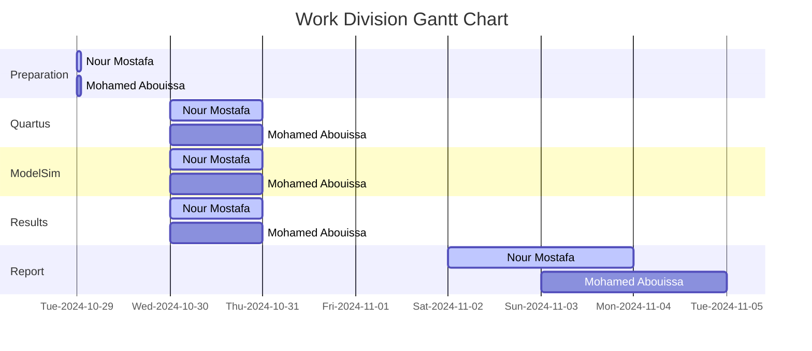

# <p align="center">Adders and Subtractors</p>

The purpose of this experiment is to design, implement, and verify arithmetic circuits capable of performing addition and subtraction of binary numbers, utilizing VHDL and the Intel DE2-115 Cyclone IV-E EP4CE115F29C7 Altera FPGA board.

---

An __accumulator__ circuit is a digital circuit designed to add a sequence of input values over time, storing (or "accumulating") the result in a register or memory. In its simplest form, an accumulator takes an initial value (often zero) and sequentially adds input values to it, updating the stored result after each addition. Accumulators are commonly found in digital systems like processors, where they are used in arithmetic operations, and in signal processing applications, where they help sum input signals over time. An accumulator typically consists of __an adder__ which is a digital component that performs binary addition on two values, __a register__ which is a memory component that stores the accumulated sum. It updates its value on each clock cycle or accumulation event, and control signals like `enable` and `reset` that manage when accumulation should occur and when the stored result should reset. The basic operation is that the current value of the register is fed into one input of the adder, while the new input data (or value to be accumulated) is fed into the other input. The adder output, which is the sum of the register and input values, is stored back in the register. Finally, this process repeats on each clock cycle (or as triggered), continuously adding the input values and updating the register with the latest accumulated sum.

## Procedure & Implementation

In *Part 1*, we design an 8-bit accumulator. An accumulator combines an arithmetic logic unit (ALU) function with storage capabilities, allowing it to retain and update a cumulative result of additions over time. Specifically, each cycle adds a new 8-bit value to the current sum stored in the accumulator. This design includes a carry[^1] output for the adder, which signals when the sum exceeds the maximum value representable by 8 bits, and an overflow[^2] output to indicate arithmetic overflow, helping manage conditions where the result exceeds the accumulator’s signed representation limits.

[^1]: The carry-out signal indicates when an arithmetic operation has exceeded the bit-width of the accumulator, specifically when a sum generates a carry beyond the most significant bit. This signal is essential in digital circuits that handle multi-bit numbers, as it helps determine whether additional adjustments are needed, especially when performing operations on extended bit-width values or chaining operations across multiple accumulators.
[^2]: The overflow signal is crucial when dealing with signed numbers (in 2’s complement format). It indicates when an arithmetic result has exceeded the range of representable values (positive or negative) within the accumulator’s bit-width, resulting in an incorrect or wrapped-around value. For example, adding two large positive numbers might yield a negative result if overflow occurs. This detection is particularly relevant in applications where accurate numeric representation is critical.

As shown in [Figure 1](Photos/Accumulator.png), the internal structure of the accumulator consists of an 8-bit adder, a register for holding the accumulated sum, and D flip-flops for storing the carry and overflow signals. The 8-bit input `A`, connected to switches `SW 0 to 7`, provides the value to be added in each cycle. The accumulated sum `S` is stored in a register and fed back into the adder, enabling continuous addition operations. Each clock cycle triggered manually using `KEY1`, updates both the register and D flip-flops, ensuring that the carry and overflow flags reflect the current arithmetic status. An active-low asynchronous reset, controlled by `KEY0`, clears all values in the accumulator when needed.

The output of the accumulator is displayed using LED indicators and 7-segment displays for easy monitoring. The sum from the adder is shown on the red lights `LEDR 0 to 7`, while the registered carry and overflow signals are displayed on `LEDR 8 and LEDR 9`, respectively. Additionally, the registered values of `A` and `S` are displayed as hexadecimal numbers on the 7-segment displays `HEX 2 to 3` and `HEX 0 to 1`, providing a complete view of the current state of the accumulator.

In *Part 2*, the accumulator circuit is extended to support both addition and subtraction operations by introducing a control input, referred to as `add_sub`  connected to SW 9. This input determines the operation executed by the circuit: when `add_sub` is set to 1, the circuit will perform subtraction, calculating the result as \( S - A \). Conversely, when `add_sub` is set to 0, the circuit will perform addition, computing the result as \( S + A \) just like in *Part 1*. This extension allows for more versatile arithmetic operations within the accumulator, accommodating a wider range of applications and functionalities in digital circuit design. The code we will provide is for part 2 as it achieves both tasks together.

<details>
  <summary>VHDL Code</summary>
<br>

```VHDL
-- Accumulator circuit with overflow detection
-- Registers are included for all inputs and outputs.
-- inputs:   SW7-0 = A
--           SW9 = Add_Sub (add when 0, subtract when 1)
--           KEY0 = active-low asynchronous reset
--           KEY1 = manual clock (the key must keep getting pressed)
-- outputs:  LEDR7-0 shows S in binary form
--           LEDR8 shows carry out
--           LEDR9 shows overflow
--           HEX3-2 shows input A
--           HEX1-0 shows the output sum

-- A is the input, S is the output of the sum or subtraction 

Library ieee;
USE ieee.std_logic_1164.all;
USE ieee.std_logic_arith.all;
USE ieee.std_logic_signed.all;

ENTITY part2 IS
   PORT ( KEY   : IN  STD_LOGIC_VECTOR(1 DOWNTO 0);
          SW    : IN  STD_LOGIC_VECTOR(9 DOWNTO 0);
          LEDR  : OUT STD_LOGIC_VECTOR(9 DOWNTO 0);
          HEX3, HEX2, HEX1, HEX0 : OUT STD_LOGIC_VECTOR(0 TO 6) );
END ENTITY part2;

ARCHITECTURE Behavior OF part2 IS
   COMPONENT hex7seg IS -- using a component of the "hex7seg" entity which is defined down (below the top level architecture)
   PORT ( hex      : IN  STD_LOGIC_VECTOR(3 DOWNTO 0);
          display  : OUT STD_LOGIC_VECTOR(0 TO 6) );
   END component;

   COMPONENT regn IS -- using a component of the "regn" entity which is defined down (below the top level architecture)
   GENERIC ( n : NATURAL := 8 );
   PORT ( R             : IN  STD_LOGIC_VECTOR(n-1 DOWNTO 0);
          Clock, Resetn : IN STD_LOGIC;
          Q             : OUT STD_LOGIC_VECTOR(n-1 DOWNTO 0) );
   END COMPONENT;
   
	-- These signals are used to manage data, control flags, and intermediate results in a design.
   SIGNAL A, A_reg, S_reg, Add_Sub_vector : STD_LOGIC_VECTOR(7 DOWNTO 0); -- Declares four signals as 8-bit wide vectors
   SIGNAL S : STD_LOGIC_VECTOR(8 DOWNTO 0); -- Declares the signal S as a 9-bit wide vector.
	-- Typically used for results of operations where an extra bit is needed to accommodate carry or overflow, such as the result of an addition where the final bit captures the carry-out.
   SIGNAL carry, carry_reg : STD_LOGIC_VECTOR(0 TO 0); -- Declares two single-bit signals
	-- carry: Represents a carry-out from an arithmetic operation.
	-- carry_reg: A stored version of carry, preserving it for synchronous use.
   SIGNAL Clock, Resetn, Add_Sub : STD_LOGIC; -- Declares three single-bit signals
	-- Clock: The clock signal that controls synchronous operations in the circuit.
	-- Resetn: An asynchronous reset signal, active low ('0' resets the circuit).
	-- Add_Sub: A control signal that specifies the operation type, where '0' indicates addition and '1' indicates subtraction.
   SIGNAL overflow, overflow_reg : STD_LOGIC_VECTOR (0 TO 0); -- Declares two single-bit signals
	-- overflow: Indicates whether an overflow condition has occurred in an arithmetic operation.
	-- overflow_reg: A registered or stored version of overflow, which can be used to retain the overflow status for synchronous use.
	
BEGIN
	-- Assigning specific values to various signals, linking them to inputs from KEY and SW from the FPGA 
   Resetn <= KEY(0);
   Clock <= KEY(1);
   A <= SW(7 DOWNTO 0);
   Add_Sub <= SW(9);
	Add_Sub_vector <= (OTHERS => ADD_Sub);

	-- Implementing a basic arithmetic unit with only adding and subtracting functions.
	
   -- instantiate module regn (R, Clock, Resetn, Q);
   U_A : regn PORT MAP (A, Clock, Resetn, A_reg); -- The regn module takes A as the input (R in the module definition) and, on a clock pulse, stores its value in A_reg while respecting the Resetn signal. 

   S <= ('0' & S_reg) + ((A_reg XOR Add_Sub_vector) + Add_Sub); 
	-- ('0' & S_reg): Extends S_reg by adding a leading '0' bit, creating a 9-bit vector for arithmetic operations to handle overflow/carry.
	-- (A_reg XOR Add_Sub_vector) + Add_Sub: Performs the arithmetic operation by using Add_Sub as a control bit. XOR-ing with Add_Sub_vector enables switching between addition (when Add_Sub is 0) and two’s complement subtraction (when Add_Sub is 1).
	-- The sum of these terms is assigned to S, resulting in a 9-bit output where the 8 LSBs hold the result, and the MSB (S(8)) holds any carry.
	
	carry(0) <= S(8); -- Assigns the carry-out bit from S to the carry(0) signal.
	-- carry(0) will indicate whether an overflow occurred in the addition/subtraction operation by holding the MSB of S.
   
	-- Display the adder outputs
   LEDR(7 DOWNTO 0) <= S(7 DOWNTO 0); -- Maps the result of the arithmetic operation (S) to LEDR(7:0), allowing the sum or difference to be viewed on the board’s LEDs.

   -- instantiate module regn (R, Clock, Resetn, Q);
   U_S : regn PORT MAP (S(7 DOWNTO 0), Clock, Resetn, S_reg); -- On each clock pulse, stores the 8-bit result in S_reg, allowing S_reg to hold the stabilized value of S for use in further logic or display.

   U_carry : regn GENERIC MAP (n => 1) -- Creates a 1-bit register (U_carry) to hold the carry-out bit carry, allowing the carry status to be retained and used later.
                  PORT MAP (carry, Clock, Resetn, carry_reg);

   -- check for overflow
   overflow(0) <= ((Add_Sub XOR A_reg(7)) XNOR S_reg(7)) AND (A_reg(7) XOR Add_Sub XOR S(7));
	-- evaluates whether an overflow condition occurred by examining the signs of the operands and the result.
	-- If the sign bits of A_reg and S_reg are mismatched after an operation (when they should logically align), overflow has occurred.
	
   U_overflow : regn GENERIC MAP (n => 1) -- Instantiates a 1-bit regn module labeled U_overflow to register the overflow signal.
                     PORT MAP (overflow, Clock, Resetn, overflow_reg); -- Stores the result of the overflow calculation in overflow_reg, allowing it to be retained for display or further use.
							
   LEDR(9) <= overflow_reg(0); -- Displays the overflow status on LED
   LEDR(8) <= carry_reg(0); -- Displays the carry status on LED 8
   
   -- drive the displays through a 7-seg decoders
   digit_3: hex7seg PORT MAP(A_reg(7 DOWNTO 4), HEX3); -- Converts the 4-bit upper portion of A_reg into a 7-segment format for display on HEX3.
   digit_2: hex7seg PORT MAP(A_reg(3 DOWNTO 0), HEX2); -- Uses the hex7seg module to convert the lower 4 bits of A_reg into a display format for the 7-segment display HEX2.
   digit_1: hex7seg PORT MAP(S_reg(7 DOWNTO 4), HEX1); -- Converts the upper portion of S_reg for display on HEX1, showing the high 4 bits of the arithmetic result.
   digit_0: hex7seg PORT MAP(S_reg(3 DOWNTO 0), HEX0); -- Converts the low 4 bits of S_reg into a 7-segment display format for HEX0.
END Behavior;

----------------------------------------------------------------------------------------------------------------------------------------------------------------

-- Defining an n-bit register with an asynchronous, active-low reset (Resetn). The register updates its output Q 
-- to match the input R on the rising edge of the clock, provided the reset is not active. If Resetn is low (0), 
-- the register contents are cleared, regardless of the clock signal.
               
LIBRARY ieee;
USE ieee.std_logic_1164.all;

-- Declares the regn entity, which defines the interface for this register module.
ENTITY regn IS
   GENERIC ( n : NATURAL := 8 ); -- Defines a generic parameter n, which specifies the width of the register. 
	-- This allows flexibility in choosing the number of bits, defaulting to 8 bits.
   PORT ( R             : IN  STD_LOGIC_VECTOR(n-1 DOWNTO 0); -- R is an n-bit input vector that represents the data to be loaded into the register.
          Clock, Resetn : IN  STD_LOGIC; -- Clock is a single-bit input signal, used to synchronize data loading. Resetn is a single-bit asynchronous reset input.
          Q             : OUT STD_LOGIC_VECTOR(n-1 DOWNTO 0) ); -- Q is an n-bit output vector representing the current contents of the register.

END ENTITY regn;

ARCHITECTURE Behavior OF regn IS -- defines the internal behavior and signal assignments for the entity
BEGIN
   PROCESS (Clock, Resetn) -- Defines a process that is sensitive to changes on Clock and Resetn. 
	-- This process block will execute whenever there is a change on either of these signals, making it suitable for synchronous logic with an asynchronous reset.
   BEGIN
      IF (Resetn = '0') THEN -- If Resetn is 0, it sets all bits in Q to '0', effectively clearing the register asynchronously.
         Q <= (OTHERS => '0'); -- assigns 0 to all bits in the vector Q, regardless of the width specified by n.
      ELSIF (rising_edge(Clock)) THEN -- If Resetn is not 0, it checks for a rising edge on Clock (meaning a transition from 0 to 1)
         Q <= R; -- loads the input vector R into Q on the rising edge of Clock.       
      END IF;
   END PROCESS;
END Behavior;

----------------------------------------------------------------------------------------------------------------------------------------------------------------

-- Describing the functionality of a 7-segment display decoder, which converts a 4-bit binary input 
-- representing hexadecimal values (0 to F) into the corresponding signals to display each character on a 
-- 7-segment display.

LIBRARY ieee;
USE ieee.std_logic_1164.all;

ENTITY hex7seg IS
   PORT ( hex      : IN  STD_LOGIC_VECTOR(3 DOWNTO 0);
          display  : OUT STD_LOGIC_VECTOR(0 TO 6) );

END ENTITY hex7seg;

ARCHITECTURE Behavior OF hex7seg IS
   --       0  
   --      ---  
   --     |   |
   --    5|   |1
   --     | 6 |
   --      ---  
   --     |   |
   --    4|   |2
   --     |   |
   --      ---  
   --       3  
BEGIN
   display <= "0000001" WHEN (hex = "0000") ELSE  -- Display '0'
              "1001111" WHEN (hex = "0001") ELSE  -- Display '1'
              "0010010" WHEN (hex = "0010") ELSE  -- Display '2'
              "0000110" WHEN (hex = "0011") ELSE  -- Display '3'
              "1001100" WHEN (hex = "0100") ELSE  -- Display '4'
              "0100100" WHEN (hex = "0101") ELSE  -- Display '5'
              "0100000" WHEN (hex = "0110") ELSE  -- Display '6'
              "0001111" WHEN (hex = "0111") ELSE  -- Display '7'
              "0000000" WHEN (hex = "1000") ELSE  -- Display '8'
              "0000100" WHEN (hex = "1001") ELSE  -- Display '9'
              "0001000" WHEN (hex = "1010") ELSE  -- Display 'A'
              "1100000" WHEN (hex = "1011") ELSE  -- Display 'B'
              "0110001" WHEN (hex = "1100") ELSE  -- Display 'C'
              "1000010" WHEN (hex = "1101") ELSE  -- Display 'D'
              "0110000" WHEN (hex = "1110") ELSE  -- Display 'E'
              "0111000";                          -- Display 'F'
END Behavior;

```

</details>


<details>
  <summary>Practical & Simulation Results</summary>
	
<br>

<p align="center">
  
  
</p>

Shown above are different test scenarios for both parts of the lab; one with all adding cases and the other with a mix of adding and subtracting. The adding and subtracting operations are happening on hexadecimal numbers. The results are not only shown on the LEDRs but also on the 7-segment displays. On the 7SD, the input value from the switches is displayed on the 2 HEXes on the left meanwhile the result of the adder/subtractor is displayed on the 2 HEXes on the right. Note that the LEDRs are more appropriate for displaying the output of the adder/subtractor as they are one step ahead of the HEX digits because the HEXes take one extra clock cycle to display the result since the first result is 00 because we need to set the value of the input (A) using switches and it has to be represented on the left HEXes first before it gets processed and produces a result that displays on the right HEXes whereas the LEDRs are showing the result of the adder directly; they don't mirror the state of the switch under them first and that is why they are faster to react to the process than HEXes.

The GIF on the left shows adding by 0, where nothing happens because the initial value was 0 and the added value to it is 0 so nothing is changing. Although, if we had a non-zero initial value first then changed the switches to 0 it would have been a clearer demonstration that the value is not changing because 0 is being added to it, whereas the first case looks like a reset. In the second test we changed the switches value to 1 and starting pressing the manual clock. On each clock tick, the value was getting incremented by 1 like so 00 → 01 → 02 → 03 → 04 → 05 → 06 → 07 → 08 → 09 → 0A → 0B → 0C → 0D → 0E → 0F → 10 → 11 → 12 → 13 → 14 → 15 → 16 → 17 → 18 → 19 → 1A → 1B → 1C → 1D → 1E → 1F → 20 → 21 → 22 ... FF. The 9 adder operates in a similar manner. As for the GIF on the right, we could is in the 1 subtractor case that the value saved in the regsiter is going down one by one from 20 → 1F → 1E → 1D → 1C → 1B → 1A → 19 → 18 etc... Similarily, for the 28 subtractor case, we can see the case 00 - 28 = D8. Since \( 28 \) (hex) is larger than \( 00 \) (hex), the result of \( 00 - 28 \) will be negative. In hexadecimal systems, negative numbers are typically represented using two's complement notation. To find the two's complement of \( 28 \) (hex), we first invert \( 28 \), which gives us \( D7 \). Then, by adding \( 1 \) to \( D7 \), we arrive at \( D8 \). Therefore, \( 00 - 28 \) is represented as \( D8 \) in two's complement hexadecimal notation, indicating a negative result.

According to the referenced DE2-115 manual, the push-button switches on the FPGA board are designed to operate with a specific logic behavior: when the switch is not pressed, it outputs a high logic level (logic '1'), and when the switch is pressed, it outputs a low logic level (logic '0'). This configuration is commonly referred to as active-low behavior. In this context, the KEY0 push-button switch, which is utilized as a reset input in our circuit, adheres to this active-low characteristic. Although we did not explicitly define this active-low functionality in the VHDL code, it is inherently understood based on the design of the switch itself. When KEY0 is pressed, it sends a low logic level (logical '0') to the connected circuit, effectively triggering the reset operation. Conversely, when the switch is not pressed, it returns to a high logic level (logical '1'), indicating that the reset condition is inactive. The debouncing mechanism integrated into the switch ensures that any noise or fluctuations caused by the mechanical action of pressing the button are filtered out, providing a stable signal. This makes the switch suitable for use as a clock or reset input in digital circuits, ensuring that the circuit responds reliably to the intended button press without unintended glitches.

<p align="center">
  
</p>

First to explain the setup of the waveform simulation, we have chosen to simulate the button press for KEY1 (the clock), we need to create a waveform that alternates periodically between 0 and 1. This alternation represents a momentary press and release, simulating a clock signal rather than a continuous press (which would keep the value at 1 indefinitely). By toggling between 0 and 1, we effectively mimic a click pattern for the clock input. For KEY0 (the active-low reset button), we only simulate a brief press at the beginning of the waveform by setting it to 0 for a short initial period. This briefly triggers the reset, allowing us to initialize the system. After this brief activation, we set KEY0 to 1 for the remainder of the simulation, keeping it inactive to allow us to focus on observing the behavior of the adder and subtractor. Regarding the switches, we are primarily concerned with SW0, which we turn on to simulate an input of 1. The remaining switches are kept off (0) throughout the simulation, except for SW9, which controls the mode of operation between addition and subtraction. For SW9, we set it to 0 for the first half of the simulation to select one mode and then switch it to 1 for the second half to activate the alternate mode. This setup covers all the input signals for the simulation.


Note that in simulation, it is easier to observe the LEDRs, while in practice, it is more straightforward to observe the 7-segment display. This is because, on the FPGA board, the 7-segment display is graphical, giving an instantly understandable output without the need for additional decoding or mental calculation. Each digit’s segments light up in a way that directly conveys the number being displayed. In contrast, in a waveform simulator, the 7-segment display values appear as a stream of reversed bits that need to be carefully mapped and decoded to their respective segment positions. This makes interpretation more cumbersome making the LEDRs simpler to understand; in the simulator, each LEDR is represented as a straightforward signal: 0 indicates "off," and 1 indicates "on," allowing for quicker reading and interpretation of output states.


Now, as for the outputs/results, we can observe that the simulation and the board results are in agreement. Initially, we observe that with neither the clock nor reset buttons pressed, the reset remains active, which keeps the output result at zero. This means the system is essentially in a reset state. Once we release both the clock and reset (activating the clock and deactivating the reset) with SW9 (the mode selector) set to low, indicating addition mode, the adder begins operation. We see the adder's output as 1, displayed on LEDR(0), confirming that addition mode has started successfully. Next, we press the clock button; however, no immediate action takes place. The system holds the previous state until we release the clock button. Upon release, the clock triggers, and we observe the value increment to 2, now shown on LEDR(1). This incrementing behavior continues with each release of the clock button, so the following increment displays 3 on the LEDRs, demonstrating the expected addition behavior. At this point, we notice a change in the SW9 switch, which now sets the mode to subtraction. Consequently, we observe that the adder transitions to a subtractor, and the output begins to decrement. Upon closer examination, we identify an issue in the code: toggling SW9 from adder to subtractor mode behaves as if there were two clock presses, causing an unexpected jump in the output. This is evident in the waveform simulation, where the output value on the LEDRs changes abruptly from 3 to 1 when the mode first switches to subtraction, rather than decrementing by 1 as expected. This bug appears specific to the LEDRs, as the 7-segment display operates correctly without this unintended behavior. Furthermore, as mentioned earlier, there is a slight delay in the 7-segment display. Each output on the 7-segment display is one clock cycle behind the LEDRs. For instance, when the LEDRs display 1, the 7-segment display is still showing 0. Then, as the LEDRs display 2, the 7-segment display updates to 1, demonstrating the offset between the two displays. This discrepancy does not affect the functionality but is noticeable in the simulation.
	
</details>


## Conclusion

Through simulation and hardware testing, the functionality of each arithmetic operation, as well as the accuracy of the overflow detection, has been validated, demonstrating the FPGA’s capability for real-time arithmetic processing. This experiment provided hands-on experience in designing and testing arithmetic circuits, specifically focusing on accumulators that can perform addition and subtraction while handling overflow detection. The relevance of these concepts extends far beyond this experiment, as accumulators are fundamental components in various computing and digital processing systems. In microprocessors, accumulators are embedded within the Arithmetic Logic Unit (ALU) to handle iterative arithmetic operations efficiently. In Digital Signal Processing (DSP), they are essential for applications such as filtering, where they sum or average signal samples for real-time processing. Additionally, accumulators are integral to counters and integrators, which are used in systems requiring accurate counting or the integration of inputs over time, such as event counters and charge integrators. Overall, understanding accumulator design not only builds a foundation for more complex circuit designs but also underpins many applications in computing, control systems, and real-time processing.


## Resources
|1| Adders and Subtractors in Digital Electronics. (n.d.). Retrieved November 5, 2024, from <br> https://www.tutorialspoint.com/adders-and-subtractors-in-digital-electronics  
|2| ALL ABOUT ELECTRONICS (Director). (2022, February 19). 4-bit Adder and Subtractor Circuit Explained [Video recording]. <br> https://www.youtube.com/watch?v=J7gPUP0aRug  
|3| Ashenden, P. J. (2008). The designer’s guide to VHDL (3rd ed). Morgan Kaufmann Publishers.    
|4| Digital Design: With an Introduction to the Verilog HDL. (n.d.). Retrieved November 5, 2024, from <br> https://www.goodreads.com/book/show/211780.Digital_Design  
|5| Digital Fundametals. (n.d.). Retrieved November 5, 2024, from <br> https://www.goodreads.com/book/show/942639.Digital_Fundamentals  
|6| Kevin Patterson (Kevin H. Patterson) (Director). (2022, April 27). 8 bit Accumulator v1 [Video recording]. <br> https://www.youtube.com/watch?v=d6PE1pXMLQM  
|7| Namitha Ramachandran (Director). (2020, May 12). DESIGN OF ACCUMULATOR REGISTER [Video recording]. <br> https://www.youtube.com/watch?v=iKQtPntfUDc  
|8| Neso Academy (Director). (2022, October 11). Overflow in Signed and Unsigned Numbers [Video recording]. <br> https://www.youtube.com/watch?v=7towQUO9aZI  
|9| SnickFreakOG. (2022, May 18). Accumulator from behavioral to structural [Reddit Post]. R/VHDL. <br> www.reddit.com/r/VHDL/comments/usik9m/accumulator_from_behavioral_to_structural/  
|10| Terasic Technologies. (2012). DE2-115 User Manual.   
|11| vlsifacts. (2023, March 10). What is Overflow in case of Binary Arithmetic. VLSIFacts. <br> https://www.vlsifacts.com/what-is-overflow-in-case-of-binary-arithmetic/  
|12| webadmin. (2024, May 19). Fundamentals of Accumulator Circuit Design. <br> https://zpcylinder.com/fundamentals-of-accumulator-circuit-design/


<br>



We extend our sincere appreciation to Eng. Umar Adeel for his insightful feedback which has significantly contributed to the successful completion of this experiment.

This publication adheres to all regulatory laws and guidelines established by the American University of Ras Al Khaimah (AURAK) regarding the dissemination of academic materials.


