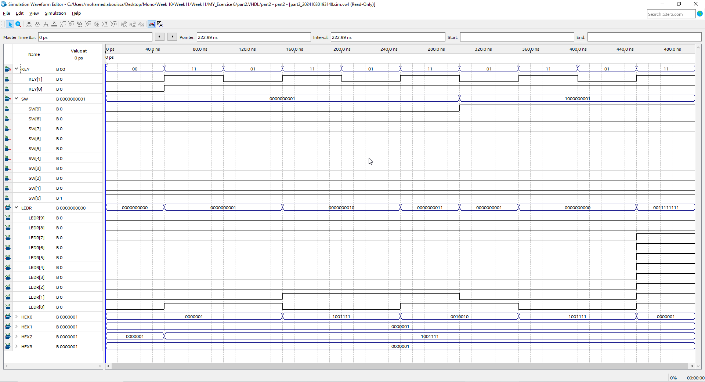
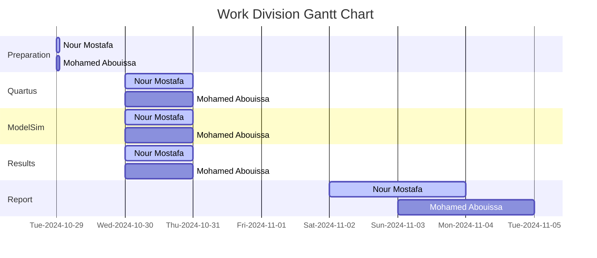

# <p align="center">Adders and Subtractors</p>

// anchor

---

// anchor

In part 1, 


In this section, we design an 8-bit accumulator, a digital circuit commonly used in computing and digital signal processing for sequential addition operations. An accumulator combines an arithmetic logic unit (ALU) function with storage capabilities, allowing it to retain and update a cumulative result of additions over time. Specifically, each cycle adds a new 8-bit value to the current sum stored in the accumulator. This design includes a carry output for the adder, which signals when the sum exceeds the maximum value representable by 8 bits, and an overflow output to indicate arithmetic overflow, helping manage conditions where the result exceeds the accumulator’s signed representation limits.

As shown in [Figure 1](Photos/Accumulator.png), the internal structure of the accumulator consists of an 8-bit adder, a register for holding the accumulated sum, and D flip-flops for storing the carry and overflow signals. The 8-bit input `A`, connected to switches `SW 0 to 7`, provides the value to be added in each cycle. The accumulated sum `S` is stored in a register and fed back into the adder, enabling continuous addition operations. Each clock cycle, triggered manually using `KEY1`, updates both the `register` and `D flip-flops`, ensuring that the carry and overflow flags reflect the current arithmetic status. An active-low asynchronous reset, controlled by `KEY0`, clears all values in the accumulator when needed.

The output of the accumulator is displayed using `LED` indicators and `7-segment displays` for easy monitoring. The sum from the adder is shown on the red lights `LEDR 0 to 7`, while the registered carry and overflow signals are displayed on `LEDR 8 and LEDR 9`, respectively. Additionally, the registered values of `A` and `S` are displayed as hexadecimal numbers on the `7-segment displays` `HEX 2 to 3` and `HEX 0 to 1`, providing a complete view of the current state of the accumulator.


## Implementation

<details>
  <summary>VHDL Code</summary>
<br>

```VHDL
-- Accumulator circuit with overflow detection
-- Registers are included for all inputs and outputs.
-- inputs:   SW7-0 = A
--           SW9 = Add_Sub (add when 0, subtract when 1)
--           KEY0 = active-low asynchronous reset
--           KEY1 = manual clock (the key must keep getting pressed)
-- outputs:  LEDR7-0 shows S in binary form
--           LEDR8 shows carry out
--           LEDR9 shows overflow
--           HEX3-2 shows input A
--           HEX1-0 shows the output sum

-- A is the input, S is the output of the sum or subtraction 

Library ieee;
USE ieee.std_logic_1164.all;
USE ieee.std_logic_arith.all;
USE ieee.std_logic_signed.all;

ENTITY part2 IS
   PORT ( KEY   : IN  STD_LOGIC_VECTOR(1 DOWNTO 0);
          SW    : IN  STD_LOGIC_VECTOR(9 DOWNTO 0);
          LEDR  : OUT STD_LOGIC_VECTOR(9 DOWNTO 0);
          HEX3, HEX2, HEX1, HEX0 : OUT STD_LOGIC_VECTOR(0 TO 6) );
END ENTITY part2;

ARCHITECTURE Behavior OF part2 IS
   COMPONENT hex7seg IS -- using a component of the "hex7seg" entity which is defined down (below the top level architecture)
   PORT ( hex      : IN  STD_LOGIC_VECTOR(3 DOWNTO 0);
          display  : OUT STD_LOGIC_VECTOR(0 TO 6) );
   END component;

   COMPONENT regn IS -- using a component of the "regn" entity which is defined down (below the top level architecture)
   GENERIC ( n : NATURAL := 8 );
   PORT ( R             : IN  STD_LOGIC_VECTOR(n-1 DOWNTO 0);
          Clock, Resetn : IN STD_LOGIC;
          Q             : OUT STD_LOGIC_VECTOR(n-1 DOWNTO 0) );
   END COMPONENT;
   
	-- These signals are used to manage data, control flags, and intermediate results in a design.
   SIGNAL A, A_reg, S_reg, Add_Sub_vector : STD_LOGIC_VECTOR(7 DOWNTO 0); -- Declares four signals as 8-bit wide vectors
   SIGNAL S : STD_LOGIC_VECTOR(8 DOWNTO 0); -- Declares the signal S as a 9-bit wide vector.
	-- Typically used for results of operations where an extra bit is needed to accommodate carry or overflow, such as the result of an addition where the final bit captures the carry-out.
   SIGNAL carry, carry_reg : STD_LOGIC_VECTOR(0 TO 0); -- Declares two single-bit signals
	-- carry: Represents a carry-out from an arithmetic operation.
	-- carry_reg: A stored version of carry, preserving it for synchronous use.
   SIGNAL Clock, Resetn, Add_Sub : STD_LOGIC; -- Declares three single-bit signals
	-- Clock: The clock signal that controls synchronous operations in the circuit.
	-- Resetn: An asynchronous reset signal, active low ('0' resets the circuit).
	-- Add_Sub: A control signal that specifies the operation type, where '0' indicates addition and '1' indicates subtraction.
   SIGNAL overflow, overflow_reg : STD_LOGIC_VECTOR (0 TO 0); -- Declares two single-bit signals
	-- overflow: Indicates whether an overflow condition has occurred in an arithmetic operation.
	-- overflow_reg: A registered or stored version of overflow, which can be used to retain the overflow status for synchronous use.
	
BEGIN
	-- Assigning specific values to various signals, linking them to inputs from KEY and SW from the FPGA 
   Resetn <= KEY(0);
   Clock <= KEY(1);
   A <= SW(7 DOWNTO 0);
   Add_Sub <= SW(9);
	Add_Sub_vector <= (OTHERS => ADD_Sub);

	-- Implementing a basic arithmetic unit with only adding and subtracting functions.
	
   -- instantiate module regn (R, Clock, Resetn, Q);
   U_A : regn PORT MAP (A, Clock, Resetn, A_reg); -- The regn module takes A as the input (R in the module definition) and, on a clock pulse, stores its value in A_reg while respecting the Resetn signal. 

   S <= ('0' & S_reg) + ((A_reg XOR Add_Sub_vector) + Add_Sub); 
	-- ('0' & S_reg): Extends S_reg by adding a leading '0' bit, creating a 9-bit vector for arithmetic operations to handle overflow/carry.
	-- (A_reg XOR Add_Sub_vector) + Add_Sub: Performs the arithmetic operation by using Add_Sub as a control bit. XOR-ing with Add_Sub_vector enables switching between addition (when Add_Sub is 0) and two’s complement subtraction (when Add_Sub is 1).
	-- The sum of these terms is assigned to S, resulting in a 9-bit output where the 8 LSBs hold the result, and the MSB (S(8)) holds any carry.
	
	carry(0) <= S(8); -- Assigns the carry-out bit from S to the carry(0) signal.
	-- carry(0) will indicate whether an overflow occurred in the addition/subtraction operation by holding the MSB of S.
   
	-- Display the adder outputs
   LEDR(7 DOWNTO 0) <= S(7 DOWNTO 0); -- Maps the result of the arithmetic operation (S) to LEDR(7:0), allowing the sum or difference to be viewed on the board’s LEDs.

   -- instantiate module regn (R, Clock, Resetn, Q);
   U_S : regn PORT MAP (S(7 DOWNTO 0), Clock, Resetn, S_reg); -- On each clock pulse, stores the 8-bit result in S_reg, allowing S_reg to hold the stabilized value of S for use in further logic or display.

   U_carry : regn GENERIC MAP (n => 1) -- Creates a 1-bit register (U_carry) to hold the carry-out bit carry, allowing the carry status to be retained and used later.
                  PORT MAP (carry, Clock, Resetn, carry_reg);

   -- check for overflow
   overflow(0) <= ((Add_Sub XOR A_reg(7)) XNOR S_reg(7)) AND (A_reg(7) XOR Add_Sub XOR S(7));
	-- evaluates whether an overflow condition occurred by examining the signs of the operands and the result.
	-- If the sign bits of A_reg and S_reg are mismatched after an operation (when they should logically align), overflow has occurred.
	
   U_overflow : regn GENERIC MAP (n => 1) -- Instantiates a 1-bit regn module labeled U_overflow to register the overflow signal.
                     PORT MAP (overflow, Clock, Resetn, overflow_reg); -- Stores the result of the overflow calculation in overflow_reg, allowing it to be retained for display or further use.
							
   LEDR(9) <= overflow_reg(0); -- Displays the overflow status on LED
   LEDR(8) <= carry_reg(0); -- Displays the carry status on LED 8
   
   -- drive the displays through a 7-seg decoders
   digit_3: hex7seg PORT MAP(A_reg(7 DOWNTO 4), HEX3); -- Converts the 4-bit upper portion of A_reg into a 7-segment format for display on HEX3.
   digit_2: hex7seg PORT MAP(A_reg(3 DOWNTO 0), HEX2); -- Uses the hex7seg module to convert the lower 4 bits of A_reg into a display format for the 7-segment display HEX2.
   digit_1: hex7seg PORT MAP(S_reg(7 DOWNTO 4), HEX1); -- Converts the upper portion of S_reg for display on HEX1, showing the high 4 bits of the arithmetic result.
   digit_0: hex7seg PORT MAP(S_reg(3 DOWNTO 0), HEX0); -- Converts the low 4 bits of S_reg into a 7-segment display format for HEX0.
END Behavior;

----------------------------------------------------------------------------------------------------------------------------------------------------------------

-- Defining an n-bit register with an asynchronous, active-low reset (Resetn). The register updates its output Q 
-- to match the input R on the rising edge of the clock, provided the reset is not active. If Resetn is low (0), 
-- the register contents are cleared, regardless of the clock signal.
               
LIBRARY ieee;
USE ieee.std_logic_1164.all;

-- Declares the regn entity, which defines the interface for this register module.
ENTITY regn IS
   GENERIC ( n : NATURAL := 8 ); -- Defines a generic parameter n, which specifies the width of the register. 
	-- This allows flexibility in choosing the number of bits, defaulting to 8 bits.
   PORT ( R             : IN  STD_LOGIC_VECTOR(n-1 DOWNTO 0); -- R is an n-bit input vector that represents the data to be loaded into the register.
          Clock, Resetn : IN  STD_LOGIC; -- Clock is a single-bit input signal, used to synchronize data loading. Resetn is a single-bit asynchronous reset input.
          Q             : OUT STD_LOGIC_VECTOR(n-1 DOWNTO 0) ); -- Q is an n-bit output vector representing the current contents of the register.

END ENTITY regn;

ARCHITECTURE Behavior OF regn IS -- defines the internal behavior and signal assignments for the entity
BEGIN
   PROCESS (Clock, Resetn) -- Defines a process that is sensitive to changes on Clock and Resetn. 
	-- This process block will execute whenever there is a change on either of these signals, making it suitable for synchronous logic with an asynchronous reset.
   BEGIN
      IF (Resetn = '0') THEN -- If Resetn is 0, it sets all bits in Q to '0', effectively clearing the register asynchronously.
         Q <= (OTHERS => '0'); -- assigns 0 to all bits in the vector Q, regardless of the width specified by n.
      ELSIF (rising_edge(Clock)) THEN -- If Resetn is not 0, it checks for a rising edge on Clock (meaning a transition from 0 to 1)
         Q <= R; -- loads the input vector R into Q on the rising edge of Clock.       
      END IF;
   END PROCESS;
END Behavior;

----------------------------------------------------------------------------------------------------------------------------------------------------------------

-- Describing the functionality of a 7-segment display decoder, which converts a 4-bit binary input 
-- representing hexadecimal values (0 to F) into the corresponding signals to display each character on a 
-- 7-segment display.

LIBRARY ieee;
USE ieee.std_logic_1164.all;

ENTITY hex7seg IS
   PORT ( hex      : IN  STD_LOGIC_VECTOR(3 DOWNTO 0);
          display  : OUT STD_LOGIC_VECTOR(0 TO 6) );

END ENTITY hex7seg;

ARCHITECTURE Behavior OF hex7seg IS
   --       0  
   --      ---  
   --     |   |
   --    5|   |1
   --     | 6 |
   --      ---  
   --     |   |
   --    4|   |2
   --     |   |
   --      ---  
   --       3  
BEGIN
   display <= "0000001" WHEN (hex = "0000") ELSE  -- Display '0'
              "1001111" WHEN (hex = "0001") ELSE  -- Display '1'
              "0010010" WHEN (hex = "0010") ELSE  -- Display '2'
              "0000110" WHEN (hex = "0011") ELSE  -- Display '3'
              "1001100" WHEN (hex = "0100") ELSE  -- Display '4'
              "0100100" WHEN (hex = "0101") ELSE  -- Display '5'
              "0100000" WHEN (hex = "0110") ELSE  -- Display '6'
              "0001111" WHEN (hex = "0111") ELSE  -- Display '7'
              "0000000" WHEN (hex = "1000") ELSE  -- Display '8'
              "0000100" WHEN (hex = "1001") ELSE  -- Display '9'
              "0001000" WHEN (hex = "1010") ELSE  -- Display 'A'
              "1100000" WHEN (hex = "1011") ELSE  -- Display 'B'
              "0110001" WHEN (hex = "1100") ELSE  -- Display 'C'
              "1000010" WHEN (hex = "1101") ELSE  -- Display 'D'
              "0110000" WHEN (hex = "1110") ELSE  -- Display 'E'
              "0111000";                          -- Display 'F'
END Behavior;

```

</details>


<details>
  <summary>Practical & Simulation Results</summary>
	
<br>

<p align="center">
  
  
</p>

// anchor


<p align="center">
  
</p>

// anchor
<br>
	
</details>


## Conclusion

// anchor

## Resources

|1| Ashenden, P. J. (2008). The designer’s guide to VHDL (3rd ed). Morgan Kaufmann Publishers.  

<br>



We extend our sincere appreciation to Eng. Umar Adeel for his insightful feedback which has significantly contributed to the successful completion of this experiment.

This publication adheres to all regulatory laws and guidelines established by the American University of Ras Al Khaimah (AURAK) regarding the dissemination of academic materials.


