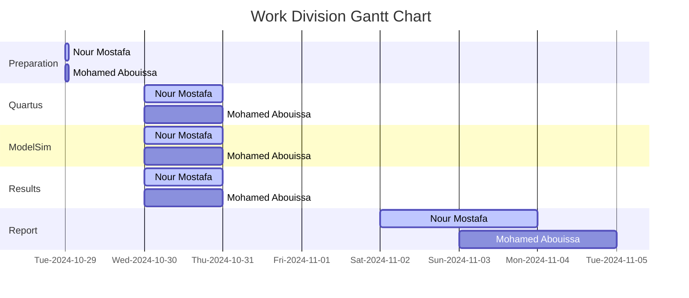

# <p align="center">Adders and Subtractors</p>

// anchor

---

// anchor

## Part 1: 

In this section, we design an 8-bit accumulator, a digital circuit commonly used in computing and digital signal processing for sequential addition operations. An accumulator combines an arithmetic logic unit (ALU) function with storage capabilities, allowing it to retain and update a cumulative result of additions over time. Specifically, each cycle adds a new 8-bit value to the current sum stored in the accumulator. This design includes a carry output for the adder, which signals when the sum exceeds the maximum value representable by 8 bits, and an overflow output to indicate arithmetic overflow, helping manage conditions where the result exceeds the accumulator’s signed representation limits.

As shown in [Figure 1](Photos/Accumulator.png), the internal structure of the accumulator consists of an 8-bit adder, a register for holding the accumulated sum, and D flip-flops for storing the carry and overflow signals. The 8-bit input `A`, connected to switches `SW 0 to 7`, provides the value to be added in each cycle. The accumulated sum `S` is stored in a register and fed back into the adder, enabling continuous addition operations. Each clock cycle, triggered manually using `KEY1`, updates both the `register` and `D flip-flops`, ensuring that the carry and overflow flags reflect the current arithmetic status. An active-low asynchronous reset, controlled by `KEY0`, clears all values in the accumulator when needed.

The output of the accumulator is displayed using `LED` indicators and `7-segment displays` for easy monitoring. The sum from the adder is shown on the red lights `LEDR 0 to 7`, while the registered carry and overflow signals are displayed on `LEDR 8 and LEDR 9`, respectively. Additionally, the registered values of `A` and `S` are displayed as hexadecimal numbers on the `7-segment displays` `HEX 2 to 3` and `HEX 0 to 1`, providing a complete view of the current state of the accumulator.

<details>
  <summary>VHDL Code Implementation on the FPGA Board</summary>
<br>

```VHDL

```

<p align="center">
  
</p>

// anchor

</details>


<details>
  <summary>Waveform Simulation</summary>
	
<br>

<p align="center">
  
</p>

// anchor
<br>
	
</details>


## Part 2:

// anchor

<details>
<summary>VHDL Code Implementation on the FPGA Board</summary>
<br>

``` VHDL


```

<p align="center">
  
  
  
</p>


// anchor
</details>

<details>
  <summary>Waveform Simulation</summary>
	<br>

<p align="center">
  
</p>

// anchor

<br>


</details>

## Conclusion

// anchor

## Resources

|1| Ashenden, P. J. (2008). The designer’s guide to VHDL (3rd ed). Morgan Kaufmann Publishers.  

<br>



We extend our sincere appreciation to Eng. Umar Adeel for his insightful feedback which has significantly contributed to the successful completion of this experiment.

This publication adheres to all regulatory laws and guidelines established by the American University of Ras Al Khaimah (AURAK) regarding the dissemination of academic materials.


