# <p align="center">Memory Blocks</p>

This lab focuses on designing a `32x4-bit RAM` module on an FPGA using `DE-series` boards. Using VHDL, we interfaced the RAM with slide switches for data input, address selection, and clock control. The system stores and retrieves data, displaying address and data values on seven-segment displays. Both simulation and practical results confirmed the successful operation of the memory module, demonstrating FPGA-based memory implementation and hardware interfacing.

---

In modern computer systems, memory is a critical resource that supports efficient data storage and access for processing operations. Field-Programmable Gate Arrays (FPGAs) offer versatile platforms for implementing memory due to their reconfigurable nature and the inclusion of dedicated memory resources. These resources, such as `M9K` and `M10K` memory blocks available in Intel FPGAs, enable the development of custom memory architectures optimized for specific applications.

This lab explores the design and implementation of a 32x4-bit Random Access Memory (RAM) module using the memory blocks in Intel FPGAs, such as those found on `DE10-Lite`, `DE0-CV`, `DE1-SoC`, and `DE2-115` boards. These FPGA boards feature the `MAX 10`, `Cyclone IV`, and `Cyclone V` series FPGAs, which include either `M9K` or `M10K` memory blocks. `M9K` blocks provide `9216 bits` of memory each, while `M10K` blocks offer `10240 bits`. By configuring these blocks with an aspect ratio of 4-bit width and 32-word depth, this exercise demonstrates how on-chip memory can be allocated and organized to meet specific design needs.

[Figure 1](Photos/32x4_(RAM).png) illustrates the structure of a 32x4-bit Random Access Memory (RAM) module, which includes essential input and output ports for accessing and managing stored data. The module features a 5-bit address port that allows access to any of the 32 memory locations, as $2^5 = 32$ Each location, or `word` in the RAM can store 4 bits of data. A Write control input is also provided to dictate whether the module operates in write or read mode. When the Write signal is active, the data at the specified address is updated with the value provided at the Data port. Conversely, when the Write signal is inactive, the module is in read mode, allowing data retrieval from the specified address. The Data port is a 4-bit bidirectional line used for both input and output, making it possible to write 4-bit values to the RAM during write operations and retrieve 4-bit values during read operations. This setup enables efficient management of 32 four-bit words using a compact, straightforward configuration.

The enhanced [Figure 2](Photos/32x4_(RAM)(2).png) of the 32x4-bit RAM module includes level-sensitive `D latches` on the Address, DataIn, and Write inputs. These latches are controlled by a clock signal, but unlike the RAM module, they are not edge-triggered. Instead, they pass data through to the RAM inputs whenever the clock signal is high, allowing the inputs to be held steady while the clock is high. In contrast, the RAM block itself is `triggered` on the `positive clock edge`, meaning that it only updates its stored values at the moment the clock transitions from low to high. This setup enables controlled and synchronized memory operations. When the clock is high, the latches allow data from the Address, DataIn, and Write ports to flow into the RAM module. On the positive edge of the clock, if the Write signal is active, the data from DataIn is written to the specified address in the RAM. If Write is inactive, the RAM operates in read mode, allowing data retrieval from the specified address and displaying it immediately on the unregistered DataOut port. This combination of `level-sensitive` latches and `edge-triggered` RAM ensures stable input handling with precise timing for memory operations.

The `M9K` and `M10K` memory blocks offer notable features, including input and optional output port registers for synchronized signal operation and dual ports for separate read and write processes. This lab will leverage these features to implement a `32x4 RAM` module with registered input ports and a separate unregistered data output port, following a synchronous design approach to optimize memory performance on FPGA platforms.

## Procedure & Implementation

In this lab, we will implement a memory circuit on an FPGA using a `DE-series` board. Our goal is to create a simple `32x4 RAM` module that interacts with the FPGA’s hardware features, such as `slide switches` and `seven segment displays`. We will develop a Quartus project and a VHDL file that instantiates the `ram32x4` module with connections to the DE-series board's input and output pins.

Using the slide switches `SW` on the FPGA board, we will load data into specific memory locations. Switches `SW 0 to 3` will provide the 4-bit data input for the RAM, while switches `SW 4 to 8` will specify the 5-bit address to access specific memory locations. The Write operation is controlled by `SW 9`, and `KEY 0` is used as the `Clock` input for synchronous data loading.

For visualization, the current address, data input, and data output values will be displayed on the board’s `seven-segment displays`. Specifically, `HEX 4 and 5` will show the address, `HEX 2` will display the data being loaded into the memory, and `HEX 0` will show the data read out from the memory. By testing this setup, we will confirm that data can be stored in and retrieved from various memory locations in the RAM module. This practical exercise helps to reinforce concepts of memory implementation, data storage, and hardware interfacing on FPGAs.

<details>
  <summary>VHDL Code</summary>
<br>

```VHDL
LIBRARY ieee;
USE ieee.std_logic_1164.all;

ENTITY part2 IS 
PORT ( KEY : IN STD_LOGIC_VECTOR(0 DOWNTO 0);
       SW  : IN STD_LOGIC_VECTOR(9 DOWNTO 0);
       HEX5, HEX4, HEX2, HEX0 : OUT STD_LOGIC_VECTOR(0 TO 6);
       LEDR : OUT STD_LOGIC_VECTOR(9 DOWNTO 0) );
END part2;

ARCHITECTURE Behavior OF part2 IS
   COMPONENT ram32x4 
      PORT ( address : IN  STD_LOGIC_VECTOR (4 DOWNTO 0);
             clock   : IN  STD_LOGIC ;
             data    : IN  STD_LOGIC_VECTOR (3 DOWNTO 0);
             wren    : IN  STD_LOGIC  := '1';
             q       : OUT STD_LOGIC_VECTOR (3 DOWNTO 0));
   END COMPONENT;
   COMPONENT hex7seg
      PORT ( hex     : IN  STD_LOGIC_VECTOR(3 DOWNTO 0);
             display : OUT STD_LOGIC_VECTOR(0 TO 6));
   END COMPONENT;
   SIGNAL Clock, Write : STD_LOGIC;
   SIGNAL Address : STD_LOGIC_VECTOR(4 DOWNTO 0); 
   SIGNAL DataIn, DataOut : STD_LOGIC_VECTOR(3 DOWNTO 0); 
BEGIN
   Clock <= KEY(0);
   Write <= SW(9);
   DataIn <= SW(3 DOWNTO 0);
   Address <= SW(8 DOWNTO 4);

   -- instantiate memory module
   -- module ram32x4 (address, clock, data, wren, q)
   U1: ram32x4 PORT MAP (Address, Clock, DataIn, Write, DataOut);

   -- display the data input, data output, and address on the 7-segs
   digit0: hex7seg PORT MAP (DataOut(3 DOWNTO 0), HEX0);
   digit2: hex7seg PORT MAP (DataIn(3 DOWNTO 0), HEX2);
   digit5: hex7seg PORT MAP ("000" & Address(4), HEX5);
   digit4: hex7seg PORT MAP (Address(3 DOWNTO 0), HEX4);

   LEDR(3 DOWNTO 0) <= DataIn;
   LEDR(8 DOWNTO 4) <= Address;
   LEDR(9) <= Write;
END Behavior;

LIBRARY ieee;
USE ieee.std_logic_1164.all;

-- the B input blanks the display when B = 1
ENTITY hex7seg IS
   PORT ( hex     : IN  STD_LOGIC_VECTOR(3 DOWNTO 0);
          display : OUT STD_LOGIC_VECTOR(0 TO 6));
END hex7seg;

ARCHITECTURE Behavior OF hex7seg IS
BEGIN
   --
   --       0  
   --      ---  
   --     |   |
   --    5|   |1
   --     | 6 |
   --      ---  
   --     |   |
   --    4|   |2
   --     |   |
   --      ---  
   --       3  
   --
   PROCESS (hex)
   BEGIN
      CASE (hex) IS
         WHEN "0000" => display <= "0000001";
         WHEN "0001" => display <= "1001111";
         WHEN "0010" => display <= "0010010";
         WHEN "0011" => display <= "0000110";
         WHEN "0100" => display <= "1001100";
         WHEN "0101" => display <= "0100100";
         WHEN "0110" => display <= "1100000";
         WHEN "0111" => display <= "0001111";
         WHEN "1000" => display <= "0000000";
         WHEN "1001" => display <= "0001100";
         WHEN "1010" => display <= "0001000";
         WHEN "1011" => display <= "1100000";
         WHEN "1100" => display <= "0110001";
         WHEN "1101" => display <= "1000010";
         WHEN "1110" => display <= "0110000";
         WHEN OTHERS => display <= "0111000";
      END CASE;
   END PROCESS;
END Behavior;

```

```VHDL
LIBRARY ieee;
USE ieee.std_logic_1164.all;

LIBRARY altera_mf;
USE altera_mf.altera_mf_components.all;

ENTITY ram32x4 IS
	PORT
	(
		address		: IN STD_LOGIC_VECTOR (4 DOWNTO 0);
		clock		: IN STD_LOGIC  := '1';
		data		: IN STD_LOGIC_VECTOR (3 DOWNTO 0);
		wren		: IN STD_LOGIC ;
		q		: OUT STD_LOGIC_VECTOR (3 DOWNTO 0)
	);
END ram32x4;


ARCHITECTURE SYN OF ram32x4 IS

	SIGNAL sub_wire0	: STD_LOGIC_VECTOR (3 DOWNTO 0);

BEGIN
	q    <= sub_wire0(3 DOWNTO 0);

	altsyncram_component : altsyncram
	GENERIC MAP (
		clock_enable_input_a => "BYPASS",
		clock_enable_output_a => "BYPASS",
		intended_device_family => "Cyclone IV E",
		lpm_hint => "ENABLE_RUNTIME_MOD=NO",
		lpm_type => "altsyncram",
		numwords_a => 32,
		operation_mode => "SINGLE_PORT",
		outdata_aclr_a => "NONE",
		outdata_reg_a => "UNREGISTERED",
		power_up_uninitialized => "FALSE",
		ram_block_type => "M9K",
		read_during_write_mode_port_a => "NEW_DATA_NO_NBE_READ",
		widthad_a => 5,
		width_a => 4,
		width_byteena_a => 1
	)
	PORT MAP (
		address_a => address,
		clock0 => clock,
		data_a => data,
		wren_a => wren,
		q_a => sub_wire0
	);


END SYN;

```

</details>


<details>
  <summary>Practical Results</summary>
	
<be>

 <p align="center">	 
  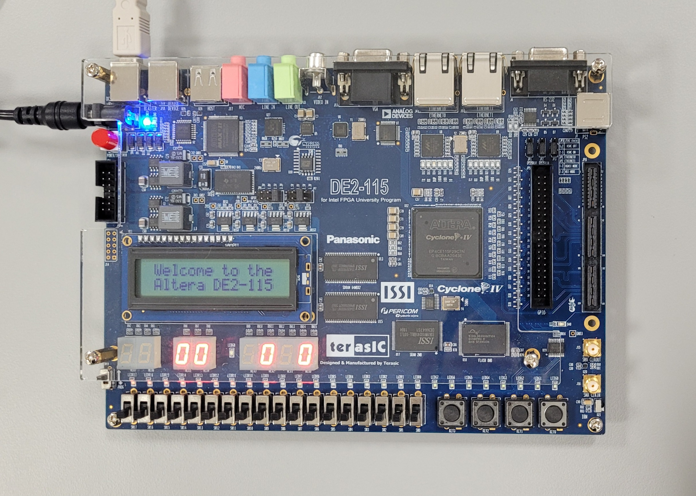
</p>

// anchor

<p align="center">
  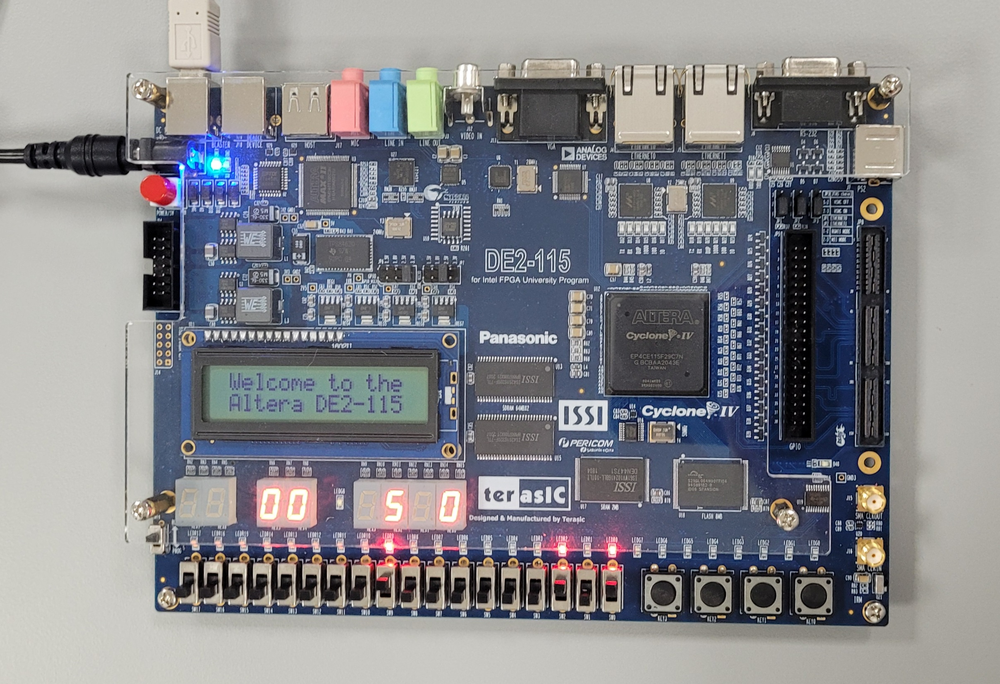 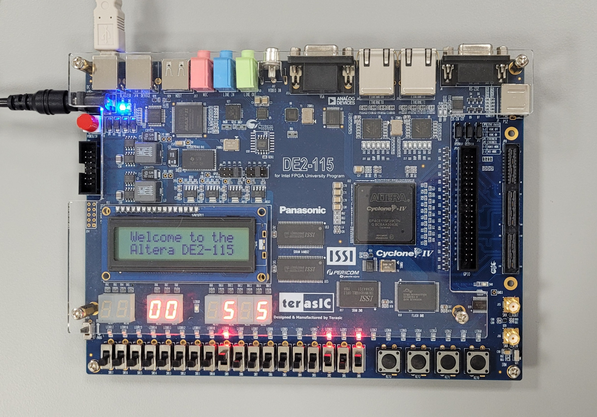 
 </p>

// anchor

 <p align="center">
  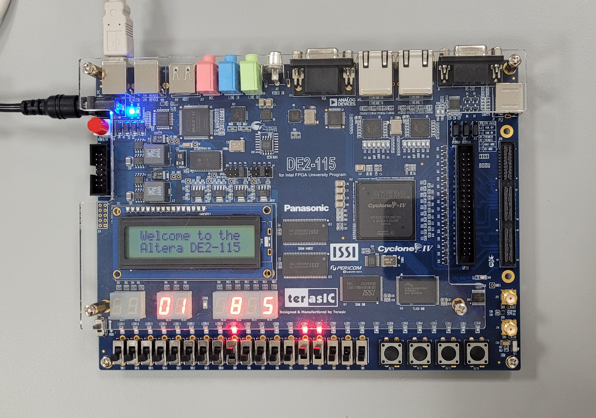  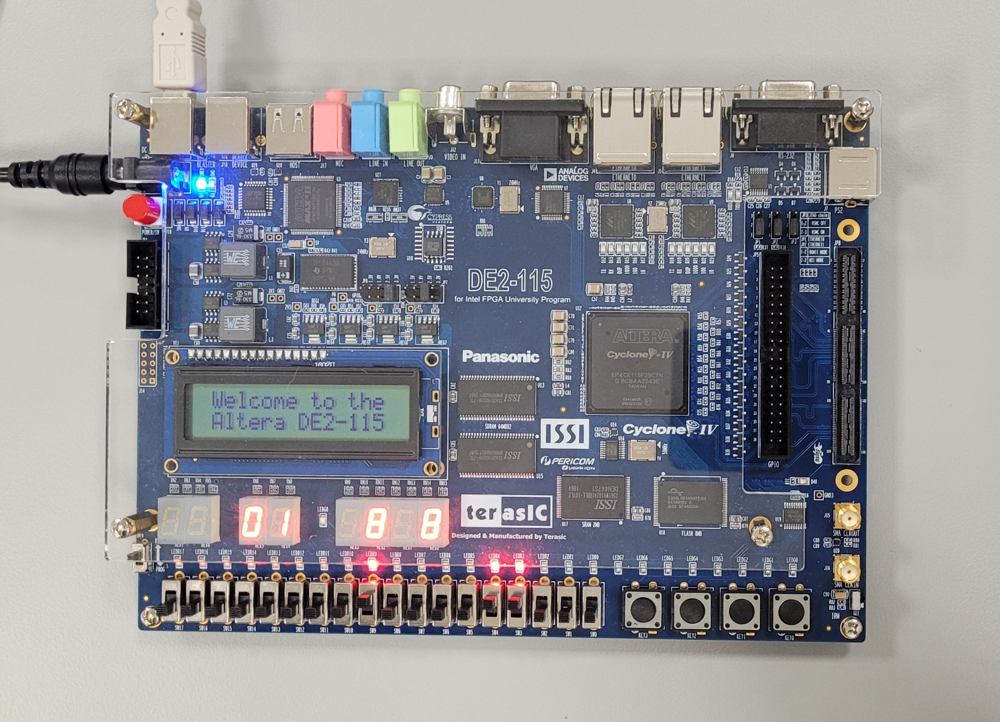
 </p>

// anchor

 <p align="center">
  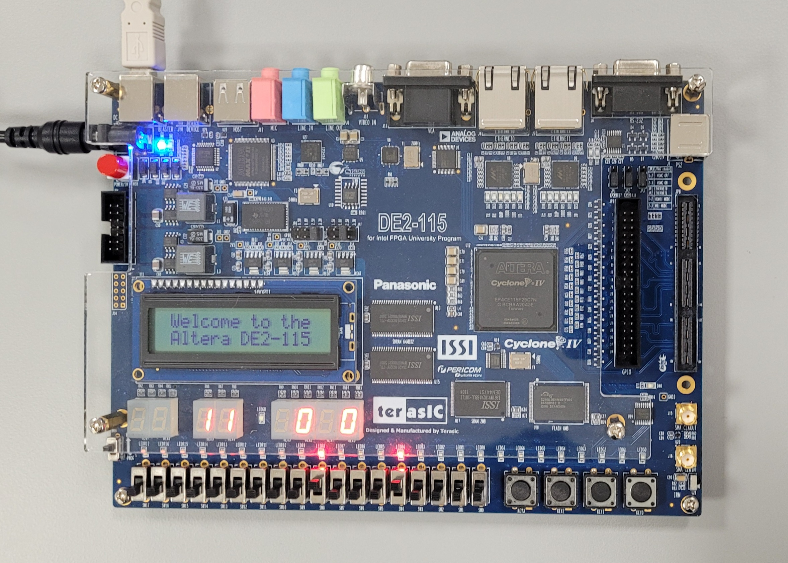 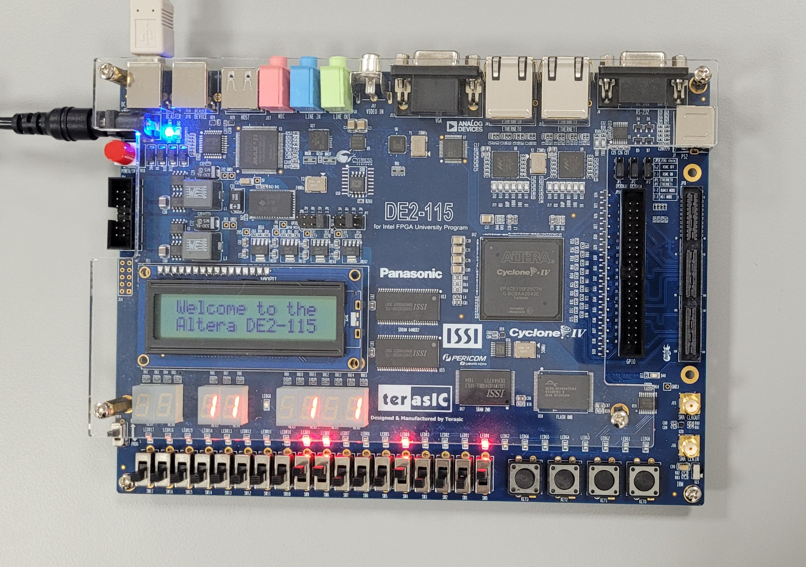
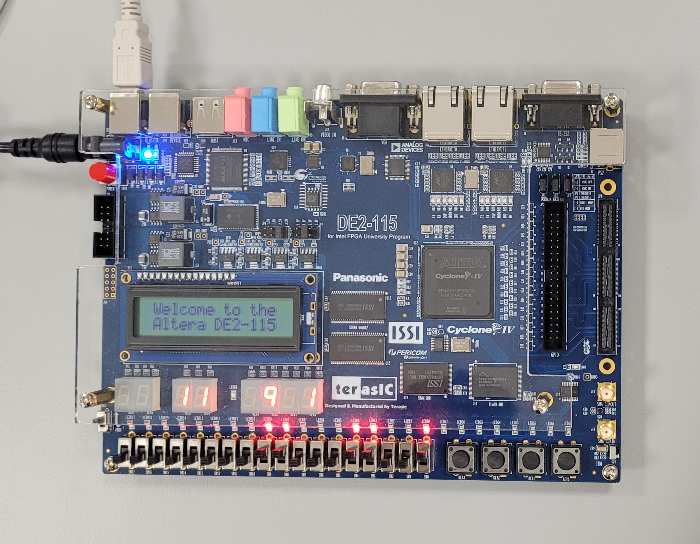  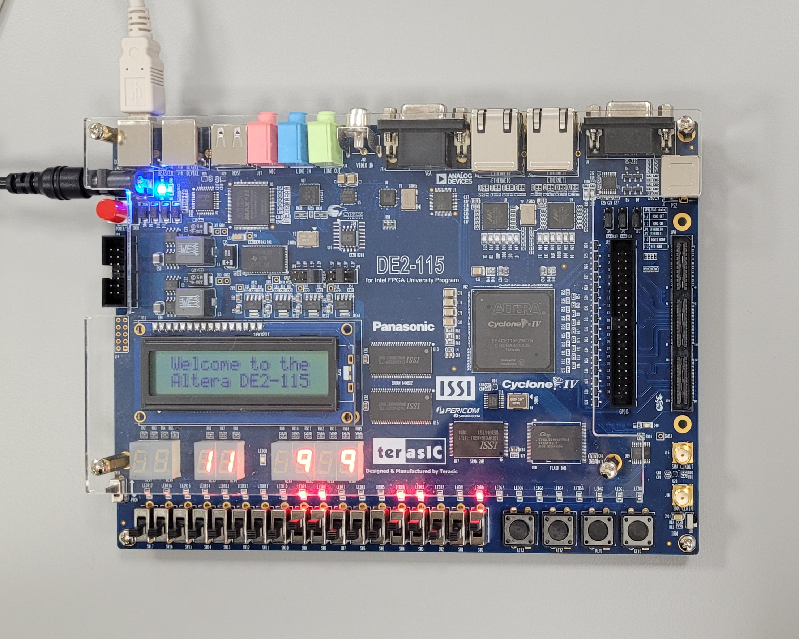
 </p>

// anchor
  
 <p align="center">
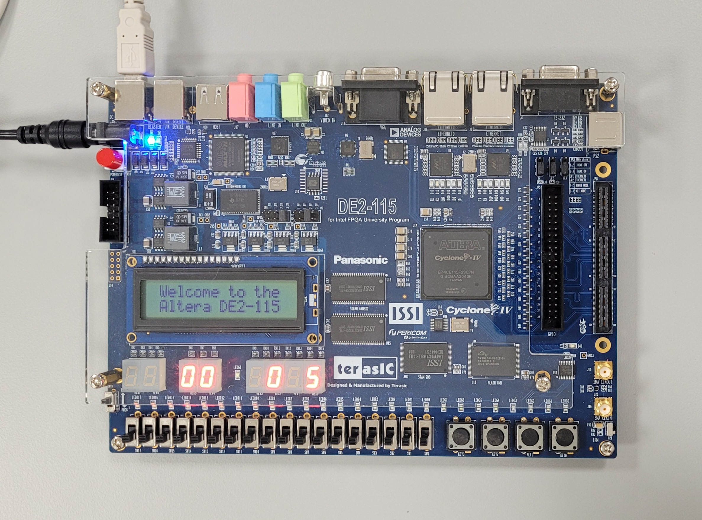 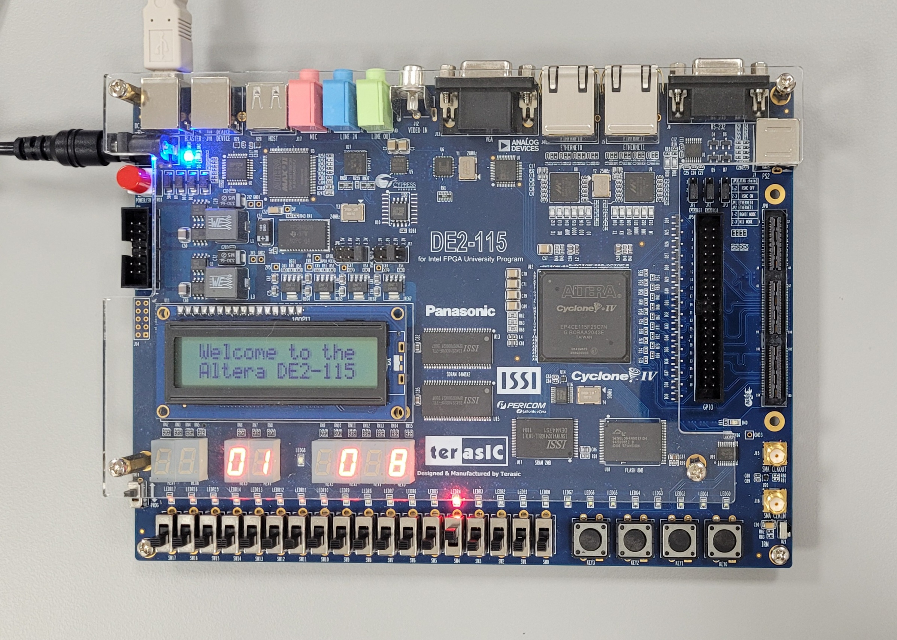
</p>

// anchor

 <p align="center">	 
  
</p>

// anchor
	
</details>

<details>
  <summary>Simulation Results</summary>
	
<br>

<p align="center">
  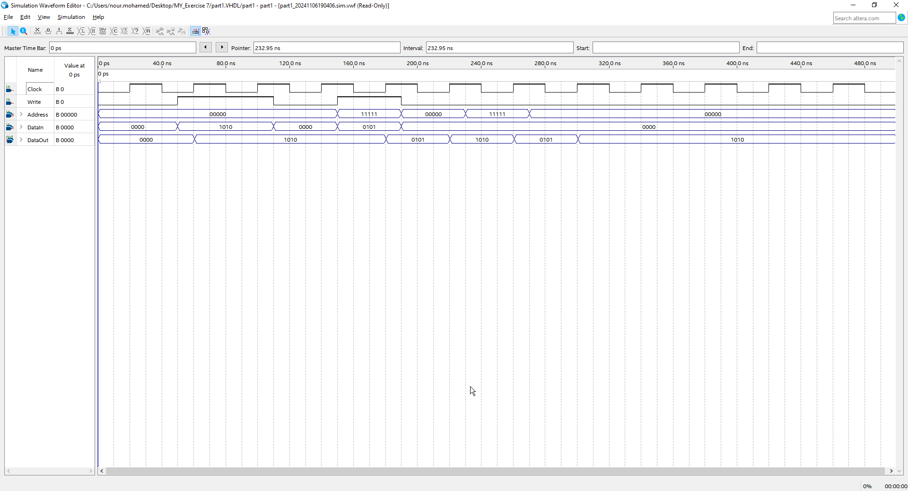
</p>

In the simulation waveform, we observe the clock, write, address, data in, and data out signals in action. At the `first clock rising edge`, the write signal is low, indicating a `read` operation at address `00000`. Since nothing has been written yet, the output reads `0000`. On the `second rising edge`, the write signal goes high, enabling a `write` operation at address `00000` with the input data `1010`, which is reflected immediately on data out.

By the `fifth rising edge`, the write is still high, and the address changes to `11111`, where data in `0101` is written and displayed on data out simultaneously. In the `sixth and seventh rising edges`, the write signal is low, so the module performs `read` operations. It retrieves `1010` from address `00000` and `0101` from address `11111`, confirming that the saved data is correctly stored and accessed.


</details>

This lab successfully demonstrated the design, implementation, and testing of a `32x4-bit` RAM module on an FPGA, with practical control and display elements such as switches and seven-segment displays. By interfacing the RAM with the `DE-series` board's hardware features, we explored how FPGA memory resources, specifically `M9K` or `M10K` blocks, support configurable memory structures.

Through both simulation and hands-on testing, we confirmed that data could be written to and read from specified memory addresses, validating the module's functionality and timing. The simulation waveform provided a clear visualization of memory operations, highlighting how the write and read functions performed as expected. This exercise reinforced important concepts in FPGA-based memory design, including clock synchronization, signal routing, and hardware interfacing. Overall, the lab provided a practical understanding of memory management on reconfigurable hardware, which is essential for future applications in digital system design.

## Resources
|3| Ashenden, P. J. (2008). The designer’s guide to VHDL (3rd ed). Morgan Kaufmann Publishers.   
// anchor

<br>

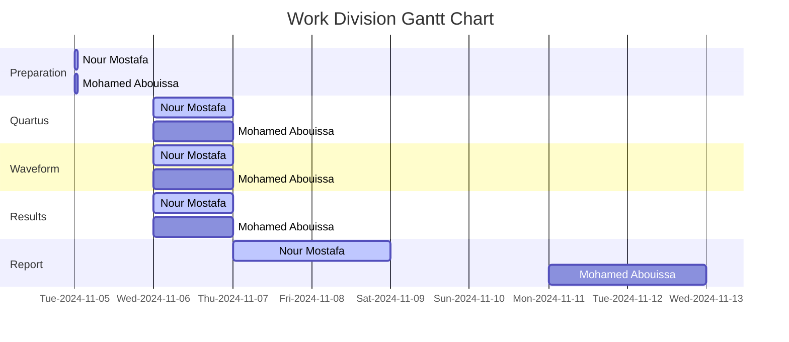

We extend our sincere appreciation to Eng. Umar Adeel for his insightful feedback which has significantly contributed to the successful completion of this experiment.

This publication adheres to all regulatory laws and guidelines established by the American University of Ras Al Khaimah (AURAK) regarding the dissemination of academic materials.
