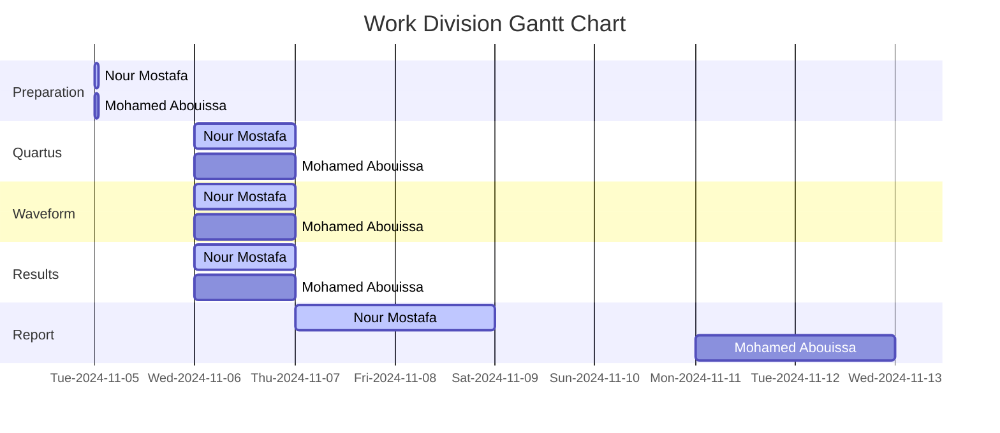

# <p align="center">Memory Blocks</p>

// anchor abstract

---

// anchor intro 

## Procedure & Implementation

// anchor

<details>
  <summary>VHDL Code</summary>
<br>

```VHDL


```

</details>


<details>
  <summary>Practical Results</summary>
	
<br>

<p align="center">
  
  
</p>


	
</details>

<details>
  <summary>Simulation Results</summary>
	
<br>

<p align="center">
  
</p>

</details>

## Conclusion

// anchor

## Resources
|3| Ashenden, P. J. (2008). The designer’s guide to VHDL (3rd ed). Morgan Kaufmann Publishers.    

<br>



We extend our sincere appreciation to Eng. Umar Adeel for his insightful feedback which has significantly contributed to the successful completion of this experiment.

This publication adheres to all regulatory laws and guidelines established by the American University of Ras Al Khaimah (AURAK) regarding the dissemination of academic materials.
