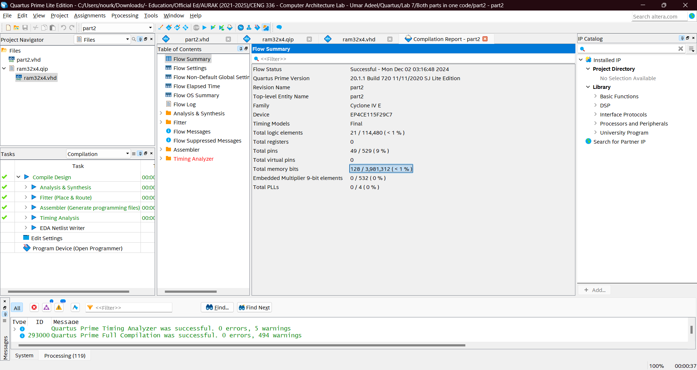
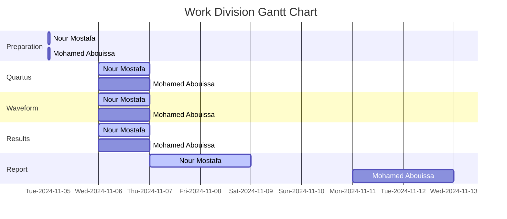

# <p align="center">Memory Blocks</p>

This lab focuses on designing a 32x4-bit RAM module on an FPGA using the DE2-115 board. Using VHDL, we interfaced the RAM with slide switches for data input, address selection, and clock control. The system stores and retrieves data, displaying address and data values on seven-segment displays. Both simulation and practical results confirmed the successful operation of the memory module, demonstrating FPGA-based memory implementation and hardware interfacing.

---

In modern computer systems, memory is a critical resource that supports efficient data storage and access for processing operations. Field-Programmable Gate Arrays (FPGAs) offer versatile platforms for implementing memory due to their reconfigurable nature and the inclusion of dedicated memory resources. These resources, such as `M9K` and `M10K` memory blocks available in Intel FPGAs, enable the development of custom memory architectures optimized for specific applications. The `M9K` blocks provide 9216 bits of memory each, while `M10K` blocks offer 10240 bits. The `M9K` and `M10K` memory blocks offer notable features, including input and optional output port registers for synchronized signal operation and dual ports for separate read and write processes. This lab will leverage these features to implement a `32x4 RAM` module with registered input ports and a separate unregistered data output port, following a synchronous design approach to optimize memory performance on FPGA platforms. By configuring these blocks with an aspect ratio of 4-bit width and 32-word depth, this exercise demonstrates how on-chip memory can be allocated and organized to meet specific design needs.

Memory blocks are contiguous chunks of memory that serve as the fundamental units for data storage and transfer in computer systems. In caching, a memory block, also known as a cache block or cache line, represents the smallest segment of memory transferred between main memory and the cache. These blocks are typically of fixed size, often a power of two, such as 8, 16, or 64 bytes, allowing for efficient indexing and addressing. Larger blocks can enhance spatial locality by bringing in more data at once, but they may also increase memory overhead if unused data is fetched. Beyond caching, memory blocks are central to RAM and virtual memory management, forming the basis of pages and frames, as well as to file systems where blocks represent storage units on a disk. While larger blocks reduce the frequency of memory accesses, they can lead to cache pollution by filling the cache with unnecessary data, whereas smaller blocks offer precision but may increase data transfer overhead. Balancing block size is crucial for optimizing performance, as fetching data in blocks reduces slower memory access while leveraging spatial locality.

RAM, or Random Access Memory, is a type of volatile computer memory used to store data and instructions that a computer's processor needs to access quickly. Unlike storage devices such as hard drives or SSDs, which are designed for long-term data storage, RAM is used for short-term, high-speed operations, as it allows data to be read from and written to memory locations almost instantaneously. This speed is critical for running applications, loading operating systems, and performing calculations. RAM is considered volatile because its contents are erased when the computer is powered off, in contrast to non-volatile memory, which retains data even without power. RAM capacity, typically measured in gigabytes (GB), directly affects a system's ability to handle multiple applications or large workloads simultaneously. Modern computers use DDR (Double Data Rate) RAM, which allows faster data transfer rates. The efficiency of RAM significantly impacts overall system performance, as insufficient RAM can lead to reliance on slower storage devices to handle active data, causing noticeable lags. By temporarily storing frequently accessed data, RAM serves as a bridge between the processor and permanent storage, ensuring smooth and efficient computing operations. RAM is a collection of memory cells organized into multiple blocks or addresses. Each of these memory blocks can store a fixed amount of data, usually in bytes, and is identified by a unique memory address. RAM is structured to provide random access, meaning the processor can directly access any memory block or cell without having to read through others sequentially.

[Figure 1](Photos/32x4_(RAM).png) illustrates the structure of a 32x4-bit RAM module, which includes essential input and output ports for accessing and managing stored data. The module features a 5-bit address port that allows access to any of the 32 memory locations, as $2^5 = 32$. Each location, or word in the RAM can store 4 bits of data. A `Write` control input is also provided to dictate whether the module operates in write or read mode. When the `Write` signal is active, the data at the specified address is updated with the value provided at the `Data` port. Conversely, when the `Write` signal is inactive, the module is in read mode, allowing data retrieval from the specified address. The `Data` port is a 4-bit bidirectional line used for both input and output, making it possible to write 4-bit values to the RAM during write operations and retrieve 4-bit values during read operations. This setup enables efficient management of 32 four-bit words using a compact, straightforward configuration. The enhanced [Figure 2](Photos/32x4_(RAM)(2).png) of the 32x4-bit RAM module includes level-sensitive D latches on the `Address`, `DataIn`, and `Write` inputs. These latches are controlled by a clock signal, but unlike the RAM module, they are not edge-triggered. Instead, they pass data through to the RAM inputs whenever the clock signal is high, allowing the inputs to be held steady while the clock is high. In contrast, the RAM block itself is triggered on the positive clock edge, meaning that it only updates its stored values at the moment the clock transitions from low to high. This setup enables controlled and synchronized memory operations. When the clock is high, the latches allow data from the `Address`, `DataIn`, and `Write` ports to flow into the RAM module. On the positive edge of the clock, if the `Write` signal is active, the data from `DataIn` is written to the specified address in the RAM. If `Write` is inactive, the RAM operates in read mode, allowing data retrieval from the specified address and displaying it immediately on the unregistered `DataOut` port. This combination of level-sensitive latches and edge-triggered RAM ensures stable input handling with precise timing for memory operations.

## Procedure & Implementation

The objective here is to implement a memory circuit on our board. We shall create a simple `32x4 RAM` module that interacts with the FPGA’s hardware features, such as slide switches and seven segment displays. Using the slide switches `SW` on the FPGA board, we will load data into specific memory locations. Switches `SW 0 to 3` will provide the 4-bit data input for the RAM, while switches `SW 4 to 8` will specify the 5-bit address to access specific memory locations. The write operation is controlled by `SW 9`, and `KEY 0` is used as the clock input for synchronous data loading. For visualization, the current address, data input, and data output values will be displayed on the board’s seven-segment displays. Specifically, `HEX 4 and 5` will show the address, `HEX 2` will display the data being loaded into the memory, and `HEX 0` will show the data read out from the memory. By testing this setup, we will confirm that data can be stored in and retrieved from various memory locations in the RAM module.

<details>
  <summary>VHDL Code</summary>
<br>

```VHDL
-- This code instantiates a 32 x 4 memory 
-- inputs: KEY0 is the clock, SW3-SW0 provides data to write into memory.
-- SW8-SW4 provides the memory address, SW9 is the memory Write input.
-- outputs: 7-seg displays HEX5-4 show the memory address, HEX2
-- displays the data input to the memory, and HEX0 show the contents read
-- from the memory. LEDGR shows the status of the SW switches.

-- RAM module
-- inputs: 
--    Clock
--    Address
--    Write: asserted to perform a write
--    DataIn: data to be written
--
-- outputs:
--    DataOut: data read

LIBRARY ieee;
USE ieee.std_logic_1164.all;

ENTITY part2 IS 
-- Define the entity (module) named "part2". An entity in VHDL represents the interface for a hardware module, including its input and output ports.

PORT ( 
  KEY : IN STD_LOGIC_VECTOR(0 DOWNTO 0);
  -- Defines an input port "KEY" as a vector of type STD_LOGIC with a single bit (0 DOWNTO 0) range.
  -- Typically, this may represent a single button or control signal.

  SW : IN STD_LOGIC_VECTOR(9 DOWNTO 0);
  -- Defines an input port "SW" as a vector of type STD_LOGIC with 10 bits (9 DOWNTO 0).
  -- This represents multiple switches, each of which can provide a binary input to the module.

  HEX5, HEX4, HEX2, HEX0 : OUT STD_LOGIC_VECTOR(0 TO 6);
  -- Defines four output ports ("HEX5", "HEX4", "HEX2", "HEX0") as vectors of type STD_LOGIC, each with 7 bits (0 TO 6).
  -- These outputs are intended to drive 7-segment displays, with each bit corresponding to one segment (a-g).
  -- The numbers in the names (5, 4, 2, 0) suggest these may be different display positions.

  LEDR : OUT STD_LOGIC_VECTOR(9 DOWNTO 0) 
  -- Defines an output port "LEDR" as a vector of type STD_LOGIC with 10 bits (9 DOWNTO 0).
  -- This output corresponds to a set of 10 LEDs, each bit controlling one LED.

);
END part2;


ARCHITECTURE Behavior OF part2 IS

	-- Creating a component inside the architecture of a module, even when the component already has its 
	-- own entity defined elsewhere, provides key organizational, structural, and functional benefits in 
	-- VHDL. A component declaration encapsulates all the details about the interface (ports) of the module 
	-- being instantiated. By explicitly declaring the component, the architecture becomes self-contained. 
	-- A reader doesn't need to refer to external files or entities to understand how the component interacts 
	-- with the rest of the module. Components allow modular and hierarchical design. Once a component is 
	-- declared and defined, it can be reused in multiple architectures or projects without redefining its 
	-- interface. This approach promotes design abstraction, where high-level modules can focus on interconnecting 
	-- components rather than their internal logic. Furthermore, some synthesis and simulation tools require 
	-- explicit component declarations to resolve instances within the architecture. Without a component 
	-- declaration, the tool might not be able to infer the relationship between the architecture and the referenced entity.

	-- While it's theoretically possible to use direct entity instantiation (function calling), this method
	--	bypasses the benefits of modularity and encapsulation provided by components. Directly referencing 
	-- entities without declaring them as components can make the architecture less portable, harder to read, 
	-- and more prone to errors during synthesis or simulation.
   COMPONENT ram32x4 
      PORT ( address : IN  STD_LOGIC_VECTOR (4 DOWNTO 0);
             clock   : IN  STD_LOGIC ;
             data    : IN  STD_LOGIC_VECTOR (3 DOWNTO 0);
             wren    : IN  STD_LOGIC  := '1';
             q       : OUT STD_LOGIC_VECTOR (3 DOWNTO 0));
   END COMPONENT;

	
   COMPONENT hex7seg
      PORT ( hex     : IN  STD_LOGIC_VECTOR(3 DOWNTO 0);
             display : OUT STD_LOGIC_VECTOR(0 TO 6));
   END COMPONENT;
   
	
   SIGNAL Clock, Write : STD_LOGIC;
   SIGNAL Address : STD_LOGIC_VECTOR(4 DOWNTO 0); 
   SIGNAL DataIn, DataOut : STD_LOGIC_VECTOR(3 DOWNTO 0); 
	
BEGIN
   Clock <= KEY(0);
   Write <= SW(9);
   DataIn <= SW(3 DOWNTO 0);
   Address <= SW(8 DOWNTO 4);

   -- instantiate memory module
   -- module ram32x4 (address, clock, data, wren, q)
   U1: ram32x4 PORT MAP (Address, Clock, DataIn, Write, DataOut); -- this name must match the title of the qip file

   -- display the data input, data output, and address on the 7-segs
   digit0: hex7seg PORT MAP (DataOut(3 DOWNTO 0), HEX0); -- Calling the hex7seg module 
   digit2: hex7seg PORT MAP (DataIn(3 DOWNTO 0), HEX2);
   digit5: hex7seg PORT MAP ("000" & Address(4), HEX5);
   digit4: hex7seg PORT MAP (Address(3 DOWNTO 0), HEX4);

   LEDR(3 DOWNTO 0) <= DataIn;
   LEDR(8 DOWNTO 4) <= Address;
   LEDR(9) <= Write;
END Behavior;

-----------------------------------------------------------------------------------------

LIBRARY ieee;
USE ieee.std_logic_1164.all;

-- the B input blanks the display when B = 1
ENTITY hex7seg IS
   PORT ( hex     : IN  STD_LOGIC_VECTOR(3 DOWNTO 0);
          display : OUT STD_LOGIC_VECTOR(0 TO 6));
END hex7seg;

ARCHITECTURE Behavior OF hex7seg IS
BEGIN
   --
   --       0  
   --      ---  
   --     |   |
   --    5|   |1
   --     | 6 |
   --      ---  
   --     |   |
   --    4|   |2
   --     |   |
   --      ---  
   --       3  
   --
   PROCESS (hex)
   BEGIN
      CASE (hex) IS
         WHEN "0000" => display <= "0000001"; -- 0
         WHEN "0001" => display <= "1001111"; -- 1
         WHEN "0010" => display <= "0010010"; -- 2
         WHEN "0011" => display <= "0000110"; -- 3
         WHEN "0100" => display <= "1001100"; -- 4
         WHEN "0101" => display <= "0100100"; -- 5
         WHEN "0110" => display <= "1100000"; -- 6
         WHEN "0111" => display <= "0001111"; -- 7
         WHEN "1000" => display <= "0000000"; -- 8
         WHEN "1001" => display <= "0001100"; -- 9
         WHEN "1010" => display <= "0001000"; -- A (10)
         WHEN "1011" => display <= "1100000"; -- B (11)
         WHEN "1100" => display <= "0110001"; -- C (12)
         WHEN "1101" => display <= "1000010"; -- D (13)
         WHEN "1110" => display <= "0110000"; -- E (14)
         WHEN OTHERS => display <= "0111000"; -- F (15)
      END CASE;
   END PROCESS;
END Behavior;
```

```VHDL
-- Automatically generatd code using the IP Catalog from Quartus Tools tab

-- This VHDL code defines a 32x4 single-port RAM module using Intel's Altera-specific `altsyncram` megafunction,
-- commonly employed for FPGA designs. The `ram32x4` entity specifies the interface for this module, including ports
-- for a 5-bit `address`, a clock signal `clock`, 4-bit input data `data`, a write-enable signal `wren`, and a 4-bit
-- output `q`. The `altsyncram` component is instantiated within the architecture named `SYN`. This megafunction is pre-designed
-- for efficient memory implementation on Intel Cyclone IV E FPGAs, utilizing M9K memory blocks.

-- The architecture uses a signal, `sub_wire0`, to connect the `altsyncram` output `q_a` to the entity's output port `q`.
-- The `GENERIC MAP` clause configures various parameters of the `altsyncram` component. Key parameters include the number of
-- memory words `numwords_a => 32`, data width `width_a => 4`, and address width `widthad_a => 5`, defining a memory depth
-- of 32 and a width of 4 bits per word. Other parameters specify the memory operation mode `SINGLE_PORT`, the type of RAM block
-- `M9K`, and behaviors such as whether the output data is registered `outdata_reg_a => "UNREGISTERED"` or uninitialized at startup
-- `power_up_uninitialized => "FALSE"`. The `PORT MAP` clause connects the entity's ports to the internal `altsyncram` component,
-- aligning the external `address`, `clock`, `data`, and `wren` signals with the corresponding inputs of the `altsyncram`.
-- The `read_during_write_mode_port_a => "NEW_DATA_NO_NBE_READ"` setting specifies the behavior when writing to and reading from the
-- same address, ensuring new data is immediately available. This setup efficiently maps high-level memory operations to the FPGA's
-- hardware resources, leveraging the FPGA's built-in RAM blocks for optimized performance.

LIBRARY ieee;
USE ieee.std_logic_1164.all;

LIBRARY altera_mf;
USE altera_mf.altera_mf_components.all;

ENTITY ram32x4 IS
	PORT
	(
		address		: IN STD_LOGIC_VECTOR (4 DOWNTO 0);
		clock		: IN STD_LOGIC  := '1';
		data		: IN STD_LOGIC_VECTOR (3 DOWNTO 0);
		wren		: IN STD_LOGIC ;
		q		: OUT STD_LOGIC_VECTOR (3 DOWNTO 0)
	);
END ram32x4;


ARCHITECTURE SYN OF ram32x4 IS

	SIGNAL sub_wire0	: STD_LOGIC_VECTOR (3 DOWNTO 0);

BEGIN
	q    <= sub_wire0(3 DOWNTO 0);

	altsyncram_component : altsyncram
	GENERIC MAP (
		clock_enable_input_a => "BYPASS",
		clock_enable_output_a => "BYPASS",
		intended_device_family => "Cyclone IV E",
		lpm_hint => "ENABLE_RUNTIME_MOD=NO",
		lpm_type => "altsyncram",
		numwords_a => 32,
		operation_mode => "SINGLE_PORT",
		outdata_aclr_a => "NONE",
		outdata_reg_a => "UNREGISTERED",
		power_up_uninitialized => "FALSE",
		ram_block_type => "M9K",
		read_during_write_mode_port_a => "NEW_DATA_NO_NBE_READ",
		widthad_a => 5,
		width_a => 4,
		width_byteena_a => 1
	)
	PORT MAP (
		address_a => address,
		clock0 => clock,
		data_a => data,
		wren_a => wren,
		q_a => sub_wire0
	);


END SYN;
```

<p align="center">
  
</p>

When describing a RAM module with a depth of 32 and a width of 4, it refers to the module's organizational structure. The depth of 32 indicates the number of distinct memory locations or addresses the module contains, meaning there are 32 unique locations where data can be stored. Each of these locations is identified by a specific address, defining the module's capacity in terms of addressable units. The width of 4 signifies the number of bits each memory location can hold, meaning every memory address stores a 4-bit word. This structure allows the total storage capacity of the RAM module to be calculated as the product of depth and width, which in this case is $32 \times 4 = 128$ bits as shown in the highlight above from the successful compilation report. 

</details>


<details>
  <summary>Practical Results</summary>
	
<be>

 <p align="center">	 
  
</p>

The initial state of the board, as shown above, indicates that the value stored at address `00` is 0. This observation allows us to conclude that when no value has been explicitly saved in an address, the default value is 0.

<p align="center">
    
 </p>

The two photos above demonstrate the process of writing and reading the value 5 to and from address `00`. In the image on the left, switch 9 is activated to enable write mode, and switches 0 to 3 are configured to represent the value 5, as displayed on HEX2 (data input). On the next rising clock edge, as shown in the image on the right, the value 5 can now be read from HEX0, which displays the data stored at the address specified by HEX4 and HEX5.

 <p align="center">
    
 </p>

The two photos above illustrate the process of writing and reading the value 8 to and from address `01`. In the left image, the write switch is activated, the address switches are set to `01` (reflected on HEX4 and HEX5), and the data input switches are set to 8, as shown on HEX2. At this stage, HEX0 still displays the result from the previous operation because the value at address `01` has not yet been updated. The update occurs on the next rising edge of the clock. In the right image, taken after the clock rises, we can see that the value 8 has been successfully written to the desired address and is now displayed on HEX0.

 <p align="center">
   
  
 </p>

In the first image, we set the address switches to `11`, which initially contains the default value of 0. We then wrote the value 1 into this address by appropriately configuring the write and data input switches. After waiting for the next clock cycle, we confirmed that the value had been successfully written to the address. In the third image, we tested overwriting a value in memory by replacing the previously saved value of 1 with 9. As shown in the fourth image, after the next rising clock cycle, the value 9 was successfully stored in address `11`, overwriting the previous value.

 <p align="center">
 
</p>

To ensure the robustness of the RAM module we created, we revisited addresses `00` and `01` in read mode to verify whether they still held the previously written values or if the values had been erased. As expected, the addresses retained the values 5 and 8, respectively. It’s important to note that the state of the data input switches, and the corresponding value displayed on HEX2 (which showed 0), is irrelevant in read mode. Regardless of what value is present on the data input, it has no effect since the module is not using it in read mode—it could be disregarded entirely.

 <p align="center">	 
  
</p>

We devised a simple method to reset the data in an address by storing the value 0 into it. In the initial step, we observed that when an address is empty, its default value is 0. Therefore, saving the value 0 into an address effectively clears its contents, making it equivalent to an empty address. We applied this process to all the addresses used during the experiment, such as `00`, `01`, and `11`. And, as shown in the reading state above, the value saved in address `00` now indeed is 0 (i.e. nothing).

</details>

<details>
  <summary>Simulation Results</summary>
	
<br>

<p align="center">
  
</p>

In the simulation waveform, we observe the clock, write, address, data in, and data out signals in action. At the first clock rising edge, the `write` signal is low, indicating a read operation at address `00000`. Since nothing has been written yet, the output reads `0000`. On the second rising edge, the `write` signal goes high, enabling a write operation at address `00000` with the input data `1010`, which is reflected immediately on data out. By the fifth rising edge, the `write` is still high, and the address changes to `11111`, where data in `0101` is written and displayed on data out simultaneously. In the sixth and seventh rising edges, the `write` signal is low, so the module performs read operations. It retrieves `1010` from address `00000` and `0101` from address `11111`, confirming that the saved data is correctly stored and accessed.


</details>

## Conclusion

The name `M9K` refers to a specific type of memory block used in Intel (formerly Altera) FPGA devices, particularly in Cyclone and Stratix families. The "M" stands for memory, and the "9K" indicates that each of these memory blocks provides 9 kilobits (Kb) of storage capacity. These blocks are embedded within the FPGA fabric and are designed to offer high-performance, low-latency memory for various applications such as data buffers, FIFOs, and small RAM modules.

To determine the number of bits required to access a given number of addresses in a memory module, we rely on the concept of binary addressing. Each bit in the address line can represent two states: 0 or 1. Consequently, the total number of unique addresses that can be represented is $2^n$, where $n$ is the number of bits. For instance, to access 32 addresses, we solve $2^n = 32$, which gives $n = 5$, meaning 5 bits are needed. Similarly, for 64 addresses, we solve $2^n = 64$, resulting in $n = 6$. This approach ensures every memory location has a unique binary address, enabling precise access and retrieval of stored data. As the number of addresses increases, the required number of bits grows logarithmically, highlighting the efficiency of binary systems for memory addressing. To solve $2^n = 32$ mathematically, we use the properties of logarithms. Specifically, we apply the base-2 logarithm because the equation involves a base of 2. Taking the logarithm base 2 of both sides, we get $\log_2(2^n) = \log_2(32)$. Using the logarithmic property $\log_b(a^c) = c \cdot \log_b(a)$, the left side simplifies to $n \cdot \log_2(2)$. Since $\log_2(2) = 1$, the equation reduces to $n = \log_2(32)$. The logarithm $\log_2(32)$ asks, “To what power must 2 be raised to get 32?” Because $2^5 = 32$, we find that $n = 5$. This step-by-step process systematically reveals the number of bits required to address 32 locations.

All in all, both simulation and practical testing verified that the memory module could efficiently store and retrieve data from specific memory locations. The ability to overwrite stored data, reset memory by writing zeros, and ensure proper read operations confirmed the functionality and robustness of our design. The concepts and techniques learned in this lab experiment have numerous practical applications in the field of digital systems design, particularly in FPGA-based solutions. The ability to design custom memory modules, such as the 32x4-bit RAM implemented here, is crucial for creating efficient and high-performance digital systems in a variety of industries. For instance, custom memory modules can be used in embedded systems, where resources are limited, and the need for compact, specialized memory solutions is high. Additionally, this knowledge is foundational for developing applications in digital signal processing (DSP), real-time data processing, and communication systems, where fast and reliable memory access is critical. FPGA-based RAM designs can be adapted for use in areas such as networking devices, hardware accelerators, robotics, and IoT systems, where low-latency memory access is required to meet performance demands. Furthermore, the understanding of memory interfacing and synchronization is applicable to larger-scale designs, including processors and custom computing platforms, where managing memory efficiently is key to overall system performance. The skills acquired in this experiment also lay the groundwork for more advanced topics, such as cache memory design, memory hierarchy management, and the integration of memory systems into larger digital systems.


## Resources
|1| Ashenden, P. J. (2008). The designer’s guide to VHDL (3rd ed). Morgan Kaufmann Publishers.   
|2| Baas, B. (n.d.). ALTERA M9K EMBEDDED MEMORY BLOCKS. (n.d.). <br> https://www.ece.ucdavis.edu/~bbaas/180/notes/Handout.M9K.mems.pdf  
|3| Little Man Computer. (n.d.). Retrieved December 2, 2024, from <br> https://wellingborough.github.io/LMC/  
|4| Little Man Computer—LMC/CPU Simulator. (n.d.). Retrieved December 2, 2024, from <br> https://www.101computing.net/LMC/  
|5| Memory Management in Operating System. (2021, August 18). GeeksforGeeks. <br> https://www.geeksforgeeks.org/memory-management-in-operating-system/  
|6| Random Access Memory (RAM). (2021, June 14). GeeksforGeeks. <br> https://www.geeksforgeeks.org/random-access-memory-ram/  
|7| What is the relation between cache line and memory blocks? (n.d.). Quora. Retrieved December 2, 2024, from <br> https://www.quora.com/What-is-the-relation-between-cache-line-and-memory-blocks  

<br>



We extend our sincere appreciation to Eng. Umar Adeel for his insightful feedback which has significantly contributed to the successful completion of this experiment.

This publication adheres to all regulatory laws and guidelines established by the American University of Ras Al Khaimah (AURAK) regarding the dissemination of academic materials.
