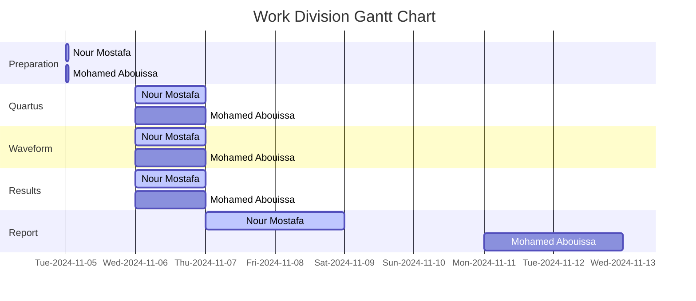

# <p align="center">Memory Blocks</p>

// anchor abstract

---

In modern computer systems, memory is a critical resource that supports efficient data storage and access for processing operations. Field-Programmable Gate Arrays (FPGAs) offer versatile platforms for implementing memory due to their reconfigurable nature and the inclusion of dedicated memory resources. These resources, such as `M9K` and `M10K` memory blocks available in Intel FPGAs, enable the development of custom memory architectures optimized for specific applications.

This lab explores the design and implementation of a 32x4-bit Random Access Memory (RAM) module using the memory blocks in Intel FPGAs, such as those found on `DE10-Lite`, `DE0-CV`, `DE1-SoC`, and `DE2-115` boards. These FPGA boards feature the `MAX 10`, `Cyclone IV`, and `Cyclone V` series FPGAs, which include either `M9K` or `M10K` memory blocks. `M9K` blocks provide `9216 bits` of memory each, while `M10K` blocks offer `10240 bits`. By configuring these blocks with an aspect ratio of 4-bit width and 32-word depth, this exercise demonstrates how on-chip memory can be allocated and organized to meet specific design needs.

[Figure 1](Photos/32x4 (RAM)) illustrates the structure of a 32x4-bit Random Access Memory (RAM) module, which includes essential input and output ports for accessing and managing stored data. The module features a 5-bit address port that allows access to any of the 32 memory locations, as `$2^5 = 32$` Each location, or `word` in the RAM can store 4 bits of data. A Write control input is also provided to dictate whether the module operates in write or read mode. When the Write signal is active, the data at the specified address is updated with the value provided at the Data port. Conversely, when the Write signal is inactive, the module is in read mode, allowing data retrieval from the specified address. The Data port is a 4-bit bidirectional line used for both input and output, making it possible to write 4-bit values to the RAM during write operations and retrieve 4-bit values during read operations. This setup enables efficient management of 32 four-bit words using a compact, straightforward configuration.

## Procedure & Implementation

// anchor

<details>
  <summary>VHDL Code</summary>
<br>

```VHDL


```

</details>


<details>
  <summary>Practical Results</summary>
	
<be>

 <p align="center">	 
  
</p>

// anchor

<p align="center">
    
 </p>

// anchor

 <p align="center">
    
 </p>

// anchor

 <p align="center">
   
  
 </p>

// anchor
  
 <p align="center">
 
</p>

// anchor

 <p align="center">	 
  
</p>

// anchor
	
</details>

<details>
  <summary>Simulation Results</summary>
	
<br>

<p align="center">
  
</p>

// anchor

</details>

## Conclusion

// anchor

## Resources
|3| Ashenden, P. J. (2008). The designer’s guide to VHDL (3rd ed). Morgan Kaufmann Publishers.   
// anchor

<br>



We extend our sincere appreciation to Eng. Umar Adeel for his insightful feedback which has significantly contributed to the successful completion of this experiment.

This publication adheres to all regulatory laws and guidelines established by the American University of Ras Al Khaimah (AURAK) regarding the dissemination of academic materials.
