# <p align="center">Understanding Cache Memories</p>

The objective of this lab is to explore and analyze cache memory behavior and optimization techniques using simulation and practical experimentation. By employing Linux-based tools, including Valgrind, we investigate the impact of cache parameters—such as associativity, block size, and set count—on cache performance metrics like hits, misses, and evictions. In the second part, we focus on optimizing a small matrix transpose function to minimize cache misses, emphasizing memory access patterns, cache line utilization, and spatial locality. These experiments enhance our understanding of how cache architecture influences computational efficiency and performance.

---

This lab cannot be conducted on a Windows machine due to several fundamental reasons related to system architecture, tools, and compatibility. First, the cache experiment relies on specific Linux-based tools, such as Valgrind, which are integral to analyzing memory traces and simulating cache behavior. Valgrind is optimized for Linux environments and is not natively supported on Windows, making it difficult to replicate the required setup and functionality. Additionally, Linux provides robust support for the command-line utilities, scripting capabilities, and system-level access required for this lab. These features are essential for interacting with the cache simulation software and analyzing memory operations. Linux also offers native support for handling .tar files and other Unix-based utilities that simplify the setup process for the lab materials. In contrast, Windows lacks the same level of native compatibility with these tools and formats, requiring additional software or modifications that may complicate or compromise the experimental workflow. Finally, the experiment is tailored to a 64-bit x86-64 Linux architecture, ensuring consistency and reliability in the memory operations being simulated. Conducting the lab on a different operating system could introduce discrepancies in memory management behavior, compromising the validity of the results. For these reasons, Linux is the preferred and most practical environment for conducting this cache experiment.

Linux Mint is a popular Linux distribution known for its simplicity, stability, and user-friendly interface, making it an excellent choice for both beginners and experienced users. Based on Ubuntu and Debian, Linux Mint offers a balance of modern features and reliable performance. Its flagship desktop environments, Cinnamon, MATE, and Xfce, provide a range of options tailored to various hardware capabilities and user preferences. Cinnamon, in particular, is celebrated for its polished and intuitive design, resembling traditional desktop environments like Windows, which helps ease the transition for users new to Linux. One of the key reasons to choose Linux Mint is its commitment to usability out of the box. It comes pre-installed with essential software like the LibreOffice suite, multimedia codecs, and a suite of everyday tools, reducing the need for post-installation setup. The Software Manager simplifies application installation and management, offering a curated list of software that's easy to browse and install. Linux Mint is also renowned for its stability, thanks to its long-term support (LTS) release model, which ensures a consistent and secure experience over time. This makes it an appealing choice for users who value a dependable operating system for work or personal use. Its resource efficiency is another major advantage, particularly with the MATE and Xfce versions, which are optimized for older or low-spec hardware, breathing new life into aging computers. 

We will be using the lab handout bundled in `cachelab.tar` to conduct this experiment. The `.tar` file format, short for Tape Archive, is a popular method for bundling multiple files and directories into a single file. Originating from Unix systems, `.tar` serves primarily as a container rather than a compressed file format. It simplifies the organization, distribution, and backup of data by grouping related files into a cohesive archive. While .tar files are often associated with compression, they are not inherently compressed. However, they are frequently used alongside compression algorithms like gzip or bzip2, resulting in hybrid file extensions such as `.tar.gz` or `.tar.bz2`. A *tarball* is simply a colloquial term for a .tar archive, often referring to both plain .tar files and their compressed counterparts. Tarballs are a staple in software distribution and deployment on Linux systems, making it easier to package and distribute multiple files. For instance, source code for software projects is often distributed as tarballs to ensure consistency across installations. Contrary to common misconceptions, tools like WinRAR and 7-Zip are capable of handling `.tar` files and tarballs. However, the issue might arise if the file is not properly associated with these tools or if the file type is misunderstood as requiring compression extraction. It's important to note: `.tar` files are not compressed, and extracting them does not reduce their size further. Improper handling of `.tar` files in some tools might lead to errors or data loss, especially when dealing with compressed tarballs, due to unsupported compression methods.

__Cache__ is a small, high-speed memory located either within the processor or close to it, designed to temporarily store frequently accessed data and instructions. It acts as an intermediary between the main memory (RAM) and the central processing unit (CPU), providing much faster access times. The *purpose* of the cache is to reduce the latency of fetching data from slower main memory, enhancing the overall performance of the system.  CPUs operate significantly faster than RAM, and without a cache, the processor would often remain idle while waiting for data. Cache reduces this bottleneck by storing data that is likely to be reused soon. This improves execution speed, minimizes latency, and enhances system performance for compute-intensive applications, including gaming, scientific calculations, and multitasking. Cache operates by leveraging the principles of *locality of reference*, which assumes that programs tend to access the same memory locations (temporal locality) or memory locations close to each other (spatial locality) frequently. When the CPU requests data, the cache is checked first. If the data is found (cache hit), it is quickly retrieved. If not (cache miss), the data is fetched from main memory and stored in the cache for potential future use. This strategy ensures that subsequent accesses are faster. Caches are structured as small memory blocks managed using various policies. They use a process called *mapping*, where data from main memory is mapped into specific cache locations. The most common mapping techniques are direct mapping, associative mapping, and set-associative mapping. Additionally, cache replacement policies, such as least recently used (LRU) or first in, first out (FIFO), determine which data to evict when the cache is full. Caches also rely on write policies like write-through and write-back to manage how updates to data are reflected in main memory. Cache operates in different *modes* that influence how data is handled between the cache and main memory. In *write-through mode*, data is written simultaneously to both the cache and the main memory, ensuring data consistency but incurring slightly higher latency due to the dual write operations. In contrast, *write-back mode* writes data to the cache first and updates the main memory only when the cache block is replaced, improving performance at the cost of more complex data consistency management. Additionally, some systems provide a cache enabled/disabled mode, allowing the cache to be explicitly toggled for debugging or compatibility purposes. Caches are categorized based on their purpose and the kind of data they store. An instruction cache holds instructions that the CPU fetches for execution, improving the efficiency of control flow in programs. A data cache stores frequently accessed data, accelerating memory operations and reducing latency. Some systems use a unified cache that combines instruction and data caching, simplifying hardware design at the expense of potential contention between instructions and data. These specialized caches work together to optimize different aspects of system performance. Caches are structured hierarchically into *levels* to balance speed, size, and cost. L1 cache (Level 1) is the smallest and fastest, located directly within the CPU core, and often split into separate instruction and data caches. L2 cache (Level 2) is larger and slower, serving as an intermediate cache, and may be shared between multiple CPU cores or dedicated to each core depending on the processor architecture. L3 cache (Level 3) is the largest and slowest, shared among all cores in modern CPUs, acting as the final level of cache before accessing the main memory. This tiered design ensures efficient data access across various workloads. In multi-core processors, cache coherency ensures that all CPU cores have a consistent view of shared data. For example, if one core modifies a value in its cache, other cores must either update their cached value or invalidate it. Protocols like MESI (Modified, Exclusive, Shared, Invalid) are used to maintain coherency. While caches are vital for performance, they present certain *challenges*. Energy consumption is a significant concern, as larger and more complex caches consume considerable power, which is especially critical in mobile and embedded systems. The cost of high-speed cache memory is much higher than that of main memory, limiting how much cache can be included in a system. Additionally, diminishing returns become evident as adding more cache levels or increasing cache size does not always result in proportional performance improvements due to increased latency and architectural constraints. These limitations require careful consideration during system design.

For this experiment, we did not develop or write any of the code used. By leveraging ready-made software, we focused our efforts on the execution and analysis of the experiment rather than the development process. Our primary role was to configure the environment, input the necessary parameters, and interpret the results generated by these tools, aligning them with the objectives of the lab.

## Part 1: Cache Memory Simulator

Create a program that accepts three command-line arguments: s, E, and b. It takes a Valgrind memory trace file as input, simulates the hit, miss, and eviction behavior of a cache memory on this trace, and outputs the total number of hits, misses, and evictions.

Note that command-line arguments are parameters passed to a program at the time you run it in the terminal or command prompt. They are provided immediately after the program name when invoking it, and the program reads them directly without prompting the user interactively. If this code is run in any compiler, you won't be prompted to enter s, E, and b. This brings our attention to a slightly irrelevant but valuable piece of information: There are two common styles of program interaction, and they are often chosen based on the purpose and design goals of the software.
1. __Interactive Input Style__: The program prompts the user interactively during execution to enter the required inputs. In other words, when you run this program, it will pause execution and prompt you to type in the values. The advantages of this are that it's easy for beginners to understand and use and it's user-friendly for small-scale or one-off programs. The disadvantages are that it's not ideal for automation and it makes testing and debugging harder because the program relies on live user input.
2. __Command-Line Argument Style__: The program takes input directly from the command line when it is executed, without prompting the user interactively. The advantage of that is that it's perfect for automation and scripting, easier to test, as inputs can be predefined in scripts or commands, and more flexible for large-scale or repeatable tasks. The disadvantage is that it can be less intuitive for beginners as it requires the user to be well-informed about how the program operates and what it needs from them without being prompted and to remember the syntax of passing different types of arguments.

<details>
  <summary>C Code</summary>
<br>

``` C
/* 
 * csim.c - A cache simulator that can replay traces from Valgrind
 *     and output statistics such as number of hits, misses, and
 *     evictions.  The replacement policy is LRU.
 *
 * Implementation and assumptions:
 *  1. Each load/store can cause at most one cache miss. (I examined the trace,
 *  the largest request I saw was for 8 bytes).
 *  2. Instruction loads (I) are ignored, since we are interested in evaluating
 *  trans.c in terms of its data cache performance.
 *  3. data modify (M) is treated as a load followed by a store to the same
 *  address. Hence, an M operation can result in two cache hits, or a miss and a
 *  hit plus an possible eviction.
 *
 * The function printSummary() is given to print output.
 * Please use this function to print the number of hits, misses and evictions.
 * This is crucial for the driver to evaluate your work. 
 */
#include <getopt.h>
#include <stdlib.h>
#include <unistd.h>
#include <stdio.h>
#include <assert.h>
#include <math.h>
#include <limits.h>
#include <string.h>
#include <errno.h>
#include "cachelab.h"

//#define DEBUG_ON 
#define ADDRESS_LENGTH 64

/* Type: Memory address */
typedef unsigned long long int mem_addr_t;

/* Type: Cache line
   LRU is a counter used to implement LRU replacement policy  */
typedef struct cache_line {
    char valid;
    mem_addr_t tag;
    unsigned long long int lru;
} cache_line_t;

typedef cache_line_t* cache_set_t;
typedef cache_set_t* cache_t;

/* Globals set by command line args */
int verbosity = 0; /* print trace if set */
int s = 0; /* set index bits */
int b = 0; /* block offset bits */
int E = 0; /* associativity */
char* trace_file = NULL;

/* Derived from command line args */
int S; /* number of sets */
int B; /* block size (bytes) */

/* Counters used to record cache statistics */
int miss_count = 0;
int hit_count = 0;
int eviction_count = 0;
unsigned long long int lru_counter = 1;

/* The cache we are simulating */
cache_t cache;  
mem_addr_t set_index_mask;

/* 
 * initCache - Allocate memory, write 0's for valid and tag and LRU
 * also computes the set_index_mask
 */
void initCache()
{
    int i,j;
    cache = (cache_set_t*) malloc(sizeof(cache_set_t) * S);
    for (i=0; i<S; i++){
        cache[i]=(cache_line_t*) malloc(sizeof(cache_line_t) * E);
        for (j=0; j<E; j++){
            cache[i][j].valid = 0;
            cache[i][j].tag = 0;
            cache[i][j].lru = 0;
        }
    }

    /* Computes set index mask */
    set_index_mask = (mem_addr_t) (pow(2, s) - 1);
}


/* 
 * freeCache - free allocated memory
 */
void freeCache()
{
    int i;
    for (i=0; i<S; i++){
        free(cache[i]);
    }
    free(cache);
}


/* 
 * accessData - Access data at memory address addr.
 *   If it is already in cache, increast hit_count
 *   If it is not in cache, bring it in cache, increase miss count.
 *   Also increase eviction_count if a line is evicted.
 */
void accessData(mem_addr_t addr)
{
    int i;
    unsigned long long int eviction_lru = ULONG_MAX;
    unsigned int eviction_line = 0;
    mem_addr_t set_index = (addr >> b) & set_index_mask;
    mem_addr_t tag = addr >> (s+b);

    cache_set_t cache_set = cache[set_index];

    for(i=0; i<E; i++){
        if(cache_set[i].tag==tag && cache_set[i].valid){
            hit_count++;
            if(verbosity)
                printf("hit ");
            cache_set[i].lru = lru_counter++;
            return;
        }
    }

    /* If we reach this line, then we have a cache miss */
    miss_count++;
    if (verbosity)
        printf("miss ");
    for(i=0; i<E; i++){
        if (cache_set[i].lru < eviction_lru){
            eviction_line = i;
            eviction_lru = cache_set[i].lru;
        }
    }

    if( cache_set[eviction_line].valid ){
        eviction_count++;
        if (verbosity)
            printf("eviction ");
    }
  
    cache_set[eviction_line].valid = 1;
    cache_set[eviction_line].tag = tag;
    cache_set[eviction_line].lru = lru_counter++;
}


/*
 * replayTrace - replays the given trace file against the cache 
 */
void replayTrace(char* trace_fn)
{
    char buf[1000];
    mem_addr_t addr=0;
    unsigned int len=0;
    FILE* trace_fp = fopen(trace_fn, "r");

    if(!trace_fp){
        fprintf(stderr, "%s: %s\n", trace_fn, strerror(errno));
        exit(1);
    }

    while( fgets(buf, 1000, trace_fp) != NULL) {
        if(buf[1]=='S' || buf[1]=='L' || buf[1]=='M') {
            sscanf(buf+3, "%llx,%u", &addr, &len);
      
            if(verbosity)
                printf("%c %llx,%u ", buf[1], addr, len);

            accessData(addr);

            /* If the instruction is R/W then access again */
            if(buf[1]=='M')
                accessData(addr);
            
            if (verbosity)
                printf("\n");
        }
    }

    fclose(trace_fp);
}

/*
 * printUsage - Print usage info
 */
void printUsage(char* argv[])
{
    printf("Usage: %s [-hv] -s <num> -E <num> -b <num> -t <file>\n", argv[0]);
    printf("Options:\n");
    printf("  -h         Print this help message.\n");
    printf("  -v         Optional verbose flag.\n");
    printf("  -s <num>   Number of set index bits.\n");
    printf("  -E <num>   Number of lines per set.\n");
    printf("  -b <num>   Number of block offset bits.\n");
    printf("  -t <file>  Trace file.\n");
    printf("\nExamples:\n");
    printf("  linux>  %s -s 4 -E 1 -b 4 -t traces/yi.trace\n", argv[0]);
    printf("  linux>  %s -v -s 8 -E 2 -b 4 -t traces/yi.trace\n", argv[0]);
    exit(0);
}

/*
 * main - Main routine 
 */
int main(int argc, char* argv[])
{
    char c;

    while( (c=getopt(argc,argv,"s:E:b:t:vh")) != -1){
        switch(c){
        case 's':
            s = atoi(optarg);
            break;
        case 'E':
            E = atoi(optarg);
            break;
        case 'b':
            b = atoi(optarg);
            break;
        case 't':
            trace_file = optarg;
            break;
        case 'v':
            verbosity = 1;
            break;
        case 'h':
            printUsage(argv);
            exit(0);
        default:
            printUsage(argv);
            exit(1);
        }
    }

    /* Make sure that all required command line args were specified */
    if (s == 0 || E == 0 || b == 0 || trace_file == NULL) {
        printf("%s: Missing required command line argument\n", argv[0]);
        printUsage(argv);
        exit(1);
    }

    /* Compute S, E and B from command line args */
    S = (unsigned int) pow(2, s);
    B = (unsigned int) pow(2, b);
 
    /* Initialize cache */
    initCache();

#ifdef DEBUG_ON
    printf("DEBUG: S:%u E:%u B:%u trace:%s\n", S, E, B, trace_file);
    printf("DEBUG: set_index_mask: %llu\n", set_index_mask);
#endif
 
    replayTrace(trace_file);

    /* Free allocated memory */
    freeCache();

    /* Output the hit and miss statistics for the autograder */
    printSummary(hit_count, miss_count, eviction_count);
    return 0;
}
```

</details>


<details>
  <summary>Analysis of Results</summary>
	
<br>

<p align="center">
  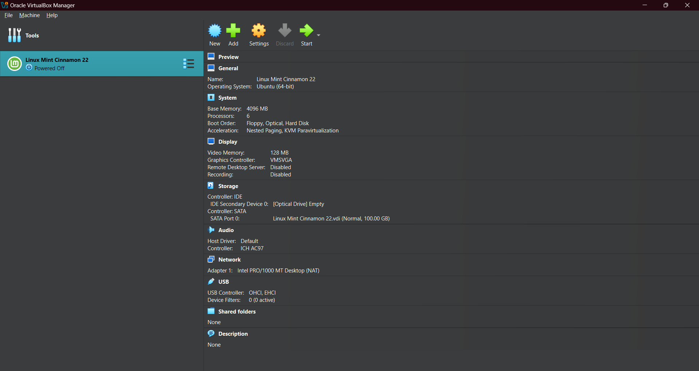 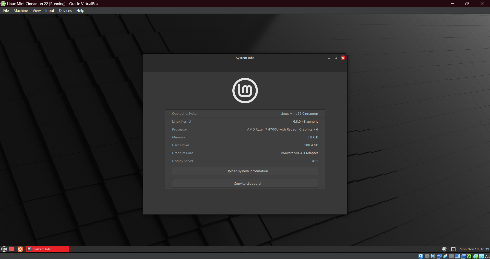 
</p>

The steps outlined above detail the process for launching the virtual machine used to conduct this lab's experiments. Additionally, we have included an image showcasing the system specifications for reference.

<br>

<p align="center">
  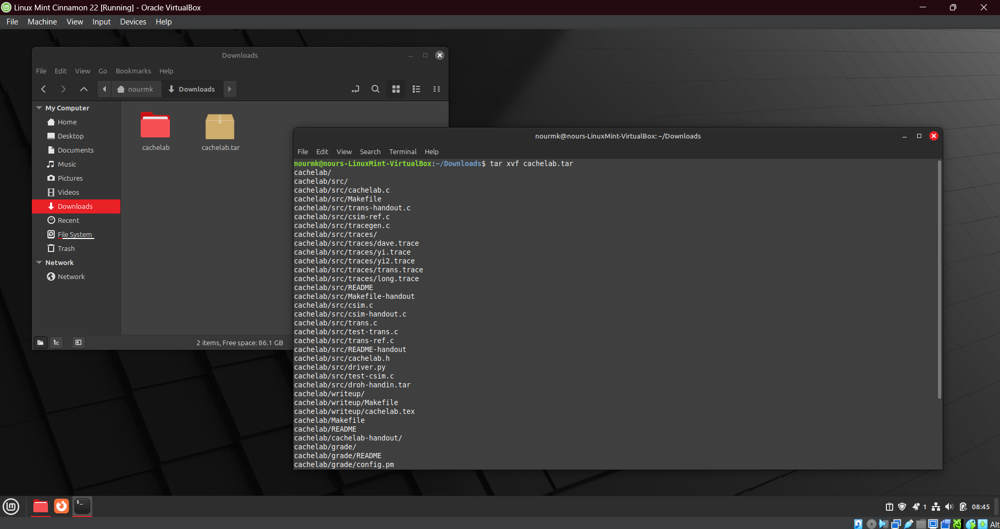 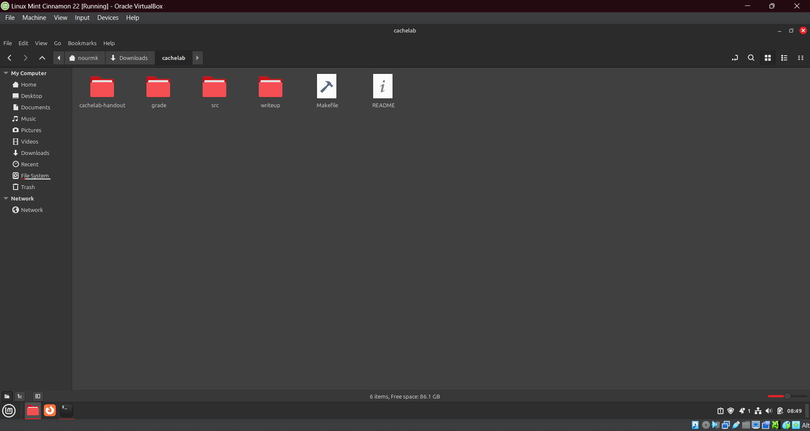 
</p>

On the left, we demonstrate the process of extracting the .tar file. On the right, we explore the directory and subfiles it generated. The command `tar xvf` is used to extract files from a .tar archive in Linux and other Unix-like systems. The tar utility stands for "tape archive" and is commonly used to create and manipulate archive files. The flags `x`, `v`, and `f` modify its behavior. The `x` flag stands for "extract," indicating that you want to extract the contents of the archive. The `v` flag stands for "verbose," meaning the command will display a list of files as they are extracted, allowing the user to see the progress. The `f` flag specifies that the next argument is the name of the file to extract, which must immediately follow the f flag.

<br>

<p align="center">
  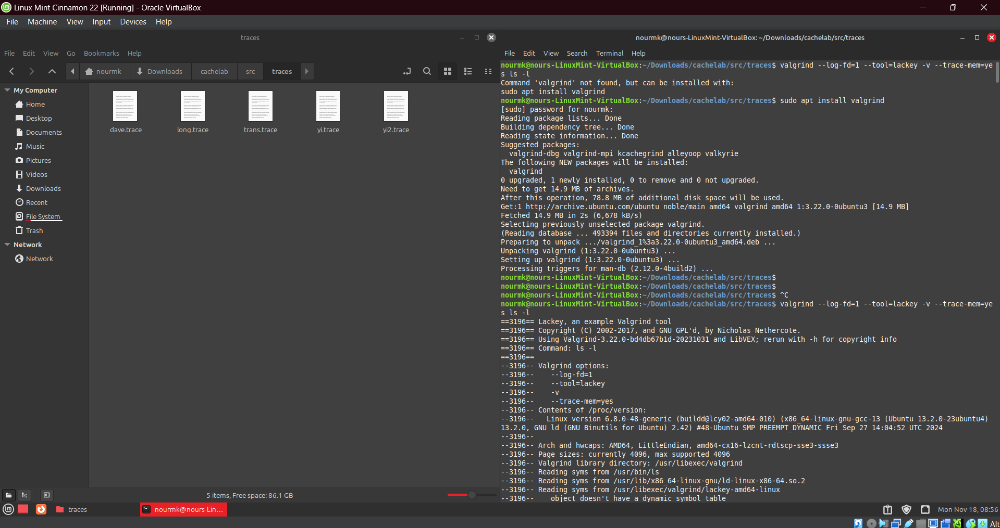 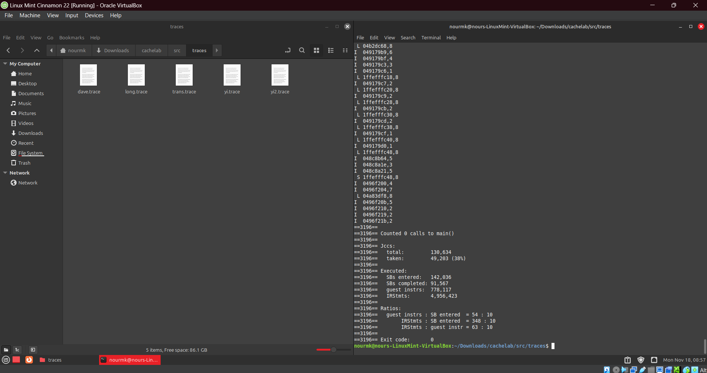 
</p>

The screenshots show a side-by-side view of the Linux terminal and the file manager. We captured the process of installing and using the Valgrind command, along with the results it generates. `sudo apt` is a command used in Linux-based systems, such as Ubuntu and Debian, for package management. The `sudo` part stands for "SuperUser Do," which grants administrative privileges to execute commands that require elevated permissions. `apt` stands for "Advanced Package Tool" and is the command-line interface used to manage software packages on Debian-based systems. Using `sudo apt`, you can perform various tasks like installing, removing, and updating software packages. As for `Valgrind`, it is a programming tool used primarily for memory debugging, memory leak detection, and profiling. It is most commonly associated with C and C++ programs, though it can be used for other languages as well. Valgrind helps developers identify issues such as memory leaks (where allocated memory is not properly freed), improper memory access, and memory corruption, which can lead to program crashes or unpredictable behavior. By running a program through Valgrind, it monitors memory usage and detects errors such as reading from or writing to memory locations that have already been freed or are uninitialized. The tool also provides detailed reports about where and when memory errors occur, making it easier to track down bugs. Additionally, Valgrind includes performance profiling tools that can help identify inefficient code sections by measuring memory usage and CPU time. As a result, it is an invaluable tool for ensuring the correctness and efficiency of software, especially in large and complex applications. The command `valgrind --log-fd=1 --tool=lackey -v --trace-mem=yes ls -l` is using Valgrind to monitor the behavior of the `ls -l` command. In this specific case, Valgrind is configured to run with the `lackey` tool, which is used for tracing memory accesses and logging them. The option `--log-fd=1` specifies that Valgrind should write its output to file descriptor 1 (standard output), while the `-v` flag enables verbose mode, providing detailed output. The `--trace-mem=yes` option tells Valgrind to track and report all memory accesses during the execution of the `ls -l` command, which lists directory contents with detailed information (like file size, permissions, and modification date).

<br>

<p align="center">
  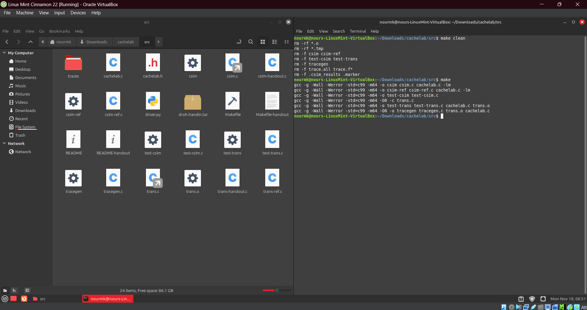 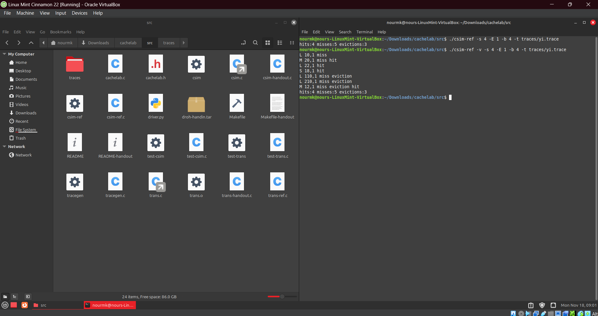 
</p>

The `make` and `make clean` commands are used in a directory containing a `Makefile` to manage and build a project. The `make` command builds the project according to the rules specified in the `Makefile`. It compiles and links the source files into an executable or binary by following the instructions defined in the file. `make` checks the timestamps of files and only recompiles the parts that are outdated, which makes the build process more efficient. On the other hand, the `make clean` command is used to remove files generated during the build process, such as object files and executables. This ensures that the build directory is free from compiled files, allowing for a clean build from scratch. It is often used to reset the build environment or resolve issues related to previous builds, and the specific files removed depend on the `clean` target in the `Makefile`. The reference simulator accepts several command-line arguments `./csim-ref [-hv] -s <s> -E <E> -b <b> -t <tracefile>` to configure its behavior. The `-h` flag is optional and provides usage information when invoked. The `-v` flag, also optional, enables verbose output, displaying trace information. The `-s <s>` argument specifies the number of set index bits, where S = $2^s$ represents the number of sets in the cache. The `-E <E>` flag defines the associativity, which is the number of lines per set in the cache. The `-b <b>` argument sets the number of block bits, where B = $2^b$ denotes the block size in the cache. Finally, the `-t <tracefile>` flag specifies the name of the Valgrind trace file to replay during the simulation. These arguments together allow the user to customize the simulator's settings for different cache configurations and trace files. In the photo on the right, we see the same command running in both the short and verbose modes on the same file and using the same s, E, b parameters.

<br>

<p align="center">
  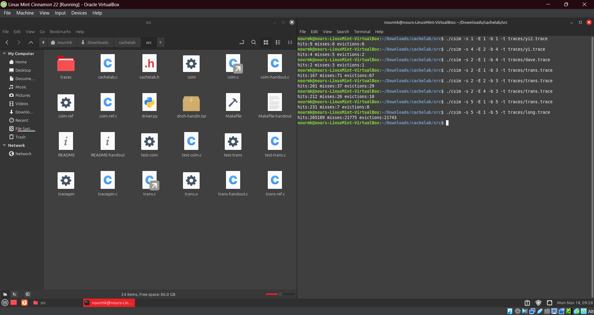
</p>

// anchor

<br>

### Questions

1. __What is the command you used to install `make` command?__
2. __What is the command you used to install `valgrind` simulator?__
3. __Why did we use `valgrind`?__ <br> <br> In this experiment, we utilized Valgrind, a powerful tool for analyzing and debugging programs, to generate reference trace files stored in the traces subdirectory of the provided handout directory. These trace files represent memory access patterns from various programs and serve as input for evaluating the correctness of the cache simulator developed in Part A. By simulating real-world memory operations, Valgrind allows us to test how well the cache simulator handles hits, misses, and evictions, ensuring its accuracy and reliability in modeling cache behavior. Valgrind is a versatile tool used for dynamic analysis of programs, offering a range of functionalities to improve code reliability and performance. One of its key features is the ability to monitor memory usage by running programs in a virtualized environment. For example, Valgrind can run an executable program like `ls -l`, trace each memory access the program makes in the order it occurs, and output this trace, typically to the terminal (stdout) or a file if redirected. Depending on the specific tool within Valgrind, it can detect memory leaks, identify invalid memory accesses, and track allocation issues, making it invaluable for debugging and testing. In addition to memory debugging, Valgrind is widely used for performance profiling. It can generate detailed traces of memory operations, such as loads, stores, and instructions executed, which are critical for cache optimization and identifying performance bottlenecks. In the context of a cache simulator, Valgrind serves as a generator of memory trace files. These traces log the sequence of memory operations performed by a program, capturing details such as the type of operation, the memory address accessed, and the data size. By running programs and capturing their memory access patterns, Valgrind enables the testing of cache simulators, ensuring they accurately model cache behavior and performance. 


4. __Capture the output of the following command and explain it `linux> valgrind --log-fd=1 --tool=lackey -v --trace-mem=yes ls -l`.__
5. __Capture the output of the following command and explain it `linux> ./csim-ref -s 4 -E 1 -b 4 -t traces/yi.trace`.__
6. __Calculate the S, E, and B.__


<br>
	
</details>


## Part 2: Optimizing a Small Matrix Transpose Function to Minimize Cache Misses

The transpose of a matrix plays a significant role in optimizing computational performance and memory efficiency, particularly in the context of computer cache. Cache optimization is critical in matrix operations, as accessing memory in a way that aligns with cache design can significantly improve performance. The significance of matrix transpose in computer cache lies in its impact on memory access patterns, cache line utilization, and overall computational efficiency. By understanding and optimizing these patterns, developers can enhance performance in numerical computing, machine learning, graphics, and scientific simulations. Efficient matrix transposition algorithms are key to leveraging modern processor architectures, where cache behavior is a critical determinant of performance.

1. In most programming languages, matrices are stored in memory as a one-dimensional array, either in row-major order (e.g., C) or column-major order (e.g., Fortran, MATLAB). Row-major order stores elements of each row contiguously, while column-major order stores elements of each column contiguously. When transposing a matrix, this storage layout leads to a significant change in the memory access pattern. Instead of accessing contiguous elements, transposition often requires jumping across rows or columns, which can disrupt cache efficiency and lead to frequent cache misses unless the algorithm is optimized for such operations.

2. Modern processors fetch data into cache in blocks called cache lines. When matrix elements are accessed contiguously in memory, multiple elements fit within a single cache line, improving spatial locality and reducing the need to repeatedly access slower main memory. During matrix transposition, however, elements are often accessed non-contiguously, which wastes cache line capacity and increases memory fetches. Optimized transposition algorithms align memory accesses with cache lines, ensuring better utilization of each cache fetch and minimizing unnecessary cache misses.

3. Matrix transposition efficiency has a direct impact on various computational tasks. For example, in matrix multiplication, transposing one matrix can improve performance by aligning its access pattern with the memory layout. For instance, if matrix B in A×B is stored in column-major order but needs row-wise access, transposing it enables faster, cache-friendly row-wise access. Similarly, transposition appears in critical linear algebra operations, such as solving systems of equations and eigenvalue computations, where efficient cache use can significantly enhance computation speed.

4. Stride refers to the distance in memory between consecutively accessed elements. Transposing a matrix stored in row-major order by accessing it column-by-column—or vice versa for column-major storage—creates a large stride. This reduces temporal locality, as cache lines fetched for one element cannot be reused for subsequent accesses, leading to frequent cache misses. To mitigate this, optimized algorithms such as blocking or tiling divide the matrix into smaller sections that fit into cache. This ensures that memory access remains contiguous within each block, preserving spatial locality and improving cache performance.

5. In parallel computing, matrix transposition must be carefully designed to avoid cache-related inefficiencies. Poorly structured algorithms can cause multiple threads to compete for the same cache lines, leading to cache contention. Similarly, false sharing occurs when threads inadvertently interfere with each other's cached data, causing unnecessary invalidations. Optimized transposition algorithms address these issues by assigning separate blocks of the matrix to different threads, ensuring minimal overlap in cache usage and maximizing both parallelism and cache efficiency.


<details>
<summary>C Code</summary>
<br>

`trans.c`:
This file contains multiple implementations of the matrix transpose function. The primary function is `transpose_submit`, which is the solution that will be graded. Additional transpose functions are provided for experimentation and comparison. The `registerFunctions` function registers all the transpose functions so they can be evaluated. The `is_transpose` function is a helper to check if the transpose was performed correctly.


`test-trans.c`:
This file is designed to test the correctness and performance of the transpose functions defined in `trans.c`. It uses external tools and libraries to generate memory traces and evaluate cache performance. The `eval_perf` function runs the registered transpose functions, validates their correctness, and measures cache misses. The main function sets up the testing environment, installs signal handlers, and calls `eval_perf` to perform the evaluation.

<br>

``` C
/* 
 * trans.c - Matrix transpose B = A^T
 * Each transpose function has a prototype of the form:
 * void trans(int M, int N, int A[N][M], int B[M][N]);
 * Each function is evaluated by counting the number of misses 
 * on a 1KB direct mapped cache with a block size of 32 bytes.
 */

#include <stdio.h>
#include "cachelab.h"

/* 
 * transpose_submit - This is the solution transpose function that you
 *     will be graded on for Part B of the assignment. Do not change
 *     the description string "Transpose submission", as the driver
 *     searches for that string to identify the transpose function to
 *     be graded. The REQUIRES and ENSURES from 15-122 are included
 *     for your convenience. They can be removed if you like.
 */
char transpose_submit_desc[] = "Transpose submission";
void transpose_submit(int M, int N, int A[N][M], int B[M][N]){
    // Transpose function written by Pranav Senthilnathan
    // Code for 61 x 67 array case from Shrikant Mether
    if(N == 32 && M == 32)
        {
            // Bocking with block size 8x8
            int x,y,i,j;
            for(x=0; x<N; x+=8)
                {
                    for(y=0; y<M; y+=8)
                        {
                            for(i=x; (i<x+8) && (i<N) ; i++)
                                {
                                    for(j=y; (j<y+8) && (j<M); j++ )
                                        {
                                            /* Diagonal entries in diagonal blocks force cache miss
                                             *  In this case the cache has B_i,..,B_{i-1},A_i,B_{i+1},..,B_{i+7}
                                             *  so writing into B_i will evict A_i. But we need to read A_i again
                                             *  so we get another miss while moving A_i back in
                                             *  To alleviate this problem we set B_i at the end, so (1) we
                                             *  won't need to read A_i again and (2) we have B_i when i <- i+1
                                             */
                                            if(y == x && i == j) continue;
                                            B[j][i] = A[i][j];
                                        }
                                    if(y == x) B[i][i] = A[i][i];
                                }
                        }
                }
        }
    else if(N == 64 && M == 64)
        {
            // Blocking with block size 8x8 and subblocks 4x4
            // Overview of an 8x8 block and its subblock:
            // A = ---------  B = ---------
            //     | W | X |      | W'| Y'|
            //     ---------      ---------
            //     | Y | Z |      | X'| Z'|
            //     ---------      ---------
            // 1) Move X^t into X', W^t into Z'
            // 2) Move Z into Z' while moving W^t from Z' to W' 
            // 3) Move XY into Y'
            int x,y,i,j;
            // Temporary storage for step 2. 
            int tmp1, tmp2, tmp3, tmp4, tmp5, tmp6;
            for(x=0; x<N; x+=8){
                for(y=0; y<M; y+=8){
                    // Step 1
                    for(i=x; (i<x+4) && (i<N) ; i++)
                        {
                            for(j=y; (j<y+4) && (j<M); j++ )
                                {
                                    // Save diagonal transpose for later
                                    if(i == j)
                                        {
                                            tmp1 = A[i][i];
                                            tmp2 = A[i][i+4];
                                            continue;
                                        }
                                    B[j+4][i+4] = A[i][j];
                                    B[j+4][i] = A[i][j+4];
                                }
                            if(x == y)
                                {
                                    B[i+4][i+4] = tmp1;
                                    B[i+4][i] = tmp2;
                                }
                        }
    
                    // Step 2           
                    for(j=y+4; (j<y+8) && (j<M) ; j++)
                        {
                            // this A line will be evicted from cache so store it in tmp vars
                            tmp1 = A[x+4][j];
                            tmp2 = A[x+5][j];
                            tmp3 = A[x+6][j];
                            tmp4 = A[x+7][j];

                            // Diagonal entry memoization for step 3
                            if(x == y) tmp5 = A[j][j-4];

                            // Loading B line evicts A, so get A's vals from tmp vars
                            // Also store in B's old vals to move up in the tmp vars
                            tmp6 = B[j][x+4];
                            B[j][x+4] = tmp1;
                            tmp1 = tmp6;

                            tmp6 = B[j][x+5];
                            B[j][x+5] = tmp2;
                            tmp2 = tmp6;

                            tmp6 = B[j][x+6];
                            B[j][x+6] = tmp3;
                            tmp3 = tmp6;

                            tmp6 = B[j][x+7];
                            B[j][x+7] = tmp4;
                            tmp4 = tmp6;

                            // B's old val that need to be moved up have been evicted,
                            // but we had them stored in tmp vars
                            B[j-4][x] = tmp1;
                            B[j-4][x+1] = tmp2;
                            B[j-4][x+2] = tmp3;
                            B[j-4][x+3] = tmp4;
 
                            // Step 3
                            for(i=x+4; (i<x+8) && (i<M); i++ )
                                {
                                    if(x == y && i == j)
                                        {
                                            B[j-4][i] = tmp5;
                                            continue;
                                        }
                                    B[j-4][i] = A[i][j-4];
                                }
                        }
                }
            }
        }
    else
        {
            int i, j, k;
            int MAX_INTS_IN_CACHE = 32*8;
            /* increment - Estimated number of integers which can be used from cache
             * without causing a miss
             */
            int increment;

            if(M < 32 || MAX_INTS_IN_CACHE % M)
                increment = 8;
            else
                increment = MAX_INTS_IN_CACHE / M;


            for(i = 0; i < M; i+= increment){
                for(j = 0; j < N; j++){
                    B[i][j] = A[j][i];

                    for(k = 1; k < increment && i + k < M; k++)
                        B[i + k][j] = A[j][i + k]; 
                }
            }
        } 
}

/* 
 * You can define additional transpose functions below. We've defined
 * a simple one below to help you get started. 
 */ 
char trans_desc[] = "Simple row-wise scan transpose";
void trans(int M, int N, int A[N][M], int B[M][N]) 
{ 
// inefficient due to its access pattern resulting in relatively many cache misses 
// This function iterates over the matrix A row by row. For each element A[i][j], it assigns the value to B[j][i].
// This row-wise access pattern does not utilize the spatial locality of the cache effectively, leading to more cache misses compared to a blocked or tiled approach.

    int i, j, tmp;
    for (i = 0; i < N; i++){
        for (j = 0; j < M; j++){
            tmp = A[i][j];
            B[j][i] = tmp;
        }
    }    
}

/*
 * trans_cheat - cheating by using a temporary array on the stack
 */
char trans_cheat_desc[] = "Illegal version that uses stack array";
void trans_cheat(int M, int N, int A[N][M], int B[M][N])
{
    int i, j;
    int C[68][68]; /* Illegal! */
    for (i = 0; i < N; i++){
        for (j = 0; j < M; j++){
            C[i][j] = A[i][j];
        }
    }    
    for (i = 0; i < N; i++){
        for (j = 0; j < M; j++){
            B[i][j] = C[j][i];
        }
    }    
}

char trans_col_desc[] = "column-wise scan transpose";
void trans_col(int M, int N, int A[N][M], int B[M][N]){
    int i, j, tmp;
    for (j = 0; j < M; j++){
        for (i = 0; i < N; i++){
            tmp = A[i][j];
            B[j][i] = tmp;
        }
    }    
}

char zig_zag_desc[] = "using a zig-zag access pattern";
void zig_zag(int M, int N, int A[N][M], int B[M][N]){
    int i, j;
    for (i = 0; i < N; i++){
        for (j = 0; j < M; j++){
            if(i % 2 == 0){
                B[j][i] = A[i][j];
            }else{
                B[M-1-j][i] = A[i][M-1-j];
            }
        }
    }  
}

char trans_blocking_desc[] = "Better locality via blocking";
void trans_blocking(int M, int N, int A[N][M], int B[M][N]){
    int x,y,i,j;
    for(x=0; x<N; x+=8){
        for(y=0; y<M; y+=8){

            for(i=x; (i<x+8) && (i<N) ; i++){
                for(j=y; (j<y+8) && (j<M); j++ ){
                    B[j][i] = A[i][j];
                }
            }

        }
    }
}

char smaller_blocking_desc[] = "Using smaller blocks";
void smaller_blocking(int M, int N, int A[N][M], int B[M][N]){
    int x,y,i,j;
    for(x=0; x<N; x+=4){
        for(y=0; y<M; y+=4){

            for(i=x; (i<x+4) && (i<N) ; i++){
                for(j=y; (j<y+4) && (j<M); j++ ){
                    B[j][i] = A[i][j];
                }
            }

        }
    }

}

// Via experiment, I found that smaller blocking performs better when 
// M=N=64 than M=N=32. Hence we use a variable block size
char variable_blocking_desc[] = "Using variable block size";
void variable_blocking(int M, int N, int A[N][M], int B[M][N]){
    int x,y,i,j,step;
    step = 2*64*64/M/N;
    if (step < 2)
        step=2;
    for(x=0; x<N; x+=step){
        for(y=0; y<M; y+=step){

            for(i=x; (i<x+step) && (i<N) ; i++){
                for(j=y; (j<y+step) && (j<M); j++ ){
                    B[j][i] = A[i][j];
                }
            }

        }
    }

}

// Blocking with zig-zagging access pattern
char zigzag_blocking_desc[] = "variable blocking + zigzag";
void zigzag_blocking(int M, int N, int A[N][M], int B[M][N]){
    int x,y,i,j,step,min;
    step = 2*64*64/M/N;
    if (step < 2)
        step=2;

    for(x=0; x<N; x+=step){
        for(y=0; y<M; y+=step){
            min = y+step < M ? y+step : M;
            for(i=x; (i<x+step) && (i<N) ; i++){
                for(j=y; (j<y+step) && (j<M); j++ ){
                    if(i % 2 == 0){
                        B[j][i] = A[i][j];
                    }else{
                        B[min-1-j+y][i] = A[i][min-1-j+y];
                    }
                }
            }

        }
    }
}

char smaller_blocking_zz_desc[] = "smaller blocks with zig zag";
void smaller_blocking_zz(int M, int N, int A[N][M], int B[M][N]){
    int x,y,i,j,min;
    for(x=0; x<N; x+=4){
        for(y=0; y<M; y+=4){
            min = y+4 < M ? y+4 : M;
            for(i=x; (i<x+4) && (i<N) ; i++){
                for(j=y; (j<y+4) && (j<M); j++ ){
                    if(i % 2 == 0)
                        B[j][i] = A[i][j];
                    else
                        B[min-1-j+y][i] = A[i][min-1-j+y];
                }
            }

        }
    }

}

// This one avoids post diagnal misses
// ONLY WORKS FOR SQUARE MATRICES
char post_diag_desc[] = "avoid post diag miss (requires square)";
void post_diag(int M, int N, int A[N][M], int B[M][N]){
    int i,j,ii,jj;
    int bsize = 4;

    /* if we should start at the front */

    for (ii=0; ii<N; ii+=bsize) { 
        /* copy the items above the diagonal in the block
         * containing the diagonal */
        for (i=ii; i<ii+bsize; i++)
            for (j=i+1; j<ii+bsize; j++)
                B[j][i] = A[i][j];
        /* copy the items below and including the diagonal
         * in the block containing the diagonal */
        for (i=ii; i<ii+bsize; i++)
            for (j=ii; j<i+1; j++)
                B[j][i] = A[i][j];
        /* copy every other block in the row of blocks
         * */
        for (jj=ii+bsize; jj<M+ii; jj+=bsize)  
            for (i=ii; i<ii+bsize; i++)  
                for (j=jj; j<jj+bsize; j++)   
                    B[j % M][i] = A[i][j % M];
    }

}

// This one uses non-square blocks
char nonsquare_blocking_desc[] = "using nonsquare blocks 8*4";
void nonsquare_blocking(int M, int N, int A[N][M], int B[M][N]){
    int x,y,i,j;
    for(x=0; x<N; x+=8){
        for(y=0; y<M; y+=4){

            for(i=x; (i<x+8) && (i<N) ; i++){
                for(j=y; (j<y+4) && (j<M); j++ ){
                    B[j][i] = A[i][j];
                }
            }

        }
    }
}

// non-squre blocks, version 2 using 4*8 blocks
char nonsquare_blocking2_desc[] = "using nonsquare blocks 4*8";
void nonsquare_blocking2(int M, int N, int A[N][M], int B[M][N]){
    int x,y,i,j;
    for(x=0; x<N; x+=4){
        for(y=0; y<M; y+=8){

            for(i=x; (i<x+4) && (i<N) ; i++){
                for(j=y; (j<y+8) && (j<M); j++ ){
                    B[j][i] = A[i][j];
                }
            }

        }
    }
}

char pranav_test_desc[] = "Pranav test";
void pranav_test(int M, int N, int A[N][M], int B[M][N]){
    if(N == 32 && M == 32)
        {
            int x,y,i,j;
            for(x=0; x<N; x+=8)
                {
                    for(y=0; y<M; y+=8)
                        {
                            for(i=x; (i<x+8) && (i<N) ; i++)
                                {
                                    for(j=y; (j<y+8) && (j<M); j++ )
                                        {
                                            if(y == x && i == j) continue; //in diag block
                                            B[j][i] = A[i][j];
                                        }
                                    if(y == x) B[i][i] = A[i][i];
                                }
                        }
                }
        }
    else if(N == 64 && M == 64)
        {
            int x,y,i,j;
            int tmp1, tmp2, tmp3, tmp4;
            for(x=0; x<N; x+=8){
                for(y=0; y<M; y+=8){
                    for(i=x; (i<x+4) && (i<N) ; i++)
                        {
                            for(j=y; (j<y+4) && (j<M); j++ )
                                {
                                    if(i == j)
                                        {
                                            tmp1 = A[i][i];
                                            tmp2 = A[i][i+4];
                                            continue;
                                        }
                                    B[j+4][i+4] = A[i][j];
                                    B[j+4][i] = A[i][j+4];
                                }
                            if(x == y)
                                {
                                    B[i+4][i+4] = tmp1;
                                    B[i+4][i] = tmp2;
                                }
                        }
                    //note i is not being used.. replace tmp4 w/i
                    for(j=y+4; (j<y+8) && (j<M) ; j++)
                        {
                            tmp1 = B[j][x+4];
                            tmp2 = B[j][x+5];
                            tmp3 = B[j][x+6];
                            tmp4 = B[j][x+7];
                            B[j][x+4] = A[x+4][j];
                            B[j][x+5] = A[x+5][j];
                            B[j][x+6] = A[x+6][j];
                            B[j][x+7] = A[x+7][j];
                            B[j-4][x] = tmp1;
                            B[j-4][x+1] = tmp2;
                            B[j-4][x+2] = tmp3;
                            B[j-4][x+3] = tmp4;
                        }
                    for(i=x+4; (i<x+8) && (i<N) ; i++)
                        {
                            for(j=y; (j<y+4) && (j<M); j++ )
                                {
                                    B[j][i] = A[i][j];
                                }
                        }
                }
            }
        }
}

/*
 * registerFunctions - This function registers your transpose
 *     functions with the driver.  At runtime, the driver will
 *     evaluate each of the registered functions and summarize their
 *     performance. This is a handy way to experiment with different
 *     transpose strategies.
 */
void registerFunctions()
{
    /* Register your solution function */
    registerTransFunction(transpose_submit, transpose_submit_desc);

    /* Register any additional transpose functions */
    registerTransFunction(trans, trans_desc);
    //  registerTransFunction(trans_cheat, trans_cheat_desc);
    registerTransFunction(trans_col, trans_col_desc);
    registerTransFunction(zig_zag, zig_zag_desc);
    //  registerTransFunction(trans_blocking, trans_blocking_desc);
    //  registerTransFunction(smaller_blocking, smaller_blocking_desc);
    //  registerTransFunction(variable_blocking, variable_blocking_desc);
    //  registerTransFunction(zigzag_blocking, zigzag_blocking_desc);
    //  registerTransFunction(smaller_blocking_zz, smaller_blocking_zz_desc);
    //  registerTransFunction(post_diag, post_diag_desc);
    //  registerTransFunction(nonsquare_blocking, nonsquare_blocking_desc);
    //  registerTransFunction(nonsquare_blocking2, nonsquare_blocking2_desc);
    //  registerTransFunction(pranav_test, pranav_test_desc);
}


/* 
 * is_transpose - This optional helper function checks if B is the
 * transpose of A. You can check the correctness of your transpose by
 * calling it before returning from the transpose function.
 */
int is_transpose(int M, int N, int A[N][M], int B[M][N]){
    int i, j;

    for (i = 0; i < N; i++){
        for(j = 0; j < M; ++j){
            if (A[i][j] != B[j][i]) {
                return 0;
            }
        }
    }
    return 1;
}

```

``` C
/*
 * test-trans.c - Checks the correctness and performance of all of the
 *     student's transpose functions and records the results for their
 *     official submitted version as well.
 */

#include <stdio.h>
#include <stdlib.h>
#include <assert.h>
#include <unistd.h>
#include <string.h>
#include <signal.h>
#include <getopt.h>
#include <sys/types.h>
#include "cachelab.h"
#include <sys/wait.h> // fir WEXITSTATUS
#include <limits.h> // for INT_MAX

/* Maximum array dimension */
#define MAXN 256

/* The description string for the transpose_submit() function that the
   student submits for credit */
#define SUBMIT_DESCRIPTION "Transpose submission"

/* External function defined in trans.c */
extern void registerFunctions();

/* External variables defined in cachelab-tools.c */
extern trans_func_t func_list[MAX_TRANS_FUNCS];
extern int func_counter; 

/* Globals set on the command line */
static int M = 0;
static int N = 0;

/* The correctness and performance for the submitted transpose function */
struct results {
    int funcid;
    int correct;
    int misses;
};
static struct results results = {-1, 0, INT_MAX};

/* 
 * eval_perf - Evaluate the performance of the registered transpose functions
 */
void eval_perf(unsigned int s, unsigned int E, unsigned int b)
{
    int i,flag;
    unsigned int len, hits, misses, evictions;
    unsigned long long int marker_start, marker_end, addr;
    char buf[1000], cmd[255];
    char filename[128];

    registerFunctions(); 

    /* Open the complete trace file */
    FILE* full_trace_fp;  
    FILE* part_trace_fp; 

    /* Evaluate the performance of each registered transpose function */

    for (i=0; i<func_counter; i++) {
        if (strcmp(func_list[i].description, SUBMIT_DESCRIPTION) == 0 )
            results.funcid = i; /* remember which function is the submission */


        printf("\nFunction %d (%d total)\nStep 1: Validating and generating memory traces\n",i,func_counter);
        /* Use valgrind to generate the trace */

        sprintf(cmd, "valgrind --tool=lackey --trace-mem=yes --log-fd=1 -v ./tracegen -M %d -N %d -F %d  > trace.tmp", M, N,i);
        flag=WEXITSTATUS(system(cmd));
        if (0!=flag) {
            printf("Validation error at function %d! Run ./tracegen -M %d -N %d -F %d for details.\nSkipping performance evaluation for this function.\n",flag-1,M,N,i);      
            continue;
        }

        /* Get the start and end marker addresses */
        FILE* marker_fp = fopen(".marker", "r");
        assert(marker_fp);
        fscanf(marker_fp, "%llx %llx", &marker_start, &marker_end);
        fclose(marker_fp);


        func_list[i].correct=1;

        /* Save the correctness of the transpose submission */
        if (results.funcid == i ) {
            results.correct = 1;
        }

        full_trace_fp = fopen("trace.tmp", "r");
        assert(full_trace_fp);


        /* Filtered trace for each transpose function goes in a separate file */
        sprintf(filename, "trace.f%d", i);
        part_trace_fp = fopen(filename, "w");
        assert(part_trace_fp);
    
        /* Locate trace corresponding to the trans function */
        flag = 0;
        while (fgets(buf, 1000, full_trace_fp) != NULL) {

            /* We are only interested in memory access instructions */
            if (buf[0]==' ' && buf[2]==' ' &&
                (buf[1]=='S' || buf[1]=='M' || buf[1]=='L' )) {
                sscanf(buf+3, "%llx,%u", &addr, &len);
        
                /* If start marker found, set flag */
                if (addr == marker_start)
                    flag = 1;

                /* Valgrind creates many spurious accesses to the
                   stack that have nothing to do with the students
                   code. At the moment, we are ignoring all stack
                   accesses by using the simple filter of recording
                   accesses to only the low 32-bit portion of the
                   address space. At some point it would be nice to
                   try to do more informed filtering so that would
                   eliminate the valgrind stack references while
                   include the student stack references. */
                if (flag && addr < 0xffffffff) {
                    fputs(buf, part_trace_fp);
                }

                /* if end marker found, close trace file */
                if (addr == marker_end) {
                    flag = 0;
                    fclose(part_trace_fp);
                    break;
                }
            }
        }
        fclose(full_trace_fp);

        /* Run the reference simulator */
        printf("Step 2: Evaluating performance (s=%d, E=%d, b=%d)\n", s, E, b);
        char cmd[255];
        sprintf(cmd, "./csim-ref -s %u -E %u -b %u -t trace.f%d > /dev/null", 
                s, E, b, i);
        system(cmd);
    
        /* Collect results from the reference simulator */
        FILE* in_fp = fopen(".csim_results","r");
        assert(in_fp);
        fscanf(in_fp, "%u %u %u", &hits, &misses, &evictions);
        fclose(in_fp);
        func_list[i].num_hits = hits;
        func_list[i].num_misses = misses;
        func_list[i].num_evictions = evictions;
        printf("func %u (%s): hits:%u, misses:%u, evictions:%u\n",
               i, func_list[i].description, hits, misses, evictions);
    
        /* If it is transpose_submit(), record number of misses */
        if (results.funcid == i) {
            results.misses = misses;
        }
    }
  
}

/*
 * usage - Print usage info
 */
void usage(char *argv[]){
    printf("Usage: %s [-h] -M <rows> -N <cols>\n", argv[0]);
    printf("Options:\n");
    printf("  -h          Print this help message.\n");
    printf("  -M <rows>   Number of matrix rows (max %d)\n", MAXN);
    printf("  -N <cols>   Number of  matrix columns (max %d)\n", MAXN);
    printf("Example: %s -M 8 -N 8\n", argv[0]);       
}

/*
 * sigsegv_handler - SIGSEGV handler
 */
void sigsegv_handler(int signum){
    printf("Error: Segmentation Fault.\n");
    printf("TEST_TRANS_RESULTS=0:0\n");
    fflush(stdout);
    exit(1);
}

/*
 * sigalrm_handler - SIGALRM handler
 */
void sigalrm_handler(int signum){
    printf("Error: Program timed out.\n");
    printf("TEST_TRANS_RESULTS=0:0\n");
    fflush(stdout);
    exit(1);
}

/* 
 * main - Main routine
 */
int main(int argc, char* argv[])
{
    char c;

    while ((c = getopt(argc,argv,"M:N:h")) != -1) {
        switch(c) {
        case 'M':
            M = atoi(optarg);
            break;
        case 'N':
            N = atoi(optarg);
            break;
        case 'h':
            usage(argv);
            exit(0);
        default:
            usage(argv);
            exit(1);
        }
    }
  
    if (M == 0 || N == 0) {
        printf("Error: Missing required argument\n");
        usage(argv);
        exit(1);
    }

    if (M > MAXN || N > MAXN) {
        printf("Error: M or N exceeds %d\n", MAXN);
        usage(argv);
        exit(1);
    }

    /* Install SIGSEGV and SIGALRM handlers */
    if (signal(SIGSEGV, sigsegv_handler) == SIG_ERR) {
        fprintf(stderr, "Unable to install SIGALRM handler\n");
        exit(1);
    }

    if (signal(SIGALRM, sigalrm_handler) == SIG_ERR) {
        fprintf(stderr, "Unable to install SIGALRM handler\n");
        exit(1);
    }

    /* Time out and give up after a while */
    alarm(120);

    /* Check the performance of the student's transpose function */
    eval_perf(5, 1, 5);
  
    /* Emit the results for this particular test */
    if (results.funcid == -1) {
        printf("\nError: We could not find your transpose_submit() function\n");
        printf("Error: Please ensure that description field is exactly \"%s\"\n", 
               SUBMIT_DESCRIPTION);
        printf("\nTEST_TRANS_RESULTS=0:0\n");
    }
    else {
        printf("\nSummary for official submission (func %d): correctness=%d misses=%d\n",
               results.funcid, results.correct, results.misses);
        printf("\nTEST_TRANS_RESULTS=%d:%d\n", results.correct, results.misses);
    }
    return 0;
}
```


</details>

<details>
  <summary>Analysis of Results</summary>
	<br>

<p align="center">
  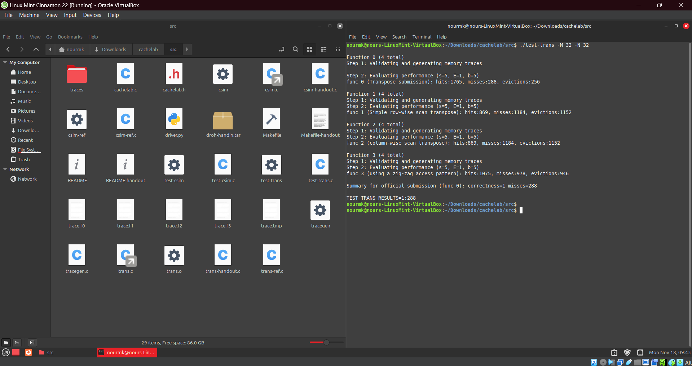 
  
  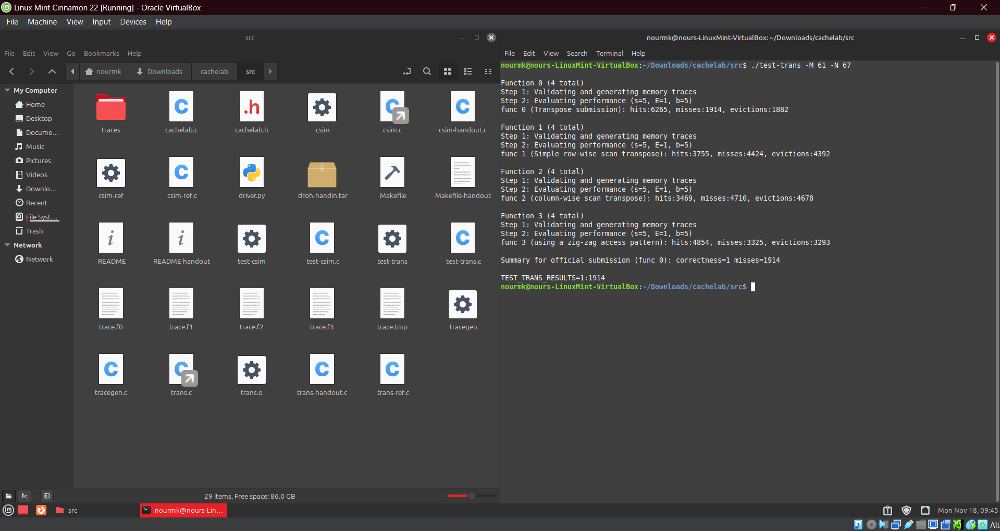
</p>

// anchor

<br>

<p align="center">
  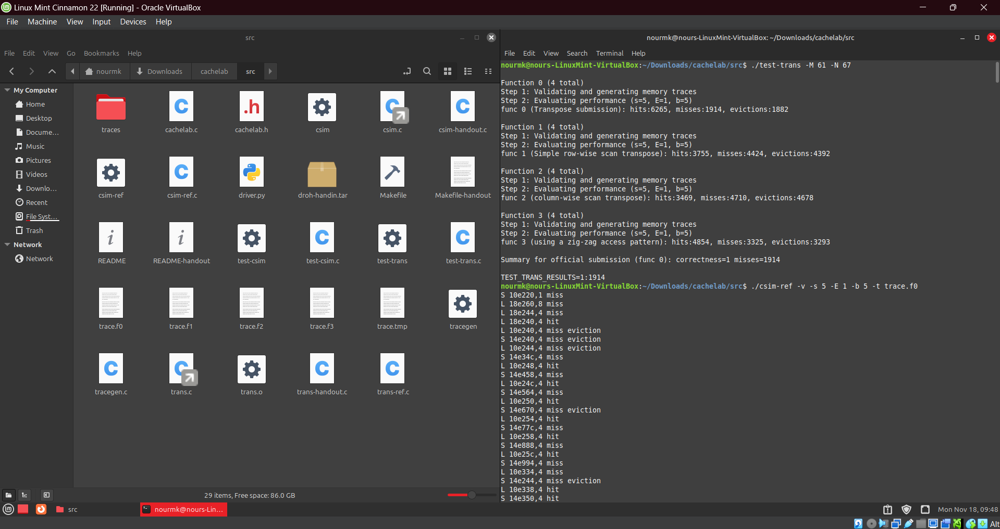 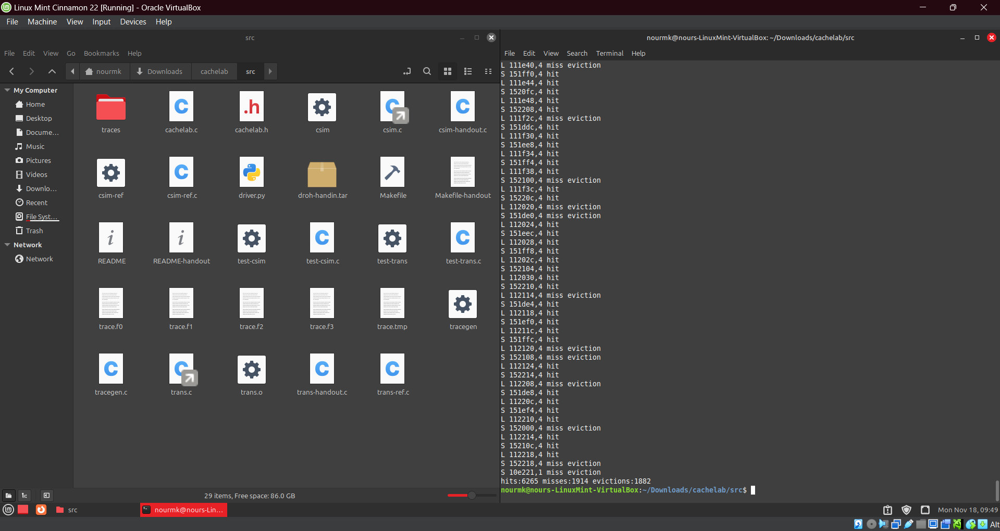 
</p>

// anchor

<br>

</details>

## Conclusion

// anchor 


When evaluating a transpose function on a direct-mapped cache, conflict misses can significantly hinder performance, especially when accessing data along the diagonal of a matrix. These misses occur when multiple data elements map to the same cache line, causing frequent evictions. To mitigate this, it’s essential to consider access patterns that reduce the likelihood of conflict misses. 

Cache performance can be enhanced through several optimization techniques. Blocking (tiling) involves dividing large datasets, like matrices, into smaller blocks that fit within the cache, ensuring efficient access patterns and reducing cache misses. Loop optimization reorders algorithmic loops to improve spatial and temporal locality, aligning memory access patterns with cache structures. In some systems, software-controlled caches allow developers to explicitly manage cache contents using specialized instructions or APIs, giving greater control over data placement and access.


## Resources

// anchor

<br>

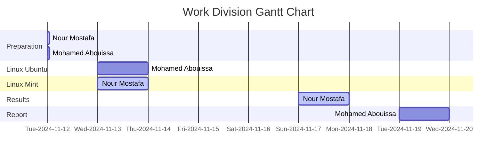

We extend our sincere appreciation to Eng. Umar Adeel for his insightful feedback which has significantly contributed to the successful completion of this experiment.

This publication adheres to all regulatory laws and guidelines established by the American University of Ras Al Khaimah (AURAK) regarding the dissemination of academic materials.
