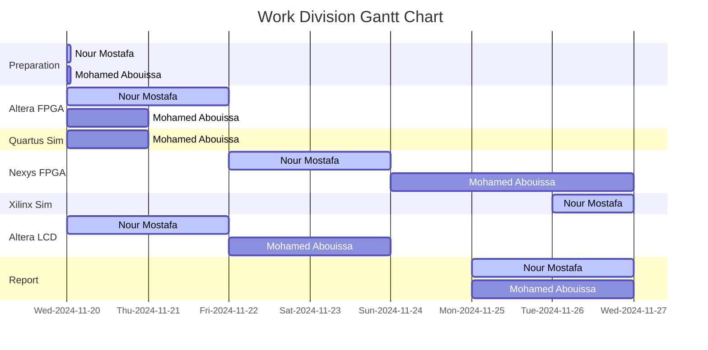

# <p align="center">Array Multiplier</p>

// anchor

---

## Introduction

// anchor

## Project Instructions

The project involves creating a digital multiplier using switches and 7-segment displays on an FPGA. Switches SW7–4 are used to represent the 4-bit binary number A, while switches SW3–0 represent the 4-bit binary number B. The hexadecimal values of A and B are displayed on the 7-segment displays HEX2 and HEX0, respectively. The 8-bit result of the multiplication, P = A × B, is shown on the 7-segment displays HEX5 and HEX4, providing a visual representation of the output. This design ensures the input and output are clearly indicated and easy to verify.

## Implementation on ALTERA DE2-115 Cyclone IV-E EP4CE115F29C7 FPGA Using Quartus Prime

// anchor

<details>
  <summary>VHDL Implementation</summary>
<br>

``` VHDL

```

</details>


<details>
  <summary>Testbench & Simulations</summary>
<br>

``` VHDL
-- Testbench created online at:
--   https://www.doulos.com/knowhow/perl/vhdl-testbench-creation-using-perl/
-- Copyright Doulos Ltd

library IEEE;
use IEEE.Std_logic_1164.all;
use IEEE.Numeric_Std.all;

entity part1_tb is
end;

architecture bench of part1_tb is

  component part1
      PORT (
          SW : IN STD_LOGIC_VECTOR(7 DOWNTO 0);
          HEX5, HEX4, HEX2, HEX0 : OUT STD_LOGIC_VECTOR(0 TO 6);
          Overflow : OUT STD_LOGIC;
			 A_out : OUT std_logic_vector(3 downto 0); -- Expose A
          B_out : OUT std_logic_vector(3 downto 0); -- Expose B
          P_out : OUT std_logic_vector(7 downto 0)  -- Expose P
      );
  end component;

  signal SW: STD_LOGIC_VECTOR(7 DOWNTO 0);
  signal HEX5, HEX4, HEX2, HEX0: STD_LOGIC_VECTOR(0 TO 6);
  signal Overflow: STD_LOGIC ;
  
  signal A, B : std_logic_vector(3 downto 0);
  signal P : std_logic_vector(7 downto 0);

begin

  uut: part1 port map ( SW       => SW,
                        HEX5     => HEX5,
                        HEX4     => HEX4,
                        HEX2     => HEX2,
                        HEX0     => HEX0,
                        Overflow => Overflow, 
							A_out => A, -- Map A_out to A
							B_out => B, -- Map B_out to B
							P_out => P  -- Map P_out to P	
							);

  stimulus: process
  begin
  
    -- Put initialisation code here

	 SW<= "00000000"; -- 0x0
	 wait for 100ns;
	 
	 SW<= "00100000"; -- 2x0
	 wait for 100ns;
	 
	 SW<= "10110001"; -- Bx1
	 wait for 100ns;
	 
	 SW<= "10000101"; -- 8x5
	 wait for 100ns;
	 
	 SW<= "10101001"; -- Ax9
	 wait for 100ns;
	 
	 SW<= "11111110"; -- FxE
	 wait for 100ns;
	 
    -- Put test bench stimulus code here

    wait;
  end process;


end;
```

	
</details>


## Implementation on Artix 7 Nexys 4 DDR XC7A100T-CSG324 FPGA Using Xilinx ISE

// anchor

<details>
<summary>VHDL Implementation</summary>
<br>

``` VHDL
library IEEE;
use IEEE.STD_LOGIC_1164.ALL;
use IEEE.STD_LOGIC_UNSIGNED.ALL;
use IEEE.STD_LOGIC_ARITH.ALL;
 
entity ArrayMultiplier is -- 4X4 Array Multiplier
	PORT (
		  SW : In STD_LOGIC_VECTOR(7 DOWNTO 0);
        en : OUT STD_LOGIC_VECTOR(7 DOWNTO 0); -- Input 8 switches for numbers A, B
		  clk_100MHz : in STD_LOGIC; 
		  HEX : OUT STD_LOGIC_VECTOR(0 TO 6)--; -- 7 segment display outputs
		  -- A_out : OUT std_logic_vector(3 downto 0); -- Expose A for the simulation only, otherwise comment out due to the ucf file incompatibility
        -- B_out : OUT std_logic_vector(3 downto 0); -- Expose B for the simulation only, otherwise comment out due to the ucf file incompatibility
        -- P_out : OUT std_logic_vector(7 downto 0)  -- Expose P for the simulation only, otherwise comment out due to the ucf file incompatibility
		);
end ArrayMultiplier;
 
architecture Behavioral of ArrayMultiplier is
	
	COMPONENT display7seg
        PORT (
            binary : IN STD_LOGIC_VECTOR(3 DOWNTO 0); -- 4-bit input for 7-segment display
            hex : OUT STD_LOGIC_VECTOR(0 TO 6) -- 7-segment display output
        );
    END COMPONENT;
	 
	 COMPONENT fa
        PORT (
            a, b, ci : IN STD_LOGIC; -- Inputs to the full adder
            s, co : OUT STD_LOGIC -- Outputs of the full adder
        );
    END COMPONENT;
 
		SIGNAL A,B : STD_LOGIC_VECTOR(3 DOWNTO 0);
		SIGNAL P : STD_LOGIC_VECTOR(7 DOWNTO 0);
		SIGNAL carryb1 : STD_LOGIC_VECTOR(3 DOWNTO 1); -- carries for row B1
		SIGNAL carryb2 : STD_LOGIC_VECTOR(3 DOWNTO 1); -- carries for row B2
		SIGNAL carryb3 : STD_LOGIC_VECTOR(3 DOWNTO 1); -- carries for row B3
		SIGNAL ParProB1 : STD_LOGIC_VECTOR(5 DOWNTO 2); -- partial products from row B1
		SIGNAL ParProB2 : STD_LOGIC_VECTOR(6 DOWNTO 3); -- partial products from row B2
		SIGNAL selected_digit : STD_LOGIC_VECTOR(3 DOWNTO 0);  -- The selected 4-bit value to display 
		SIGNAL counter : INTEGER RANGE 0 TO 999999 := 0;  -- Fast counter to generate "display_selector"
		SIGNAL display_selector : STD_LOGIC_VECTOR(1 DOWNTO 0);  -- The 2-bit signal that changes quickly
 
		-- Intermediate signals for logical operations
		SIGNAL A0B0_sig, A1B0_sig, A2B0_sig, A3B0_sig : STD_LOGIC;
		SIGNAL A0B1_sig, A1B1_sig, A2B1_sig, A3B1_sig : STD_LOGIC;
		SIGNAL A0B2_sig, A1B2_sig, A2B2_sig, A3B2_sig : STD_LOGIC;
		SIGNAL A0B3_sig, A1B3_sig, A2B3_sig, A3B3_sig : STD_LOGIC;
 
begin

	 B <= SW(3 DOWNTO 0);
	 A <= SW(7 DOWNTO 4);
	 
	 -- A_out <= A; -- for the simulation only, otherwise comment out due to the ucf file incompatibility
	 -- B_out <= B; -- for the simulation only, otherwise comment out due to the ucf file incompatibility
	 -- P_out <= P; -- for the simulation only, otherwise comment out due to the ucf file incompatibility
	
	 -- Array multiplier logic
    A0B0_sig <= A(0) AND B(0);
    A1B0_sig <= A(1) AND B(0);
    A2B0_sig <= A(2) AND B(0);
    A3B0_sig <= A(3) AND B(0);

    A0B1_sig <= A(0) AND B(1);
    A1B1_sig <= A(1) AND B(1);
    A2B1_sig <= A(2) AND B(1);
    A3B1_sig <= A(3) AND B(1);

    A0B2_sig <= A(0) AND B(2);
    A1B2_sig <= A(1) AND B(2);
    A2B2_sig <= A(2) AND B(2);
    A3B2_sig <= A(3) AND B(2);

    A0B3_sig <= A(0) AND B(3);
    A1B3_sig <= A(1) AND B(3);
    A2B3_sig <= A(2) AND B(3);
    A3B3_sig <= A(3) AND B(3);
	 
	 P(0) <= A0B0_sig;

    -- Instantiate full adders for the three rows of the multiplier
	 
    -- Row 1
    a0b1: fa PORT MAP (A1B0_sig, A0B1_sig, '0', P(1), carryb1(1));
    a1b1: fa PORT MAP (A2B0_sig, A1B1_sig, carryb1(1), ParProB1(2), carryb1(2));
    a2b1: fa PORT MAP (A3B0_sig, A2B1_sig, carryb1(2), ParProB1(3), carryb1(3));
    a3b1: fa PORT MAP ('0', A3B1_sig, carryb1(3), ParProB1(4), ParProB1(5));

    -- Row 2
    a0b2: fa PORT MAP (ParProB1(2), A0B2_sig, '0', P(2), carryb2(1));
    a1b2: fa PORT MAP (ParProB1(3), A1B2_sig, carryb2(1), ParProB2(3), carryb2(2));
    a2b2: fa PORT MAP (ParProB1(4), A2B2_sig, carryb2(2), ParProB2(4), carryb2(3));
    a3b2: fa PORT MAP (ParProB1(5), A3B2_sig, carryb2(3), ParProB2(5), ParProB2(6));

    -- Row 3
    a0b3: fa PORT MAP (ParProB2(3), A0B3_sig, '0', P(3), carryb3(1));
    a1b3: fa PORT MAP (ParProB2(4), A1B3_sig, carryb3(1), P(4), carryb3(2));
    a2b3: fa PORT MAP (ParProB2(5), A2B3_sig, carryb3(2), P(5), carryb3(3));
    a3b3: fa PORT MAP (ParProB2(6), A3B3_sig, carryb3(3), P(6), P(7));
	
	PROCESS (clk_100MHz)
    BEGIN
        IF rising_edge(clk_100MHz) THEN
            -- Increment the counter to generate a slower signal
            IF counter = 99999 THEN
                counter <= 0;  -- Reset counter to 0
                -- Toggle 'display_selector' signal to change values
                display_selector <= display_selector + 1;  
            ELSE
                counter <= counter + 1;  -- Increment counter
            END IF;
        END IF;
    END PROCESS;
	 
	PROCESS (display_selector, A, B, P)
    BEGIN
        CASE display_selector IS
            WHEN "00" =>
                en <= "11111110";  -- Enable HEX0
                selected_digit <= A;  -- Display A on HEX0
            WHEN "01" => 
                en <= "11111011";  -- Enable HEX2
                selected_digit <= B;  -- Display B on HEX2
            WHEN "10" =>
				en <= "11101111";  -- Enable HEX4
                selected_digit <=  P(3 DOWNTO 0);  -- Display
            WHEN "11" => 
                en <= "11011111";  -- Enable HEX5
                selected_digit <= P(7 DOWNTO 4);  -- Display 
            WHEN OTHERS =>  -- Default case
                en <= "11111111";  -- Disable all
                selected_digit <= "0000";  -- Blank display
        END CASE;
    END PROCESS;

	digit0: display7seg PORT MAP (selected_digit, HEX);
 
end Behavioral;

------------------------------------------------------------------------------------------
-- Full Adder

LIBRARY ieee;
USE ieee.std_logic_1164.all;

ENTITY fa IS
    PORT (
        a, b, ci : IN STD_LOGIC; -- Inputs to the full adder
        s, co : OUT STD_LOGIC -- Outputs of the full adder
    );
END fa;

-- Architecture for the full adder entity
ARCHITECTURE Structure OF fa IS
    SIGNAL a_xor_b : STD_LOGIC;
BEGIN
    a_xor_b <= a XOR b;
    s <= a_xor_b XOR ci;
    co <= (NOT(a_xor_b) AND b) OR (a_xor_b AND ci);
END Structure;
 
------------------------------------------------------------------------------------------
-- 7 Segment Display
 
LIBRARY ieee;
USE ieee.std_logic_1164.all;

ENTITY display7seg IS
    PORT (
        binary : IN STD_LOGIC_VECTOR(3 DOWNTO 0); -- 4-bit input for 7-segment display
        hex : OUT STD_LOGIC_VECTOR(0 TO 6) -- 7-segment display output
    );
END display7seg;
 
ARCHITECTURE Behavior OF display7seg IS
BEGIN
    PROCESS (binary)
    BEGIN
        CASE binary IS
            WHEN "0000" => hex <= "0000001"; -- 0
            WHEN "0001" => hex <= "1001111"; -- 1
            WHEN "0010" => hex <= "0010010"; -- 2
            WHEN "0011" => hex <= "0000110"; -- 3
            WHEN "0100" => hex <= "1001100"; -- 4
				WHEN "0101" => hex <= "0100100"; -- 5
            WHEN "0110" => hex <= "0100000"; -- 6
            WHEN "0111" => hex <= "0001111"; -- 7
            WHEN "1000" => hex <= "0000000"; -- 8
            WHEN "1001" => hex <= "0001100"; -- 9
            WHEN "1010" => hex <= "0001000"; -- A
				WHEN "1011" => hex <= "1100000"; -- B
            WHEN "1100" => hex <= "0110001"; -- C
            WHEN "1101" => hex <= "1000010"; -- D
            WHEN "1110" => hex <= "0110000"; -- E
            WHEN OTHERS => hex <= "0111000"; -- F
				END CASE;
    END PROCESS;
END Behavior;
```

<br>

``` ini
## This file is a general .ucf for the Nexys4 DDR Rev C board
## Rename the used signals according to the project
 
## Clock signal
NET "clk_100MHz"   LOC = "E3"	| IOSTANDARD = "LVCMOS33";
NET "clk_100MHz" TNM_NET = sys_clk_pin;
TIMESPEC TS_sys_clk_pin = PERIOD sys_clk_pin 100 MHz HIGH 50%;
 
## Switches
NET "SW<0>"          LOC=J15 | IOSTANDARD=LVCMOS33; #IO_L24N_T3_RS0_15
NET "SW<1>"          LOC=L16 | IOSTANDARD=LVCMOS33; #IO_L3N_T0_DQS_EMCCLK_14
NET "SW<2>"          LOC=M13 | IOSTANDARD=LVCMOS33; #IO_L6N_T0_D08_VREF_14
NET "SW<3>"          LOC=R15 | IOSTANDARD=LVCMOS33; #IO_L13N_T2_MRCC_14
NET "SW<4>"          LOC=R17 | IOSTANDARD=LVCMOS33; #IO_L12N_T1_MRCC_14
NET "SW<5>"          LOC=T18 | IOSTANDARD=LVCMOS33; #IO_L7N_T1_D10_14
NET "SW<6>"          LOC=U18 | IOSTANDARD=LVCMOS33; #IO_L17N_T2_A13_D29_14
NET "SW<7>"          LOC=R13 | IOSTANDARD=LVCMOS33; #IO_L5N_T0_D07_14
#NET "SW<8>"          LOC=T8 | IOSTANDARD=LVCMOS18; #IO_L24N_T3_34
#NET "SW<9>"          LOC=U8 | IOSTANDARD=LVCMOS18; #IO_25_34
 
## Enabling the HEXes
NET "en<0>"          LOC=J17 | IOSTANDARD=LVCMOS33; #IO_L23P_T3_FOE_B_15
NET "en<1>"          LOC=J18 | IOSTANDARD=LVCMOS33; #IO_L23N_T3_FWE_B_15
NET "en<2>"          LOC=T9 | IOSTANDARD=LVCMOS33; #IO_L24P_T3_A01_D17_14
NET "en<3>"          LOC=J14 | IOSTANDARD=LVCMOS33; #IO_L19P_T3_A22_15
NET "en<4>"          LOC=P14 | IOSTANDARD=LVCMOS33; #IO_L8N_T1_D12_14
NET "en<5>"          LOC=T14 | IOSTANDARD=LVCMOS33; #IO_L14P_T2_SRCC_14
NET "en<6>"          LOC=K2 | IOSTANDARD=LVCMOS33; #IO_L23P_T3_35
NET "en<7>"          LOC=U13 | IOSTANDARD=LVCMOS33; #IO_L23N_T3_A02_D18_14
 
## 7 segments HEX
NET "HEX<0>" LOC=T10 | IOSTANDARD=LVCMOS33; #IO_L24N_T3_A00_D16_14
NET "HEX<1>" LOC=R10 | IOSTANDARD=LVCMOS33; #IO_25_14
NET "HEX<2>" LOC=K16 | IOSTANDARD=LVCMOS33; #IO_25_15
NET "HEX<3>" LOC=K13 | IOSTANDARD=LVCMOS33; #IO_L17P_T2_A26_15
NET "HEX<4>" LOC=P15 | IOSTANDARD=LVCMOS33; #IO_L13P_T2_MRCC_14
NET "HEX<5>" LOC=T11 | IOSTANDARD=LVCMOS33; #IO_L19P_T3_A10_D26_14
NET "HEX<6>" LOC=L18 | IOSTANDARD=LVCMOS33; #IO_L4P_T0_D04_14
```

<br>


</details>

<details>
  <summary>Testbench & Simulations</summary>
<br>

``` VHDL
--------------------------------------------------------------------------------
-- VHDL Test Bench Created by ISE for module: ArrayMultiplier
--  
-- This testbench has been automatically generated using types std_logic and
-- std_logic_vector for the ports of the unit under test.  Xilinx recommends
-- that these types always be used for the top-level I/O of a design in order
-- to guarantee that the testbench will bind correctly to the post-implementation 
-- simulation model.

-- Modified by our team because it wasn't showing the signals A, B, and P.
-- They are needed since the hexes are multiplexed so their wave on the 
-- simulator are not meaningful so instead we must observe the result from P.
--------------------------------------------------------------------------------
LIBRARY ieee;
USE ieee.std_logic_1164.ALL;
 
ENTITY ArrayMultiplierTestbench IS
END ArrayMultiplierTestbench;
 
ARCHITECTURE behavior OF ArrayMultiplierTestbench IS 
 
    -- Component Declaration for the Unit Under Test (UUT)
 
    COMPONENT ArrayMultiplier
    PORT(
         SW : IN  std_logic_vector(7 downto 0);
         en : OUT  std_logic_vector(7 downto 0);
         clk_100MHz : IN  std_logic;
         HEX : OUT  std_logic_vector(0 to 6);
			A_out : OUT std_logic_vector(3 downto 0); -- Expose A
         B_out : OUT std_logic_vector(3 downto 0); -- Expose B
         P_out : OUT std_logic_vector(7 downto 0)  -- Expose P
        );
    END COMPONENT;
    

   --Inputs
   signal SW : std_logic_vector(7 downto 0) := (others => '0');
   signal clk_100MHz : std_logic := '0';

 	--Outputs
   signal en : std_logic_vector(7 downto 0);
   signal HEX : std_logic_vector(0 to 6);
	
	signal A, B : std_logic_vector(3 downto 0);
	signal P : std_logic_vector(7 downto 0);

   -- Clock period definitions
   constant clk_100MHz_period : time := 10 ns;
 
BEGIN
 
	-- Instantiate the Unit Under Test (UUT)
   uut: ArrayMultiplier PORT MAP (
          SW => SW,
          en => en,
          clk_100MHz => clk_100MHz,
          HEX => HEX,
			 A_out => A, -- Map A_out to A
			 B_out => B, -- Map B_out to B
			 P_out => P  -- Map P_out to P
        );

   -- Clock process definitions
   clk_100MHz_process :process
   begin
		clk_100MHz <= '0';
		wait for clk_100MHz_period/2;
		clk_100MHz <= '1';
		wait for clk_100MHz_period/2;
   end process;
 

   -- Stimulus process
   stim_proc: process
   begin	
	
    -- hold reset state for 100 ns.
    wait for 100 ns;		

    wait for clk_100MHz_period*10;

    -- insert stimulus here 
	 SW<= "00000000"; -- 0x0
	 wait for 100ns;
	 
	 SW<= "00100000"; -- 2x0
	 wait for 100ns;
	 
	 SW<= "10110001"; -- Bx1
	 wait for 100ns;
	 
	 SW<= "10000101"; -- 8x5
	 wait for 100ns;
	 
	 SW<= "10101001"; -- Ax9
	 wait for 100ns;
	 
	 SW<= "11111110"; -- FxE
	 wait for 100ns;

      wait;
   end process;

END;
```


</details>

## Project Learning Outcomes

// anchor 

## Conclusion

// anchor 

## Resources

// anchor

<br>



We extend our sincere appreciation to Eng. Umar Adeel for his insightful feedback which has significantly contributed to the successful completion of this experiment.

This publication adheres to all regulatory laws and guidelines established by the American University of Ras Al Khaimah (AURAK) regarding the dissemination of academic materials.
