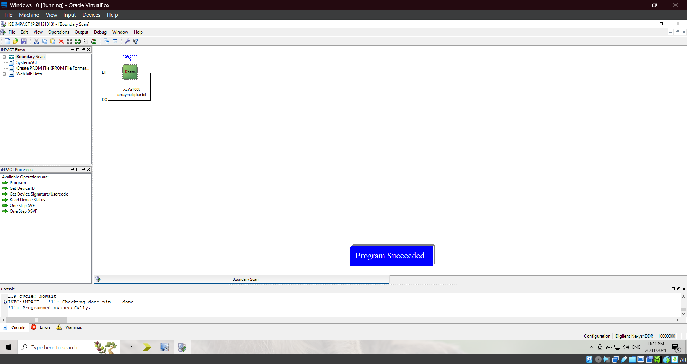

# <p align="center">Array Multiplier</p>

This project's objective is to design, implement, and simulate a digital array multiplier using eight switches and four 7-segment displays on 2 different FPGA boards and programming platforms. 

---

The project involves creating a digital array multiplier using switches and 7-segment displays on an FPGA. Switches SW7–4 are used to represent the 4-bit binary number A, while switches SW3–0 represent the 4-bit binary number B. The hexadecimal values of A and B are displayed on the 7-segment displays HEX2 and HEX0, respectively. The 8-bit result of the multiplication, P = A × B, is shown on the 7-segment displays HEX5 and HEX4, providing a visual representation of the output. This design ensures the input and output are clearly indicated and easy to verify.

A [digital array multiplier](Photos/proj-requirements2.png) is a combinational circuit designed to multiply two binary numbers. It works by generating partial products and summing them to produce the final result. The circuit mimics the principle of longhand multiplication, where each bit of one operand (the multiplier) is ANDed with all bits of the other operand (the multiplicand). The partial products are then aligned and added using adders, all within a structured hardware framework.  To handle the summation of partial products, an array multiplier typically relies on full adders as its building blocks. Full adders are used to sum the bits from different rows of the array, along with any carry generated during the addition. This design makes the array multiplier efficient for high-speed binary multiplication. The name *array multiplier* stems from the circuit's structure, which resembles an array of logic gates organized in rows and columns. Each row is dedicated to generating partial products for a specific bit of the multiplier, while the columns handle the addition of these partial products. The systematic arrangement of gates simplifies the design and facilitates parallel processing of the binary multiplication, making it both intuitive and effective for hardware implementations.

As a theoretical example, consider [tracing the case 1111 x 1111 on the array multiplier design schematic](Photos/tracing-example.png), we notice that the sum is given by the [XOR](Photos/3-Input-XOR-Gate.png) of all three inputs meanwhile the carry out is generated when any two or more of the three inputs are 1. So, for instance, When a full adder processes 1+1 with a carry-in of 1, it first computes the intermediate sum of A = 1 and B = 1, yielding 0 with a carry of 1. Adding the carry-in to this intermediate sum results in a final sum of 1. Meanwhile, the carry-out remains 1. A fascinating characteristic of a full adder is that even when an intermediate carry is generated then consumed in the process of calculating the final sum (by summing it with the intermediate sum or with the intermediate sum and carry in if it exists), the full adder still ensures that this carry is reflected in the final carry-out of the circuit. Finally, refer to this [diagram](Photos/long-multiplication.png), as detailed by [MadforMath](https://madformath.com/calculators/digital-systems/binary-arithmetic/binary-multiplication-calculator-with-steps/binary-multiplication-calculator-with-steps), for an equivalent step by step long multiplication of the same inputs previously traced on the circuit schema.

## Implementation on ALTERA DE2-115 Cyclone IV-E EP4CE115F29C7 FPGA Using Quartus Prime

The Altera DE2-115 board, which uses an Intel (formerly Altera) Cyclone IV FPGA, is traditionally supported by Quartus Prime, Altera's development software. Quartus Prime is a robust toolchain designed for FPGA design, including synthesis, simulation, and configuration. It offers a wide range of features for both beginners and advanced users, including the ability to design in both schematic and HDL (Hardware Description Language) formats, as well as integration with various hardware design tools. However, Quartus Prime's ecosystem can sometimes be overwhelming, especially for those new to FPGA design, and its compatibility with newer FPGA families may be more limited as time progresses. While the DE2-115 board is known for its reliability in academic environments and for prototyping, it may not be as well-suited for very high-performance applications, as it is a mid-range FPGA with certain hardware limitations. 

<details>
  <summary>VHDL Implementation</summary>
<br>

``` VHDL
-- In this code, we focus only on the multiplier implementation.
-- If you want to inspect how the LCD operates, kindly refer to the included .rar file to download the full source code.

LIBRARY ieee;
USE ieee.std_logic_1164.all;
USE ieee.std_logic_unsigned.all;

ENTITY part1 IS
    PORT (
        SW : IN STD_LOGIC_VECTOR(7 DOWNTO 0); -- Input 8 switches for numbers A, B
        HEX5, HEX4, HEX2, HEX0 : OUT STD_LOGIC_VECTOR(0 TO 6); -- 7 segment display outputs
        Overflow : OUT STD_LOGIC --; -- Overflow indicator
	-- A_out : OUT std_logic_vector(3 downto 0); -- Expose A for the simulation only, otherwise comment out due to the ucf file incompatibility
        -- B_out : OUT std_logic_vector(3 downto 0); -- Expose B for the simulation only, otherwise comment out due to the ucf file incompatibility
        -- P_out : OUT std_logic_vector(7 downto 0)  -- Expose P for the simulation only, otherwise comment out due to the ucf file incompatibility
    );
END part1;

ARCHITECTURE Structure OF part1 IS
    COMPONENT fa
        PORT (
            a, b, ci : IN STD_LOGIC; -- Inputs to the full adder
            s, co : OUT STD_LOGIC -- Outputs of the full adder
        );
    END COMPONENT;

    COMPONENT display7seg
        PORT (
            binary : IN STD_LOGIC_VECTOR(3 DOWNTO 0); -- 4-bit input for 7-segment display
            hex : OUT STD_LOGIC_VECTOR(0 TO 6) -- 7-segment display output
        );
    END COMPONENT;

    SIGNAL A, B : STD_LOGIC_VECTOR(3 DOWNTO 0);
    SIGNAL P : STD_LOGIC_VECTOR(7 DOWNTO 0);
    SIGNAL carryb1 : STD_LOGIC_VECTOR(3 DOWNTO 1); -- carries for row B1
    SIGNAL carryb2 : STD_LOGIC_VECTOR(3 DOWNTO 1); -- carries for row B2
    SIGNAL carryb3 : STD_LOGIC_VECTOR(3 DOWNTO 1); -- carries for row B3
    SIGNAL ParProB1 : STD_LOGIC_VECTOR(5 DOWNTO 2); -- partial products from row B1
    SIGNAL ParProB2 : STD_LOGIC_VECTOR(6 DOWNTO 3); -- partial products from row B2

    -- Intermediate signals for logical operations
    SIGNAL A0B0_sig, A1B0_sig, A2B0_sig, A3B0_sig : STD_LOGIC;
    SIGNAL A0B1_sig, A1B1_sig, A2B1_sig, A3B1_sig : STD_LOGIC;
    SIGNAL A0B2_sig, A1B2_sig, A2B2_sig, A3B2_sig : STD_LOGIC;
    SIGNAL A0B3_sig, A1B3_sig, A2B3_sig, A3B3_sig : STD_LOGIC;

BEGIN
    -- Assign input numbers A and B from SW switches
    A <= SW(7 DOWNTO 4);
    B <= SW(3 DOWNTO 0);
	 
    -- A_out <= A; -- for the simulation only, otherwise comment out due to the ucf file incompatibility
    -- B_out <= B; -- for the simulation only, otherwise comment out due to the ucf file incompatibility
    -- P_out <= P; -- for the simulation only, otherwise comment out due to the ucf file incompatibility

    -- Intermediate signals for logical operations
    A0B0_sig <= A(0) AND B(0);
    A1B0_sig <= A(1) AND B(0);
    A2B0_sig <= A(2) AND B(0);
    A3B0_sig <= A(3) AND B(0);

    A0B1_sig <= A(0) AND B(1);
    A1B1_sig <= A(1) AND B(1);
    A2B1_sig <= A(2) AND B(1);
    A3B1_sig <= A(3) AND B(1);

    A0B2_sig <= A(0) AND B(2);
    A1B2_sig <= A(1) AND B(2);
    A2B2_sig <= A(2) AND B(2);
    A3B2_sig <= A(3) AND B(2);

    A0B3_sig <= A(0) AND B(3);
    A1B3_sig <= A(1) AND B(3);
    A2B3_sig <= A(2) AND B(3);
    A3B3_sig <= A(3) AND B(3);

    P(0) <= A0B0_sig;

    -- Instantiate full adders for the three rows of the multiplier
    -- Row 1
    a0b1: fa PORT MAP (A1B0_sig, A0B1_sig, '0', P(1), carryb1(1));
    a1b1: fa PORT MAP (A2B0_sig, A1B1_sig, carryb1(1), ParProB1(2), carryb1(2));
    a2b1: fa PORT MAP (A3B0_sig, A2B1_sig, carryb1(2), ParProB1(3), carryb1(3));
    a3b1: fa PORT MAP ('0', A3B1_sig, carryb1(3), ParProB1(4), ParProB1(5));

    -- Row 2
    a0b2: fa PORT MAP (ParProB1(2), A0B2_sig, '0', P(2), carryb2(1));
    a1b2: fa PORT MAP (ParProB1(3), A1B2_sig, carryb2(1), ParProB2(3), carryb2(2));
    a2b2: fa PORT MAP (ParProB1(4), A2B2_sig, carryb2(2), ParProB2(4), carryb2(3));
    a3b2: fa PORT MAP (ParProB1(5), A3B2_sig, carryb2(3), ParProB2(5), ParProB2(6));

    -- Row 3
    a0b3: fa PORT MAP (ParProB2(3), A0B3_sig, '0', P(3), carryb3(1));
    a1b3: fa PORT MAP (ParProB2(4), A1B3_sig, carryb3(1), P(4), carryb3(2));
    a2b3: fa PORT MAP (ParProB2(5), A2B3_sig, carryb3(2), P(5), carryb3(3));
    a3b3: fa PORT MAP (ParProB2(6), A3B3_sig, carryb3(3), P(6), P(7));

    -- Overflow detection
    Overflow <= '1' WHEN (A(3) AND B(3)) = '1' ELSE '0';

    -- Display A, B and P hexadecimal values through a 7-seg decoder
    digit3: display7seg PORT MAP (A, HEX2);
    digit2: display7seg PORT MAP (B, HEX0);
    digit1: display7seg PORT MAP (P(7 DOWNTO 4), HEX5);
    digit0: display7seg PORT MAP (P(3 DOWNTO 0), HEX4);

END Structure;

-- Full Adder entity -------------------------------------------------------------------------------------------------
LIBRARY ieee;
USE ieee.std_logic_1164.all;

ENTITY fa IS
    PORT (
        a, b, ci : IN STD_LOGIC; -- Inputs to the full adder
        s, co : OUT STD_LOGIC -- Outputs of the full adder
    );
END fa;

-- Architecture for the full adder entity
ARCHITECTURE Structure OF fa IS
    SIGNAL a_xor_b : STD_LOGIC;
BEGIN
    a_xor_b <= a XOR b;
    s <= a_xor_b XOR ci;
    co <= (NOT(a_xor_b) AND b) OR (a_xor_b AND ci);
END Structure;

-- 7-segment display entity --------------------------------------------------------------------------------------------
LIBRARY ieee;
USE ieee.std_logic_1164.all;

ENTITY display7seg IS
    PORT (
        binary : IN STD_LOGIC_VECTOR(3 DOWNTO 0); -- 4-bit input for 7-segment display
        hex : OUT STD_LOGIC_VECTOR(0 TO 6) -- 7-segment display output
    );
END display7seg;

-- Architecture for the 7-segment display entity
ARCHITECTURE Behavior OF display7seg IS
BEGIN
    PROCESS (binary)
    BEGIN
        CASE binary IS
            WHEN "0000" => hex <= "0000001"; -- 0
            WHEN "0001" => hex <= "1001111"; -- 1
            WHEN "0010" => hex <= "0010010"; -- 2
            WHEN "0011" => hex <= "0000110"; -- 3
            WHEN "0100" => hex <= "1001100"; -- 4
            WHEN "0101" => hex <= "0100100"; -- 5
            WHEN "0110" => hex <= "0100000"; -- 6
            WHEN "0111" => hex <= "0001111"; -- 7
            WHEN "1000" => hex <= "0000000"; -- 8
            WHEN "1001" => hex <= "0001100"; -- 9
            WHEN "1010" => hex <= "0001000"; -- A
            WHEN "1011" => hex <= "1100000"; -- B
            WHEN "1100" => hex <= "0110001"; -- C
            WHEN "1101" => hex <= "1000010"; -- D
            WHEN "1110" => hex <= "0110000"; -- E
            WHEN OTHERS => hex <= "0111000"; -- F
        END CASE;
    END PROCESS;
END Behavior;
```

<p align="center">
    
</p>

<p align="center">
    
    
</p>

<p align="center">
    
    
   
</p>

This VHDL code implements a 4-bit binary multiplier on an FPGA, taking two 4-bit inputs (A and B) via switches and displaying the results on 7-segment displays. The part1 entity defines the top-level module, with the inputs and outputs, including 7-segment displays for the inputs and product and an overflow indicator. The multiplication is performed using the partial products method: each bit of B is ANDed with all bits of A to produce intermediate signals (A0B0_sig to A3B3_sig). These partial products are summed using a hierarchical structure of full adders (fa components) to account for carries across rows, producing the final 8-bit product (P). Overflow is detected based on the most significant bits of A and B. The 7-segment display decoder (display7seg) converts 4-bit binary values (A, B, and portions of P) into signals that drive the HEX displays. A key feature is modularity, as the code separates concerns into distinct components for arithmetic (fa) and display logic (display7seg). The design ensures the multiplier operates efficiently by organizing the summation of partial products across rows using logical cascades of adders.

</details>


<details>
  <summary>Testbench & Simulations</summary>
<br>

``` VHDL
-- Testbench created online at:
--   https://www.doulos.com/knowhow/perl/vhdl-testbench-creation-using-perl/
-- Copyright Doulos Ltd

library IEEE;
use IEEE.Std_logic_1164.all;
use IEEE.Numeric_Std.all;

entity part1_tb is
end;

architecture bench of part1_tb is

  component part1
      PORT (
          SW : IN STD_LOGIC_VECTOR(7 DOWNTO 0);
          HEX5, HEX4, HEX2, HEX0 : OUT STD_LOGIC_VECTOR(0 TO 6);
          Overflow : OUT STD_LOGIC;
			 A_out : OUT std_logic_vector(3 downto 0); -- Expose A
          B_out : OUT std_logic_vector(3 downto 0); -- Expose B
          P_out : OUT std_logic_vector(7 downto 0)  -- Expose P
      );
  end component;

  signal SW: STD_LOGIC_VECTOR(7 DOWNTO 0);
  signal HEX5, HEX4, HEX2, HEX0: STD_LOGIC_VECTOR(0 TO 6);
  signal Overflow: STD_LOGIC ;
  
  signal A, B : std_logic_vector(3 downto 0);
  signal P : std_logic_vector(7 downto 0);

begin

  uut: part1 port map ( SW       => SW,
                        HEX5     => HEX5,
                        HEX4     => HEX4,
                        HEX2     => HEX2,
                        HEX0     => HEX0,
                        Overflow => Overflow, 
			A_out => A, -- Map A_out to A
			B_out => B, -- Map B_out to B
			P_out => P  -- Map P_out to P	
			);

  stimulus: process
  begin
  
    -- Put initialisation code here

	 SW<= "00000000"; -- 0x0
	 wait for 100ns;
	 
	 SW<= "00100000"; -- 2x0
	 wait for 100ns;
	 
	 SW<= "10110001"; -- Bx1
	 wait for 100ns;
	 
	 SW<= "10000101"; -- 8x5
	 wait for 100ns;
	 
	 SW<= "10101001"; -- Ax9
	 wait for 100ns;
	 
	 SW<= "11111110"; -- FxE
	 wait for 100ns;
	 
    -- Put test bench stimulus code here

    wait;
  end process;


end;
```

<p align="center">
    
</p>

<p align="center">
       
</p>

We can observe from the results above that the waveforms from the RTL simulation and from the Waveform simulation are in alignment, especially since we have supplied the same test cases to both in order to cross check and verify for any differences. The results in the simulations can be observed directly from the P bus as well as analyzed from the HEX 7-segment bus (keeping in mind that both the Altera and Nexys boards Hexes follow the same 7-segment [arrangement order](Photos/7segment-arrangement.png)). Notice that we only see a wave in the simulation when we are observing a single bit, unlike when it's a bus of bits where you can only observe the binary values of that bus.

	
</details>


## Implementation on Artix 7 Nexys 4 DDR XC7A100T-CSG324 FPGA Using Xilinx ISE

The Nexys 4 DDR board uses a Xilinx Artix-7 FPGA, supported by Xilinx ISE and the more modern Vivado suite. Vivado offers enhanced features, better support for high-speed designs, and improved simulation and debugging capabilities compared to ISE. The Artix-7 FPGA balances performance and power efficiency, making it suitable for various applications. Vivado's user-friendly interface and improved tools allow for faster development cycles and better performance optimization, though it has a learning curve and limited backward compatibility with older FPGA families. ISE, designed for older Windows versions, can be challenging to run on modern systems, causing compatibility issues and requiring Linux knowledge for configuration. Moreover, since ISE is no longer actively updated, there are limited resources available for resolving such issues, which may force users to rely on outdated tools and manuals. The Nexys 4 DDR board simplifies setup with a single USB cable, unlike the Altera DE2-115, which requires both a USB and battery cable and a USB Blaster driver. The Nexys 4 uses USB-JTAG for programming, while the DE2-115 uses a USB-Blaster for JTAG-based programming. Xilinx simplifies the process of testbench creation by automatically generating the framework for you, leaving you responsible only for writing the stimulus portion. This automation eliminates the need to rely on external scripting tools like Perl, streamlining the workflow and reducing the time spent on testbench setup. By focusing solely on the stimulus, developers can concentrate on verifying the design's behavior rather than managing testbench infrastructure, making the verification process more efficient and user-friendly. Xilinx FPGAs are used in defense and military applications, subject to strict export control regulations (ITAR and EAR) due to their high performance and reconfigurability. These regulations ensure that advanced technology is used only in authorized applications, making it difficult for foreign entities to access certain Xilinx products due to licensing.

<details>
<summary>VHDL Implementation</summary>
<br>

``` VHDL
library IEEE;
use IEEE.STD_LOGIC_1164.ALL;
use IEEE.STD_LOGIC_UNSIGNED.ALL;
use IEEE.STD_LOGIC_ARITH.ALL;
 
entity ArrayMultiplier is -- 4X4 Array Multiplier
	PORT (
		SW : In STD_LOGIC_VECTOR(7 DOWNTO 0);
		en : OUT STD_LOGIC_VECTOR(7 DOWNTO 0); -- Input 8 switches for numbers A, B
		clk_100MHz : in STD_LOGIC; 
		HEX : OUT STD_LOGIC_VECTOR(0 TO 6)--; -- 7 segment display outputs
		-- A_out : OUT std_logic_vector(3 downto 0); -- Expose A for the simulation only, otherwise comment out due to the ucf file incompatibility
        	-- B_out : OUT std_logic_vector(3 downto 0); -- Expose B for the simulation only, otherwise comment out due to the ucf file incompatibility
        	-- P_out : OUT std_logic_vector(7 downto 0)  -- Expose P for the simulation only, otherwise comment out due to the ucf file incompatibility
		);
end ArrayMultiplier;
 
architecture Behavioral of ArrayMultiplier is
	
	COMPONENT display7seg
        PORT (
            binary : IN STD_LOGIC_VECTOR(3 DOWNTO 0); -- 4-bit input for 7-segment display
            hex : OUT STD_LOGIC_VECTOR(0 TO 6) -- 7-segment display output
        );
    END COMPONENT;
	 
	 COMPONENT fa
        PORT (
            a, b, ci : IN STD_LOGIC; -- Inputs to the full adder
            s, co : OUT STD_LOGIC -- Outputs of the full adder
        );
    END COMPONENT;
 
		SIGNAL A,B : STD_LOGIC_VECTOR(3 DOWNTO 0);
		SIGNAL P : STD_LOGIC_VECTOR(7 DOWNTO 0);
		SIGNAL carryb1 : STD_LOGIC_VECTOR(3 DOWNTO 1); -- carries for row B1
		SIGNAL carryb2 : STD_LOGIC_VECTOR(3 DOWNTO 1); -- carries for row B2
		SIGNAL carryb3 : STD_LOGIC_VECTOR(3 DOWNTO 1); -- carries for row B3
		SIGNAL ParProB1 : STD_LOGIC_VECTOR(5 DOWNTO 2); -- partial products from row B1
		SIGNAL ParProB2 : STD_LOGIC_VECTOR(6 DOWNTO 3); -- partial products from row B2
		SIGNAL selected_digit : STD_LOGIC_VECTOR(3 DOWNTO 0);  -- The selected 4-bit value to display 
		SIGNAL counter : INTEGER RANGE 0 TO 999999 := 0;  -- Fast counter to generate "display_selector"
		SIGNAL display_selector : STD_LOGIC_VECTOR(1 DOWNTO 0);  -- The 2-bit signal that changes quickly
 
		-- Intermediate signals for logical operations
		SIGNAL A0B0_sig, A1B0_sig, A2B0_sig, A3B0_sig : STD_LOGIC;
		SIGNAL A0B1_sig, A1B1_sig, A2B1_sig, A3B1_sig : STD_LOGIC;
		SIGNAL A0B2_sig, A1B2_sig, A2B2_sig, A3B2_sig : STD_LOGIC;
		SIGNAL A0B3_sig, A1B3_sig, A2B3_sig, A3B3_sig : STD_LOGIC;
 
begin

	 B <= SW(3 DOWNTO 0);
	 A <= SW(7 DOWNTO 4);
	 
	 -- A_out <= A; -- for the simulation only, otherwise comment out due to the ucf file incompatibility
	 -- B_out <= B; -- for the simulation only, otherwise comment out due to the ucf file incompatibility
	 -- P_out <= P; -- for the simulation only, otherwise comment out due to the ucf file incompatibility
	
	 -- Array multiplier logic
	    A0B0_sig <= A(0) AND B(0);
	    A1B0_sig <= A(1) AND B(0);
	    A2B0_sig <= A(2) AND B(0);
	    A3B0_sig <= A(3) AND B(0);
	
	    A0B1_sig <= A(0) AND B(1);
	    A1B1_sig <= A(1) AND B(1);
	    A2B1_sig <= A(2) AND B(1);
	    A3B1_sig <= A(3) AND B(1);
	
	    A0B2_sig <= A(0) AND B(2);
	    A1B2_sig <= A(1) AND B(2);
	    A2B2_sig <= A(2) AND B(2);
	    A3B2_sig <= A(3) AND B(2);
	
	    A0B3_sig <= A(0) AND B(3);
	    A1B3_sig <= A(1) AND B(3);
	    A2B3_sig <= A(2) AND B(3);
	    A3B3_sig <= A(3) AND B(3);
	 
	 P(0) <= A0B0_sig;

    -- Instantiate full adders for the three rows of the multiplier
	 
    -- Row 1
    a0b1: fa PORT MAP (A1B0_sig, A0B1_sig, '0', P(1), carryb1(1));
    a1b1: fa PORT MAP (A2B0_sig, A1B1_sig, carryb1(1), ParProB1(2), carryb1(2));
    a2b1: fa PORT MAP (A3B0_sig, A2B1_sig, carryb1(2), ParProB1(3), carryb1(3));
    a3b1: fa PORT MAP ('0', A3B1_sig, carryb1(3), ParProB1(4), ParProB1(5));

    -- Row 2
    a0b2: fa PORT MAP (ParProB1(2), A0B2_sig, '0', P(2), carryb2(1));
    a1b2: fa PORT MAP (ParProB1(3), A1B2_sig, carryb2(1), ParProB2(3), carryb2(2));
    a2b2: fa PORT MAP (ParProB1(4), A2B2_sig, carryb2(2), ParProB2(4), carryb2(3));
    a3b2: fa PORT MAP (ParProB1(5), A3B2_sig, carryb2(3), ParProB2(5), ParProB2(6));

    -- Row 3
    a0b3: fa PORT MAP (ParProB2(3), A0B3_sig, '0', P(3), carryb3(1));
    a1b3: fa PORT MAP (ParProB2(4), A1B3_sig, carryb3(1), P(4), carryb3(2));
    a2b3: fa PORT MAP (ParProB2(5), A2B3_sig, carryb3(2), P(5), carryb3(3));
    a3b3: fa PORT MAP (ParProB2(6), A3B3_sig, carryb3(3), P(6), P(7));

    -- While not a complete clock divider (it doesn't directly produce a new clock signal), this implementation achieves the
    -- same effect by toggling display_selector at a slower rate. It takes a 100 MHz input clock (clk_100MHz) and uses a counter
    -- to create a slower toggling signal. The counter increments on each rising edge of the clock, and when it reaches the value 99999,
    -- it resets to zero and toggles the display_selector signal. In this case, the output signal toggles every 100,000 cycles of the 100 MHz
    -- clock, resulting in a frequency of 500 Hz. (f_output = (f_input)/(2xcounter)). The process runs on the rising edge of the clk_100MHz signal,
    -- which means it checks the condition and updates the signals 100 million times per second. The counter variable keeps track of how many clock
    -- cycles have occurred. It increments by 1 with every rising edge of the clock. When the counter reaches 99999, it means 100,000 clock cycles
    -- have passed. Once the counter reaches 99999 (1 ms has elapsed), it resets to 0. At the same time, the display_selector signal is updated (incremented). 
	PROCESS (clk_100MHz)
    BEGIN
        IF rising_edge(clk_100MHz) THEN
            -- Increment the counter to generate a slower signal
            IF counter = 99999 THEN
                counter <= 0;  -- Reset counter to 0
                -- Toggle 'display_selector' signal to change values
                display_selector <= display_selector + 1;  
            ELSE
                counter <= counter + 1;  -- Increment counter
            END IF;
        END IF;
    END PROCESS;
	 
	PROCESS (display_selector, A, B, P)
    BEGIN
        CASE display_selector IS
	-- we only need 2 bits because we have only 4 hexes to display on and select between which means we have 4 cases
	-- Hence, 2 bits are sufficient to create 4 unique combinations to represent the 4 cases
            WHEN "00" =>
                en <= "11111110";  -- Enable HEX0
                selected_digit <= A;  -- Display A on HEX0
            WHEN "01" => 
                en <= "11111011";  -- Enable HEX2
                selected_digit <= B;  -- Display B on HEX2
            WHEN "10" =>
				en <= "11101111";  -- Enable HEX4
                selected_digit <=  P(3 DOWNTO 0);  -- Display
            WHEN "11" => 
                en <= "11011111";  -- Enable HEX5
                selected_digit <= P(7 DOWNTO 4);  -- Display 
            WHEN OTHERS =>  -- Default case
                en <= "11111111";  -- Disable all
                selected_digit <= "0000";  -- Blank display
        END CASE;
    END PROCESS;

-- The display_selector signal is crucial for the time-multiplexed display logic, efficiently utilizing limited hardware resources to showcase
-- multiple values (inputs A, B, and the product P) on different 7-segment displays. The signal's behavior is driven by a fast-running counter
-- that resets every 99,999 cycles of the clk_100MHz clock, incrementing display_selector periodically. This mechanism creates a slower clocking
-- effect, enabling display changes at a rate perceptible to humans. Through a PROCESS block, display_selector serves as a selector for the displayed
-- value: "00" for A, "01" for B, "10" for the lower nibble of P (P(3 DOWNTO 0)), and "11" for the upper nibble of P (P(7 DOWNTO 4)). This rapid cycling
-- creates the illusion of simultaneous display due to persistence of vision. Additionally, display_selector controls the en signal, which activates specific
-- hexes. For each value of display_selector, the corresponding part of the display is enabled, ensuring that only one set of data is shown at a time, thereby
-- avoiding display conflicts. This signal exemplifies efficient resource utilization by leveraging time-multiplexing instead of requiring multiple buses for
-- each 7-segments within each of the 8 hexes. The design can be easily extended by increasing the bit width of display_selector and adding more cases in the
-- logic. Furthermore, display_selector maintains synchronization between the counter, clock, and display logic, ensuring a consistent and predictable display cycle.

	digit0: display7seg PORT MAP (selected_digit, HEX);
 
end Behavioral;

------------------------------------------------------------------------------------------
-- Full Adder

LIBRARY ieee;
USE ieee.std_logic_1164.all;

ENTITY fa IS
    PORT (
        a, b, ci : IN STD_LOGIC; -- Inputs to the full adder
        s, co : OUT STD_LOGIC -- Outputs of the full adder
    );
END fa;

-- Architecture for the full adder entity
ARCHITECTURE Structure OF fa IS
    SIGNAL a_xor_b : STD_LOGIC;
BEGIN
    a_xor_b <= a XOR b;
    s <= a_xor_b XOR ci;
    co <= (NOT(a_xor_b) AND b) OR (a_xor_b AND ci);
END Structure;
 
------------------------------------------------------------------------------------------
-- 7 Segment Display
 
LIBRARY ieee;
USE ieee.std_logic_1164.all;

ENTITY display7seg IS
    PORT (
        binary : IN STD_LOGIC_VECTOR(3 DOWNTO 0); -- 4-bit input for 7-segment display
        hex : OUT STD_LOGIC_VECTOR(0 TO 6) -- 7-segment display output
    );
END display7seg;
 
ARCHITECTURE Behavior OF display7seg IS
BEGIN
    PROCESS (binary)
    BEGIN
        CASE binary IS
            WHEN "0000" => hex <= "0000001"; -- 0
            WHEN "0001" => hex <= "1001111"; -- 1
            WHEN "0010" => hex <= "0010010"; -- 2
            WHEN "0011" => hex <= "0000110"; -- 3
            WHEN "0100" => hex <= "1001100"; -- 4
				WHEN "0101" => hex <= "0100100"; -- 5
            WHEN "0110" => hex <= "0100000"; -- 6
            WHEN "0111" => hex <= "0001111"; -- 7
            WHEN "1000" => hex <= "0000000"; -- 8
            WHEN "1001" => hex <= "0001100"; -- 9
            WHEN "1010" => hex <= "0001000"; -- A
				WHEN "1011" => hex <= "1100000"; -- B
            WHEN "1100" => hex <= "0110001"; -- C
            WHEN "1101" => hex <= "1000010"; -- D
            WHEN "1110" => hex <= "0110000"; -- E
            WHEN OTHERS => hex <= "0111000"; -- F
				END CASE;
    END PROCESS;
END Behavior;
```

``` ini
## This file is a general .ucf for the Nexys4 DDR Rev C board
## Rename the used signals according to the project

# Pin Assignments
 
## Clock signal
NET "clk_100MHz"   LOC = "E3"	| IOSTANDARD = "LVCMOS33";
NET "clk_100MHz" TNM_NET = sys_clk_pin;
TIMESPEC TS_sys_clk_pin = PERIOD sys_clk_pin 100 MHz HIGH 50%;
 
## Switches
NET "SW<0>"          LOC=J15 | IOSTANDARD=LVCMOS33; #IO_L24N_T3_RS0_15
NET "SW<1>"          LOC=L16 | IOSTANDARD=LVCMOS33; #IO_L3N_T0_DQS_EMCCLK_14
NET "SW<2>"          LOC=M13 | IOSTANDARD=LVCMOS33; #IO_L6N_T0_D08_VREF_14
NET "SW<3>"          LOC=R15 | IOSTANDARD=LVCMOS33; #IO_L13N_T2_MRCC_14
NET "SW<4>"          LOC=R17 | IOSTANDARD=LVCMOS33; #IO_L12N_T1_MRCC_14
NET "SW<5>"          LOC=T18 | IOSTANDARD=LVCMOS33; #IO_L7N_T1_D10_14
NET "SW<6>"          LOC=U18 | IOSTANDARD=LVCMOS33; #IO_L17N_T2_A13_D29_14
NET "SW<7>"          LOC=R13 | IOSTANDARD=LVCMOS33; #IO_L5N_T0_D07_14
#NET "SW<8>"          LOC=T8 | IOSTANDARD=LVCMOS18; #IO_L24N_T3_34
#NET "SW<9>"          LOC=U8 | IOSTANDARD=LVCMOS18; #IO_25_34
 
## Enabling the HEXes
NET "en<0>"          LOC=J17 | IOSTANDARD=LVCMOS33; #IO_L23P_T3_FOE_B_15
NET "en<1>"          LOC=J18 | IOSTANDARD=LVCMOS33; #IO_L23N_T3_FWE_B_15
NET "en<2>"          LOC=T9 | IOSTANDARD=LVCMOS33; #IO_L24P_T3_A01_D17_14
NET "en<3>"          LOC=J14 | IOSTANDARD=LVCMOS33; #IO_L19P_T3_A22_15
NET "en<4>"          LOC=P14 | IOSTANDARD=LVCMOS33; #IO_L8N_T1_D12_14
NET "en<5>"          LOC=T14 | IOSTANDARD=LVCMOS33; #IO_L14P_T2_SRCC_14
NET "en<6>"          LOC=K2 | IOSTANDARD=LVCMOS33; #IO_L23P_T3_35
NET "en<7>"          LOC=U13 | IOSTANDARD=LVCMOS33; #IO_L23N_T3_A02_D18_14
 
## 7 segments HEX
NET "HEX<0>" LOC=T10 | IOSTANDARD=LVCMOS33; #IO_L24N_T3_A00_D16_14
NET "HEX<1>" LOC=R10 | IOSTANDARD=LVCMOS33; #IO_25_14
NET "HEX<2>" LOC=K16 | IOSTANDARD=LVCMOS33; #IO_25_15
NET "HEX<3>" LOC=K13 | IOSTANDARD=LVCMOS33; #IO_L17P_T2_A26_15
NET "HEX<4>" LOC=P15 | IOSTANDARD=LVCMOS33; #IO_L13P_T2_MRCC_14
NET "HEX<5>" LOC=T11 | IOSTANDARD=LVCMOS33; #IO_L19P_T3_A10_D26_14
NET "HEX<6>" LOC=L18 | IOSTANDARD=LVCMOS33; #IO_L4P_T0_D04_14
```

<p align="center">
    
</p>

<p align="center">
    
    
   
</p>

The ArrayMultiplier entity serves as the main module, implementing a 4x4 binary multiplier using combinational logic and sequential control. It takes an 8-bit input SW, where the higher 4 bits represent one operand (A) and the lower 4 bits represent the other operand (B). The outputs include en to enable specific 7-segment displays, HEX to display values on a 7-segment display, and a clock signal (clk_100MHz) to manage the timing for display switching. The multiplication logic relies on generating partial products and summing them using full adders (fa components). The results, represented as an 8-bit product P, are displayed on 7-segment displays using the display7seg component. The fa component implements a full adder, a fundamental building block of digital circuits used for binary addition. It takes three inputs: two bits (a and b) and a carry-in (ci), and outputs the sum (s) and a carry-out (co). The adder uses basic XOR, AND, and OR gates to generate these outputs. This component is instantiated multiple times in the ArrayMultiplier module to sum the partial products generated during multiplication, creating a ripple-carry adder structure. The display7seg component is responsible for converting 4-bit binary inputs into the 7-segment display's active-low encoding. Each case in its process corresponds to a specific hexadecimal digit (0–F) and maps the binary input to its appropriate 7-segment representation. This component allows the results of the computation (operands and product) to be displayed meaningfully on 7-segment displays, enhancing user interaction. The multiplication process in ArrayMultiplier uses combinational logic to calculate partial products. Signals like A0B0_sig, A1B0_sig, etc., represent the bitwise AND of individual bits of A and B. These partial products are summed row by row using the instantiated full adders (fa). For instance, the first row calculates the least significant bits (P(0)) and carries for the next row (carryb1). The subsequent rows propagate these carries and sum higher-order partial products to compute the final 8-bit product. To handle display control, the design includes a multiplexing mechanism driven by a fast counter (counter) and a 2-bit signal (display_selector). The counter increments on each rising edge of the clock signal (clk_100MHz) and toggles the display_selector value once it reaches a threshold (99999), enabling slow toggling between displays. A PROCESS block monitors display_selector to select which digit to display (A, B, or parts of P) on the appropriate 7-segment display, enabled through en. The enable signals (en) manage which 7-segment display is active at any time. Based on the value of display_selector, one of four displays is enabled: A is shown on HEX0, B on HEX2, the lower 4 bits of the product (P(3 DOWNTO 0)) on HEX4, and the upper 4 bits of the product (P(7 DOWNTO 4)) on HEX5. This approach ensures efficient use of limited 7-segment displays to show all relevant values in a time-multiplexed manner. The interactions between components are seamless and modular. The ArrayMultiplier serves as the overarching system, coordinating the operation of all subcomponents. The full adders perform the arithmetic operations required for multiplication, while the display7seg components format and display the results. The counter and display_selector ensure the dynamic selection of values for the 7-segment displays, while en signals activate only one display at a time, preventing overlap. Collectively, the system combines arithmetic, logical, and display control to achieve a functional and interactive array multiplier circuit.

The core of the 4x4 binary multiplier is a purely combinational circuit. The multiplication process involves generating partial products using bitwise AND operations and summing these using full adders (fa components). These full adders operate without memory or clock signals—they directly compute the outputs (sum and carry) based on the current inputs. Since the multiplication produces the result (P) purely from the instantaneous state of the inputs (A and B), it is entirely combinational.

The display mechanism, on the other hand, relies on sequential logic because it uses a clock signal (clk_100MHz) to drive a counter and generate a time-dependent control signal (display_selector). This sequential control determines which value (A, B, or parts of P) is shown on the 7-segment displays at any given time. The counter increments on each clock edge, and the PROCESS block controlling the display selection reacts to this time-dependent signal, making the display mechanism sequential in nature.


</details>

<details>
  <summary>Testbench & Simulations</summary>
<br>

``` VHDL
--------------------------------------------------------------------------------
-- VHDL Test Bench Created by ISE for module: ArrayMultiplier
--  
-- This testbench has been automatically generated using types std_logic and
-- std_logic_vector for the ports of the unit under test.  Xilinx recommends
-- that these types always be used for the top-level I/O of a design in order
-- to guarantee that the testbench will bind correctly to the post-implementation 
-- simulation model.

-- Modified by our team because it wasn't showing the signals A, B, and P.
-- They are needed since the hexes are multiplexed so their wave on the 
-- simulator are not meaningful so instead we must observe the result from P.
--------------------------------------------------------------------------------
LIBRARY ieee;
USE ieee.std_logic_1164.ALL;
 
ENTITY ArrayMultiplierTestbench IS
END ArrayMultiplierTestbench;
 
ARCHITECTURE behavior OF ArrayMultiplierTestbench IS 
 
    -- Component Declaration for the Unit Under Test (UUT)
 
    COMPONENT ArrayMultiplier
    PORT(
         SW : IN  std_logic_vector(7 downto 0);
         en : OUT  std_logic_vector(7 downto 0);
         clk_100MHz : IN  std_logic;
         HEX : OUT  std_logic_vector(0 to 6);
			A_out : OUT std_logic_vector(3 downto 0); -- Expose A
         B_out : OUT std_logic_vector(3 downto 0); -- Expose B
         P_out : OUT std_logic_vector(7 downto 0)  -- Expose P
        );
    END COMPONENT;
    

   --Inputs
   signal SW : std_logic_vector(7 downto 0) := (others => '0');
   signal clk_100MHz : std_logic := '0';

 	--Outputs
   signal en : std_logic_vector(7 downto 0);
   signal HEX : std_logic_vector(0 to 6);
	
	signal A, B : std_logic_vector(3 downto 0);
	signal P : std_logic_vector(7 downto 0);

   -- Clock period definitions
   constant clk_100MHz_period : time := 10 ns;
 
BEGIN
 
	-- Instantiate the Unit Under Test (UUT)
   uut: ArrayMultiplier PORT MAP (
          SW => SW,
          en => en,
          clk_100MHz => clk_100MHz,
          HEX => HEX,
			 A_out => A, -- Map A_out to A
			 B_out => B, -- Map B_out to B
			 P_out => P  -- Map P_out to P
        );

   -- Clock process definitions
   clk_100MHz_process :process
   begin
		clk_100MHz <= '0';
		wait for clk_100MHz_period/2;
		clk_100MHz <= '1';
		wait for clk_100MHz_period/2;
   end process;
 

   -- Stimulus process
   stim_proc: process
   begin	
	
    -- hold reset state for 100 ns.
    wait for 100 ns;		

    wait for clk_100MHz_period*10;

    -- insert stimulus here 
	 SW<= "00000000"; -- 0x0
	 wait for 100ns;
	 
	 SW<= "00100000"; -- 2x0
	 wait for 100ns;
	 
	 SW<= "10110001"; -- Bx1
	 wait for 100ns;
	 
	 SW<= "10000101"; -- 8x5
	 wait for 100ns;
	 
	 SW<= "10101001"; -- Ax9
	 wait for 100ns;
	 
	 SW<= "11111110"; -- FxE
	 wait for 100ns;

      wait;
   end process;

END;
```

<p align="center">
  
</p>
<p align="center">
    
    
   
</p>

We have made sure to use the same input cases across all our tests in order to easily observe the alignment in the results. We can notice that the simulation waves above match the results obtained in Quartus Prime. For example, when `A = 0000` and `B = 0000` the result `P = 00000000`. Keep in mind that the hex segments cannot be anaylzed here like they could in the Quartus simulation because they don't accurately reflect the multiplexing they undergo to show different values using different segments on different hexes.

</details>

## Project Learning Outcomes


The status of our project is complete as our design has been successfully implemented. All components and functionalities were thoroughly tested, and the results align perfectly with the project requirements. The system performs as intended, demonstrating accurate and reliable operation under various conditions. Any initial challenges or issues encountered during the design and implementation phases were resolved effectively, ensuring that the final output meets the specified objectives.

In this project, several specific design skills and philosophies were employed, including bottom-up design and divide-and-conquer strategies, both of which played a crucial role in achieving the final successful implementation. The bottom-up design approach involves starting with the development and testing of smaller, low-level components before integrating them into larger, more complex systems. In this project, individual modules, such as the 7-segment decoder, binary-to-BCD converter, and digit multiplexer, were designed and thoroughly tested as standalone units. Moreover, on Nexys 4, we started by using LEDS to test the functinality, then we used only one hex then multiple hexes in sequence all showing the same number, then multiple hexes at the same time showing the same number, then, finally, multiple hexes at the same time showing different numbers. This modular approach ensured that each component functioned correctly in isolation, making it easier to identify and address potential issues early in the development process. Once the smaller components were verified, they were integrated step by step, forming the complete system. This philosophy allowed us to build a robust and reliable design incrementally, ensuring that the foundation of the system was strong before tackling higher levels of complexity. The divide-and-conquer strategy involves breaking the overall problem into smaller, more manageable sub-problems, solving each independently, and then combining their solutions. For this project, the task of displaying multiple digits on the 7-segment display was divided into distinct sub-tasks, such as controlling individual segments, multiplexing data to select the appropriate digit, and synchronizing the timing to achieve seamless visual fusion. By addressing these smaller challenges separately, the complexity of the overall system was significantly reduced. This approach not only made debugging and testing more straightforward but also facilitated a clearer understanding of the project’s requirements and constraints at each stage of development. Additionally, our code utilizes reuse as a key design strategy through instantiation and port mapping. By instantiating multiple instances of the full adder entity, we are able to generate a larger, more complex array multiplier, similar to how functions are called in C++ to reuse code. This approach allows us to leverage basic building blocks to create more advanced design components while keeping our codebase short and free of redundancies. Modularity is another important aspect of the design, as entities and architectures are employed to structure the system, fostering a modular and organized approach. Additionally, the use of descriptive signal names, comments, and proper indentation enhances the clarity and maintainability of the code, making it easier to understand and modify.


Designing and implementing a complex digital system is rarely a straightforward process. It involves a combination of theoretical understanding, practical application, and iterative problem-solving. This project, which focused on creating a functional array multiplier and integrating it with FPGA hardware, required meticulous planning and attention to detail. While the initial design process laid a solid foundation, the path to achieving the final working system was not without its obstacles. From understanding the intricacies of hardware-software integration, parsing errors, synthesis errors, mapping errors, to debugging unexpected behaviors in the circuit, we encountered numerous errors and challenges along the way. These hurdles not only tested our technical skills but also highlighted the importance of persistence and adaptability in digital design. 

<details>
  <summary>The following list discusses the specific challenges we faced and how each was addressed to bring the project to fruition.</summary>
<br>

1. An array multiplier operates in parallel, generating all partial products simultaneously and summing them in a single step. In contrast, a serial multiplier works sequentially, processing one bit of the multiplier at a time, which requires multiple clock cycles to complete the operation. This difference makes the array multiplier significantly faster but also more hardware-intensive compared to the serial multiplier. The hardware requirements also vary between the two. An array multiplier uses more resources, including multiple adders and logic gates working concurrently. On the other hand, a serial multiplier is more resource-efficient but needs additional control logic to manage the sequential operations. Consequently, array multipliers are favored in high-performance applications where speed is crucial, while serial multipliers are better suited for low-power or resource-constrained environments.

2. Hexadecimal multiplication involves multiplying numbers represented in base-16, where each digit can range from 0 to 15 (0 to F). The process is similar to decimal multiplication but adapted for base-16 arithmetic. For example, when multiplying 5 by 8 in decimal, the calculation is straightforward (5 x 8 = 40). Now, let's consider the same numbers in hexadecimal (5 x 8 = 28). Though both multiplications give the same numerical value (40 in decimal), the representation differs between the two systems. The decimal result is 40, while the hexadecimal result is 28. This shows how the numeral systems (decimal and hexadecimal) express numbers differently. This [example](Photos/proj-requirements.png) illustrates how the multiplication process can be represented in different numeral systems and implementations. The multiplication in decimal uses the standard columnar method. The multiplication process in binary uses a similar procedure. Another implementation shows the multiplication operation in a more systematic form, using individual bit multiplications and their corresponding positions in the result, indicating how the process might be handled in a hardware implementation, such as an array multiplier.

3. Both the Nexys and Altera FPGA boards feature similar segment arrangements for their hexadecimal displays. However, there is a key difference in how the hardware for these displays is implemented. On the Nexys board, the same hardware is used to control the segments of all the hex displays, meaning that the same set of signals is shared across each display. In contrast, the Altera board has dedicated hardware for the segments of each of its hexadecimal displays, allowing for more independent control and potentially improved performance in handling multiple displays simultaneously. This difference in hardware design affects how each board manages the display outputs, with the Altera board offering more flexibility due to its dedicated resources for each display.

4. The aim is to display distinct numbers on each of the four digits of the two 4-digit 7-segment displays on the Nexys4 DDR board. The challenge arises because [only one set of control signals (CA, CB, CC, CD, CE, CF, CG) is available for all the segments](Photos/hexessharingsegments.png), meaning all active displays show the same digit simultaneously unless a multiplexing strategy is implemented. To achieve this, we use a technique called time-division multiplexing. The approach involves sequencing through each digit individually, activating only one at a time while lighting up the appropriate segments for that digit. By switching between the digits at a speed fast enough for the human eye to perceive all digits as lit simultaneously (a phenomenon known as persistence of vision), we can create the illusion of displaying distinct numbers on all digits at once. The display sequence works as follows: for each active digit, the corresponding "ANx" signal is grounded (or driven high depending on the board configuration) while all other ANx signals are floated (disabled). This activates the selected digit, allowing the control signals (CA through CG) to light up the appropriate segments for the desired number. After a small fraction of a second, the next digit is selected, its segments are illuminated, and the process repeats for all digits in sequence. This rapid blinking needs to occur at a frequency of at least 1kHz to ensure the display appears steady to the human eye without noticeable flickering. For optimal results, frequencies of 5kHz to 10kHz can be used.

5. To integrate the LCD component effectively with the rest of our project's code, we designed a system where the LCD controller and the array multiplier worked together seamlessly under the control of a top-level entity, `combined_top`. The implementation was structured to achieve efficient interaction between these two components, displaying multiplication results on the 7-segment displays while concurrently managing LCD status messages. We began by implementing the LCD functionality using a dedicated `lcd_component`. This component was designed to manage the LCD display, allowing it to show dynamically updated status messages based on two primary inputs: `mess`, a 3-bit signal, and `isServer`, a 2-bit signal. To ensure the LCD initialized correctly, we introduced a `reset_delay` subcomponent. This component generated a delayed reset signal, `DLY_RST`, which was crucial because the LCD hardware requires a specific delay after power-up before it can process commands. This reset signal was fed into the `lcd_messages` subcomponent, allowing the LCD to start displaying messages after the initialization phase. The `lcd_messages` module was the core of our LCD controller, managing the data to be displayed. It utilized a lookup table (LUT) to store predefined messages, which were selected based on the mess and isServer inputs. For the first line of the LCD, the isServer input dictated the message content, while the mess input controlled the second line. These inputs allowed the display to dynamically adapt to different system states. Inside `lcd_messages`, the `lcd_controller` subcomponent handled the actual interfacing with the LCD hardware, ensuring the correct timing and control signals were generated. The `iCLK` signal (a 50 MHz clock input) drove the LCD controller. A clock divider within the `lcd_controller` reduced the clock frequency to match the LCD’s operational requirements. Additionally, a counter was used to periodically refresh the display, ensuring the LCD content remained updated without manual intervention. The messages displayed on the LCD were determined by `mess` and `isServer`, which selected specific entries in the LUT. Using a state machine, the `lcd_messages` component cycled through states for setting data, enabling the LCD, and implementing necessary delays. The state machine logic ensured seamless transitions between commands, data writes, and idle periods, adhering to the LCD’s communication protocol. At the completion of one refresh cycle, the LUT index reset, updating the display with new messages as required.

17. To ensure proper operation of the Altera FPGA board and its recognition as a reprogrammable device by Quartus, it's essential to follow a few key steps. First, the USB-Blaster must be securely connected to the FPGA board for proper communication between the board and the Quartus tool. Additionally, the leftmost switch on the FPGA board must be flicked up to ensure it can be programmed and operate as expected. For the Nexys 4 DDR board, start by turning it on using the power switch located at the top left corner of the board. Next, ensure that the QSPI and JTAG pins are connected via a jumper (the blue conductor cap), which is critical for programming and debugging the FPGA. Verify that the power select jumper and battery header are set to the positions indicated in the implementation pictures to maintain correct power supply settings. After completing these connections, it's crucial to check the programming status. The Done LED will flash green if the FPGA board has been successfully programmed with the VHDL code from Xilinx ISE, indicating that the implementation has been correctly uploaded and is functional. A jumper is a small, removable connector or cap that bridges two or more adjacent pins on a circuit board. These blue jumpers on the Nexys 4 DDR board allow users to configure certain settings or hardware modes by creating a physical connection between the pins they cover. By changing the position of the jumper (or removing it altogether), you can alter the behavior of the board without requiring software changes. They’re essentially a hardware-based switch for specific settings. Jumpers are essentially conductive connectors. They are usually made of plastic with small metallic components inside that make an electrical connection between the pins or pads on a circuit board. The jumper itself is a small piece of conductive material (typically metal) that is enclosed in plastic. When placed on the pins, it creates a short circuit between the connected pins, which allows a signal or power to pass between them. By changing the position of the jumper, you either complete or break that connection, which is how they configure settings on the board. To clarify, the plastic part of the jumper helps insulate it and prevent accidental short circuits, while the metal inside provides the electrical conductivity needed to connect the pins. There is no electrical connection between the pins, meaning the circuit doesn't complete. The metal inside the jumper bridges the pins and allows current to flow, completing the circuit and enabling the feature.


7. Pipelining significantly enhances a processor's performance by increasing its instruction throughput—the number of instructions completed per unit of time. This is achieved by dividing the execution of instructions into multiple stages, such as fetch, decode, execute, memory access, and write-back, and processing different instructions concurrently in each stage. By allowing multiple instructions to overlap in execution, pipelining reduces the overall time required to complete a sequence of instructions compared to processing them sequentially. The impact of pipelining is most apparent in applications with a steady flow of independent instructions, as the pipeline can remain fully utilized. However, the actual performance gain depends on factors like the pipeline's depth, the complexity of the stages, and the ability to handle pipeline hazards. In modern processors, deeper pipelines enable higher clock speeds but introduce challenges such as increased branch misprediction penalties and higher power consumption. Despite these trade-offs, pipelining remains a foundational strategy in computer architecture, as it dramatically improves performance without requiring proportionally higher hardware resources. The effectiveness of pipelining is a key determinant of a processor's overall efficiency and computational power. Pipelining is conceptually relevant to the project because the design of a system like the array multiplier or the control logic for driving multiple 7-segment displays relies on principles that can be likened to pipelining.
   - In the project, to display numbers on multiple 7-segment displays, we cycle through the digits rapidly using a clock signal and control logic. This sequential activation of digits creates the illusion of all digits being displayed simultaneously. This is similar to the concept of pipelining, where overlapping tasks create an efficient flow, even though only one step is executed at each stage of the pipeline at a given moment.
   - The array multiplier was designed using modular components, such as full adders and binary-BCD converters, which could be processed in a structured sequence. While this isn't exactly pipelining, it reflects a similar approach to breaking tasks into manageable stages and optimizing how they are processed.
   - Both pipelining and the project rely on clock signals to manage the flow of data and ensure synchronization. In the case of the project, the clock signal drives the multiplexer and digit enable signals to ensure proper display, much like a clock drives instruction execution stages in a processor pipeline.

16. Our Array Multiplier design is a combinational circuit, meaning it does not rely on clock cycles for operation but instead depends on propagation delay of the critical path through the circuit (i.e. the number of rows and columns) such that the __Delay = 4 full adder delays + any AND gate delays__. If the design is pipelined (e.g., registers are added between rows for sequential computation), the latency (time to get the final P) would depend on the number of pipeline stages and clock cycles required per stage. Additionally, VHDL is inherently concurrent, allowing multiple operations to execute simultaneously. This property is leveraged in hardware designs to create parallelism. However, the behavior of the circuit also depends on how data dependencies are structured. The initial stage involves computing partial products using the AND gates. This can be done concurrently since each bit of A is multiplied by each bit of B, independent of the others. Each stage of addition depends on the outputs of the previous stage. For example, in the bottom row of the diagram, the carry-out from one FA is fed as carry-in to the next FA in the same row, creating a dependency chain. Similarly, intermediate sums and carries propagate to subsequent rows, adding another layer of dependency. Although the circuit doesn't use clock cycles explicitly (as it's combinational logic in this form), the output of one adder needs to stabilize before it can be used as an input for the next stage. This sequential stabilization introduces what is effectively a "logical propagation delay" through the circuit, even in a concurrent language like VHDL. Therefore, while VHDL allows parallel execution of instructions, the physical hardware behavior is still constrained by the critical path delay, which determines how fast the inputs propagate to the final output, and the data dependencies, which require previous outputs to stabilize before being used. the intermediate P bits (e.g., P2, P3, P4, P5, P6) do not get calculated at the same time due to the sequential dependencies inherent in the array multiplier structure.

7. VHDL compilers encounter an issue with how signals are assigned to the ports of the full adder (fa) component. This error indicates that the expression used to connect to the "a" port of the fa component is not a simple signal or constant, but instead a more complex expression that the compiler cannot process in this context. In VHDL, when instantiating a component and mapping its ports, the expressions used for the port connections must be simple signals or constants. More complex expressions, such as logical operations, cannot be directly mapped to ports. To resolve this issue, you should introduce intermediate signals to store the results of any logical operations before mapping them to the fa component's ports.

8. Using Oracle's VirtualBox to create a Windows 10 virtual machine for running Xilinx ISE is a practical solution for overcoming compatibility issues with modern operating systems. Since Xilinx ISE is officially supported only on older versions of Windows, setting up a Windows 10 VM in VirtualBox allows users to bypass the limitations of using ISE on current versions of Windows. VirtualBox provides an easy-to-use platform for creating isolated environments, where users can install a compatible version of Windows 10 that functions as a host for Xilinx ISE. This setup enables users to take advantage of the modern hardware and software features of their primary operating system while maintaining a dedicated environment for FPGA development. The virtual machine can be allocated enough resources (CPU, memory, and storage) to ensure smooth operation, and since VirtualBox supports multiple operating systems, users can experiment with different configurations to optimize performance. Additionally, VirtualBox is free and open-source, making it an accessible solution for users who may not want to invest in expensive software for this purpose. 
   
9. In VHDL, it is not allowed to perform a port map inside a case statement. This restriction arises because a case statement is used to execute one of several possible branches based on the value of a given expression, and the actions within each branch must be deterministic at compile-time. Port mapping, on the other hand, involves connecting signals or components dynamically, which is a structural operation that typically occurs outside of control flow constructs like case statements. To resolve this, you should place the port map outside the case statement, ensuring that the mapping is done in a way that is consistent with VHDL's synthesis rules and maintains clarity and functionality in the design.

10. During the troubleshooting process of the design on Xilinx, the goal was to ensure that the output on the Nexys 4 DDR FPGA board matched the result we had previously achieved on the Altera FPGA board. This required a systematic approach to verify and adjust several aspects of the design. First, we reviewed the VHDL code and constraints to ensure that the correct pin assignments and timing were set up for the Xilinx board. Next, we carefully examined the mapping of the signals and outputs, making sure that any differences in the configuration between the two boards were accounted for. Additionally, we used simulation tools to check the functional correctness of the design before programming the FPGA. By comparing the waveform results and ensuring proper signal mapping, we were able to identify and resolve any discrepancies. Ultimately, this iterative process helped us align the behavior on the Nexys 4 DDR FPGA board with the expected results, ensuring consistency across both platforms.

11. In our array multiplier, carry handling is properly addressed using full adders for each row of the multiplication process. Each full adder handles the addition of two bits and a carry-in bit, producing a sum and a carry-out bit, with the carry-out bit from one full adder serving as the carry-in for the next adder in the row. However, overflow is not a concern in this design. Since the product is stored in an 8-bit vector (P), which can represent values from 0 to 255, and the inputs A and B are 4-bit vectors with a maximum value of 15, the maximum possible product (15 * 15 = 225) fits comfortably within the 8-bit product vector. Therefore, overflow is not an issue, and the design effectively handles carries within the multiplication process without requiring explicit overflow detection.

12. In the array multiplier design depicted, ripple carry full adders are essential because they are capable of summing three inputs: the partial product generated by the AND gates, the carry bit propagated from the previous column, and the sum bit from the row below. Half adders, on the other hand, can only handle two inputs, which makes them unsuitable for positions where a carry input exists, limiting their application to only the first column of each row where no carry input is required. Instead of full adders, we could consider using carry-save adders (CSAs), which can sum multiple operands simultaneously without immediately propagating the carry, thereby enhancing performance in larger designs. However, in small designs like this one, ripple carry full adders remain effective due to their balance of simplicity, functionality, and area efficiency. Other alternatives, such as carry-lookahead adders, may reduce propagation delay but would introduce unnecessary complexity and resource overhead for a 4x4 multiplier.

13. A User Constraints File (UCF) is a text file used in FPGA design workflows, specifically with Xilinx tools such as ISE, to define constraints for a design. These constraints primarily map the logical signals in a design to physical pins on the FPGA device, specifying how the design interacts with the external hardware. For example, a UCF file can assign a clock signal to a specific FPGA pin or configure input/output standards like voltage levels. By providing this essential information, the UCF file bridges the gap between the logical design and the physical implementation on the FPGA board, enabling correct operation and efficient resource utilization. Properly configuring the UCF file is critical to ensuring that the FPGA design functions as intended in real-world applications.

14. Through our experience working with User Constraint Files (UCF) in VHDL, we learned that when dealing with multiple entities in a VHDL design, the port names of the top-level entity should be the ones that match the signal names specified in the UCF file. The top-level entity directly connects to the FPGA's I/O pins, so it is essential to ensure that the signals in the VHDL code are mapped correctly to the physical pins on the FPGA using the UCF file.

15. In digital design, whether or not a clock is required depends on the type of design you're working with. For sequential circuits, which rely on state changes over time, a clock signal is typically necessary to synchronize the transitions between states. The clock ensures that the design operates in a predictable, timed manner, updating states at each clock cycle. On the other hand, for combinational circuits, which do not rely on memory or state and instead perform operations based purely on the current inputs, a clock signal is not needed. Combinational designs calculate their outputs immediately from the inputs without the need for synchronization, as there are no time-dependent elements like flip-flops or registers.

16. We resolved an issue with the ModelSim waveform simulation where the waveforms were not being generated with a message indicating "No Design Loaded" even despite the compilation finishing successfully. Upon investigation, we discovered that the problem was due to the absence of internal intermediary signals to store the states of the design. These signals serve as checkpoints for capturing the behavior of the design over time. If these signals are missing, the simulation engine has no state data to log, and thus, no waveforms are produced for analysis. Without these internal signals, ModelSim cannot track or generate waveforms, even if the external signals themselves aren't directly being plotted.

17. The flickering issue on the display was caused by the multiplexing frequency being too low. To resolve this and make the display appear constant, we increased the clock divider’s output frequency. By generating a faster clock signal, we were able to raise the multiplexing frequency, effectively reducing the flickering and ensuring that the display remains stable and continuous.

18. To resolve the issue of file creation and simulation results, we first checked the file permissions to ensure that the directory specified in the file path had the appropriate permissions for writing files. We made sure we had the necessary write permissions to create files in that directory. For example, on Nour's Laptop, she can create and run the Quartus project from her Desktop directory but not from insider the subfolders inside her Downloads directory.

</details>


## Conclusion

Implementing the same digital design project on two different platforms, using two different FPGA boards, offers several valuable benefits. By comparing the performance, ease of use, and compatibility of the two platforms, we gain a deeper understanding of the nuances between different FPGA architectures and development environments. Each platform, whether it's the Altera DE2-115 or the Nexys 4 DDR, has its own unique set of tools, libraries, and constraints, making it crucial to explore how these factors influence the design workflow. In doing so, we are exposed to the limitations and strengths of each FPGA family, which can help us optimize our designs for various applications. Additionally, by testing the same design on two platforms, we can ensure better portability and scalability of our work, enabling us to apply our designs to a wider range of projects and industries. The hands-on experience with different hardware and development tools simulates the flexibility and adaptability needed in industry, where FPGA designs often need to be deployed across different hardware configurations. It also enhances our ability to troubleshoot, optimize, and adapt to future challenges in FPGA development. 

In closing, the implementation of the array multiplier in this lab project successfully ensured consistent results across both the FPGA boards and simulators, validating the design's accuracy and efficiency. Array multipliers are widely used in digital systems where fast multiplication is crucial, such as in processors, digital signal processing (DSP) units, and embedded systems. Their parallel processing capability allows them to perform multiplications much faster than sequential methods, making them integral to the performance of modern computing devices. The importance of array multipliers lies in their ability to enhance the speed and efficiency of arithmetic operations, which are fundamental to a variety of computational tasks, including scientific calculations, encryption, and real-time data processing. This project not only reinforced the theoretical concepts behind array multipliers but also provided valuable hands-on experience in translating those concepts into a working hardware implementation.


## Resources

|1| Abstract programmer (Director). (2024, May 10). How to create a shared folder in VirtualBox (Windows host and guest) [Video recording]. <br> https://www.youtube.com/watch?v=mXAI-kyW4lk  
|2| AllisonCSULB (Director). (2012, April 5). Xilinx 12.x Basic Example [Video recording]. <br> https://www.youtube.com/watch?v=5FmGPENgw60  
|3| Areibi, S. (n.d.). Creating a Project using Xilinx ISE 14.7: A Half Adder Circuit using Schematic Capture.  
|4| AspiringCanadian. (2020, February 19). VirtualBox stuck on Windows Logo [Forum post]. Super User. <br> https://superuser.com/q/1208895  
|5| awitizered. (2024, September 21). Xilinx alternatives [Reddit Post]. R/FPGA. <br> www.reddit.com/r/FPGA/comments/1fm3387/xilinx_alternatives/  
|6| Basic Codes to display on LCD of Altera DE2 Board. (2017, January 12). EmbDev.Net. <br> https://embdev.net/topic/416415  
|7| Basic VHDL course. (n.d.). YouTube. Retrieved November 11, 2024, from <br> http://www.youtube.com/playlist?list=PLIbRYKjjYOPkhpxnkQ0fwTXnmgsiCMcVV  
|8| Beginners Guide to get started with Xilinx FPGA Programming. (n.d.). YouTube. Retrieved November 11, 2024, from <br> http://www.youtube.com/playlist?list=PLqOe1_kmWOx33G3gOzQSajSdrTtW9shBO  
|9| Brilliant_Tankers. (2023, June 1). Newbie’s complaints about Xilinx software [Reddit Post]. R/FPGA. <br> www.reddit.com/r/FPGA/comments/13xpm56/newbies_complaints_about_xilinx_software/  
|10| Chinmay Todankar (Director). (2018, April 18). How to upload VHDL programs on FPGA using xilinx [Video recording]. <br> https://www.youtube.com/watch?v=CJ4oxg3xobM  
|11| Corrigall, E. (2017, October 29). Answer to “VirtualBox stuck on Windows Logo” [Online post]. Super User. <br> https://superuser.com/a/1263414  
|12| DarthHudson. (2021, October 28). Xilinx ISE 14.7 on windows 11? [Reddit Post]. R/FPGA. <br> www.reddit.com/r/FPGA/comments/qhpbj0/xilinx_ise_147_on_windows_11/  
|13| Diaz, M. D. (2019, April 5). How to use different 7-segment for different numbers in FPGA board? [Forum post]. EE Stack Exchange. <br> https://electronics.stackexchange.com/q/430992  
|14| Digilent, Inc. (Director). (2014, December 30). Nexys4-DDR introduction [Video recording]. <br> https://www.youtube.com/watch?v=nk__TzBZ6_I  
|15| Digilent, Inc. (Director). (2015, February 14). Nexys4 DDR Unboxing [Video recording]. <br> https://www.youtube.com/watch?v=Y-R4ScnmV6g  
|16| Does anybody use Xilinx ISE on Linux? I need to get it going on my computer and I have some questions. (2014, February 5). [Reddit Post]. <br> www.reddit.com/r/ECE/comments/1x1dqb/does_anybody_use_xilinx_ise_on_linux_i_need_to/  
|17| Downloads. (n.d.). AMD. Retrieved November 12, 2024, from <br> https://www.xilinx.com/support/download.html  
|18| Dr.HariPrasad Naik Bhattu (Director). (2023, June 17). Xilinx Vivado to Design NOT, NAND, NOR Gates. [Video recording]. <br> https://www.youtube.com/watch?v=sA5YEIFzCOw  
|19| Ekeeda (Director). (2022, April 5). Implementation of Full Adder Using VHDL Code and Considering data Flow Modeling | VHDL in EXTC. <br> https://www.youtube.com/watch?v=zQYfr5yuPE4  
|20| Electro DeCODE. (2020, November 16). How to Create First Xilinx FPGA Project in Vivado? | FPGA Programming | Verilog Tutorials | Nexys 4. <br> https://www.youtube.com/watch?v=bw7umthnRYw  
|21| electronicmmusic. (2023, January 19). Xilinx ISE 14.7 really needs OVB to run on WIN10? [Reddit Post]. R/FPGA. <br> www.reddit.com/r/FPGA/comments/10g7n7m/xilinx_ise_147_really_needs_ovb_to_run_on_win10/  
|22| FPGA Design using VHDL Lectures. (n.d.). YouTube. Retrieved November 11, 2024, from <br> http://www.youtube.com/playlist?list=PLZv8x7uxq5XY-IQfQFb6mC6OXzz0h8ceF  
|23| FPGAs for Beginners (Director). (2021, October 10). Setting up a Nexys board in Linux! [Video recording]. <br> https://www.youtube.com/watch?v=9gJdh8Rb1vI  
|24| FPGAs For Dummies®, 2nd Intel® Special Edition. (n.d.). Intel. Retrieved November 27, 2024, from <br> https://www.intel.com/content/www/us/en/content-details/775363/fpgas-for-dummies-2nd-intel-special-edition.html  
|25| Freecores/hd44780_driver. (2024). [VHDL]. FreeCores. <br> https://github.com/freecores/hd44780_driver  
|26| Fundamentals of VHDL with XIlinx Vivado Design Suite. (n.d.). YouTube. Retrieved November 11, 2024, from <br> http://www.youtube.com/playlist?list=PLrkc7rkl1Xyiem3OreD12DzmpQk4Zf5Df  
|27| GEEKrar Guides (Director). (2022a, March 31). Install Linux Mint Cinnamon VirtualBox (2022) | Linux Mint 20.3 Una [Video recording]. <br> https://www.youtube.com/watch?v=j7XO1RXiOLs  
|28| GEEKrar Guides (Director). (2022b, November 17). *NEW* Install VirtualBox 7 and Extension Pack [Video recording]. <br> https://www.youtube.com/watch?v=omQ6mLF2zYA  
|29| gonya707. (2021, October 10). PSA: Xilinx ISE suite / PlanAhead don’t work on Windows 11 [Reddit Post]. R/FPGA. <br> www.reddit.com/r/FPGA/comments/q5avv0/psa_xilinx_ise_suite_planahead_dont_work_on/  
|30| Gyancity Research Lab (Director). (2015, December 19). Xilinx Synthesis Technology [Video recording]. <br> https://www.youtube.com/watch?v=fgFYy9crXe8  
|31| Haitham Ramadan (Director). (2023, October 30). تسطيب Xilinx ISE 14.7 كامل و حل جميع مشاكل الكراك و ال Simulation . [Video recording]. <br> https://www.youtube.com/watch?v=igM-13zj2AY  
|32| HD44780U (LCD-II), (Dot Matrix Liquid Crystal Display Controller/Driver). (n.d.).  
|33| HDL Design using Vivado. (n.d.). AMD. Retrieved November 11, 2024, from <br> https://www.amd.com/en/corporate/university-program/vivado/vivado-teaching-material/hdl-design.html  
|34| Hosseini, S. (2024). SayidHosseini/DE2-115_VHDL_PS2-CLCD [VHDL]. <br> https://github.com/SayidHosseini/DE2-115_VHDL_PS2-CLCD (Original work published 2019)  
|35| Inderjit Singh Dhanjal (Director). (2021, April 23). 4 x 4 Array Multiplier Design 1 [Video recording]. <br> https://www.youtube.com/watch?v=q0SzMHSyVy0  
|36| Installing Vivado, Vitis, and Digilent Board Files—Digilent Reference. (n.d.). Retrieved November 12, 2024, from <br> https://digilent.com/reference/programmable-logic/guides/installing-vivado-and-vitis  
|37| Kaj Norman Nielsen (Director). (2011, November 23). Xilinx ISE adding User Constraint File and creating a bit file for FPGA download. <br> https://www.youtube.com/watch?v=UjrBo_EyKXE  
|38| Laurence Gregg (Director). (2018, September 9). How to Download and Install Xilinx ISE 14.7 Windows 10 [Video recording]. <br> https://www.youtube.com/watch?v=VMEIPCjqinA  
|39| Lets Learn (Director). (2020, October 21). Xilinx ISE Design Suite 14.7 Simulation Tutorial || VHDL Code for  AND Gate [Video recording]. <br> https://www.youtube.com/watch?v=EUZi0U5ybVo  
|40| Nexys 4 DDR (Legacy)—Digilent Reference. (n.d.). Retrieved November 12, 2024, from <br> https://digilent.com/reference/programmable-logic/nexys-4-ddr/start?srsltid=AfmBOorrrgWuW6loPRDIQL2l9Th14qIV3LdHCucI6GFy7943ukqQ1gm4  
|41| Nexys 4 DDR Reference Manual—Digilent Reference. (n.d.). Retrieved November 23, 2024, from <br> https://digilent.com/reference/programmable-logic/nexys-4-ddr/reference-manual?srsltid=AfmBOoo-pOn9l6vr9RYnjdyk2GyUwgW49ivbSBmtLKRMu1B-I99QhAv9  
|42| Nexys-4-DDR-Keyboard/src/hdl/Seg_7_Display.v at master (n.d.). GitHub. Retrieved November 27, 2024, from <br> https://github.com/Digilent/Nexys-4-DDR-Keyboard/blob/master/src/hdl/Seg_7_Display.v  
|43| Pefhany, S. (2019, April 5). Answer to “How to use different 7-segment for different numbers in FPGA board?” EE Stack Exchange. <br> https://electronics.stackexchange.com/a/430996  
|44| Problems HD44780—LCD - ALTERA DE2-115... (2012, June 11). <br> https://community.intel.com/t5/Programmable-Devices/Problems-HD44780-LCD-ALTERA-DE2-115/m-p/179786#M57818  
|45| Russell. (2022, June 9). VHDL Tutorial—Introduction to VHDL for beginners. Nandland. <br> https://nandland.com/introduction-to-vhdl-for-beginners-with-code-examples/  
|46| spicker23. (2019, January 30). Need help from experienced Xilinx users with choosing software [Reddit Post]. R/FPGA. <br> www.reddit.com/r/FPGA/comments/alae7d/need_help_from_experienced_xilinx_users_with/  
|47| SumptuosusElephanti. (2023, January 29). ISE 14.7 on windows 10 [Reddit Post]. R/FPGA. <br> www.reddit.com/r/FPGA/comments/10ofkbi/ise_147_on_windows_10/  
|48| Team, S. (2014, April 7). VHDL Code for Full Adder. <br> https://allaboutfpga.com/vhdl-code-for-full-adder/  
|49| TinaDesignSuite (Director). (2021, July 14). Programming Xilinx FPGA boards in VHDL with TINA [Video recording]. <br> https://www.youtube.com/watch?v=_t7MyEKuD9A  
|50| VHDL Digital Clock Main. (n.d.). [Paste Site]. Pastebin.Com. Retrieved November 27, 2024, from <br> https://pastebin.com/z5CGAaCB  
|51| Vijayalaxmi Kumbhar (Director). (2023, October 16). 4-bit ALU using Xilinx ISE Design Suite 14.2 [Video recording]. <br> https://www.youtube.com/watch?v=4dpycOUjDoQ  
|52| Xilinx Intro. (n.d.). Retrieved November 12, 2024, from <br> https://www.cs.ucr.edu/~windhs/lab1/xilinx/xilinx_intro.html  

<br>


We extend our sincere appreciation to Eng. Umar Adeel for his insightful feedback which has significantly contributed to the successful completion of this experiment.

This publication adheres to all regulatory laws and guidelines established by the American University of Ras Al Khaimah (AURAK) regarding the dissemination of academic materials.
