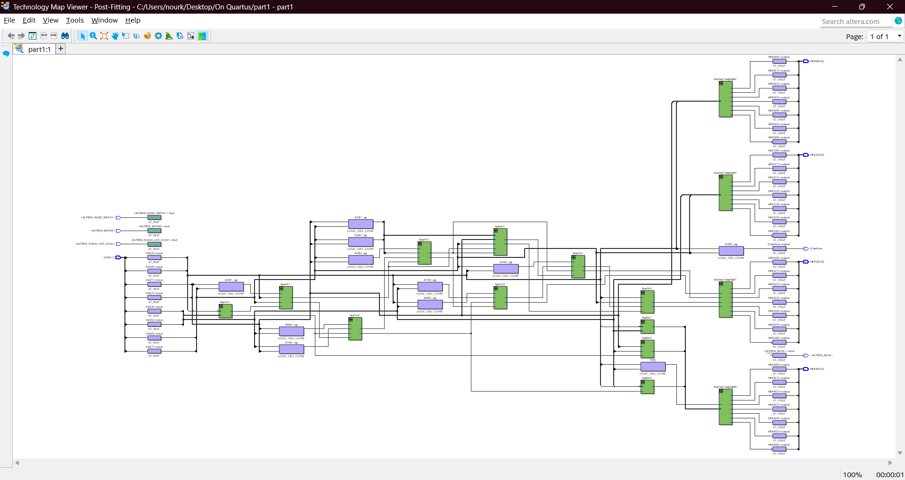
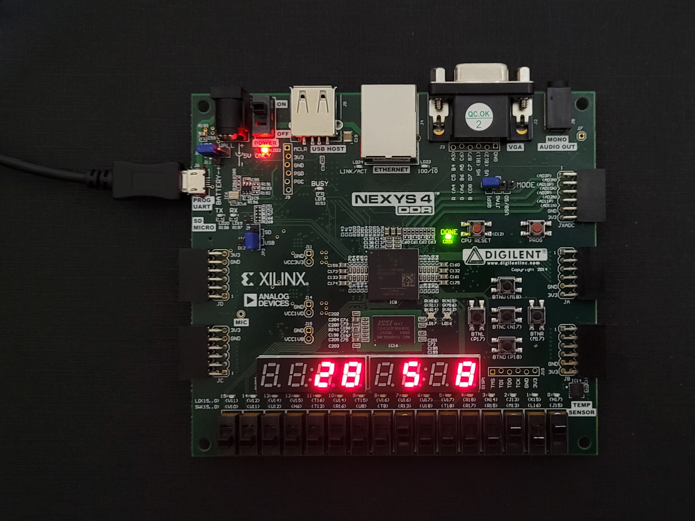

# <p align="center">Array Multiplier</p>

// anchor

---

The project involves creating a digital array multiplier using switches and 7-segment displays on an FPGA. Switches SW7–4 are used to represent the 4-bit binary number A, while switches SW3–0 represent the 4-bit binary number B. The hexadecimal values of A and B are displayed on the 7-segment displays HEX2 and HEX0, respectively. The 8-bit result of the multiplication, P = A × B, is shown on the 7-segment displays HEX5 and HEX4, providing a visual representation of the output. This design ensures the input and output are clearly indicated and easy to verify.

A [digital array](Photos/proj-requirements2.png) multiplier is a combinational circuit designed to multiply two binary numbers. It works by generating partial products and summing them to produce the final result. The circuit mimics the principle of longhand multiplication, where each bit of one operand (the multiplier) is ANDed with all bits of the other operand (the multiplicand). The partial products are then aligned and added using adders, all within a structured hardware framework.  To handle the summation of partial products, an array multiplier typically relies on full adders as its building blocks. Full adders are used to sum the bits from different rows of the array, along with any carry generated during the addition. This design makes the array multiplier efficient for high-speed binary multiplication. The name *array multiplier* stems from the circuit's structure, which resembles an array of logic gates organized in rows and columns. Each row is dedicated to generating partial products for a specific bit of the multiplier, while the columns handle the addition of these partial products. The systematic arrangement of gates simplifies the design and facilitates parallel processing of the binary multiplication, making it both intuitive and effective for hardware implementations.


## Implementation on ALTERA DE2-115 Cyclone IV-E EP4CE115F29C7 FPGA Using Quartus Prime

// anchor

<details>
  <summary>VHDL Implementation</summary>
<br>

``` VHDL

```

<p align="center">
    
</p>

<p align="center">
    
    
   
</p>

// anchor


</details>


<details>
  <summary>Testbench & Simulations</summary>
<br>

``` VHDL
-- Testbench created online at:
--   https://www.doulos.com/knowhow/perl/vhdl-testbench-creation-using-perl/
-- Copyright Doulos Ltd

library IEEE;
use IEEE.Std_logic_1164.all;
use IEEE.Numeric_Std.all;

entity part1_tb is
end;

architecture bench of part1_tb is

  component part1
      PORT (
          SW : IN STD_LOGIC_VECTOR(7 DOWNTO 0);
          HEX5, HEX4, HEX2, HEX0 : OUT STD_LOGIC_VECTOR(0 TO 6);
          Overflow : OUT STD_LOGIC;
			 A_out : OUT std_logic_vector(3 downto 0); -- Expose A
          B_out : OUT std_logic_vector(3 downto 0); -- Expose B
          P_out : OUT std_logic_vector(7 downto 0)  -- Expose P
      );
  end component;

  signal SW: STD_LOGIC_VECTOR(7 DOWNTO 0);
  signal HEX5, HEX4, HEX2, HEX0: STD_LOGIC_VECTOR(0 TO 6);
  signal Overflow: STD_LOGIC ;
  
  signal A, B : std_logic_vector(3 downto 0);
  signal P : std_logic_vector(7 downto 0);

begin

  uut: part1 port map ( SW       => SW,
                        HEX5     => HEX5,
                        HEX4     => HEX4,
                        HEX2     => HEX2,
                        HEX0     => HEX0,
                        Overflow => Overflow, 
							A_out => A, -- Map A_out to A
							B_out => B, -- Map B_out to B
							P_out => P  -- Map P_out to P	
							);

  stimulus: process
  begin
  
    -- Put initialisation code here

	 SW<= "00000000"; -- 0x0
	 wait for 100ns;
	 
	 SW<= "00100000"; -- 2x0
	 wait for 100ns;
	 
	 SW<= "10110001"; -- Bx1
	 wait for 100ns;
	 
	 SW<= "10000101"; -- 8x5
	 wait for 100ns;
	 
	 SW<= "10101001"; -- Ax9
	 wait for 100ns;
	 
	 SW<= "11111110"; -- FxE
	 wait for 100ns;
	 
    -- Put test bench stimulus code here

    wait;
  end process;


end;
```

<p align="center">
    
</p>

<p align="center">
       
</p>

// anchor

	
</details>


## Implementation on Artix 7 Nexys 4 DDR XC7A100T-CSG324 FPGA Using Xilinx ISE

// anchor

<details>
<summary>VHDL Implementation</summary>
<br>

``` VHDL
library IEEE;
use IEEE.STD_LOGIC_1164.ALL;
use IEEE.STD_LOGIC_UNSIGNED.ALL;
use IEEE.STD_LOGIC_ARITH.ALL;
 
entity ArrayMultiplier is -- 4X4 Array Multiplier
	PORT (
		  SW : In STD_LOGIC_VECTOR(7 DOWNTO 0);
        en : OUT STD_LOGIC_VECTOR(7 DOWNTO 0); -- Input 8 switches for numbers A, B
		  clk_100MHz : in STD_LOGIC; 
		  HEX : OUT STD_LOGIC_VECTOR(0 TO 6)--; -- 7 segment display outputs
		  -- A_out : OUT std_logic_vector(3 downto 0); -- Expose A for the simulation only, otherwise comment out due to the ucf file incompatibility
        -- B_out : OUT std_logic_vector(3 downto 0); -- Expose B for the simulation only, otherwise comment out due to the ucf file incompatibility
        -- P_out : OUT std_logic_vector(7 downto 0)  -- Expose P for the simulation only, otherwise comment out due to the ucf file incompatibility
		);
end ArrayMultiplier;
 
architecture Behavioral of ArrayMultiplier is
	
	COMPONENT display7seg
        PORT (
            binary : IN STD_LOGIC_VECTOR(3 DOWNTO 0); -- 4-bit input for 7-segment display
            hex : OUT STD_LOGIC_VECTOR(0 TO 6) -- 7-segment display output
        );
    END COMPONENT;
	 
	 COMPONENT fa
        PORT (
            a, b, ci : IN STD_LOGIC; -- Inputs to the full adder
            s, co : OUT STD_LOGIC -- Outputs of the full adder
        );
    END COMPONENT;
 
		SIGNAL A,B : STD_LOGIC_VECTOR(3 DOWNTO 0);
		SIGNAL P : STD_LOGIC_VECTOR(7 DOWNTO 0);
		SIGNAL carryb1 : STD_LOGIC_VECTOR(3 DOWNTO 1); -- carries for row B1
		SIGNAL carryb2 : STD_LOGIC_VECTOR(3 DOWNTO 1); -- carries for row B2
		SIGNAL carryb3 : STD_LOGIC_VECTOR(3 DOWNTO 1); -- carries for row B3
		SIGNAL ParProB1 : STD_LOGIC_VECTOR(5 DOWNTO 2); -- partial products from row B1
		SIGNAL ParProB2 : STD_LOGIC_VECTOR(6 DOWNTO 3); -- partial products from row B2
		SIGNAL selected_digit : STD_LOGIC_VECTOR(3 DOWNTO 0);  -- The selected 4-bit value to display 
		SIGNAL counter : INTEGER RANGE 0 TO 999999 := 0;  -- Fast counter to generate "display_selector"
		SIGNAL display_selector : STD_LOGIC_VECTOR(1 DOWNTO 0);  -- The 2-bit signal that changes quickly
 
		-- Intermediate signals for logical operations
		SIGNAL A0B0_sig, A1B0_sig, A2B0_sig, A3B0_sig : STD_LOGIC;
		SIGNAL A0B1_sig, A1B1_sig, A2B1_sig, A3B1_sig : STD_LOGIC;
		SIGNAL A0B2_sig, A1B2_sig, A2B2_sig, A3B2_sig : STD_LOGIC;
		SIGNAL A0B3_sig, A1B3_sig, A2B3_sig, A3B3_sig : STD_LOGIC;
 
begin

	 B <= SW(3 DOWNTO 0);
	 A <= SW(7 DOWNTO 4);
	 
	 -- A_out <= A; -- for the simulation only, otherwise comment out due to the ucf file incompatibility
	 -- B_out <= B; -- for the simulation only, otherwise comment out due to the ucf file incompatibility
	 -- P_out <= P; -- for the simulation only, otherwise comment out due to the ucf file incompatibility
	
	 -- Array multiplier logic
    A0B0_sig <= A(0) AND B(0);
    A1B0_sig <= A(1) AND B(0);
    A2B0_sig <= A(2) AND B(0);
    A3B0_sig <= A(3) AND B(0);

    A0B1_sig <= A(0) AND B(1);
    A1B1_sig <= A(1) AND B(1);
    A2B1_sig <= A(2) AND B(1);
    A3B1_sig <= A(3) AND B(1);

    A0B2_sig <= A(0) AND B(2);
    A1B2_sig <= A(1) AND B(2);
    A2B2_sig <= A(2) AND B(2);
    A3B2_sig <= A(3) AND B(2);

    A0B3_sig <= A(0) AND B(3);
    A1B3_sig <= A(1) AND B(3);
    A2B3_sig <= A(2) AND B(3);
    A3B3_sig <= A(3) AND B(3);
	 
	 P(0) <= A0B0_sig;

    -- Instantiate full adders for the three rows of the multiplier
	 
    -- Row 1
    a0b1: fa PORT MAP (A1B0_sig, A0B1_sig, '0', P(1), carryb1(1));
    a1b1: fa PORT MAP (A2B0_sig, A1B1_sig, carryb1(1), ParProB1(2), carryb1(2));
    a2b1: fa PORT MAP (A3B0_sig, A2B1_sig, carryb1(2), ParProB1(3), carryb1(3));
    a3b1: fa PORT MAP ('0', A3B1_sig, carryb1(3), ParProB1(4), ParProB1(5));

    -- Row 2
    a0b2: fa PORT MAP (ParProB1(2), A0B2_sig, '0', P(2), carryb2(1));
    a1b2: fa PORT MAP (ParProB1(3), A1B2_sig, carryb2(1), ParProB2(3), carryb2(2));
    a2b2: fa PORT MAP (ParProB1(4), A2B2_sig, carryb2(2), ParProB2(4), carryb2(3));
    a3b2: fa PORT MAP (ParProB1(5), A3B2_sig, carryb2(3), ParProB2(5), ParProB2(6));

    -- Row 3
    a0b3: fa PORT MAP (ParProB2(3), A0B3_sig, '0', P(3), carryb3(1));
    a1b3: fa PORT MAP (ParProB2(4), A1B3_sig, carryb3(1), P(4), carryb3(2));
    a2b3: fa PORT MAP (ParProB2(5), A2B3_sig, carryb3(2), P(5), carryb3(3));
    a3b3: fa PORT MAP (ParProB2(6), A3B3_sig, carryb3(3), P(6), P(7));
	
	PROCESS (clk_100MHz)
    BEGIN
        IF rising_edge(clk_100MHz) THEN
            -- Increment the counter to generate a slower signal
            IF counter = 99999 THEN
                counter <= 0;  -- Reset counter to 0
                -- Toggle 'display_selector' signal to change values
                display_selector <= display_selector + 1;  
            ELSE
                counter <= counter + 1;  -- Increment counter
            END IF;
        END IF;
    END PROCESS;
	 
	PROCESS (display_selector, A, B, P)
    BEGIN
        CASE display_selector IS
	-- we only need 2 bits because we have only 4 hexes to display on and select between which means we have 4 cases
	-- Hence, 2 bits are sufficient to create 4 unique combinations to represent the 4 cases
            WHEN "00" =>
                en <= "11111110";  -- Enable HEX0
                selected_digit <= A;  -- Display A on HEX0
            WHEN "01" => 
                en <= "11111011";  -- Enable HEX2
                selected_digit <= B;  -- Display B on HEX2
            WHEN "10" =>
				en <= "11101111";  -- Enable HEX4
                selected_digit <=  P(3 DOWNTO 0);  -- Display
            WHEN "11" => 
                en <= "11011111";  -- Enable HEX5
                selected_digit <= P(7 DOWNTO 4);  -- Display 
            WHEN OTHERS =>  -- Default case
                en <= "11111111";  -- Disable all
                selected_digit <= "0000";  -- Blank display
        END CASE;
    END PROCESS;

	digit0: display7seg PORT MAP (selected_digit, HEX);
 
end Behavioral;

------------------------------------------------------------------------------------------
-- Full Adder

LIBRARY ieee;
USE ieee.std_logic_1164.all;

ENTITY fa IS
    PORT (
        a, b, ci : IN STD_LOGIC; -- Inputs to the full adder
        s, co : OUT STD_LOGIC -- Outputs of the full adder
    );
END fa;

-- Architecture for the full adder entity
ARCHITECTURE Structure OF fa IS
    SIGNAL a_xor_b : STD_LOGIC;
BEGIN
    a_xor_b <= a XOR b;
    s <= a_xor_b XOR ci;
    co <= (NOT(a_xor_b) AND b) OR (a_xor_b AND ci);
END Structure;
 
------------------------------------------------------------------------------------------
-- 7 Segment Display
 
LIBRARY ieee;
USE ieee.std_logic_1164.all;

ENTITY display7seg IS
    PORT (
        binary : IN STD_LOGIC_VECTOR(3 DOWNTO 0); -- 4-bit input for 7-segment display
        hex : OUT STD_LOGIC_VECTOR(0 TO 6) -- 7-segment display output
    );
END display7seg;
 
ARCHITECTURE Behavior OF display7seg IS
BEGIN
    PROCESS (binary)
    BEGIN
        CASE binary IS
            WHEN "0000" => hex <= "0000001"; -- 0
            WHEN "0001" => hex <= "1001111"; -- 1
            WHEN "0010" => hex <= "0010010"; -- 2
            WHEN "0011" => hex <= "0000110"; -- 3
            WHEN "0100" => hex <= "1001100"; -- 4
				WHEN "0101" => hex <= "0100100"; -- 5
            WHEN "0110" => hex <= "0100000"; -- 6
            WHEN "0111" => hex <= "0001111"; -- 7
            WHEN "1000" => hex <= "0000000"; -- 8
            WHEN "1001" => hex <= "0001100"; -- 9
            WHEN "1010" => hex <= "0001000"; -- A
				WHEN "1011" => hex <= "1100000"; -- B
            WHEN "1100" => hex <= "0110001"; -- C
            WHEN "1101" => hex <= "1000010"; -- D
            WHEN "1110" => hex <= "0110000"; -- E
            WHEN OTHERS => hex <= "0111000"; -- F
				END CASE;
    END PROCESS;
END Behavior;
```

``` ini
## This file is a general .ucf for the Nexys4 DDR Rev C board
## Rename the used signals according to the project

# Pin Assignments
 
## Clock signal
NET "clk_100MHz"   LOC = "E3"	| IOSTANDARD = "LVCMOS33";
NET "clk_100MHz" TNM_NET = sys_clk_pin;
TIMESPEC TS_sys_clk_pin = PERIOD sys_clk_pin 100 MHz HIGH 50%;
 
## Switches
NET "SW<0>"          LOC=J15 | IOSTANDARD=LVCMOS33; #IO_L24N_T3_RS0_15
NET "SW<1>"          LOC=L16 | IOSTANDARD=LVCMOS33; #IO_L3N_T0_DQS_EMCCLK_14
NET "SW<2>"          LOC=M13 | IOSTANDARD=LVCMOS33; #IO_L6N_T0_D08_VREF_14
NET "SW<3>"          LOC=R15 | IOSTANDARD=LVCMOS33; #IO_L13N_T2_MRCC_14
NET "SW<4>"          LOC=R17 | IOSTANDARD=LVCMOS33; #IO_L12N_T1_MRCC_14
NET "SW<5>"          LOC=T18 | IOSTANDARD=LVCMOS33; #IO_L7N_T1_D10_14
NET "SW<6>"          LOC=U18 | IOSTANDARD=LVCMOS33; #IO_L17N_T2_A13_D29_14
NET "SW<7>"          LOC=R13 | IOSTANDARD=LVCMOS33; #IO_L5N_T0_D07_14
#NET "SW<8>"          LOC=T8 | IOSTANDARD=LVCMOS18; #IO_L24N_T3_34
#NET "SW<9>"          LOC=U8 | IOSTANDARD=LVCMOS18; #IO_25_34
 
## Enabling the HEXes
NET "en<0>"          LOC=J17 | IOSTANDARD=LVCMOS33; #IO_L23P_T3_FOE_B_15
NET "en<1>"          LOC=J18 | IOSTANDARD=LVCMOS33; #IO_L23N_T3_FWE_B_15
NET "en<2>"          LOC=T9 | IOSTANDARD=LVCMOS33; #IO_L24P_T3_A01_D17_14
NET "en<3>"          LOC=J14 | IOSTANDARD=LVCMOS33; #IO_L19P_T3_A22_15
NET "en<4>"          LOC=P14 | IOSTANDARD=LVCMOS33; #IO_L8N_T1_D12_14
NET "en<5>"          LOC=T14 | IOSTANDARD=LVCMOS33; #IO_L14P_T2_SRCC_14
NET "en<6>"          LOC=K2 | IOSTANDARD=LVCMOS33; #IO_L23P_T3_35
NET "en<7>"          LOC=U13 | IOSTANDARD=LVCMOS33; #IO_L23N_T3_A02_D18_14
 
## 7 segments HEX
NET "HEX<0>" LOC=T10 | IOSTANDARD=LVCMOS33; #IO_L24N_T3_A00_D16_14
NET "HEX<1>" LOC=R10 | IOSTANDARD=LVCMOS33; #IO_25_14
NET "HEX<2>" LOC=K16 | IOSTANDARD=LVCMOS33; #IO_25_15
NET "HEX<3>" LOC=K13 | IOSTANDARD=LVCMOS33; #IO_L17P_T2_A26_15
NET "HEX<4>" LOC=P15 | IOSTANDARD=LVCMOS33; #IO_L13P_T2_MRCC_14
NET "HEX<5>" LOC=T11 | IOSTANDARD=LVCMOS33; #IO_L19P_T3_A10_D26_14
NET "HEX<6>" LOC=L18 | IOSTANDARD=LVCMOS33; #IO_L4P_T0_D04_14
```

<p align="center">
    
</p>

<p align="center">
    
    
   
</p>

// anchor


</details>

<details>
  <summary>Testbench & Simulations</summary>
<br>

``` VHDL
--------------------------------------------------------------------------------
-- VHDL Test Bench Created by ISE for module: ArrayMultiplier
--  
-- This testbench has been automatically generated using types std_logic and
-- std_logic_vector for the ports of the unit under test.  Xilinx recommends
-- that these types always be used for the top-level I/O of a design in order
-- to guarantee that the testbench will bind correctly to the post-implementation 
-- simulation model.

-- Modified by our team because it wasn't showing the signals A, B, and P.
-- They are needed since the hexes are multiplexed so their wave on the 
-- simulator are not meaningful so instead we must observe the result from P.
--------------------------------------------------------------------------------
LIBRARY ieee;
USE ieee.std_logic_1164.ALL;
 
ENTITY ArrayMultiplierTestbench IS
END ArrayMultiplierTestbench;
 
ARCHITECTURE behavior OF ArrayMultiplierTestbench IS 
 
    -- Component Declaration for the Unit Under Test (UUT)
 
    COMPONENT ArrayMultiplier
    PORT(
         SW : IN  std_logic_vector(7 downto 0);
         en : OUT  std_logic_vector(7 downto 0);
         clk_100MHz : IN  std_logic;
         HEX : OUT  std_logic_vector(0 to 6);
			A_out : OUT std_logic_vector(3 downto 0); -- Expose A
         B_out : OUT std_logic_vector(3 downto 0); -- Expose B
         P_out : OUT std_logic_vector(7 downto 0)  -- Expose P
        );
    END COMPONENT;
    

   --Inputs
   signal SW : std_logic_vector(7 downto 0) := (others => '0');
   signal clk_100MHz : std_logic := '0';

 	--Outputs
   signal en : std_logic_vector(7 downto 0);
   signal HEX : std_logic_vector(0 to 6);
	
	signal A, B : std_logic_vector(3 downto 0);
	signal P : std_logic_vector(7 downto 0);

   -- Clock period definitions
   constant clk_100MHz_period : time := 10 ns;
 
BEGIN
 
	-- Instantiate the Unit Under Test (UUT)
   uut: ArrayMultiplier PORT MAP (
          SW => SW,
          en => en,
          clk_100MHz => clk_100MHz,
          HEX => HEX,
			 A_out => A, -- Map A_out to A
			 B_out => B, -- Map B_out to B
			 P_out => P  -- Map P_out to P
        );

   -- Clock process definitions
   clk_100MHz_process :process
   begin
		clk_100MHz <= '0';
		wait for clk_100MHz_period/2;
		clk_100MHz <= '1';
		wait for clk_100MHz_period/2;
   end process;
 

   -- Stimulus process
   stim_proc: process
   begin	
	
    -- hold reset state for 100 ns.
    wait for 100 ns;		

    wait for clk_100MHz_period*10;

    -- insert stimulus here 
	 SW<= "00000000"; -- 0x0
	 wait for 100ns;
	 
	 SW<= "00100000"; -- 2x0
	 wait for 100ns;
	 
	 SW<= "10110001"; -- Bx1
	 wait for 100ns;
	 
	 SW<= "10000101"; -- 8x5
	 wait for 100ns;
	 
	 SW<= "10101001"; -- Ax9
	 wait for 100ns;
	 
	 SW<= "11111110"; -- FxE
	 wait for 100ns;

      wait;
   end process;

END;
```

<p align="center">
  
</p>
<p align="center">
    
    
   
</p>


</details>

## Project Learning Outcomes

1. An array multiplier operates in parallel, generating all partial products simultaneously and summing them in a single step. In contrast, a serial multiplier works sequentially, processing one bit of the multiplier at a time, which requires multiple clock cycles to complete the operation. This difference makes the array multiplier significantly faster but also more hardware-intensive compared to the serial multiplier. The hardware requirements also vary between the two. An array multiplier uses more resources, including multiple adders and logic gates working concurrently. On the other hand, a serial multiplier is more resource-efficient but needs additional control logic to manage the sequential operations. Consequently, array multipliers are favored in high-performance applications where speed is crucial, while serial multipliers are better suited for low-power or resource-constrained environments.

2. Hexadecimal multiplication involves multiplying numbers represented in base-16, where each digit can range from 0 to 15 (0 to F). The process is similar to decimal multiplication but adapted for base-16 arithmetic. For example, when multiplying 5 by 8 in decimal, the calculation is straightforward (5 x 8 = 40). Now, let's consider the same numbers in hexadecimal (5 x 8 = 28). Though both multiplications give the same numerical value (40 in decimal), the representation differs between the two systems. The decimal result is 40, while the hexadecimal result is 28. This shows how the numeral systems (decimal and hexadecimal) express numbers differently. This [example](Photos/proj-requirements1.png) illustrates how the multiplication process can be represented in different numeral systems and implementations. The multiplication in decimal uses the standard columnar method. The multiplication process in binary uses a similar procedure. Another implementation shows the multiplication operation in a more systematic form, using individual bit multiplications and their corresponding positions in the result, indicating how the process might be handled in a hardware implementation, such as an array multiplier.
3. The aim is to display distinct numbers on each of the four digits of the two 4-digit 7-segment displays on the Nexys4 DDR board. The challenge arises because only one set of control signals (CA, CB, CC, CD, CE, CF, CG) is available for all the segments, meaning all active displays show the same digit simultaneously unless a multiplexing strategy is implemented. To achieve this, we use a technique called time-division multiplexing. The approach involves sequencing through each digit individually, activating only one at a time while lighting up the appropriate segments for that digit. By switching between the digits at a speed fast enough for the human eye to perceive all digits as lit simultaneously (a phenomenon known as persistence of vision), we can create the illusion of displaying distinct numbers on all digits at once. The display sequence works as follows: for each active digit, the corresponding "ANx" signal is grounded (or driven high depending on the board configuration) while all other ANx signals are floated (disabled). This activates the selected digit, allowing the control signals (CA through CG) to light up the appropriate segments for the desired number. After a small fraction of a second, the next digit is selected, its segments are illuminated, and the process repeats for all digits in sequence. This rapid blinking needs to occur at a frequency of at least 1kHz to ensure the display appears steady to the human eye without noticeable flickering. For optimal results, frequencies of 5kHz to 10kHz can be used.


4. VHDL compilers encounter an issue with how signals are assigned to the ports of the full adder (fa) component. This error indicates that the expression used to connect to the "a" port of the fa component is not a simple signal or constant, but instead a more complex expression that the compiler cannot process in this context. In VHDL, when instantiating a component and mapping its ports, the expressions used for the port connections must be simple signals or constants. More complex expressions, such as logical operations, cannot be directly mapped to ports. To resolve this issue, you should introduce intermediate signals to store the results of any logical operations before mapping them to the fa component's ports.
5. Using Oracle's VirtualBox to create a Windows 10 virtual machine for running Xilinx ISE is a practical solution for overcoming compatibility issues with modern operating systems. Since Xilinx ISE is officially supported only on older versions of Windows, setting up a Windows 10 VM in VirtualBox allows users to bypass the limitations of using ISE on current versions of Windows. VirtualBox provides an easy-to-use platform for creating isolated environments, where users can install a compatible version of Windows 10 that functions as a host for Xilinx ISE. This setup enables users to take advantage of the modern hardware and software features of their primary operating system while maintaining a dedicated environment for FPGA development. The virtual machine can be allocated enough resources (CPU, memory, and storage) to ensure smooth operation, and since VirtualBox supports multiple operating systems, users can experiment with different configurations to optimize performance. Additionally, VirtualBox is free and open-source, making it an accessible solution for users who may not want to invest in expensive software for this purpose. 
   
6. In VHDL, it is not allowed to perform a port map inside a case statement. This restriction arises because a case statement is used to execute one of several possible branches based on the value of a given expression, and the actions within each branch must be deterministic at compile-time. Port mapping, on the other hand, involves connecting signals or components dynamically, which is a structural operation that typically occurs outside of control flow constructs like case statements. To resolve this, you should place the port map outside the case statement, ensuring that the mapping is done in a way that is consistent with VHDL's synthesis rules and maintains clarity and functionality in the design.
7. During the troubleshooting process of the design on Xilinx, the goal was to ensure that the output on the Nexys 4 DDR FPGA board matched the result we had previously achieved on the Altera FPGA board. This required a systematic approach to verify and adjust several aspects of the design. First, we reviewed the VHDL code and constraints to ensure that the correct pin assignments and timing were set up for the Xilinx board. Next, we carefully examined the mapping of the signals and outputs, making sure that any differences in the configuration between the two boards were accounted for. Additionally, we used simulation tools to check the functional correctness of the design before programming the FPGA. By comparing the waveform results and ensuring proper signal mapping, we were able to identify and resolve any discrepancies. Ultimately, this iterative process helped us align the behavior on the Nexys 4 DDR FPGA board with the expected results, ensuring consistency across both platforms.


8. The flickering issue on the display was caused by the multiplexing frequency being too low. To resolve this and make the display appear constant, we increased the clock divider’s output frequency. By generating a faster clock signal, we were able to raise the multiplexing frequency, effectively reducing the flickering and ensuring that the display remains stable and continuous.

The Nexys 4 DDR board uses a Xilinx Artix-7 FPGA, which is supported by Xilinx ISE (Integrated Software Environment) or the more modern Vivado suite. Xilinx ISE was historically the main development tool for Xilinx FPGAs but has largely been replaced by Vivado for newer devices, which offers enhanced features, better support for high-speed designs, and improved simulation and debugging capabilities. Xilinx's Artix-7 FPGA is known for its balance between performance and power efficiency, making it suitable for a wide range of applications, from academic projects to industry-level designs. Vivado's modern, user-friendly interface and improved synthesis and implementation tools allow for faster development cycles and better performance optimization compared to ISE. However, Vivado is not always backward-compatible with older FPGA families, and its learning curve can still present challenges for newcomers. On the other hand, Xilinx ISE can present significant hurdles for users, particularly when trying to run it on modern operating systems. ISE, which was originally designed to run on older versions of Windows, is only officially supported on Windows XP, Vista, some early Windows 7 versions, and Windows 10 (not always). This makes it difficult for users working with newer versions of Windows (e.g. Windows 11), as Xilinx ISE may fail to install or function correctly, causing frustration and wasting valuable time in troubleshooting compatibility issues. Additionally, although some users have had success running ISE on Linux, this is typically limited to specific distributions, and configuring ISE on Linux may require more advanced knowledge of the operating system, as well as additional dependencies. This can be a major obstacle for those without extensive Linux experience. Moreover, since ISE is no longer actively updated, there are limited resources available for resolving such issues, which may force users to rely on outdated tools and manuals. The Nexys 4 DDR board offers a more streamlined setup process compared to the Altera DE2-115 board. For the Nexys 4, you only need to connect a single USB cable from the computer to the board, eliminating the need for additional connections or components. In contrast, the Altera DE2-115 requires both a USB cable and a battery cable for proper operation. Additionally, the Altera board necessitates the installation of a USB Blaster driver to facilitate communication between the board and the development environment. On the other hand, the Nexys 4 board simplifies the process further, as it doesn't require any additional drivers to be installed. This makes the Nexys 4 more user-friendly and convenient, especially for those who seek a quicker and hassle-free development experience without dealing with additional hardware setup or driver installation. Nexys 4 DDR board (based on Xilinx FPGAs) typically uses USB for programming, and this USB connection involves a UART-based interface for communication with the computer. However, the primary method for configuring the FPGA on the Nexys 4 board is via USB and its built-in USB-JTAG functionality (not just UART). Altera DE2-115 board (based on Intel Altera FPGAs) uses a USB-Blaster cable that facilitates JTAG-based programming. The JTAG interface is the primary method for programming the FPGA on the DE2-115, but the USB-Blaster provides the connection and works with software like Quartus for programming and debugging. Xilinx, a major FPGA manufacturer, has been associated with various defense and military applications over the years. Due to the sensitive nature of these applications, certain Xilinx products became subject to strict export control regulations, specifically under the International Traffic in Arms Regulations (ITAR) and the Export Administration Regulations (EAR) enforced by the United States government. This is because FPGAs, including those from Xilinx, are often used in military technologies, aerospace systems, and other defense-related fields. Their high performance and reconfigurability make them ideal for processing complex algorithms, controlling sophisticated hardware, and enabling encryption and signal processing for secure communications. As a result of Xilinx's involvement in military and defense applications, the company has had to comply with stringent U.S. government regulations, which include heavy licensing requirements for the export of its products. These licensing requirements can make it difficult for foreign entities to access certain Xilinx technologies, particularly the higher-end models that are classified as "military-grade." The U.S. government's control over these products ensures that advanced technology does not fall into the wrong hands and that they are used only in authorized applications


The Altera DE2-115 board, which uses an Intel (formerly Altera) Cyclone IV FPGA, is traditionally supported by Quartus Prime, Altera's development software. Quartus Prime is a robust toolchain designed for FPGA design, including synthesis, simulation, and configuration. It offers a wide range of features for both beginners and advanced users, including the ability to design in both schematic and HDL (Hardware Description Language) formats, as well as integration with various hardware design tools. However, Quartus Prime's ecosystem can sometimes be overwhelming, especially for those new to FPGA design, and its compatibility with newer FPGA families may be more limited as time progresses. While the DE2-115 board is known for its reliability in academic environments and for prototyping, it may not be as well-suited for very high-performance applications, as it is a mid-range FPGA with certain hardware limitations. The Altera DE2-115 board, which uses an Intel (formerly Altera) Cyclone IV FPGA, is traditionally supported by Quartus Prime, Altera's development software. Quartus Prime is a robust toolchain designed for FPGA design, including synthesis, simulation, and configuration. It offers a wide range of features for both beginners and advanced users, including the ability to design in both schematic and HDL (Hardware Description Language) formats, as well as integration with various hardware design tools. However, Quartus Prime's ecosystem can sometimes be overwhelming, especially for those new to FPGA design, and its compatibility with newer FPGA families may be more limited as time progresses. While the DE2-115 board is known for its reliability in academic environments and for prototyping, it may not be as well-suited for very high-performance applications, as it is a mid-range FPGA with certain hardware limitations.


Implementing the same digital design project on two different platforms, using two different FPGA boards, offers several valuable benefits. By comparing the performance, ease of use, and compatibility of the two platforms, we gain a deeper understanding of the nuances between different FPGA architectures and development environments. Each platform, whether it's the Altera DE2-115 or the Nexys 4 DDR, has its own unique set of tools, libraries, and constraints, making it crucial to explore how these factors influence the design workflow. In doing so, we are exposed to the limitations and strengths of each FPGA family, which can help us optimize our designs for various applications. Additionally, by testing the same design on two platforms, we can ensure better portability and scalability of our work, enabling us to apply our designs to a wider range of projects and industries. The hands-on experience with different hardware and development tools simulates the flexibility and adaptability needed in industry, where FPGA designs often need to be deployed across different hardware configurations. It also enhances our ability to troubleshoot, optimize, and adapt to future challenges in FPGA development. 


In conclusion, the implementation of the array multiplier in this lab project successfully ensured consistent results across both the FPGA boards and simulators, validating the design's accuracy and efficiency. Array multipliers are widely used in digital systems where fast multiplication is crucial, such as in processors, digital signal processing (DSP) units, and embedded systems. Their parallel processing capability allows them to perform multiplications much faster than sequential methods, making them integral to the performance of modern computing devices. The importance of array multipliers lies in their ability to enhance the speed and efficiency of arithmetic operations, which are fundamental to a variety of computational tasks, including scientific calculations, encryption, and real-time data processing. This project not only reinforced the theoretical concepts behind array multipliers but also provided valuable hands-on experience in translating those concepts into a working hardware implementation.


## Resources

// anchor

<br>


We extend our sincere appreciation to Eng. Umar Adeel for his insightful feedback which has significantly contributed to the successful completion of this experiment.

This publication adheres to all regulatory laws and guidelines established by the American University of Ras Al Khaimah (AURAK) regarding the dissemination of academic materials.
